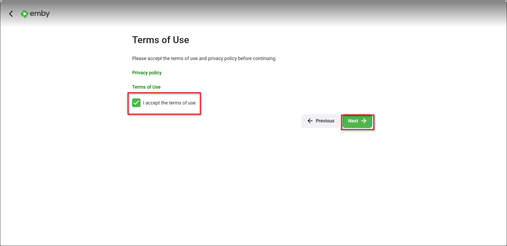
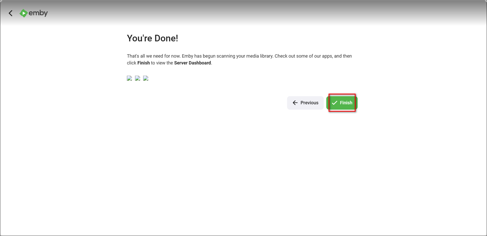
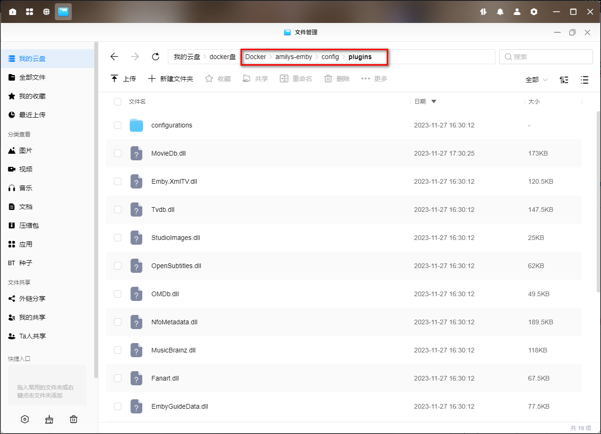
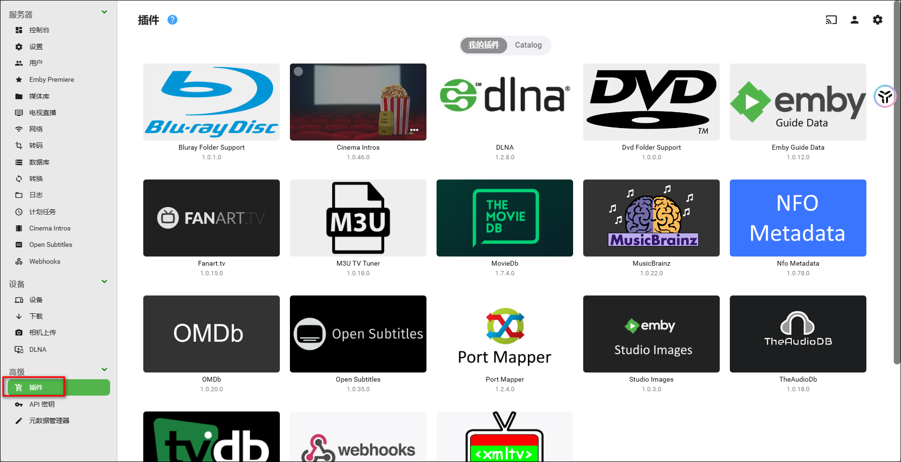
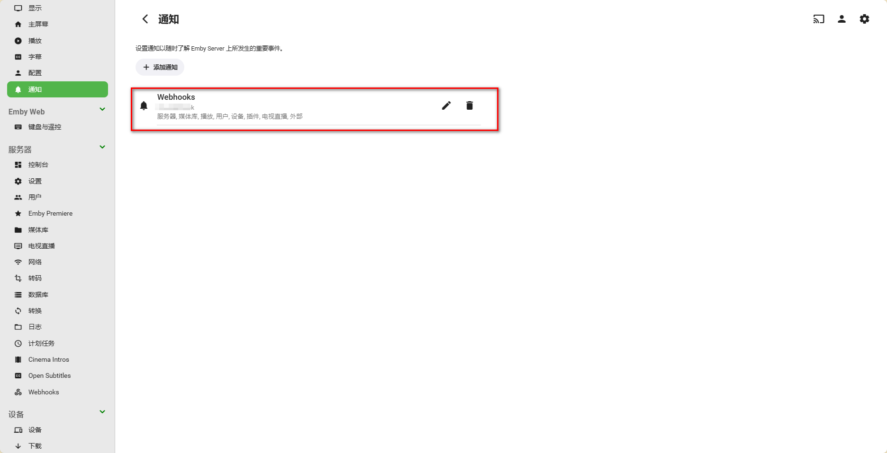

## 1、compose安装命令

```
services:
  emby:
    image: linuxserver/emby:latest
    container_name: emby
    restart: always
    privileged: true
    devices:
      - /dev/dri:/dev/dri             # 开启硬件转码
    network_mode: bridge # DLNA and Wake-on-Lan 需要 bridge
    ports:
      - 8096:8096 # 对外访问端口, 以后反代 emby 请用这个端口，这样才会走直链。
    volumes:
      - /volume3/docker/emby/config:/config  # 配置文件目录
      - /volume2/Media_movie:/hddMovie  # 媒体文件目录
    environment:
      - PUID=1007
      - PGID=10
      - TZ=Asia/Shanghai # 设置容器的时区为亚洲/上海
```

## 2、初始化

通过 Emby 前期搭建、Emby 参数配置，Emby 的部署工作已经完成了，接下来是初始化，里面涉及到大量的个性化设置，请大家按照自己需求修改即可，如果不明白什么意思那么就和我选择同样的即可。

1、打开浏览器，地址栏中输入绿联 IP:8096,下拉列表选择中文，然后点击 next。


2、配置用户名和密码，点击下一步。

> 在这个页面点击一下刷新才可使之前的设置生效，变为中文，我懒得刷新了。


3、设置媒体库这里因为设置选项过多，我们稍后配置，点击下一个。


4、首选元数据语言和国家按照自己需求选择，这里我选择简体中文和中国。


5、配置远程访问这里是否勾选无影响直接选择下一个。


6、接受 emby 条款，然后继续点击下一个。



7、初始化步骤结束点击完成。



8、点击手动登录并输入刚刚设置的账号密码来登录刚刚创建的账户。


9、进入了首页


## 3、设置

登录 emby,点击右上角的小齿轮图标进入 emby 设置页面。


### 1、转码

点击转码，在启动硬件加速中选择高级，将下列的解码器全部选择 QuickSnyc，关闭所有的 VAAPI，然后记得翻到下面点击保存。


### 2、添加媒体库

关于媒体库的添加这里我主要演示一下电影的添加，关于剧集之类的因为命名比较影响信息的搜刮效果。
此步骤设置为 bt 和个人资源的信息搜刮，正在做种的资源不要按照这种方式配置容易影响做种。

1、点击媒体库，点击新增媒体库


2、这里因为我都是通过其它工具刮好的媒体，所以一些 emby 刮削的选项没有设置了，填写完点击确定。


首次添加需要时间才能刮削完毕，请耐心等待。

### 4、插件

**1）第三方插件安装**

1、将下载好的后缀为 dll 的插件放到文件夹/docker/emby/plugins 中即可，然后重启 emby 服务器。



2、在 emby 插件选项中配置插件即可。



**2）字幕插件**

字幕插件：<https://github.com/91270/MeiamSubtitles>。

## 5、其它

### 1）emby 客户端

emby 支持全平台客户端，可在[官网](https://emby.media/download.html)直接下载官方软件，也可下载其他版本的。

### 2）webhooks

点击通知-添加通知，选择 webhooks


设置 webhooks 名称，填写 url 后可以点击发送测试通知查看 url 是否填写正确。然后勾选想发送通知的事件。填写完成后点击添加通知。


设置完成。



## 6、命名规范

### 1）电影的命名

标准命名规范：**影片名.年份.分辨率.视频编码.音频编码**

例：

- 变形金刚 3.2011.1080p.AVC.TrueHD7.1.mkv
- Transformers Dark Of The Moon.2011.1080p.AVC.TrueHD7.1.mkv
- 变形金刚 3.Transformers Dark Of The Moon.2011.1080p.AVC.TrueHD7.1.mkv

但其实不需要那么多后缀，中文名.年份，就够了（那么多后缀你看着烦不烦，要是有的你多的东西命名又不规范还会影响你海报识别，真心没必要），例如：【变形金刚 3.2011】。

要是系列电影有小标题的，中文名中间是用冒号分开，例如【007：八爪女.1983】。

真想要保留分辨率，视频编码，音频编码，中间也是用英文状态的【.】 隔开，例如【007：八爪女.1983.Blu-Ray.1080P】。

### 2）电视剧的命名

标准命名规范：**影片名.季+剧集.年份.分辨率.视频编码.音频编码**

例：

- 萨布丽娜的惊心冒险.S01E01.2018.1080p.x264.DD5.1.mp4
- Chilling Adventures of Sabrina.S01E01.2018.1080p.x264.DD5.1.mp4
- 萨布丽娜的惊心冒险.Chilling.Adventures.of.Sabrina.S01E01.2018.1080p.x264.DD5.1.mp4

要是有的剧，每一集有小标题的话，用括号括在里面，目的是为了防止造成海报识别干扰，而不是要利用小标题，例如：【 超智能足球 2.S02E02（奥尼外传 不敌.心魔）】

### 3）动漫剧的命名

不管动漫是否只有一季，一定要创建一个“Season 1”的文件夹，不然刮削的时候不能搜到每一集的介绍。而特别篇是建一个文件夹（Season 0，Season 00，Specials）来存放的。

比如我们动漫一人之下：


