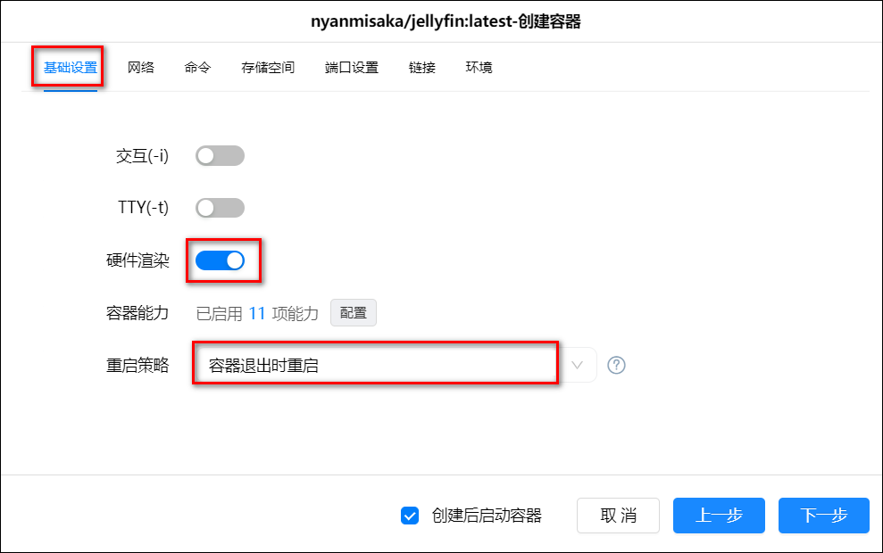
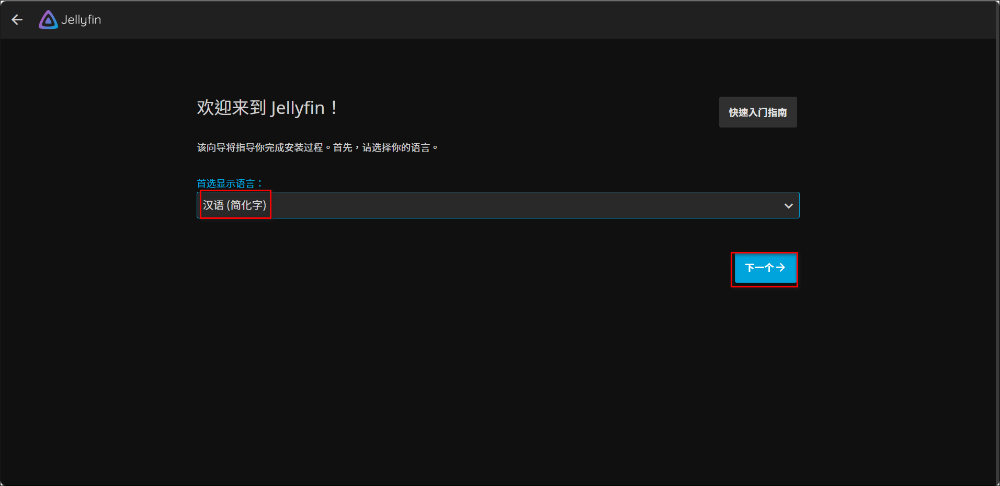
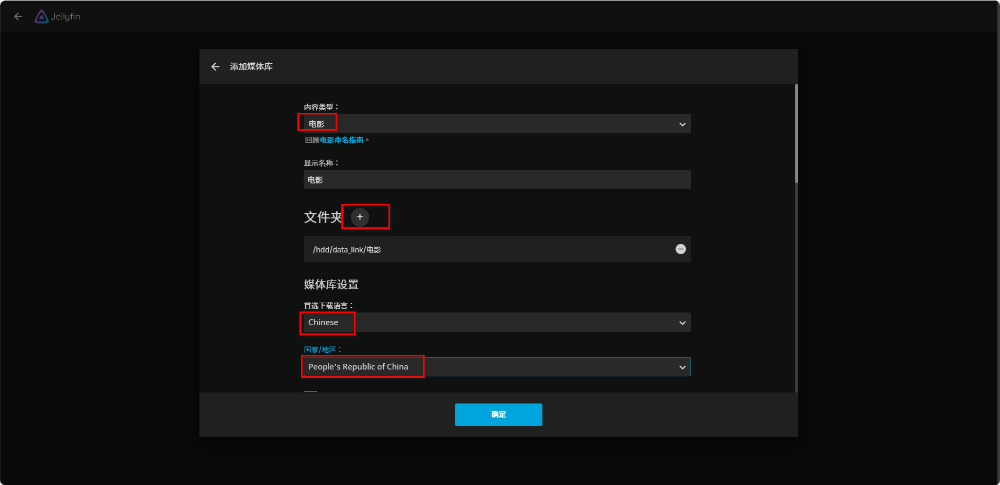
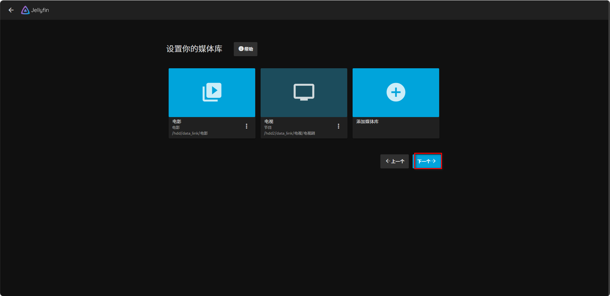
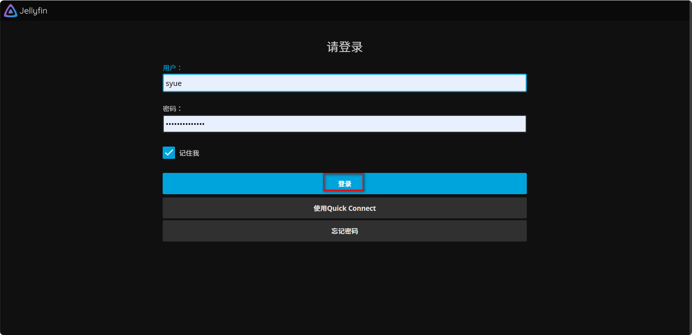
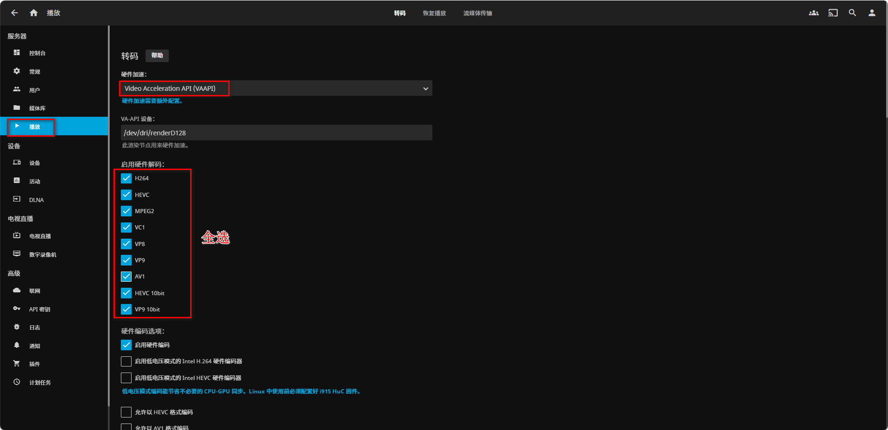
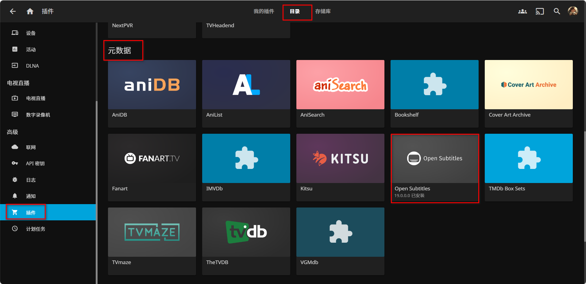

## 1、容器部署

1、下载镜像

在绿联 docker-镜像管理-镜像仓库里搜索 jellyfin，有很多版本，其中:

- jellyfin/jellyfin 和 linuxserver/jellyfin 这两个都是官方版本，没有进行魔改的；
- nyanmisaka/jellyfin（后简称 ny)这个版本是 nyanmisaka 这位大神进行修改魔改的版本。

ny 大神的和官方版本的都是推荐安装的，而且区别不大。

我这里选择 ny 大神的下载。


2、部署安装

1）在镜像管理-本地镜像找到刚刚下载的镜像，点击创建容器，勾选创建后启动容器，点击下一步。


2）基础设置里勾选硬件渲染，设置重启策略。



3）网络设置 bridge。


4）设置存储空间前，我们首先在 docker 文件夹下创建一个 jellyfin 文件夹，再在 jellyfin 文件下创建 cache、config 两个子文件夹，分别用于存储缓存和配置文件。
然后把这两个子文件夹分别转载为/cache、/config，注意这两个装载路径不可以改名。再把我们的影视文件夹挂载上，这个可以自定义转载路径名称，注意类型全为读写。


5）端口选项，如果本地端口 8096 没有被占用则填写 8096，被占用了填个没有被占用的其他端口，容器端口 8096（默认）。


6）环境变量里添加两个变量，PUID 和 PGID，表示用哪个用户来运行程序，0 就表示直接作为最高权限的 root 用户。填写完这些后点击下一步，然后点击完成完成容器部署。


## 2、使用

### 1、初始化

1）我们在浏览器中输入 绿联 ip 地址：端口 ，进入界面，先选择汉语（简化字）。



2）然后进行用户名创建和密码设置。


3）然后就是添加媒体库。


4）首先来设置电影的文件夹，类别选择电影，路径为/data/电影，首选语言为 Chinese,国家和地区选择 People's Republic of China,勾选媒体资料存储方式 nfo。然后其他不会的全部默认即可，如果是已经刮削好的影视，可以把元数据下载器，图片下载器这些全部不要勾选，免得扫描库比较慢。




5）添加完媒体库点击下一个。



6）设置首选元数据语言：语言为 Chinese,国家和地区选择 People's Republic of China。


7）远程访问默认即可。


8）点击完成。


9）输入账号密码登录。



### 2、硬件转码设置

1）进入首页会开始扫描媒体库。点击左上角的菜单。


点击控制台。


这里会显示扫描媒体库的进度和一些动态，我们点击播放。


在播放的选下卡里，将硬件加速里面，选择 Video Acceleration API(VAAPI)这一项，在启用硬件解码当中，勾选所有的编码。



设置完成之后，点击保存。


## 其它

### 1、字幕插件

有时候我们下载的电影没有字幕，可以使用字幕插件自动下载匹配的字幕。在控制台点击“插件”选项，右边点击“目录”，然后往下移，在元数据类找到“open subtitles”这个插件，然后点击“Install”进行安装。



安装完成后重启 jellyfin 服务，可以在插件-我的插件里看到它，状态为 Active，如果为 restart 的话，即表示需要重启。


点击进入这个插件，填上账号密码就好了（没有账号就点击“[Register](https://www.opensubtitles.com/zh-CN)”跳转网页去注册。


### 2、webhook

github 文档说明：<https://github.com/jellyfin/jellyfin-plugin-webhook>。

**1）默认设置**

1、打开 jf 控制台-插件，在插件目录里找到 Webhook 并点击。


2、点击安装 Webhook。


3、安装完后会提示重启 Jellyfin，按要求重启下即可，重启后状态显示 active 表示成功。


4、Server Url 填写 Jellyfin 服务器 URL，然后点击 Add Generic Destination 按钮新增一个 Hook，并设置以下信息：

- Webhook Name：自定义 Webhook 名称
- Webhook Url：ms 地址/jellyfin
- Notification Type：勾选你想触发通知的通知类型
- User Filter：勾选你想触发通知的用户
- Item Type：勾选你想监控的媒体类型
- Send All Properties (ignores template)和 Template 二选一即可，默认勾选 Send All Properties (ignores template)。
- 点击 Add Request Header，并新增一组：Key: Content-Type, Value: application/json

设置完后点击保存。


5、至此 Webhook 设置完成。


6、如果我们的 Webhook 没起作用的话，我们可以更改 logging.default.json 文件以输出 Webhook 的调试日志。


在文档中的"Serilog"下添加一行内容：

```json
"Jellyfin.Plugin.Webhook": "Debug"
```

添加后记得在`"System": "Warning"`的末尾添加个逗号。


**2）模板**

1、参数

1）Helpers:

- if_equals：如果第一个参数等于第二个参数,不区分大小写
- if_exist：如果参数的值不为 null 或为空
- link_to：将`$url`和`$text`包装在`<a>`标签中

2）Variables:

- 每个通知器

  - ServerId：服务器
  - ServerName：服务器名称
  - ServerVersion：服务器版本 `$major.$minor.$build`
  - ServerUrl：服务器 Url
  - NotificationType：通知类型
    ```
    None = 0,
    ItemAdded = 1,  // 媒体添加
    Generic = 2,  // 通用
    PlaybackStart = 3,  // 开始播放
    PlaybackProgress = 4,  // 播放进度
    PlaybackStop = 5,  // 停止播放
    SubtitleDownloadFailure = 6,  // 字幕下载失败
    AuthenticationFailure = 7,  // 身份验证失败
    AuthenticationSuccess = 8,  // 身份验证成功
    SessionStart = 9,  // 会话开始
    PendingRestart = 10,  // 挂起重启
    TaskCompleted = 11,  // 任务已完成
    PluginInstallationCancelled = 12,  // 取消安装插件
    PluginInstallationFailed = 13,  // 插件安装失败
    PluginInstalled = 14,  // 插件安装成功
    PluginInstalling = 15,  // 正在安装插件
    PluginUninstalled = 16,  // 卸载插件
    PluginUpdated = 17,  // 更新插件
    UserCreated = 18,  // 创建用户
    UserDeleted = 19,  // 删除用户
    UserLockedOut = 20,  // 锁定用户
    UserPasswordChanged = 21,  // 用户密码更改
    UserUpdated = 22,  // 用户更新
    UserDataSaved = 23  // 用户数据保存
    ```

- 基础项

  - Timestamp：当前服务器时间 本地
  - UtcTimestamp：当前服务器时间 UTC
  - Name：媒体名称
  - Overview：媒体简介
  - Tagline：媒体标语
  - ItemId：媒体 ID
  - ItemType：媒体类型
    ```
    Movies,  // 电影
    Episodes,  // 集
    Season,  // 季
    Series,  // 电视剧
    Albums,  // 相册
    Songs,  // 歌曲
    ```
  - Year：媒体年份
  - SeriesName：电视剧名称
  - SeasonNumber：季数 - 直接格式
  - SeasonNumber00：季数 - 填充 00
  - SeasonNumber000：季数 - 填充 000
  - EpisodeNumber：集数 - 直接格式
  - EpisodeNumber00：集数 - 填充 00
  - EpisodeNumber000：集数 - 填充 000
  - Provider\_{providerId_lowercase}：数据库

  ```
  Provider_imdb,  // IMDB
  Provider_tmdb,  // TMDB
  Provider_opendouban,  // 豆瓣
  ```

  - RunTimeTicks：运行时间格式： [Ticks](https://docs.microsoft.com/en-us/dotnet/api/system.datetime.ticks)
  - RunTime：运行时间格式： `hh:mm:ss`

- 播放
  - 包括 `BaseItem`
  - PlaybackPositionTicks：播放起点位置，格式为 [Ticks](https://docs.microsoft.com/en-us/dotnet/api/system.datetime.ticks)
  - PlaybackPosition：播放起点位置，格式为 hh:mm:ss
  - MediaSourceId：媒体源 ID
  - IsPaused：播放已暂停
  - IsAutomated：通知是自动的，或者是用户触发的
  - DeviceId：播放设备 ID
  - DeviceName：播放的设备名称
  - ClientName：播放的终端名称
  - NotificationUsername：操作了会产生通知的用户名
  - UserId：用户 ID
  - PlayedToCompletion：`true/false`, 仅当 `NotificationType == PlaybackStop`

3）Destination Specific

- Discord
  - MentionType
  - EmbedColor
  - AvatarUrl
  - BotUsername
- Gotify
  - Priority
- Pushbullet
- Pushover
  - Token 令 牌
  - UserToken 用户令牌
  - Device 设备
  - Title 标题
  - MessageUrl 消息 Url
  - MessageUrlTitle 消息 Url 标题
  - MessagePriority 消息优先级
  - NotificationSound 通知声音
- SMTP
- Slack
  - BotUsername
  - SlackIconUrl
