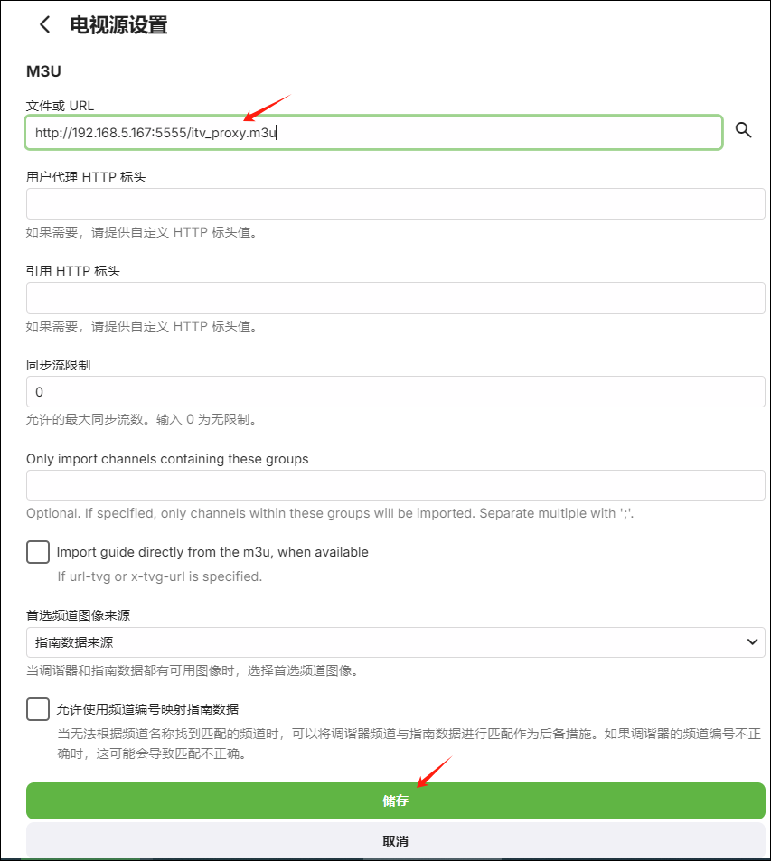
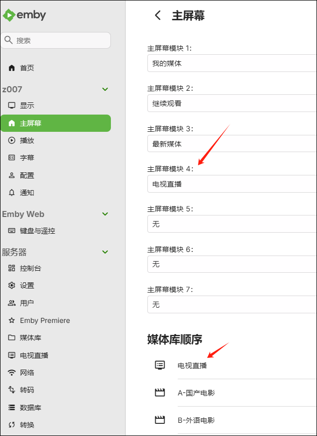

## 容器安装

1、绿联登录ssh，root运行以下命令：`docker run -d --name=pixman -p 5555:5000 --restart=always pixman/pixman:latest`
​
注意：
- 如果端口5555被占用了，换成另一个未被占用的即可
- 可以用lsof命令查看监听端口，比如`lsof -i:5555`

​2、安装完成后，可以输入 绿联IP:端口（我这里是5555） 转跳使用教程，代表安装正确。
​
​
## 添加M3U电视源
​
1、打开emby-电视直播，点击添加电视源

​
​
 ​
​2、添加电视源后点击储存
​
​

3、可以添加以下地址

```
https://cdn.jsdelivr.net/gh/vicjl/myIPTV@master/CCTV.m3u
​
https://cdn.jsdelivr.net/gh/vicjl/myIPTV@master/IPTV.m3u
​
http://192.168.5.167:5555/itv_proxy.m3u
​
http://192.168.5.167:5555/ysp.m3u
​
http://192.168.5.167:5555/tptv_proxy.m3u
​
http://192.168.5.167:5555/4gtv.m3u  台湾源需要emby环境变量里面添加代理

```

​​

​
4、对于特殊的源在环境变量添加代理

```
HTTP_PROXY=http://192.168.5.167:7890
​
ALL_PROXY=http://192.168.5.167:7890
​
NO_PROXY=172.0.0.1,127.0.0.1,localhost

```

​​​
​
## 添加电视指南源
​

​1、emby点击电视直播-指南数据源，点击添加指南数据源
​
​​​

2、填写国家和数据来源

​​​

3、填写信息，可以添加以下两个xml地址

```
https://cdn.jsdelivr.net/gh/vicjl/myIPTV@master/EPG.xml
​
https://assets.livednow.com/epg.xml

```
​​​

4、两个数据源添加完成

​​​

## 使用

1、在主屏幕加载电视直播

​​​
 ​
2、完成

​​​

 ​
​
​