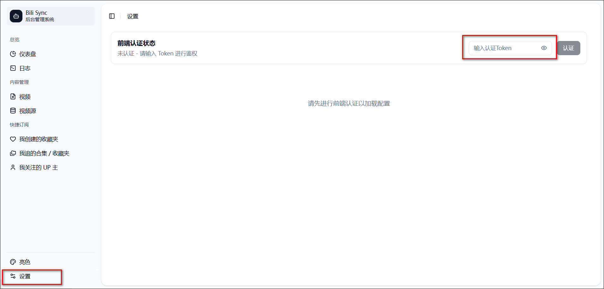
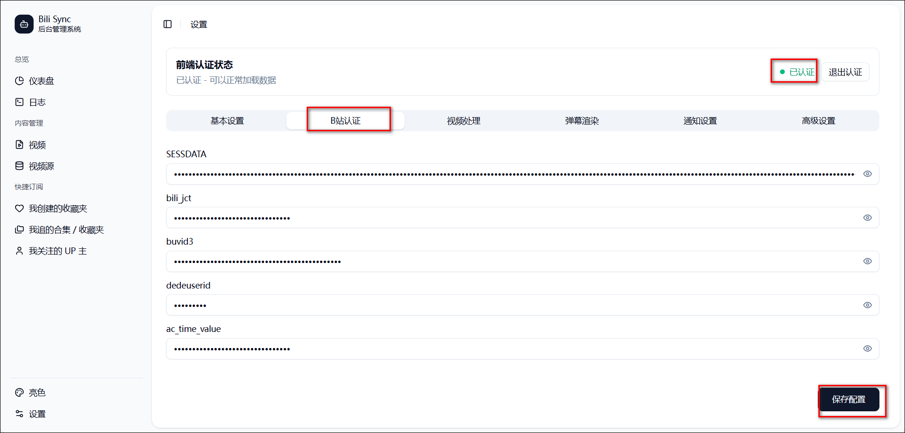
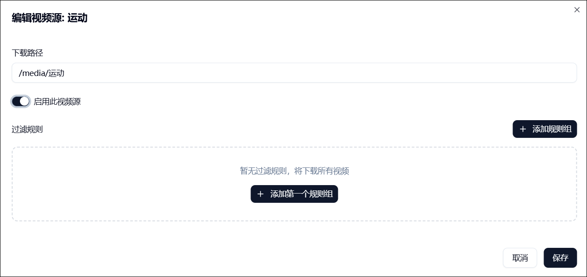
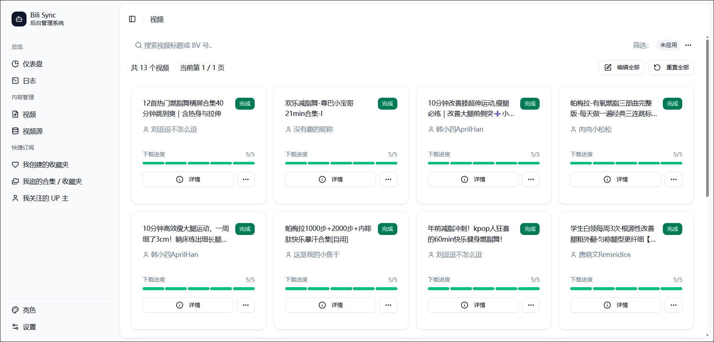

bili-sync 是一款专为 NAS 用户编写的哔哩哔哩同步工具。它的基本的工作原理是使用用户填写的凭据定期扫描视频合集、收藏夹等，获取到本地未下载过的内容并保存到本地，维持本地视频库与哔哩哔哩网站的同步。

官网：https://bili-sync.allwens.work/quick-start

注意：自 2.6.0 版本开始是数据库形式，本文教程版本为2.9.4

## compose部署

```
services:
  bili-sync-rs:
    image: amtoaer/bili-sync-rs:latest
    hostname: bili-sync-rs
    container_name: bili-sync-rs
    restart: unless-stopped
    network_mode: bridge
    tty: true # 该选项请仅在日志终端支持彩色输出时启用，否则日志中可能会出现乱码
    # user: 1000:1000 # 不设置默认为 Root
    ports:
      - 12345:12345
    volumes:
      - ./config:/app/.config/bili-sync # 配置目录
      - /volume5/Media_other/BiliSync:/media # 视频保存目录
      # - ${Emby 或 Jellyfin 配置下的 metadata/people 目录}:/app/.config/bili-sync/upper_face # metadata/people 正确挂载才能在 Emby 或 Jellyfin 中显示 UP 主头像。右边的目标目录不固定，只需要确保目标目录与 bili-sync 中填写的“UP 主头像保存路径”保持一致即可
```


如果设置了user，但是容器一直在重启，查看日志显示：`数据库初始化失败: Failed to migrate database`的话，说明权限不够，建议注释或者删除user一行，用默认的root。

容器启动成功后获取日志里的auth_token：

​


## 认证配置

1、浏览器输入IP:12345，打开 WebUI。

2、此时有个提示弹窗说未认证不用管他，我们点击左下角的设置，把刚刚在日志里的token填入输入框然后点击认证。点击完成后状态会变成已认证。

​


3、B 站认证

认证后设置页面会出现更多设置栏目，我们来到B站认证菜单，填写所需的五个值然后点击保存设置。

​


其中ac_time_value用于刷新 Cookies，需要按 F12 打开开发者工具，然后进入控制台，输入`window.localStorage.ac_time_value`即可获取值。如果输入后结果是undefined，可以尝试：
- 退出重新登录
- 使用无痕模式
- 更换浏览器
- 多退出登录几次

我个人是edge和谷歌的正常和无痕都不行，也都试了一次重新登录也不行，后来在无痕模式下再退出重新登了一次才行的。
​


剩下的sessdata、bili_jct、buvid3 和 dedeuserid 这四个参数的值均在浏览器的 Cookies 里头，获取方法：
- 按 F12 打开开发者工具
- 在工具窗口上方找到`应用程序`选项卡
- 在左侧找到`存储/Cookies`，并选中b站域名，在右侧找到对应四项即可。

​


## 下载视频


点击我创建的收藏夹菜单，可以看到所有的收藏夹，点击订阅按钮可以订阅此收藏夹，注意本地保存路径得设置对，比如我的compose里挂载的下载目录为media，则我这里是/media/运动。

​

订阅完成后可以在视频源菜单看到运动这个名称，也可以点击手动添加的按钮来添加收藏夹，只是需要填写收藏夹id。其他类型的视频源类似。

​

点击编辑按钮进入编辑页面，可以选择开启还是关闭这个源，或者设置过滤规则。

​


启用的视频源里的视频下载任务会在后台每隔特定时间自动运行一次，由配置中的“任务触发条件”决定。

​


也可以点击首页的立即执行下载任务手动下载启用的视频源里的任务。

​


在视频菜单下也可以看到所有下载的视频。

​


可以点击日志菜单查看情况。
>如果下载的时候报错`message: 账号未登录`，而且B站认证里的内容确认填写正确的话，建议重启一下容器看看。

​