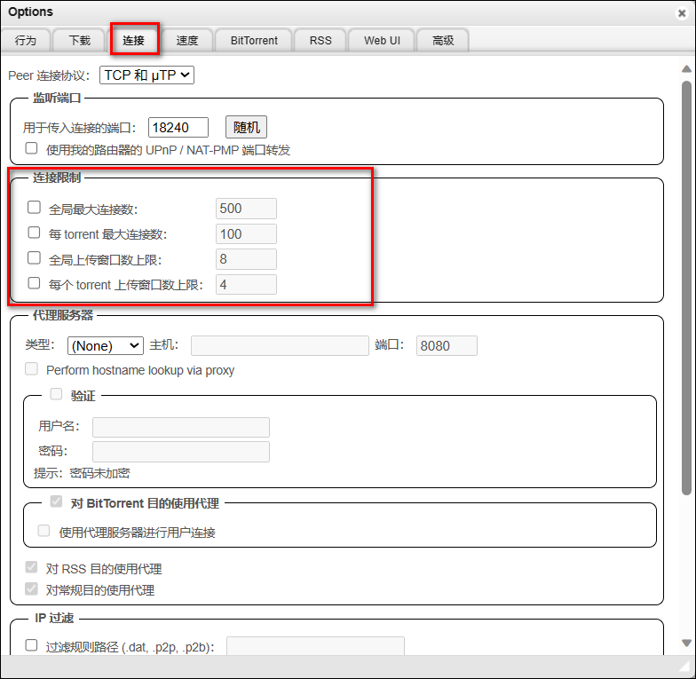
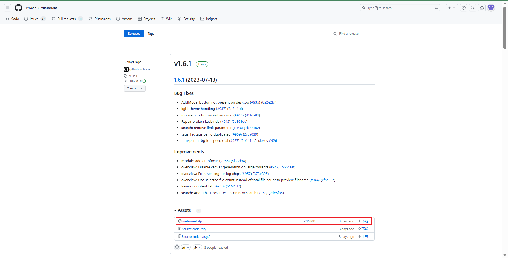
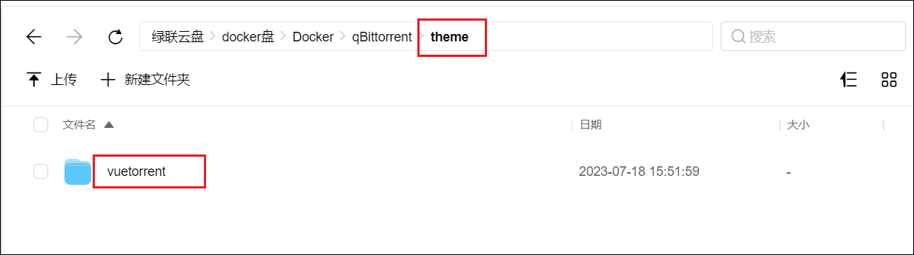
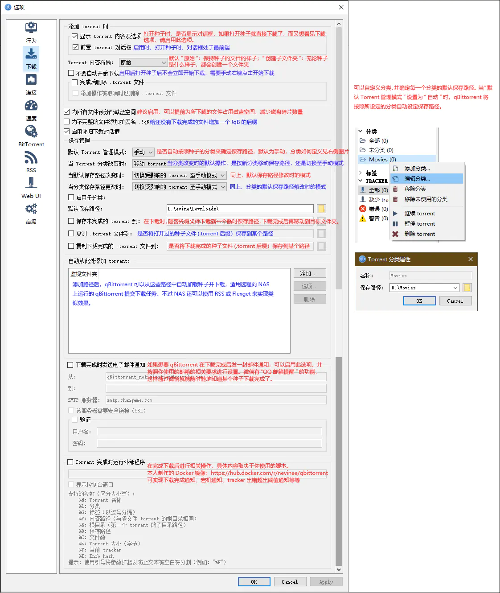
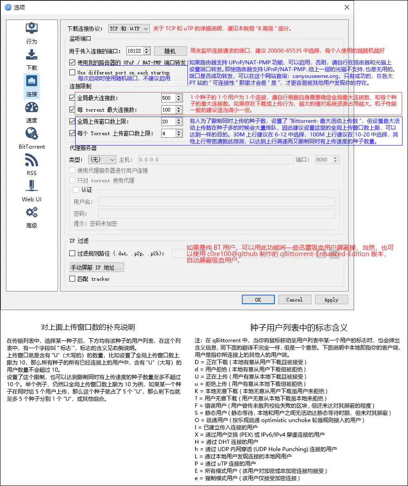
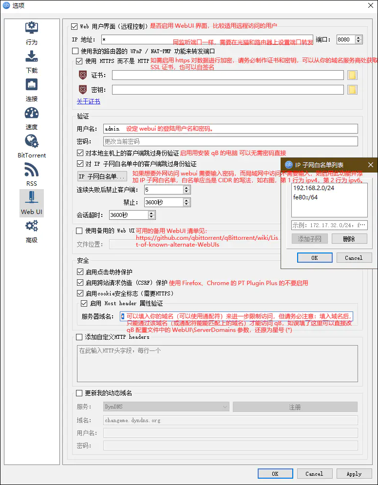
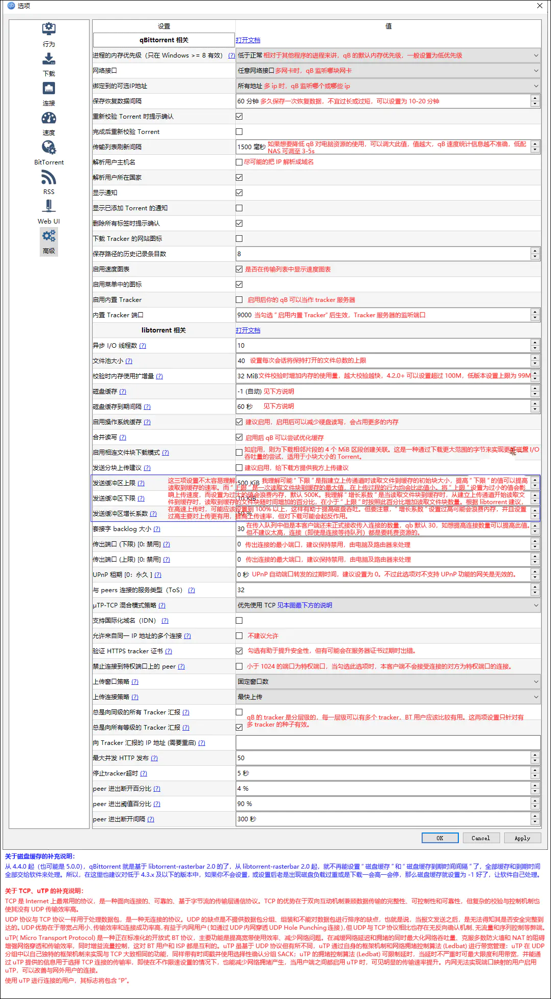

## 1、compose安装命令

```
services:
  qbittorrent:
    image: linuxserver/qbittorrent:4.6.7
    container_name: qB
    network_mode: bridge
    restart: always
    ports:
      - 8080:8080
      - 16881:6881
      - 16881:6881/udp
    volumes:
      - /volume3/docker/qBittorrent:/config
      - /volume2/Media_movie:/hddMovie
      - /volume1/Media_TV:/hddTv
      - /volume5/Media_other:/hddOther
      - /volume5/Media_115:/hdd115 # 上传115目录
    environment:
      - PUID=0
      - PGID=0
      - TZ=Asia/Shanghai 
      - WEBUI_PORT=8080  # Web UI端口
    deploy:  
      resources:  
        limits:  
          cpus: '4'   # 限制容器可以使用的最大CPU核心数 
          memory: 4G  # 限制容器可以使用的最大内存量
        # reservations:  
        #   cpus: '2'   # 保证容器至少可以使用的CPU核心数
        #   memory: 2G  # 保证容器至少可以使用的内存量
```


## 2、初始化设置

1、打开浏览器，在地址栏输入绿联 IP:8080,就可以访问 qb 的 webui 页面了，输入初始的用户名（admin）和密码（adminadmin）登录。


> 下面的设置项设置完成后，记得点击保存。

2、点击设置按钮，可以把语言设置为简体中文。


3、在 web UI 下可以修改账户名称和密码，建议修改。


4、如果下载没速度的话，可以点击一下随机端口，最好设置个 5 位数的端口。


5、如果同时下载数很多的话，则有些会显示排队的状态，我们可以取消勾选 Torrent 排队来解决，也可以把默认的数值设置大一点。



6、确认“总是向同级的所有 Tracker 汇报”、“总是向所有等级的 Tracker 汇报”选中。


## 3、皮肤美化

官方介绍：<https://github.com/WDaan/VueTorrent>

1、VueTorrent 压缩包下载：<https://github.com/WDaan/VueTorrent/releases>,下载最新版本的即可。注意：下载的是 vuetorrent.zip 这个压缩包而不是下面两个源码的。



2、在 docker 盘的 qb 目录（/config 挂载对应的目录）下新建一个文件夹 theme 用来存放皮肤文件。


3、把下载的 VueTorrent 压缩包文件解压放进去。



4、然后打开 qb，点开设置-Web UI 里面，勾选使用备用 Web UI，并选择路径。然后点击保存。


5、重启 qb，进入已更换皮肤的 web 界面，点击右上角的齿轮进入设置界面，选择 VUETORRENT，往下翻，设置语言为中文，右上角点击保存。然后重新刷新界面，就是中文界面了。


6、如果页面打不开，提示 xx 文件无效、找不到，那说明文件夹路径配置错误。

可以打开 QB 配置文件（qBittorrent.conf，记事本等工具可以打开）。


然后找到 WebUI\RootFolder 行， 修改后面的值即可。


## 4、进阶

### 1、忘记密码

如果忘记了密码，可以打开 QB 配置文件（qBittorrent.conf），删除 WebUI\Password_PBKDF2 这一行把密码重置为默认密码，再重启 QB 容器就可以了。


### 2、详细说明

在网上看到的一个详细说明，仅供参考




可实现下载完成通知、宕机通知、tracker 出错超出阈值通知、自动分类、tracker 出错打标签、批量修改 tracker、检测指定文件夹下未在 qbittorrent 客户端中做种的文件夹/文件、配合 IYUUAutoReseed 实现自动重新校验和自动恢复做种、指定设备上线时自动限速、多时段限速、导出做种文件清单、导出未做种文件清单等等等等。




匿名模式说明：https://github.com/qbittorrent/qBittorrent/wiki/Anonymous-Mode




可用的备用 WebUI 清单见：https://github.com/qbittorrent/qBittorrent/wiki/List-of-known-alternate-WebUIs。


