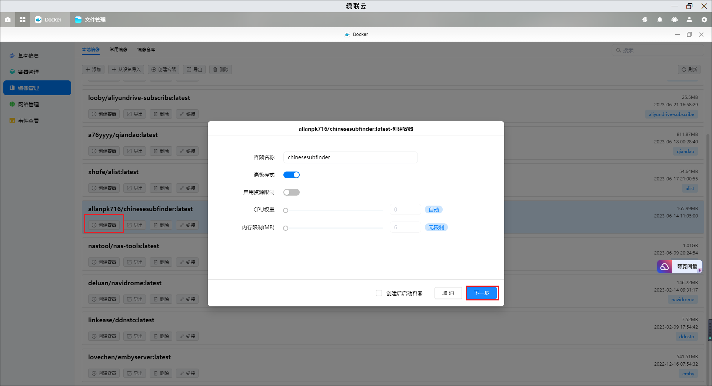
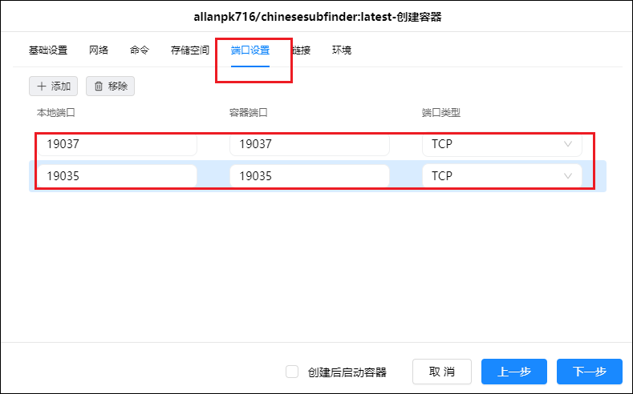
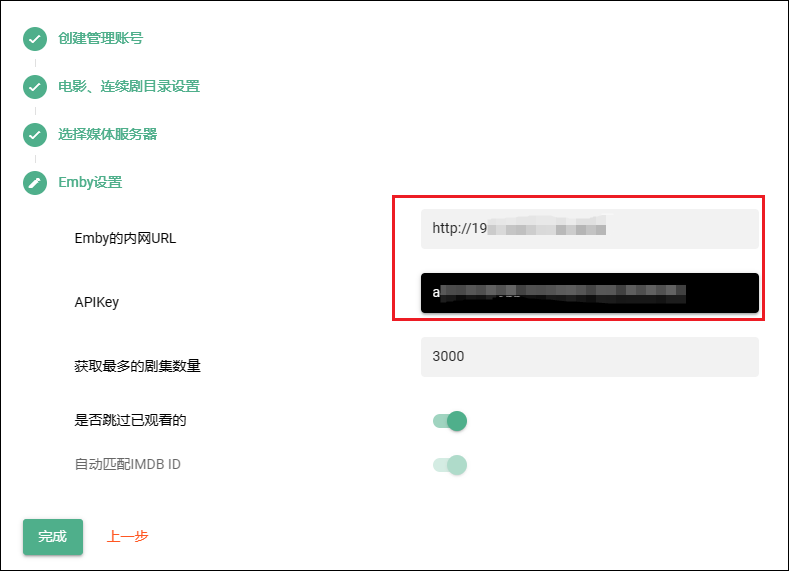
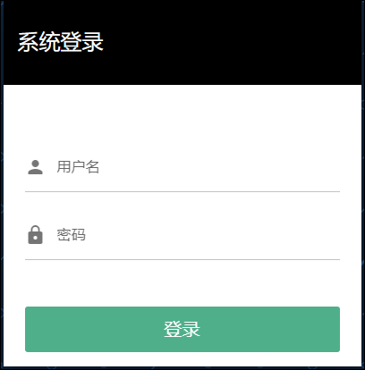
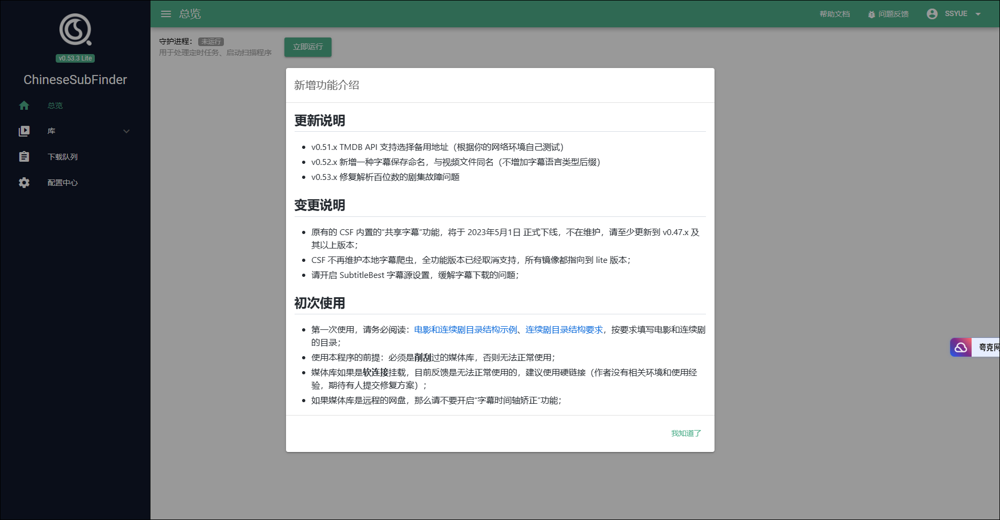
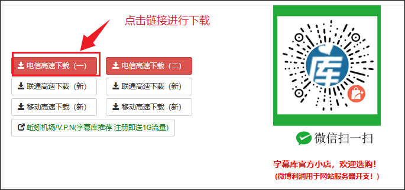
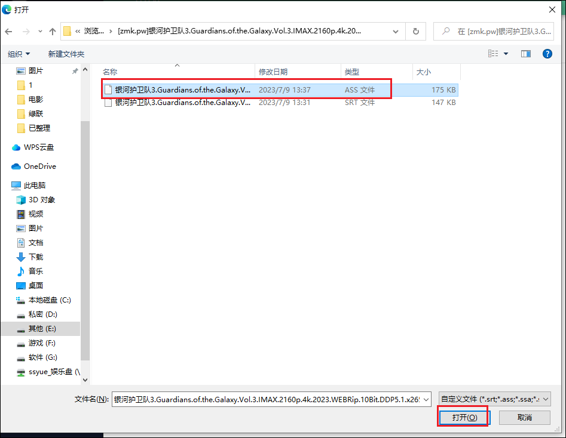
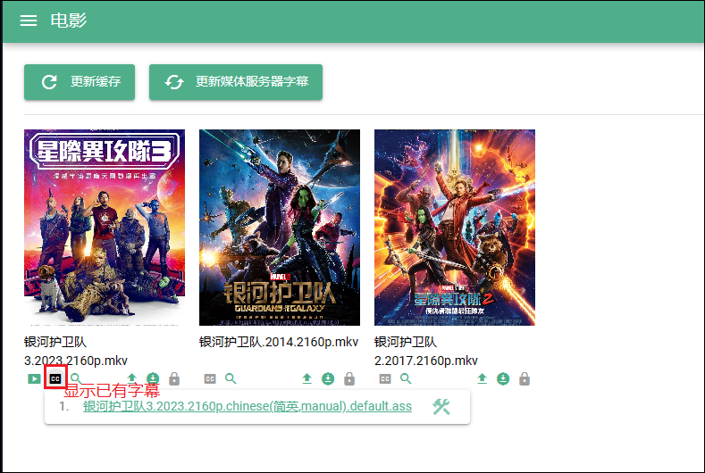
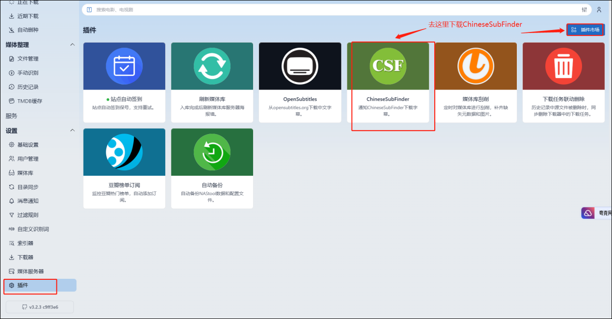
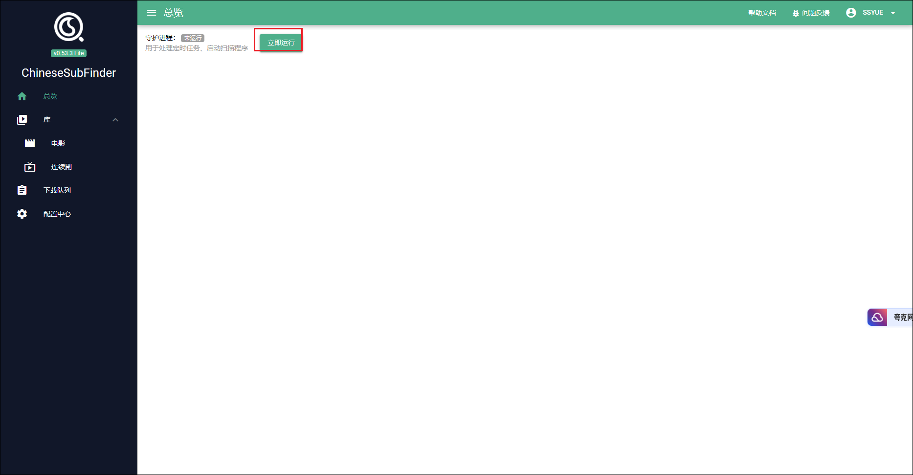

chinesesubfinder：自动化中文字幕下载。

## 安装

1、下载镜像

2、先在 docker 盘里新建几个文件夹，先创建个 chinesesubfinder 文件夹，然后在这个文件夹里创建两个子文件夹：config 和 cache。

3、点击创建容器

4、存储空间设置，把刚刚新建的两个文件夹用上，另外选择个存放影视的文件夹挂载/media。注意类型改成读写。

5、端口设置 19037 和 19035.

6、环境设置

环境这里默认的 PUID 是 1026，PGID 是 100，可以先按默认的来，如果有问题则都改成 0，一般 0 是代表最高权限。我先不改。

至此，容器创建完成，我们点击启动。

## 初始化

1、在浏览器输入绿联 IP+端口进去容器，如果一开始是无法访问，可以多等几分钟再进，因为容器启用需要时间，可能还没有完全启动。

2、好了，现在我们进来了这个容器，我们先按照要求填写管理账号的账号名和密码，然后点击下一步。

3、在这之前首先看看我的影视文件夹目录情况：

4、所以我是这样填的，填完之后选择下一步。

5、这里就按你的情况来选择，我的是 emby，选择完成后点击下一步。

6、填写 URL 和 API，URL 即为绿联 IP+端口，也就是你进 emby 的链接。

7、API 可以在 emby 后台为 chinesesubfinder 新建个。

8、填写完成后点击完成。然后重新登录下

9、进入界面

## 使用

1、后台设置

1）点击配置中心，修改字幕格式为默认格式

2）然后往下翻，启用 TMDB，填写 TMDB 的 API 密钥。点击保存

3）在字幕源设置里可以添加伪射手网址。相当于增加个搜索字幕的来源。

4）Emby 这里我们在刚开始就设置了，可以点下检测，一般没问题。

设置就设置完成了。

5）然后我我们可以去我们的库里看看，刚开始建没有东西的话，点击更新缓存。更新完后点击下刷新，影视就出来了。

2、字幕

1）我们可以在下面看到字幕情况，也可以点击放大镜搜索字幕了。

2）它可以跳转到字幕网站进行检索，比如点击第一个

3）这样就出来了一些字幕，我们可以点进去进行下载

4）比如点击刚刚的第一个

5）跳转到下载页面

6）下载完成后是个压缩包，解压后发现里面有一个 srt 和一个 ass 文件，这两个都是字幕的常见格式。

7）然后回到我们的字幕网站，选择刚刚下载的影片，点击上传字幕。

8）选择刚刚下载好的字幕

9）上传完成后，cc 变黑，显示已有字幕，点击可以看到字幕情况。

3、和 nastool 联动

1）chinesesubfinder 中打开配置中心-API key，获取密钥，然后点击保存

2）打开 nastool，选择字幕里的 ChineseSubFinder。

3）如果是最新版可能没有字幕在左侧，则点击插件，下载 ChineseSubFinder 插件。

4）打开 ChineseSubFinder 插件，填写内容

5）本地路径可以参考自己 nastool 媒体库的

6）远程路径可以参考自己 ChineseSubFinder 里的

7）然后我们点击 nastool 里的目录同步，看看是否生效。

8）然后我们也可以把守护进程打开，这样就算 nastool 没有成功下载字幕的时候，ChineseSubFinder 也会每隔几个小时去重新整理一下这个影片资源。

