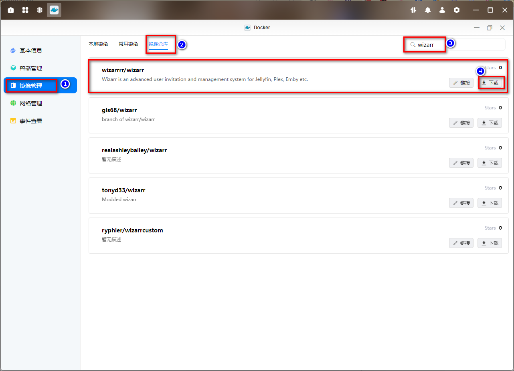
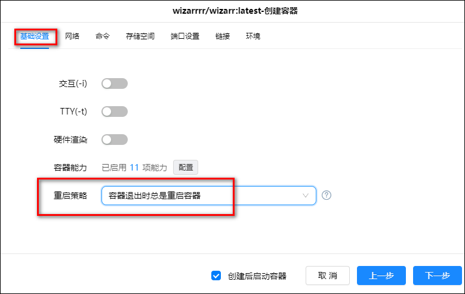
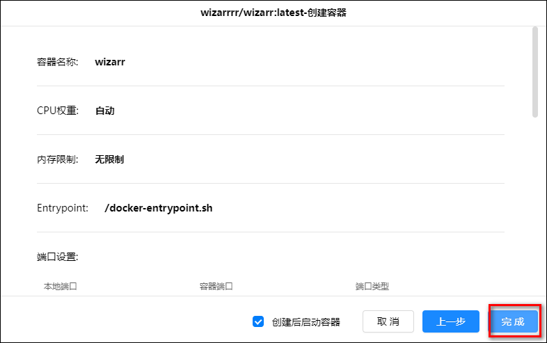
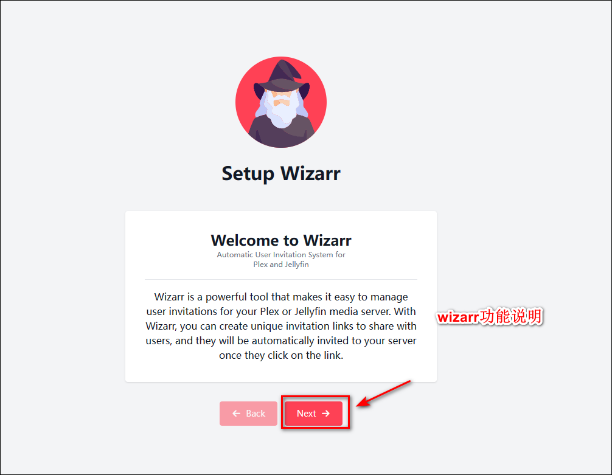
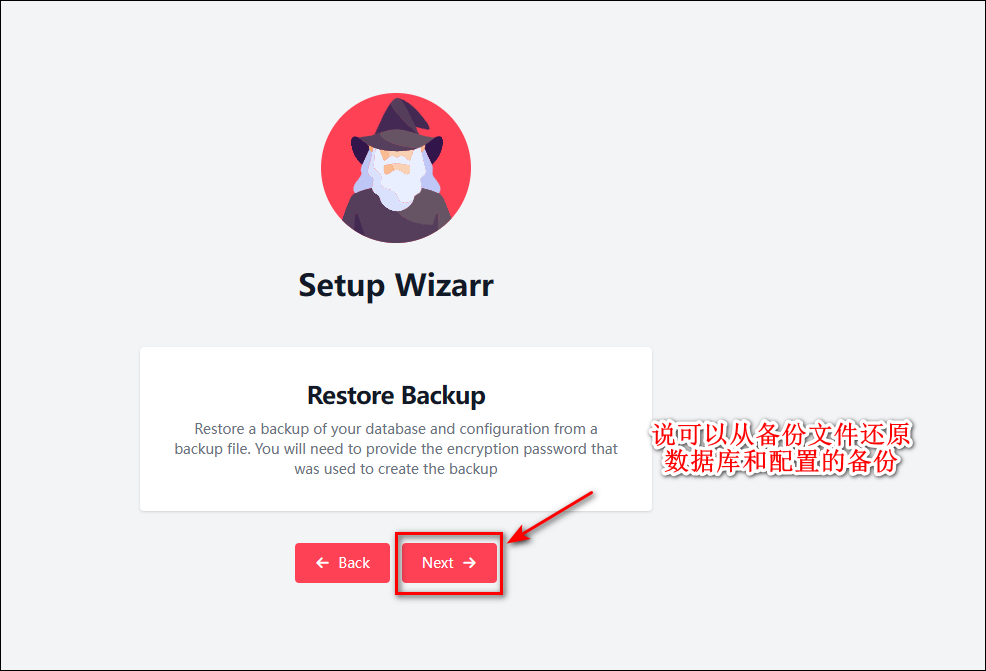
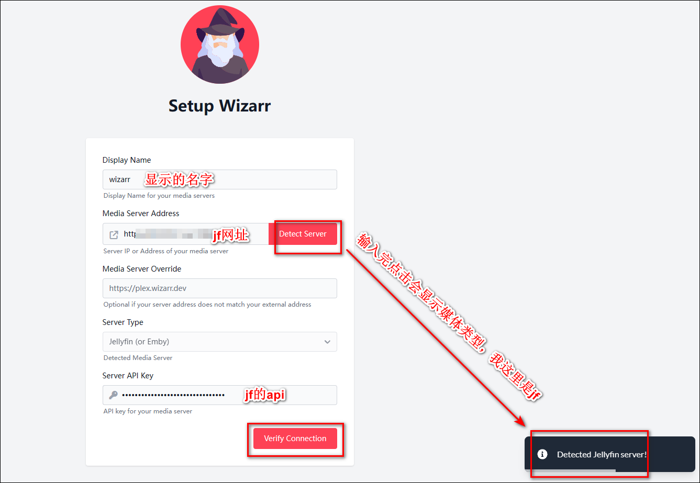
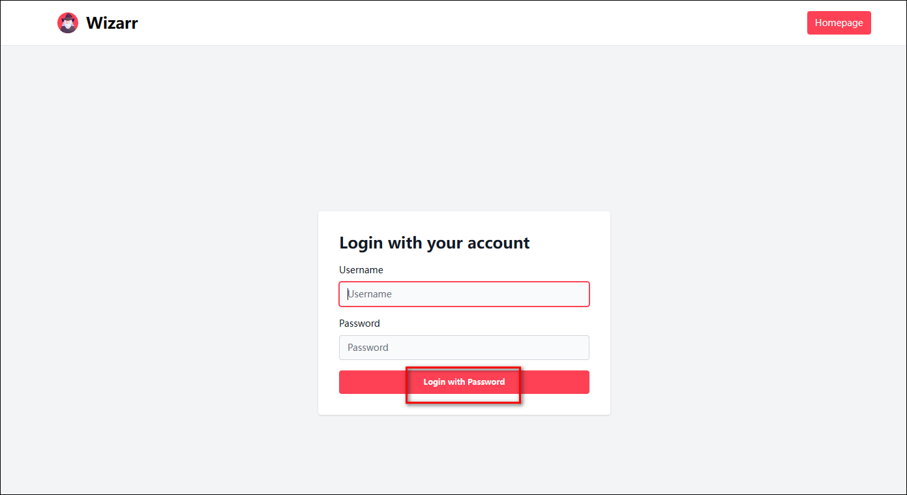
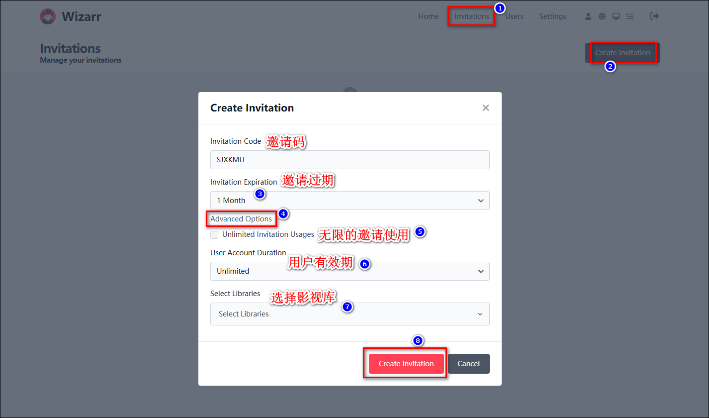

可以为 Jellyfin 创建用户邀请，github 地址：<https://github.com/wizarrrr/wizarr>。

## 容器部署

1、在绿联云 APP 里打开 docker，在镜像管理-镜像仓库中搜索 wizarr，选择第一个并点击下载，版本选择最新版本即可。

2、在本地仓库里找到刚刚下载好的镜像，点击创建容器。容器名称可以自定义，勾选创建后启动容器，然后点击下一步。

3、基础设置这里设置下重启策略。此时先不要点下一步。

4、存储空间设置：在 docker 文件夹下新建一个文件夹 wizarr，并建一个子文件夹 database，把它挂载为/data/database，类型设置读写。

5、端口设置：本地端口如果 5690 没有被占用的话，默认 5690 即可。端口设置完可以点下一步了。

6、点击完成。

## 初始化

在浏览器中打开 ip:5690，进入 Wizarr 设置界面。

1、功能说明提示，点击 next

2、说明目前 Wizarr 仅支持其内部 SQLite 数据库，点击 next

3、说明从备份文件还原数据库和配置的备份，点击 next

4、输入管理员账号的用户名、密码、邮箱，输入完之后点击 Create Account。

5、配置媒体服务器信息

- Display Name 自定义即可
- 在 Media Server Address 中填入你的 Jellyfin/Emby/Plex 的地址，然后点击旁边的 Detect Server，没问题的话右下角会自动识别出媒体服务器的类型，比如我这里是 jf。
- 在媒体库中（我这里是 jf）中创建一个 API Key，粘贴在 Server API Key 下。
- 点击 Verify Connection

6、点完 Verify Connection 后右下角会跳出个成功的提示，此时页面也已更改，我们继续点击 Save Connection

7、点完 Save Connection 后右下角会跳出个成功的提示，此时页面也已更改，我们点击 Scan Libraies

8、点完 Scan Libraies 后，会扫描出你的媒体服务器所有的媒体库，选择你后续想用来分享的媒体库，建议全部都选上，选完后点击 Select Libraies

9、点完 Select Libraies 后右下角会跳出个成功的提示，此时页面也已更改，最后继续点击 Next。

10、现在设置都完成了，点 Go to Login 去登录

11、输入用户名和密码，点击 Login with Password 登录

12、进入界面会有功能说明教程，一直点击 next 查看就行

13、点完后成功地初始化完成了

## 使用

### 邀请

点击 Invitations - Create Invitations，选择有效期（有一天、一月、一年、永久、自定义日期等选项）后点击 Create Invitations。

会跳出个分享的链接，点击 share 分享给别人即可。

