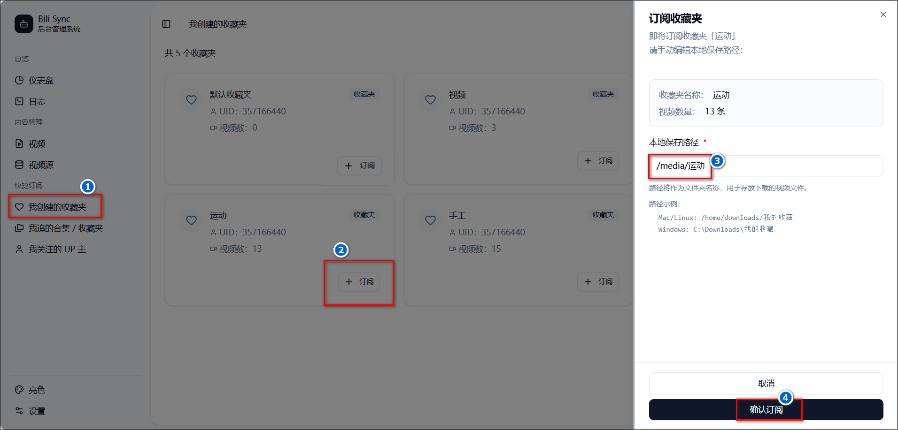

bili-sync 是一款专为 NAS 用户编写的哔哩哔哩同步工具。它的基本的工作原理是使用用户填写的凭据定期扫描视频合集、收藏夹等，获取到本地未下载过的内容并保存到本地，维持本地视频库与哔哩哔哩网站的同步。

官网：https://bili-sync.allwens.work/quick-start

注意：自 2.6.0 版本开始是数据库形式，本文教程版本为2.9.4

## compose部署

```
services:
  bili-sync-rs:
    image: amtoaer/bili-sync-rs:latest
    hostname: bili-sync-rs
    container_name: bili-sync-rs
    restart: unless-stopped
    network_mode: bridge
    tty: true # 该选项请仅在日志终端支持彩色输出时启用，否则日志中可能会出现乱码
    # user: 1000:1000 # 不设置默认为 Root
    ports:
      - 12345:12345
    volumes:
      - ./config:/app/.config/bili-sync # 配置目录
      - /volume5/Media_other/BiliSync:/media # 视频保存目录
      # - ${Emby 或 Jellyfin 配置下的 metadata/people 目录}:/app/.config/bili-sync/upper_face # metadata/people 正确挂载才能在 Emby 或 Jellyfin 中显示 UP 主头像。右边的目标目录不固定，只需要确保目标目录与 bili-sync 中填写的“UP 主头像保存路径”保持一致即可
```


如果设置了user，但是容器一直在重启，查看日志显示：`数据库初始化失败: Failed to migrate database`的话，说明权限不够，建议注释或者删除user一行，用默认的root。

容器启动成功后获取日志里的auth_token：

​


如果是第一次部署时没记录下来，后面又重新部署容器把日志刷掉了，可以停掉 bili-sync 后用 DB Browser for SQLite 或类似的工具打开 data.sqlite，config 表里存储了 json 格式的配置信息。如果config表里面没有信息的话可以试试删除这个表重新启动容器。

​

## 认证配置

1、浏览器输入IP:12345，打开 WebUI。

2、此时有个提示弹窗说未认证不用管他，我们点击左下角的设置，把刚刚在日志里的token填入输入框然后点击认证。点击完成后状态会变成已认证。

​


3、B 站认证

认证后设置页面会出现更多设置栏目，我们来到B站认证菜单，填写所需的五个值然后点击保存设置。

​


其中ac_time_valueac_time_value 用于刷新凭据，如果不填写或填写错误，那么 credential 没办法自动更新，过几天就会失效。需要按 F12 打开开发者工具，然后进入控制台，输入`window.localStorage.ac_time_value`即可获取值。如果输入后结果是undefined，可以尝试：
- 退出重新登录
- 使用无痕模式
- 更换浏览器
- 多退出登录几次

我个人是edge和谷歌的正常和无痕都不行，也都试了一次重新登录也不行，后来在无痕模式下再退出重新登了一次才行的。
​


剩下的sessdata、bili_jct、buvid3 和 dedeuserid 这四个参数的值均在浏览器的 Cookies 里头，获取方法：
- 按 F12 打开开发者工具
- 在工具窗口上方找到`应用程序`选项卡
- 在左侧找到`存储/Cookies`，并选中b站域名，在右侧找到对应四项即可。

​


## 下载视频


点击我创建的收藏夹菜单，可以看到所有的收藏夹，点击订阅按钮可以订阅此收藏夹，注意本地保存路径得设置对，比如我的compose里挂载的下载目录为media，则我这里是`/media/运动`。

​


>这里因为有很多人不理解导致下了视频后找不到，我再多说明一下。
>
>首先看我们compose里挂载的视频保存目录 `- /volume5/Media_other/BiliSync:/media # 视频保存目录` ：
>- 冒号左边：`/volume5/Media_other/BiliSync` 是你的绿联 NAS 本地**实际路径**，这个路径可以右键对应文件夹→属性查看复制，是视频文件最终实际保存的位置；
>- 冒号右边：/media 是容器内部的**挂载映射路径**，可自定义为 /download 或者 /save 等任意名称，只要使用的时候保持一致即可。
>
>**保存路径设置规则**：
>
>容器会通过冒号右侧的容器挂载路径，映射到 NAS 本地的实际路径，所以在容器的视频保存设置中，保存路径必须以容器挂载路径为前缀（或直接填容器挂载路径）：
>- 直接保存到 NAS 实际路径根目录：保存路径填 /media（根据你冒号右边的挂载路径来填写）；
>- 保存到 NAS 实际路径的二级目录：在容器挂载路径后加后缀即可，比如我要保存到运动分类，就填 `/media/运动`，文件最终会出现在 NAS 的`/volume5/Media_other/BiliSync/运动` 文件夹下。
>
>简单说：NAS 实际路径负责 【文件存在哪】，容器挂载路径负责【容器认哪】，保存路径得跟着容器挂载路径填。
>
>不小心设置错了保存路径：
>​


订阅完成后可以在视频源菜单看到运动这个名称，也可以点击手动添加的按钮来添加收藏夹，只是需要填写收藏夹id。其他类型的视频源类似。

>注意：使用快捷订阅添加视频源后**默认不启用**，需要手动点击编辑后进去开启，开启的与否就是看启用状态列的滑动按钮是否在右边。如果源都没有开启，会遇到如下错误：**本轮视频下载任务执行遇到错误：没有可用的视频源**。

​

点击编辑按钮进入编辑页面，可以选择开启还是关闭这个源，或者设置过滤规则。

​


启用的视频源里的视频下载任务会在后台每隔特定时间自动运行一次，由配置中的“任务触发条件”决定。

​


也可以点击首页的立即执行下载任务手动下载启用的视频源里的任务。

​


在视频菜单下也可以看到所有下载的视频。

​


可以点击日志菜单查看情况。
>如果下载的时候报错`message: 账号未登录`，而且B站认证里的内容确认填写正确的话，建议重启一下容器看看。

​


## 常见问题

1、错误：request failed, status code: -352, message: -352，等待下一轮执行

这个是风控导致的。当前程序已经采取了多种措施缓解风控，包括：
- 除合集外的视频源类型基于时间提前中断；
- 视频详情仅填充一次、下载结果记录到数据库中，在下一轮执行时跳过；
- 支持配置并发限制、请求频率限制；
- 遇到风控自动中断等待下一轮执行；
- 每轮任务前打乱视频源顺序，避免后续视频源长期饥饿。
- 目前风控应该主要出现在添加新视频源后，新增大量视频需要处理导致风控的触发频率较高。存量视频处理差不多后，每轮仅检测处理新增视频应该不太会触发风控。如果还是遇到风控比较多可以尝试调低并发和请求频率限制。

不过当前程序已经有了比较完善的风控处理逻辑了，极端点来讲，即使每轮任务都触发风控，从宏观角度来看问题规模也是在逐步下降的。因此风控并不是需要修复的 BUG，可以视作一个不影响程序正确性的 WARNING。

另外风控主要出现在下载存量视频时，等存量视频填充完毕后，每个周期扫描写入的新视频数量级不会很大，一般不会触发风控。

说到底风控是由 b 站服务器策略导致的，bili-sync 作为接口调用方除了限流和完善处理策略外能做的十分有限。


2、检查刷新 Credential 遇到错误

- `status code: -111`: cookie 里的 bili_jct 字段
- `status code: 86095`: ac_time_value 字段


程序的 cookie 刷新机制按照[上游文档](https://github.com/SocialSisterYi/bilibili-API-collect/blob/15b325637cd6226825d7afe6c628845a895bcc94/docs/login/cookie_refresh.md)实现，会在每天第一次执行扫描任务时检查刷新，如果 b 站 api 返回“需要刷新”则进入刷新 cookie 流程。

这类问题最简单的解决办法就是重新填一遍凭据，推荐的方法是开启浏览器无痕窗口登录，获取一套凭据后填写到 bili-sync。