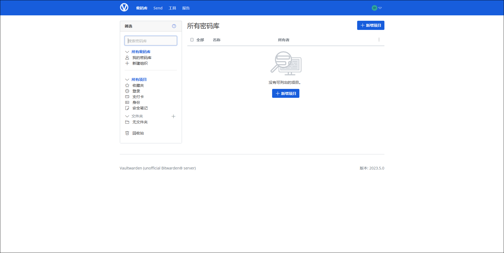
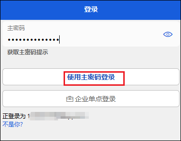
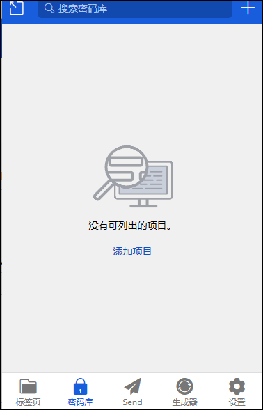

官方文档： https://rs.ppgg.in/home

注意，此容器需要https。


## 1、compose文件

```
services:
  vaultwarden:
    image: vaultwarden/server:latest
    container_name: vaultwarden
    restart: always
    volumes:
      - ./vw-data:/data
    ports:
      - 2080:80 # 您可以将 2080 替换为您喜欢的端口
    environment:
      SIGNUPS_ALLOWED: "true" # 控制是否允许新用户注册账号。创建账户后，使用 "false" 停用此选项，这样就不会有陌生人注册了
      # DOMAIN: "https://vaultwarden.example.com" # 使用反向代理时必填；您的域名；Vaultwarden 需要知道它是 https 才能正确处理附件
```

## 2、初始化

1、使用外网来登录，进入网页，点击创建账户。


2、填写电子邮件后点继续。


3、设置密码后点创建账户


4、登录


5、进入页面



6、可以新建文件夹用来分类密码


## 3、浏览器插件

1、在浏览器安装对应的[插件](https://microsoftedge.microsoft.com/addons/detail/bitwarden-%E5%AF%86%E7%A0%81%E7%AE%A1%E7%90%86%E5%99%A8/jbkfoedolllekgbhcbcoahefnbanhhlh?hl=zh-CN)


2、点击插件，输入邮箱后点击自托管。


3、输入外网地址后点击保存，回到登录页面点击继续。


4、输入密码，点击登录。



5、插件创建完成，可以点右上方的+添加密码项目。


