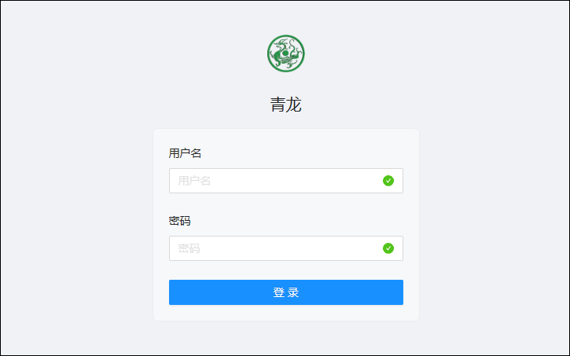
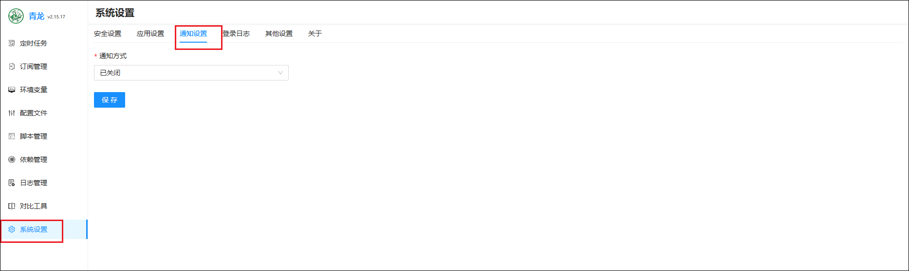
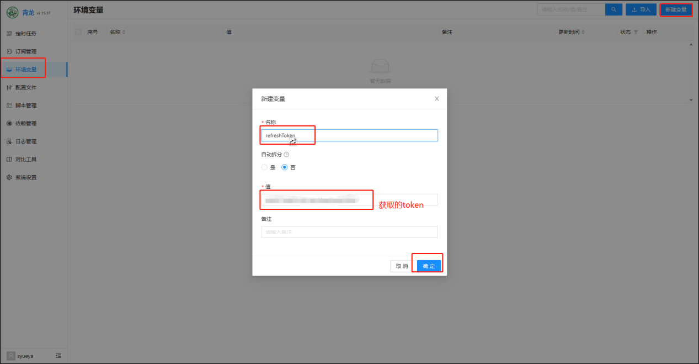
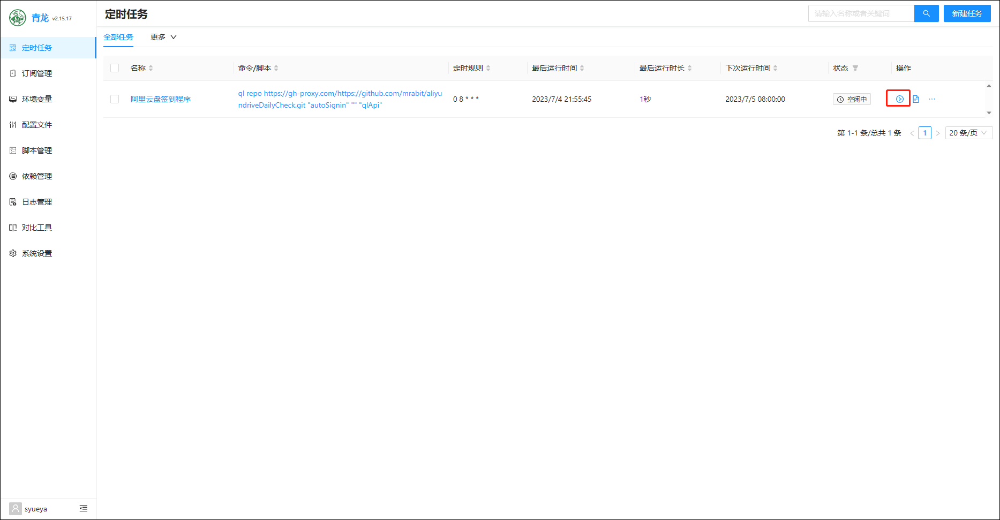

## 1、容器创建

```
services:
  qinglong:
    image: 'whyour/qinglong:latest'
    container_name: qinglong
    restart: always
    network_mode: bridge
    ports:
      - "15700:5700"
    volumes:
      - /volume3/docker/qinglong/data:/ql/data
    environment:
      QlBaseUrl: '/' # 部署路径非必须，以斜杠开头和结尾，比如 /test/
```

## 2、初始化

1、在本地浏览器输入 ip:端口进行访问，点击开始安装


2、设置完管理员账号密码后可以点击提交



3、通知设置可以先跳过


可以后面在系统里设置



4、点击去登录


5、输入账户密码点击登录


6、登录成功界面


## 3、阿里云签到

1、获取 token

通过[alist 获取阿里云盘的 token](https://alist.nn.ci/zh/guide/drivers/aliyundrive.html)


2、新建环境变量



3、新建依赖


4、新建任务

定时签到程序脚本：

- 国内建议用此脚本：
  ```
  ql repo https://gitee.com/joechen1024/aliyundriveDailyCheck.git "autoSignin" "" "qlApi"
  ```
- 国外原版拉取脚本：
  `    - ql repo https://github.com/mrabit/aliyundriveDailyCheck.git "autoSignin" "" "qlApi"
    - ql repo https://gh-proxy.com/https://github.com/mrabit/aliyundriveDailyCheck.git "autoSignin" "" "qlApi"
   `
  

点击运行一次，运行完成后刷新网页



如果多出一条定时任务则表示成功。


再手动运行一次。


然后查看日志是否正常，如果成功就可以不用管了。


5、如果有两个账号就多新建一个环境变量就行


6、消息通知

- 可以在设置里填好通知方式对应的信息。

  

- 也可在配置文件里输入对应的通知方法的信息。

  
