## 1、compose命令

```
services:
    qiandao:
        image: 'a76yyyy/qiandao:latest'
        container_name: qiandao
        restart: always
        ports:
            - '9006:80'
        volumes:
            - '/volume3/docker/qiandao:/user/src/app/config'
```

## 2、初始化

1、输入绿联云 IP+刚刚设置的本地端口进入页面，点击右上角的登录

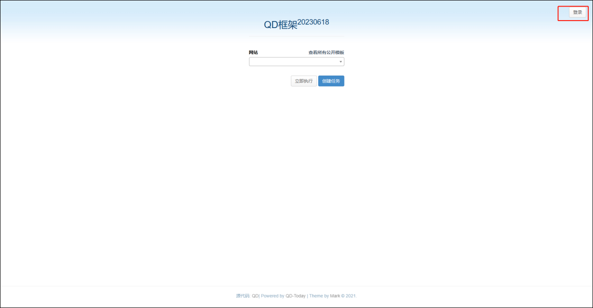

2、第一次的话输入邮箱和密码后点击注册，注册一个账号


3、签到框架首页

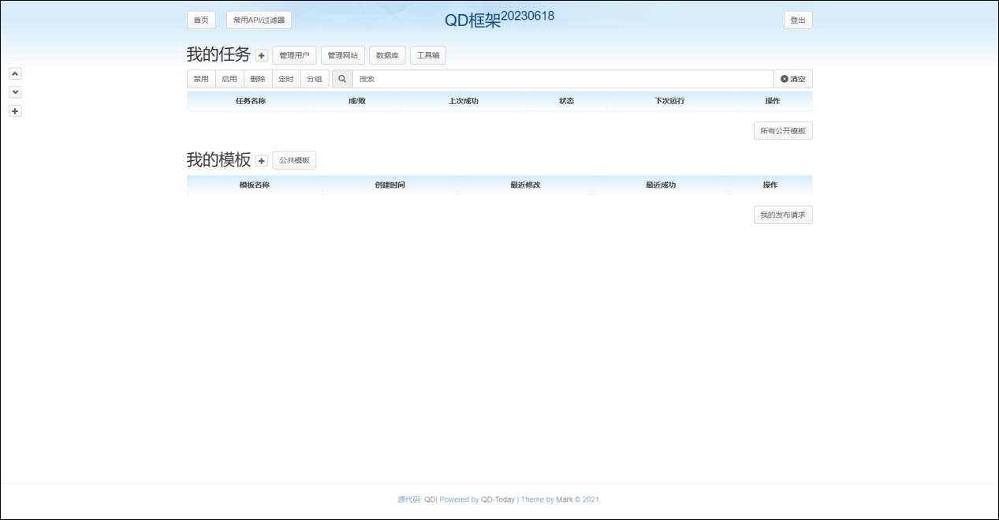

4、仓库模板

1）添加公共模板

首页点击公共模板


点击注册仓库，如果这里不显示注册，则先退出去再重新登进。


填写仓库名（自定义）、URL：<https://github.com/wjf0214/qd-templates>、分支，选择加速：

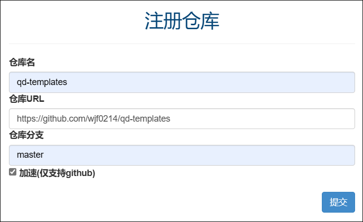

仓库注册成功：


没模板出现的强制更新几次看看


2）Har 文件获取

点击其中一个链接：


可以直接选择下载自己想要的 har 文件：

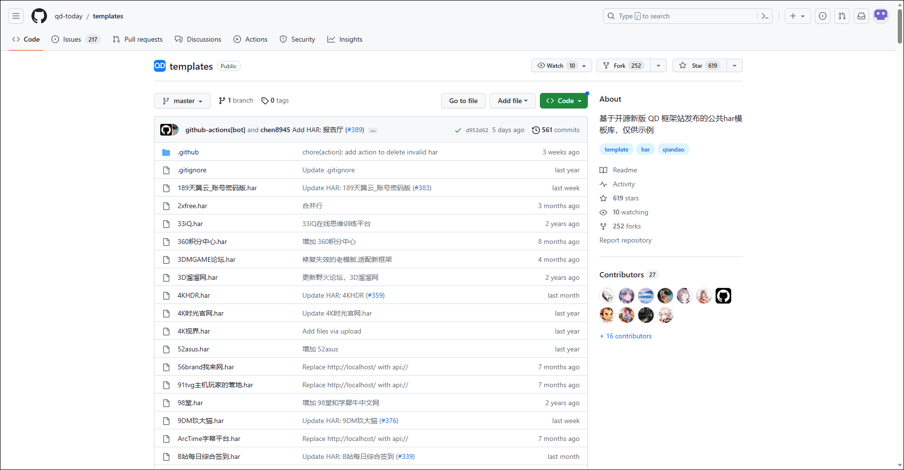

## 3、添加签到任务

### 1、什么值得买

1、登录什么值得买网页端，然后按 F12 调出开发人员工具，再刷新下页面，然后选择网络，找到 cookie 并复制。


2、点添加模板：


3、选择上传 HAR 文件然后直接点上传：


4、点击保存：


5、输入名称和网址继续保存：


6、往下翻点击测试，并输入刚刚复制的的 cookie：


7、测试成功后点空白处退出测试，并返回主页：


8、在主页处刷新下，看到我的模板里有什么值得买的模板了，然后在我的任务后点击新建任务：

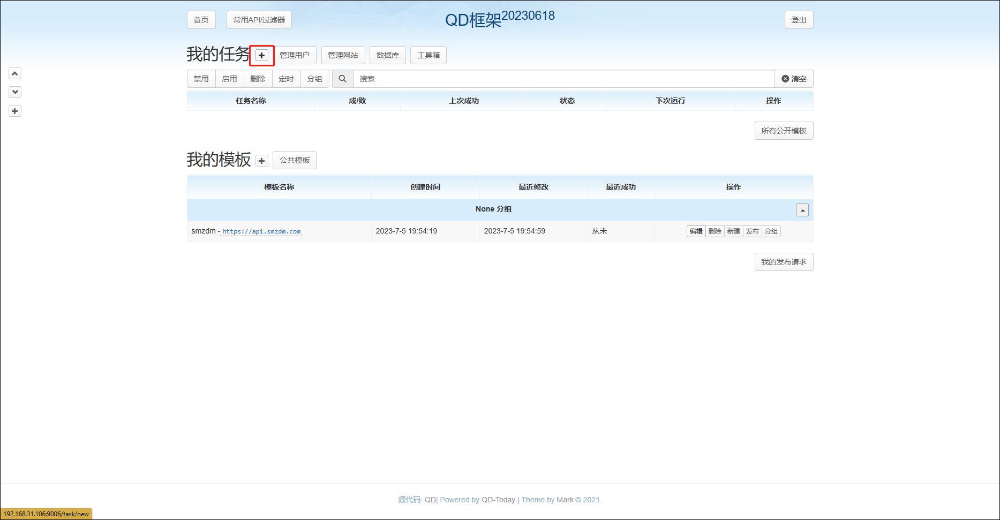

9、选好网站后输入 cookie，如果有签到了的记得勾选今日已签到，分组的话自己选择是否分。然后在下面点击提交：


10、如果今天还没有签到的话，可以点击执行，然后刷新看看是否有任务成功次数，也可以查看日志看看具体信息。可以自己选择是否定时。


### 2、阿里云盘

1、点添加模板：


2、选择上传 HAR 文件然后点上传：


3、点击保存（如果不想自动领取奖励，可以把这里的领取奖励删掉）：


4、继续保存，保存后返回首页，刷新下，看到我的模板里出现了阿里云的链接了。


5、 点击工具箱

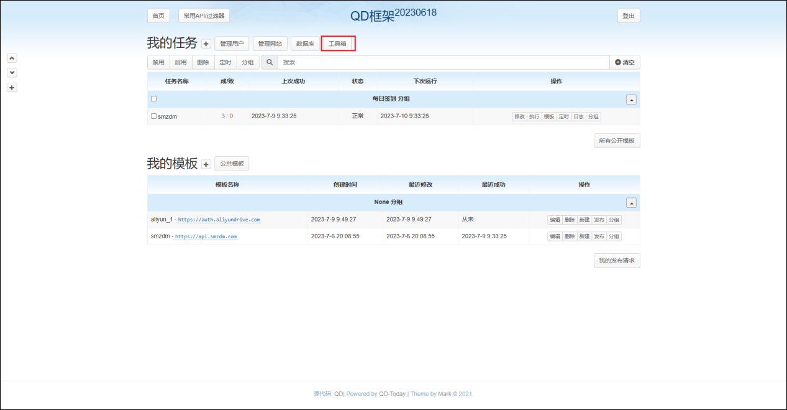

6、选择记事本


7、填写内容后点击复写，注意这里的 token 是短的一个，token 获取方法之一：<https://alist.nn.ci/tool/aliyundrive/request.html>。


8、新建任务：


9、填好后，在下面点击提交：

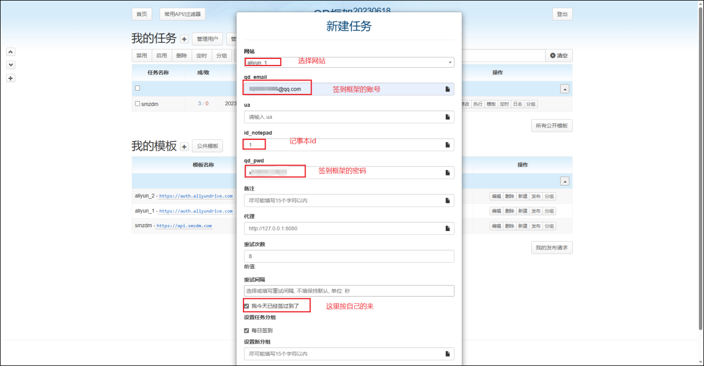

有两个账号的按上面流程重来次改下名称即可。

### 3、PT 站

1、点击添加模板


4、上传 har 文件并点击上传。

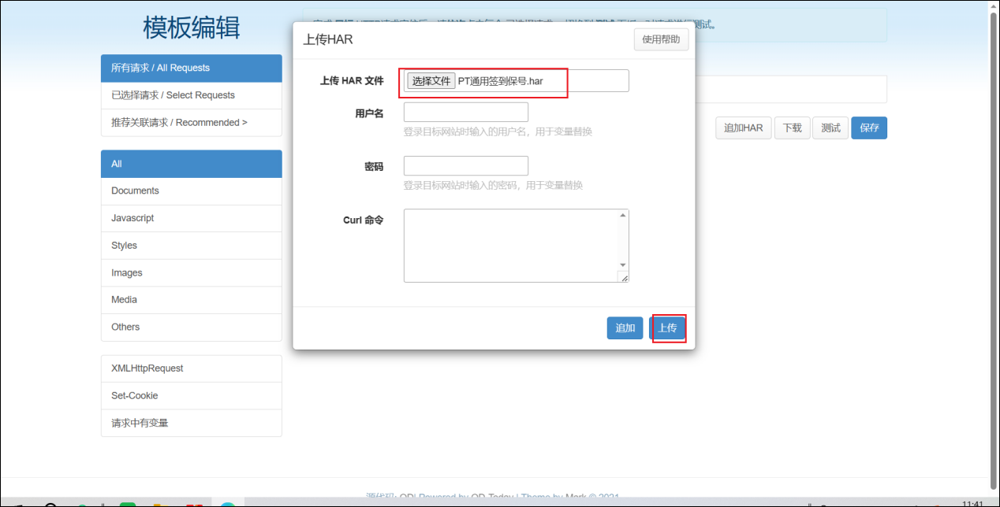

3、点击保存

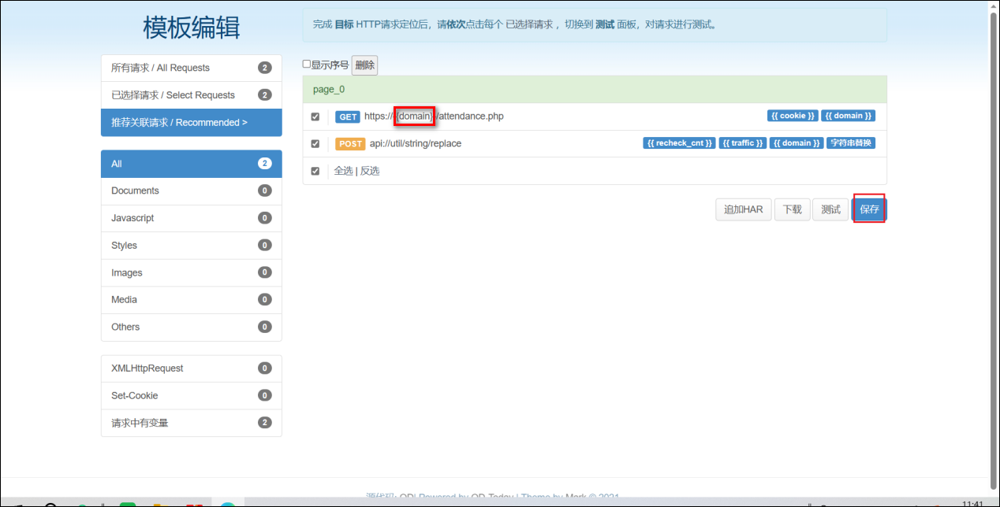

4、输入你 PT 站的网站名称（可自定义）和网址，然后继续点击保存


5、去主页刷新下，可以看到模板里有你刚刚新建的 pt 站的信息，然后在我的任务里点击添加任务。


6、打开你的 pt 站，然后按 F12 调出开发人员工具，再刷新下页面，然后选择网络，找到 cookie 并复制。


7、把刚刚复制的 cookie 填入签到框架刚刚新建的任务里，并点击测试。


8、测试成功后点击提交。然后在首页刷新下，由于我之前勾选了我一件签过到了，所以今天不会执行，也不会有执行成功的信息。


其他的 PT 站的也类似。

### 4、b 站

1、点击添加模板

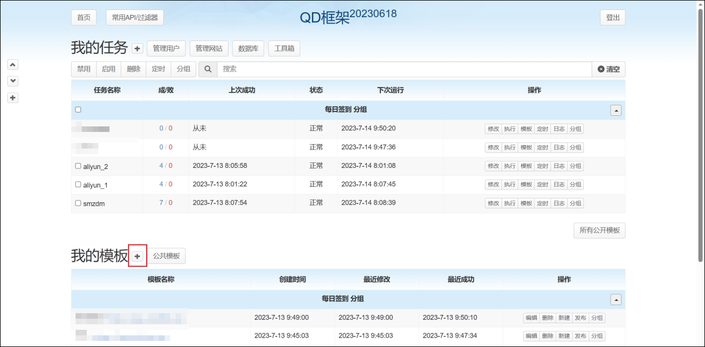

2、上传 har 文件并点击上传。


3、点击保存。


4、继续保存。


5、去主页刷新下，可以看到模板里有 bilibili 的信息，然后在我的任务里点击添加任务。


6、打开 b 站首页并登录，然后按 F12 调出开发人员工具，再刷新下 b 站页面，然后选择网络，找到 cookie 并复制。


7、把刚刚复制的 cookie 填入签到框架刚刚新建的任务里，并点击测试。


8、测试成功后点击提交。

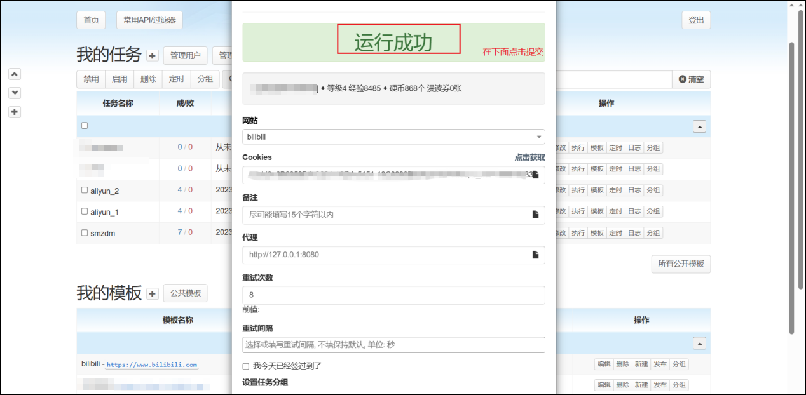

9、提交后会执行一次，等一会刷新下可以看到执行成功相关的信息，也可以在后面的日志里查看详细信息。

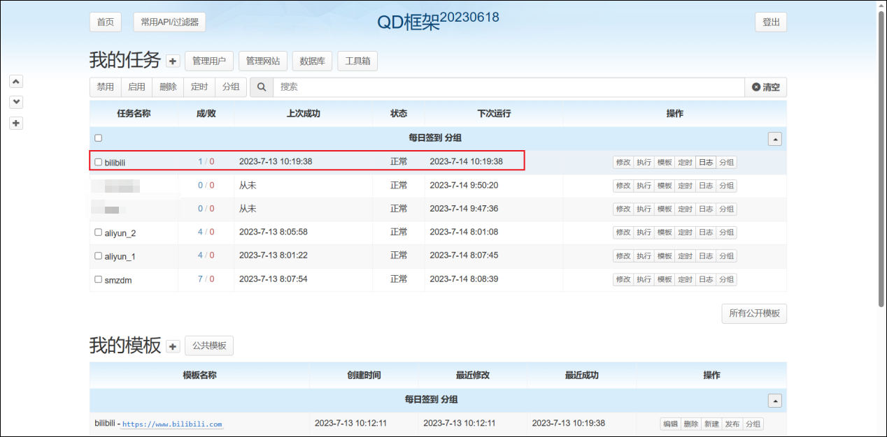

### 5、网易云音乐

1、添加模板

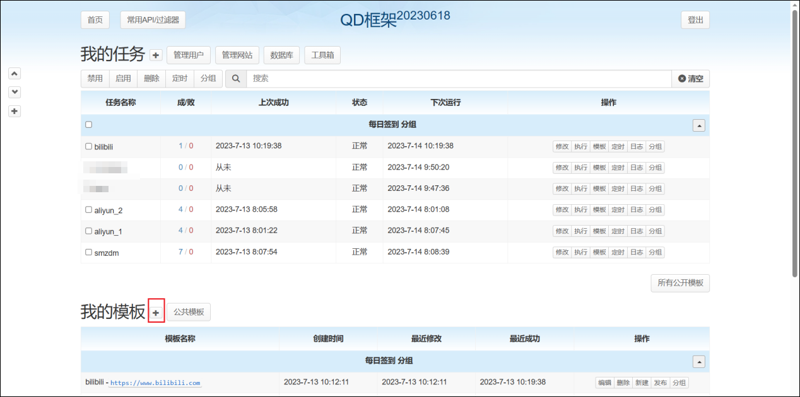

2、上传 har 文件并上传。


3、点击保存


4、继续保存


5、保存成功后去首页，刷新下，可以看到网易云在模板里，然后在我的任务里点击添加任务

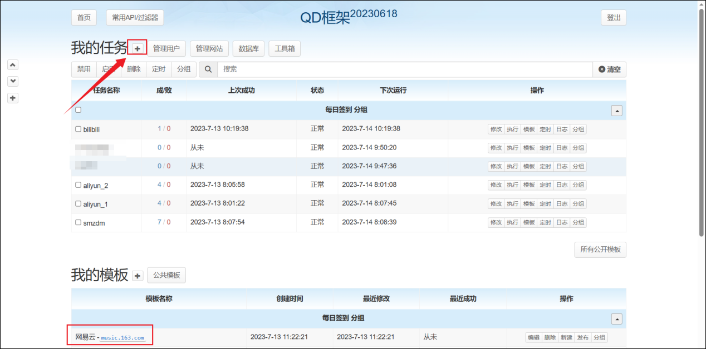

6、去网易云官网登录，并按 F12 调出开发人员工具，然后在界面刷新下，点击网络，找到 cookie 并复制好。


7、把刚刚复制的 cookie 填入签到框架刚刚新建的任务里，并点击测试。


8、测试成功后点击提交


9、提交后会回到首页，显示正在执行任务。


10、过一会，刷新下，可以看到任务执行成功的一些信息，然后可以点击查看日志，查看具体的信息。


## 4、WxPusher 消息通知

1、打开[wxpusher 官网](http://wxpusher.zjiecode.com/demo/)，扫码关注公众号

2、获取 UID


3、点击链接：<https://wxpusher.zjiecode.com/admin/>，创建应用获取 Token。只需要填写这三个信息就足够

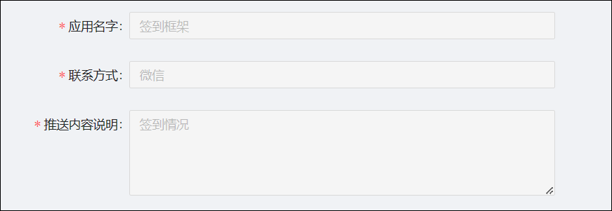

4、创建应用以后，你可以看到应用的应用码和关注链接，可以通过这 2 种方式来关注应用，关注应用以后，就可以收到消息了。


5、来到 QD 框架首页点击工具箱

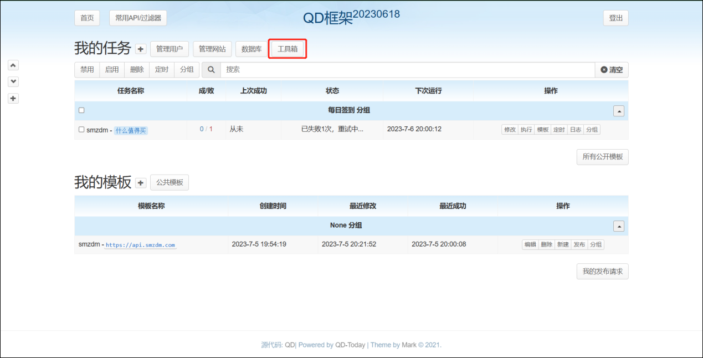

6、点击推送注册


7、按要求填写 UID 和 Token（token 和 uid 之间用;连接），并点击提交来注册推送，注册后可以点击测试看看。


8、测试成功后点击推送设置


9、选择 WXPusher，设置通知选项，并提交。


10、效果


