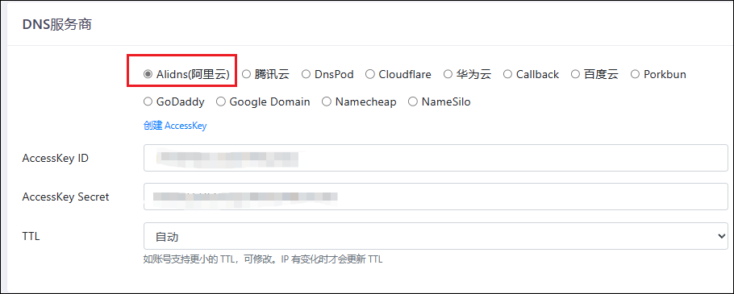
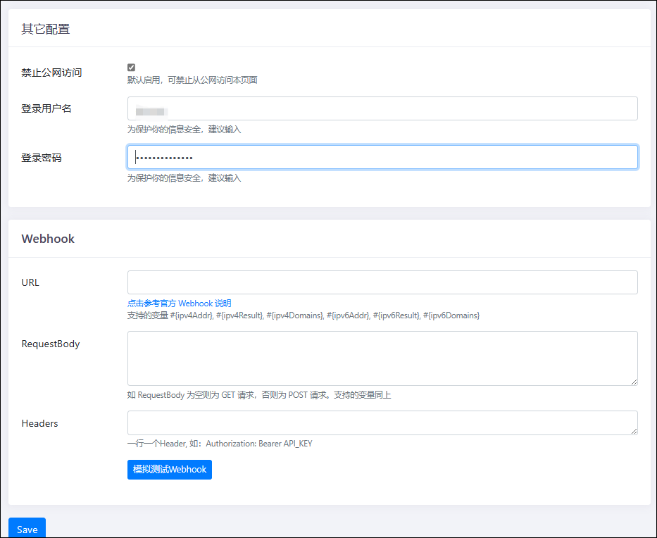

通过 DDNS-GO 和阿里云的免费域名部署动态解析，实现外网通过域名访问 NAS。


## compose命令

```
services:
  ddns-go:
    image: jeessy/ddns-go:latest
    container_name: ddns-go
    restart: always
    network_mode: "host"
    volumes:
      - ./data:/root
```

## 设置

创建完成后，在浏览器输入绿联 IP:9876，即可进入 DDNS-GO 的设置界面。选择阿里云，填入之前获取到的 AccessKey ID 和 AccessKey Secret。TTL 选择自动。



下面的 ipv4 和 ipv6 设置，大家根据自己的网络实际情况任选其一均可。Domains 这里因为我们解析的是一个@记录，所以这里填写@.域名。


其他设置这里，可以自行选择是否禁止公网访问，一般不建议打开公网访问，因为 DDNS-GO 的动态解析只要设置一次后就会自动解析。当然，你也可以选择启用公网访问，只需要转发一下端口。另外这里也可以重新设置账号密码。全部设置完成之后，在下方点击 Save，就可以在日志里面看到解析是否成功的记录。


