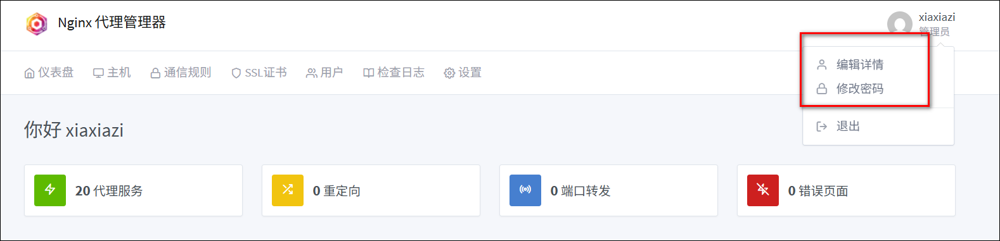
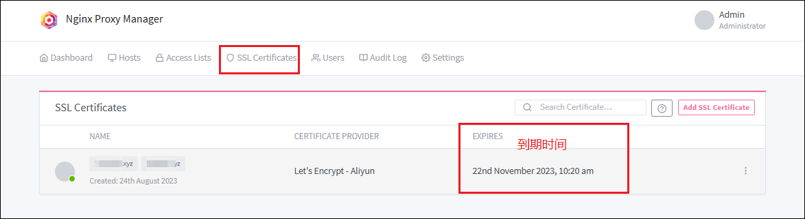
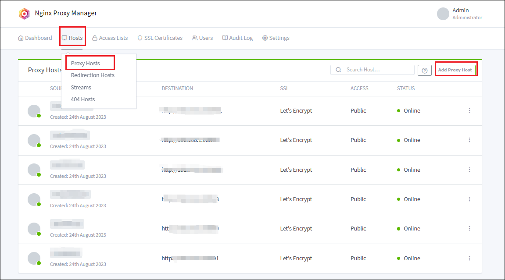
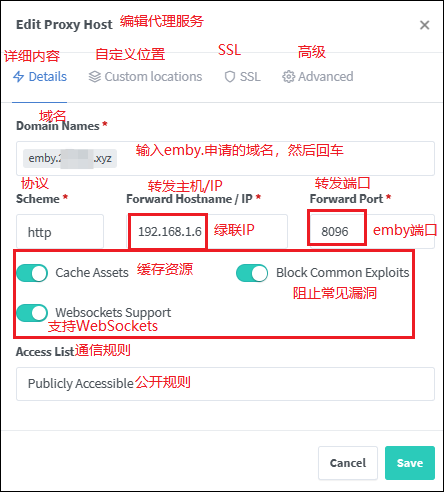
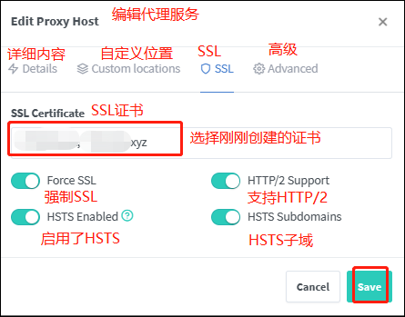

## compose命令

```
services:
  worktable:
    image: 'jc21/nginx-proxy-manager:latest'
    # image: 'chishin/nginx-proxy-manager-zh:latest' # 中文版
    container_name: NPM
    restart: always
    ports:
      - '1080:80'
      - '1082:81'
      - '1043:443'  # 1043是外网访问时需要映射的端口
    volumes:
      - ./data:/data
      - ./letsencrypt:/etc/letsencrypt
```


## 初始化

浏览器输入绿联 ip:端口进入 npm，默认的账号为admin@example.com，默认的密码是：changeme。

登入后点击右上角的头像，然后点击 1 可以修改用户名和邮箱，点击 2 可以修改密码，首次进入推荐更改账号以及密码。



## SSL 证书

点击 SSL 证书（SSL Certificate），然后点击创建证书，并按要求输入内容，输入完成后点击 save 保存。

- 域名（Domain Names）：填写两个，一个直接填写你申请的域名，一个填写【\*.申请的域名】。
- 填写对应的邮箱地址，勾选【使用 DNS 认证（Use a DNS Challenge）】。
- DNS 提供者（DNS Provider）选择你申请的域名服务商，比如阿里。
- 证书内容（Credentials File Content）里把=后面的内容换成你自己的 access_key。
- 等待时间（Propagation Seconds）可默认不填。
- 勾选同意条款。


添加完成后需要等待一会，就可以看到我们添加成功的证书。由于这是免费的泛域名证书，有效期只有三个月，所以有个到期时间，到期后我们就需要来重新申请一次证书。



如出现如图错误：


则我们需要下载一个 zope 模块，等待下载完成后再去 Nginx-Proxy-Manager 后台点击保存确认，即可申请到证书。

## 反代端口

点击 Hosts（主机），选择 Proxy Hosts（代理服务），添加然后在 Proxy Hosts（代理服务）页面点击 Add Proxy Hosts（添加代理服务）。



主要设置以下两项：

1）Details

以 emby 为例：这里的域名是二级域名可随意填写，只要后缀是自己的域名就可以，比如 emby.域名；协议就是 http；转发主机就是绿联的 IP；转发端口就是你需要转发的容器服务比如 emby 对应的端口；然后勾选下面三项内容。



2）SSL

点击 SSL，勾选刚才申请的证书和下面四项内容。


