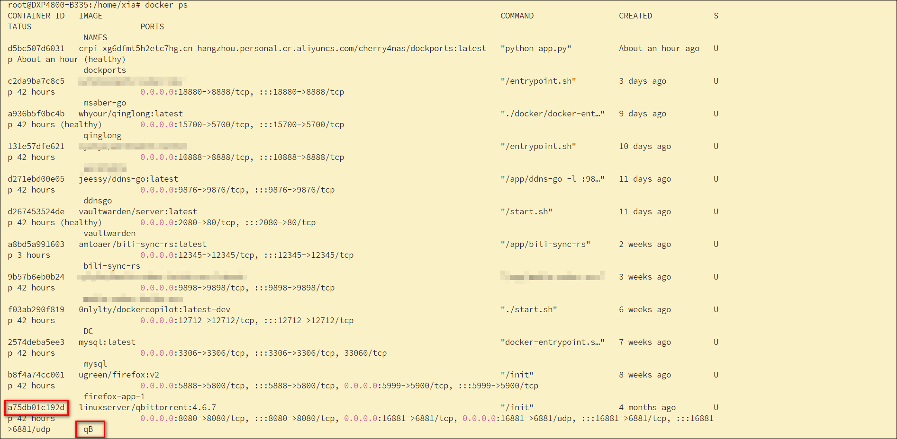
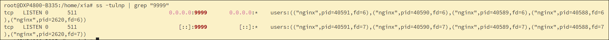

众所周知，我们部署容器的时候有一个常见错误就是端口被占用了。那我们如何查看端口是否被占用，以及是被哪个进程占用的呢？一般来说有两种方法，一是使用ssh命令，二是通过dockports容器。

下面我们来具体看看。


## ssh命令

先sudo su进入root权限。

### 一、docker端口


1、查看所有运行容器的端口映射情况:`docker ps --format "table {{.Names}}\t{{.Ports}}"`


> 如果需要包含停止的容器，只需加 -a 参数：`docker ps -a --format "table {{.Names}}\t{{.Ports}}"`


2、查看单个容器的详细端口配置：`docker inspect <容器名/容器ID> | grep -i "port"`

容器名和id的获取方法
- 使用容器管理器dc
·
- 使用docker命令
·


比如查看qb的：`docker inspect qB | grep -i "port"`


### 二、宿主机端口

1、`ss -tulnp` 是查看所有 TCP/UDP 监听端口并关联占用进程的命令，注意此命令需要root权限。

其中-tulnp参数的含义为：
- t: 仅显示 TCP 协议 的端口 / 连接
- u: 仅显示 UDP 协议 的端口 / 连接
- l: 仅显示 处于监听状态 的端口
- a: 显示所有连接 / 监听端口
- n: 以纯数字显示 IP 地址和端口（不解析域名 / 服务名）
- p: 显示占用端口的进程名 + PID


2、查看特定端口的占用进程，比如9999端口：`ss -tulnp | grep "9999"`



3、如果需要按端口号排序的话，可以使用sort命令：
- 从小到大: `ss -tulnp | sort -k 4 -t ':'`
- 从大到小: `ss -tulnp | sort -k 4 -t ':' -r`

4、也可以使用netstat命令，但是需要安装net-tools包。他的使用和ss命令差不多，比如：`netstat -tulpn | grep "9999"`


## dockports容器

项目地址：https://github.com/coracoo/DockPorts

compose部署：
```
services:
  dockports:
    image: crpi-xg6dfmt5h2etc7hg.cn-hangzhou.personal.cr.aliyuncs.com/cherry4nas/dockports:latest  # 国内用户推荐
    # image: ghcr.io/coracoo/dockports:latest  # 官方推荐，全球访问
    container_name: dockports
    restart: unless-stopped
    network_mode: host
    volumes:
      - /var/run/docker.sock:/var/run/docker.sock:ro
      - ./config:/app/config
    environment:
      - DOCKPORTS_PORT=7577  # 可修改此端口以避免冲突
```

使用`绿联IP:端口`进入网页，可以查看所有端口情况。


如果是使用bridge网络模式的话，端口数量会少一部分，因此还是建议用host网络。至于host网络下的快捷访问问题，把端口数填写compose文件里环境变量DOCKPORTS_PORT的值即可。比如我的端口是17577。

