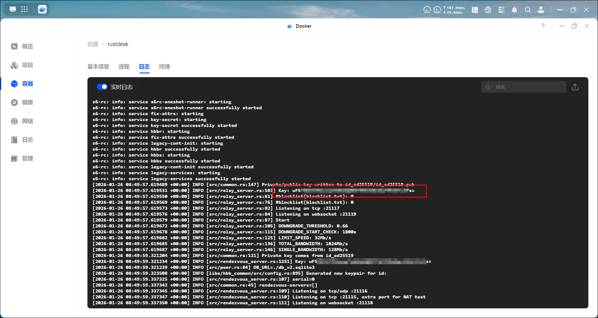
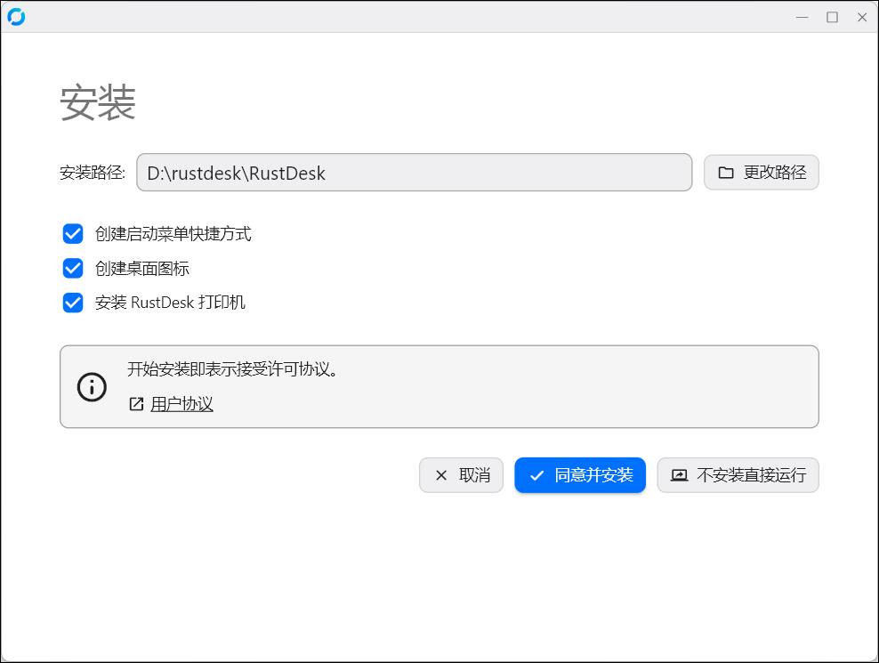
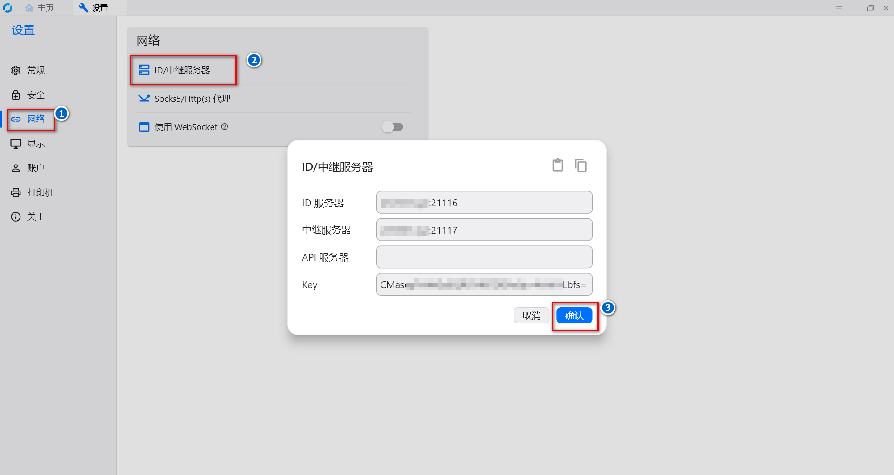

官方文档：https://rustdesk.com/docs/zh-cn/

RustDesk 是一个功能完整的开源远程控制替代方案，支持自托管和安全性，配置简单。支持 Windows、macOS、Linux、iOS、Android、Web。


## 容器部署

推荐的是rustdesk-server-s6镜像，此镜像内置了进程管理器，会自动同时运行 hbbs 和 hbbr。

```
services:
  rustdesk:
    container_name: rustdesk
    image: rustdesk/rustdesk-server-s6:latest
    restart: unless-stopped
    ports:
      - 21115:21115
      - 21116:21116
      - 21116:21116/udp
      - 21117:21117
    #   - 21118:21118 # 用于支持网页客户端
    #   - 21119:21119 # 用于支持网页客户端
    volumes:
      - ./data:/data
    environment:
      - RELAY=rustdesk.example.com:21117 # 中继服务器地址，改成自己的域名
      - ENCRYPTED_ONLY=1 # 启用加密
```
1、部署成功后可以在日志查看到key的值，先复制下来，后面需要用到。




2、服务也会在/data目录下生成并储存两个密钥文件：
- id_ed25519：私钥文件，值的结尾有两个==
- id_ed25519.pub：公钥文件，值的结尾是一个=

我们需要的是公钥，所以可以把公钥文件下载下来查看其值。


3、端口映射及域名解析
- 域名解析：需要有一个域名用于解析服务，如果已经使用过lucky或者ddnsgo等解析过域名了，直接在环境变量填写自己的主域名即可，比如RELAY=111111.xyz:21117。
- 端口映射：需要在路由上配置21115（tcp）、21116（tcp+udp）和21117（tcp）端口的转发，如果开启了网页端口的话，也记得加上21118和21119。比如我在爱快上的：


## 客户端

1、开源版本下载地址：https://github.com/rustdesk/rustdesk/releases


2、以win为例。下载后双击打开exe文件，出现RustDesk页面。这里可以选择点击安装按钮来安装版本；也可以直接运行这个未安装版本。点击ID后的三个点可以进入设置页。


3、如果选择安装



4、添加服务器

进入设置页后点击网络，如果上面有解锁网络设置按钮才能继续编辑的话先解锁一下。然后再选择ID/中继服务器，填写服务器相关内容，假如域名是111111.xyz。
- ID服务器地址：111111.xyz:21116
- 中继服务器地址：111111.xyz:21117
- key：复制之前生成的公钥值
- API服务器：仅适用于 Pro 用户，我们不需要




5、固定密码。可以点击安全，再点击密码下的设置固定密码按钮，设置一个固定密码方便连接。


6、服务器设置完成后来到首页，可以看到最下方的就绪状态，表示服务器正常运行。和其他远程软件一样可以输入其他设备的id进行连接，连接后的设备会在下方展示，可以进行连接/删除/收藏/重命名等操作。
