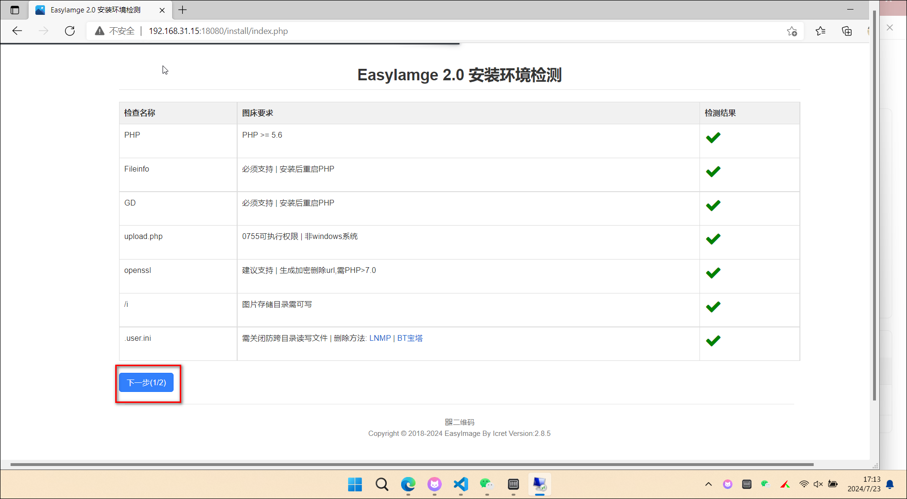

## compose命令
```
services:
  easyimage:
    image: ddsderek/easyimage:latest
    container_name: easyimage
    ports:
      - '8080:80'
    environment:
      - TZ=Asia/Shanghai
      - PUID=1000
      - PGID=1000
    volumes:
      - '/root/data/docker_data/easyimage/config:/app/web/config'
      - '/root/data/docker_data/easyimage/i:/app/web/i'
    restart: unless-stopped
```
## 使用

1、登录IP:端口，点击下一步




2、域名可以填写内网网址/外网域名，这里我填写的是外网域名，记得统一，然后设置密码，点击开始安装


3、登录后来到页面

