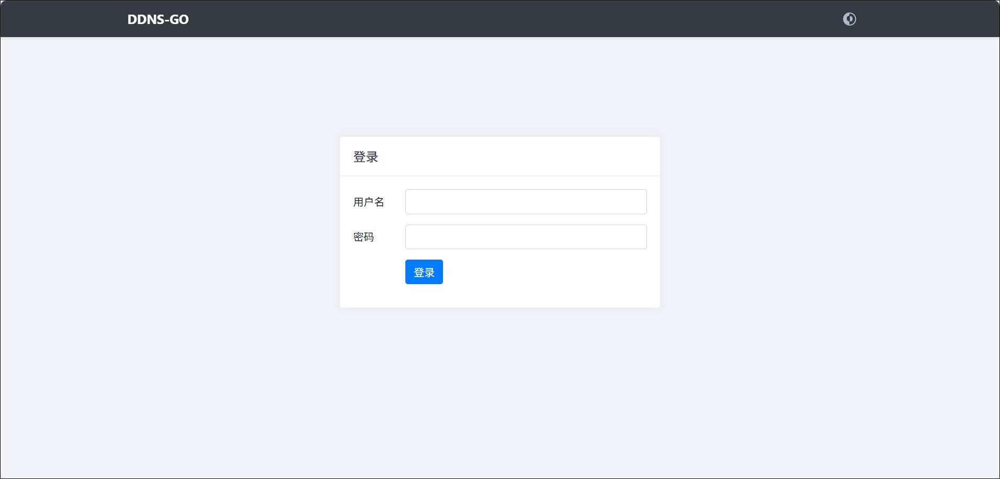

## compose文件

```
services:
  ddnsgo:
    image: jeessy/ddns-go:latest
    container_name: ddnsgo
    restart: always
    network_mode: bridge
    ports:
      - 9876:9876
    volumes:
      - ./data:/root
```

## 使用

1、在浏览器输入绿联 IP:9876，即可进入 DDNS-GO 界面。在这里我们自定义账号和密码然后点击登录。



2、选择你的DNS服务商比如阿里云，填入之前获取到的 AccessKey ID 和 AccessKey Secret。TTL默认自动即可。


3、ipv4 和 ipv6 设置大家根据自己的网络实际情况任选其一均可，这里以V4为例。

因为阿里那边域名解析的V4是一个@记录，所以Domains这里填写`@.域名`。


4、另外在其他菜单下可以自行选择是否禁止公网访问(建议默认的禁止即可)和重新设置账号密码。


5、全部设置完成之后，记得点击 Save保存设置。

6、可以在日志里面看到解析记录。