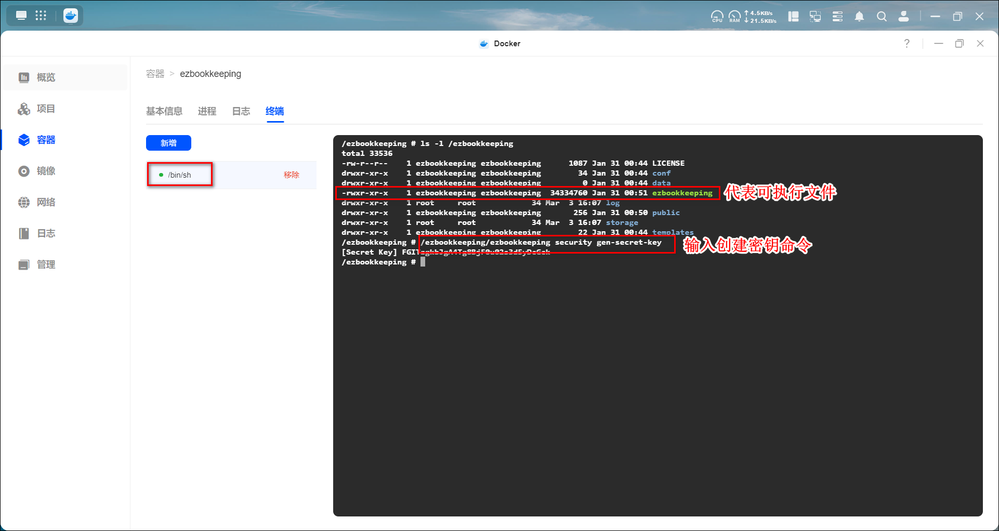
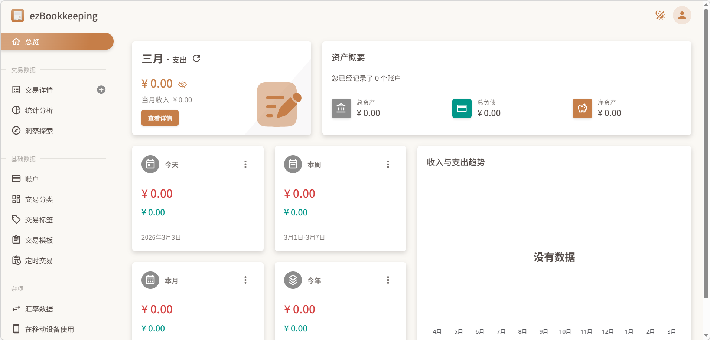
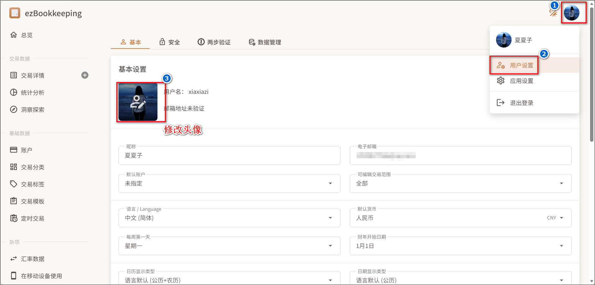
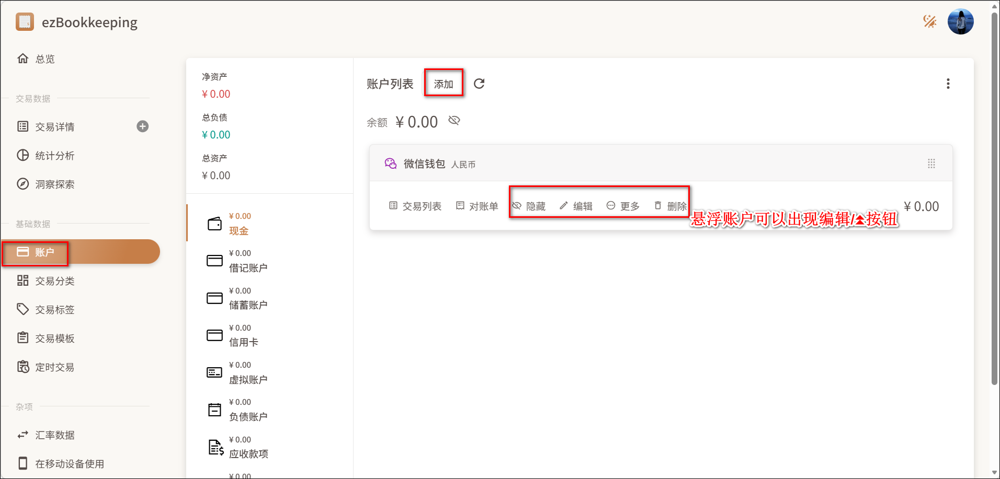
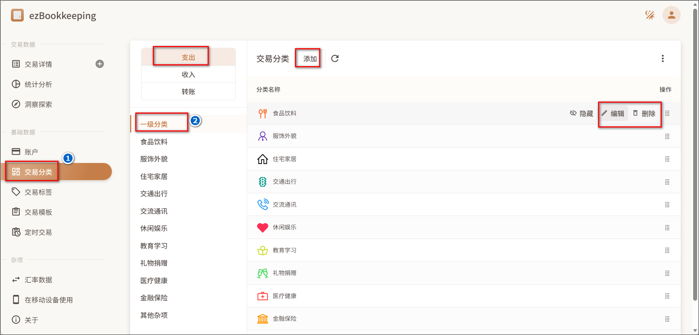
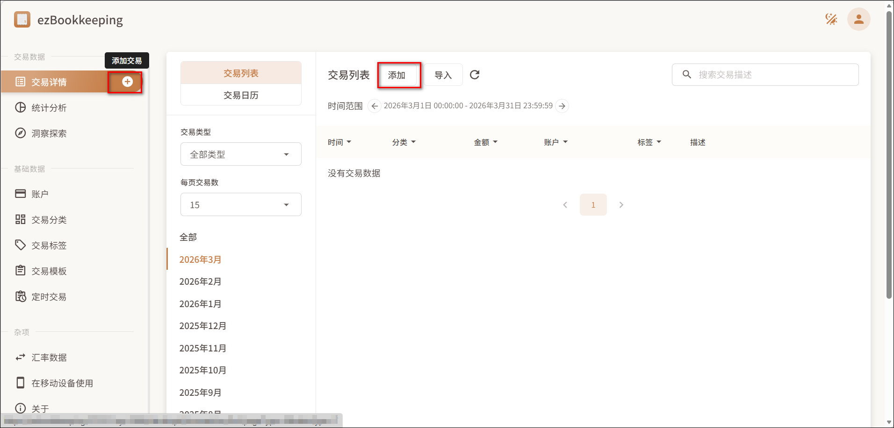
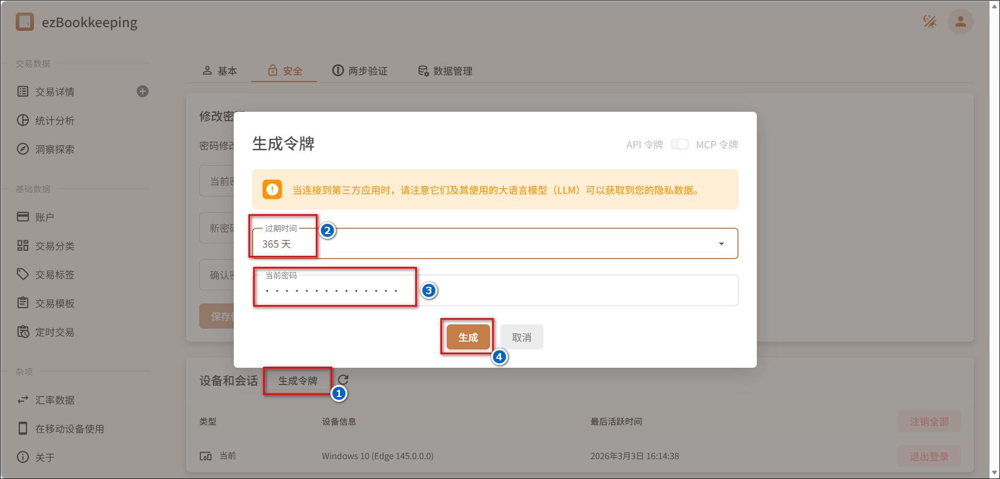
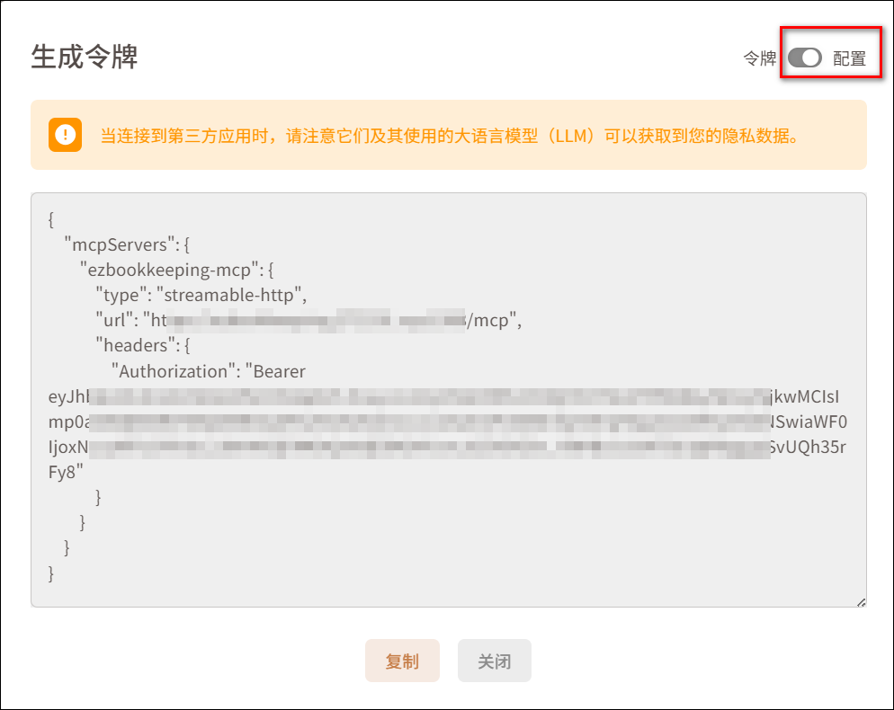
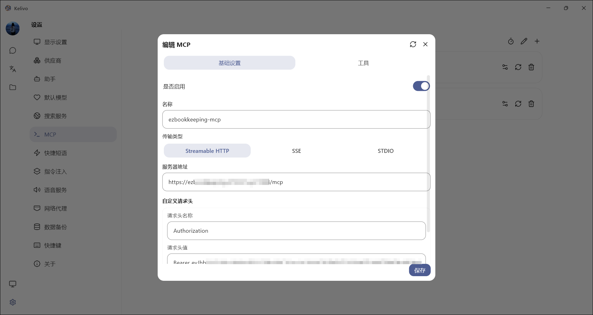
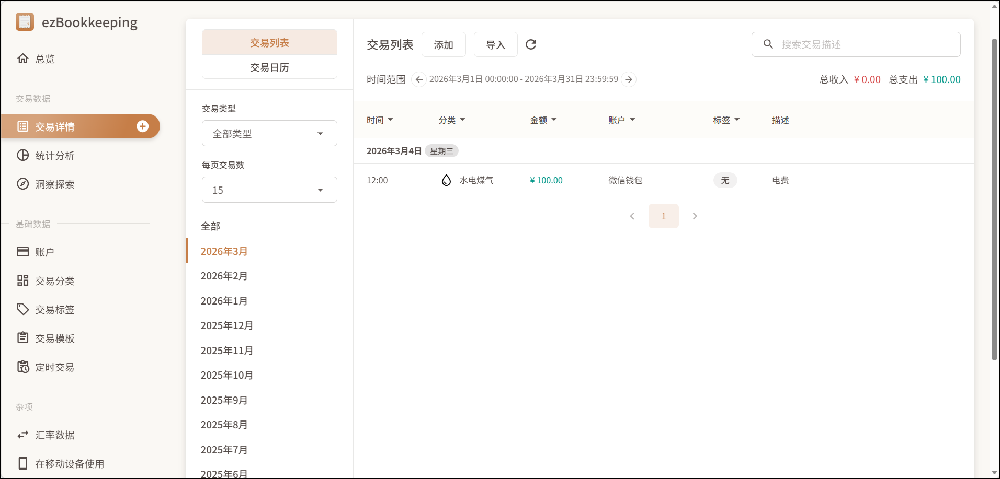

ezBookkeeping 是一款轻量、自托管的个人记账应用。

官方文档：https://ezbookkeeping.mayswind.net/zh_Hans/installation/


## docker部署

### 部署前的说明

1、数据库

默认数据库类型是 sqlite3，其数据库文件存储在容器中的 `/ezbookkeeping/data/ezbookkeeping.db`。

所以如果使用 sqlite3 作为数据库，必须挂载宿主机的路径到容器内，否则当容器被重建或删除时，所有数据将会丢失。

2、密钥

在部署到生产环境之前，必须生成一个随机值并将其设置到 secret_key 配置中以保证您数据的安全。可以通过以下方法来获取一个随机密钥：
- ezbookkeeping security gen-secret-key
- openssl rand -base64 32

以ezbookkeeping命令为参考，生成密钥的方法如下：
- 创建/bin/sh终端
- 运行 `/ezbookkeeping/ezbookkeeping security gen-secret-key`


3、配置项

ezBookkeeping 使用 ini 文件作为配置文件。如果想修改配置项，可以通过文件或者环境变量设置配置。
- 环境变量设置配置项
  - 环境变量名(大写)：EBK_{SECTION_NAME}_{OPTION_NAME}
  - 其中SECTION_NAME是节名，OPTION_NAME是选项名
  - 可以在[配置文档](https://ezbookkeeping.mayswind.net/zh_Hans/configuration/)页面查看对应该的名称
  - 比如将数据库类型设置为 mysql，你可以定义环境变量`EBK_DATABASE_TYPE=mysql`
- 同一个配置项优先级依次为：环境变量 > 配置文件


### compose文件
```
services:
  ezbookkeeping:
    image: mayswind/ezbookkeeping:latest
    container_name: ezbookkeeping
    hostname: ezbookkeeping
    restart: unless-stopped
    user: 0:0
    ports:
      - 18088:8080 # 冒号左边选个未被使用的端口
    environment:
      - EBK_LOG_MODE=console file # 日志输出类型，支持 console 和 file。使用空格分隔多个模式，例如 console file。
      - EBK_LOG_LEVEL=info # 一般日志级别。该值可以设置为 debug、info、warn 或 error
      - EBK_MCP_ENABLE_MCP=true # 是否启用 MCP
      - EBK_SECURITY_SECRET_KEY=FGITzgkbJgA4Tg8BjF0u02s3d5yDcGck # 密钥，提前获取，改成自己的
      # 服务配置
      - EBK_SERVER_DOMAIN=ezbookkeeping.yourdomain # 服务访问域名
      - EBK_SERVER_ROOT_URL=https://ezbookkeeping.yourdomain:8888 # 服务访问地址
      - EBK_SERVER_ENABLE_GZIP=true # 是否启用 GZIP 压缩
      # 如果使用内置sqlite数据库的话，以下EBK_DATABASE变量可以去掉
      - EBK_DATABASE_TYPE=postgres # 数据库类型，支持 mysql、postgres 和 sqlite3
      - EBK_DATABASE_HOST=192.168.31.15:5432 # 数据库地址
      - EBK_DATABASE_NAME=ezbookkeeping # 数据库名称
      - EBK_DATABASE_USER=ezbookkeeping # 数据库用户名
      - EBK_DATABASE_PASSWD=ezbookkeeping   # 数据库用户密码
  volumes:
      - /etc/localtime:/etc/localtime:ro # 同步宿主机时间
      - ./log:/ezbookkeeping/log    # 日志目录
      - ./storage:/ezbookkeeping/storage    # 文件目录
      # - ./data:/ezbookkeeping/data  #  数据库目录，如果使用sqlite的话需要挂载，如果是mysql或者pgsql的话，不需要挂载
```

## 使用

### 初始化

1、通过IP:端口，或者EBK_SERVER_ROOT_URL里填写的域名打开页面，点击创建新账号。


2、填写基本用户信息后点击下一步


3、可以先使用预设分类，后面可以再进行更改。然后点击提交按钮。


4、就来到了ezBookkeeping的主页



5、点击右上角的头像，选择用户设置下的基本菜单可以进行一些基础设置的修改，比如可以修改头像。



### 记账

**1、账户**

账户管理页面，可以查看账户列表，添加/修改/删除账户。




**2、交易分类**

交易分类页面，可以自定义交易分类。
- 切换支出/收入/转账，可以查看三个分类下的一级分类。
- 点击一级分类可以查看/操作一级分类列表。
- 点击对应的一级分类名称，可以查看/操作二级分类列表。



**3、添加交易**

交易详情页面可以添加交易，也可以点击交易详情菜单后的添加交易按钮快速添加交易。




其他的比如标签啥的就自己探索吧。

### MCP 

>如果想使用MCP，需要在环境变量中已经设置EBK_MCP_ENABLE_MCP=true

1、点击右上角头像-用户设置-安全-生成令牌。选择过期时间和输入当前账号的密码，生成令牌




2、会出现令牌值，如果启用配置，可以看到 json 配置格式。注意这个令牌之后是看不到的，只能重新生成，所以先不要关闭，确保已保存令牌值/已设置完成后再关闭。




3、在可以使用mcp的地方根据上方的json配置内容添加mcp。
- 名称：自定义如：ezBookkeeping-mcp
- 类型：streamableHttp 
- 服务器地址：json 配置里的url，也可以自己手动填写，格式是：域名/mcp
- 请求头名称：Authorization
- 请求头值：Bearer {获取的token}



mcp可以使用的功能有：
- 添加交易
- 查询交易
- 查询所有账户名
- 查询所有账户余额
- 查询所有交易分类名
- 查询所有交易标签名
- 查询最新的汇率

4、使用mcp


5、查看mcp记账结果




### 手机端

效果如下：


