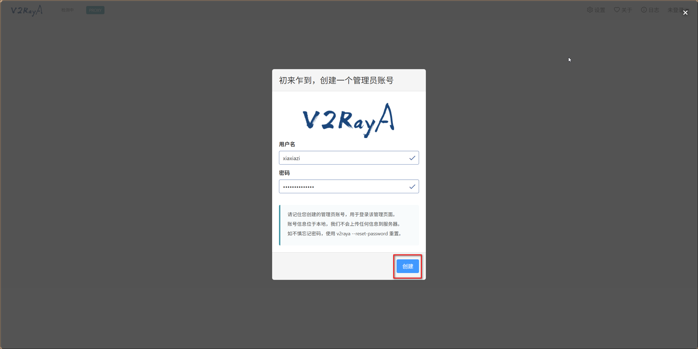
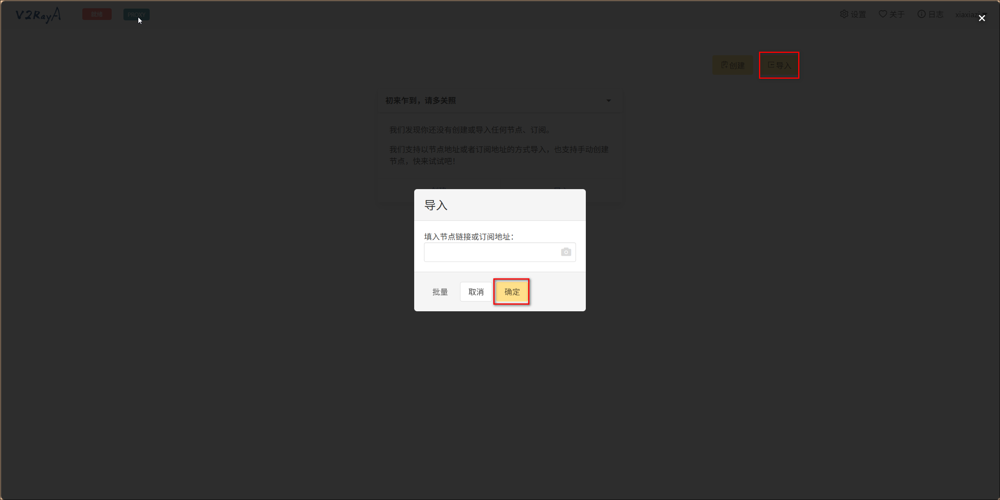
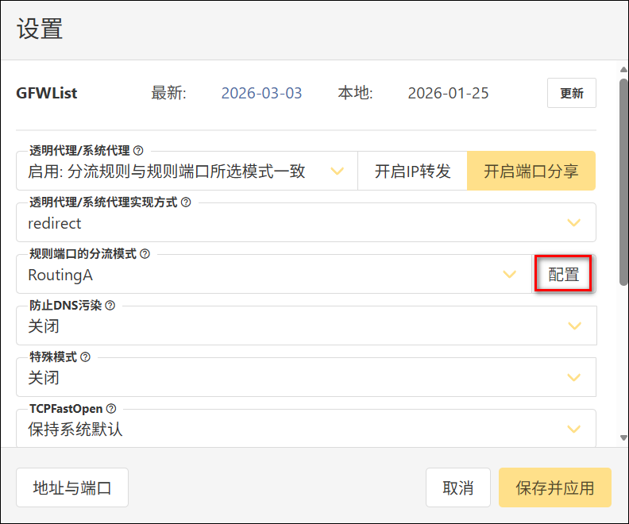
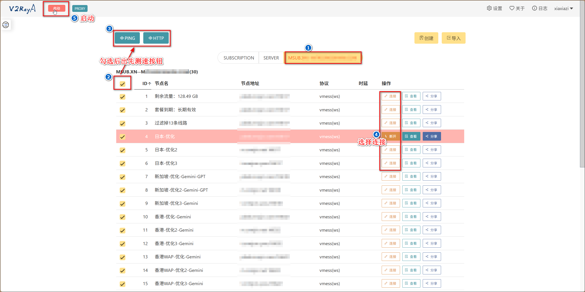

项目：https://github.com/v2rayA/v2rayA
文档：https://v2raya.org/docs/prologue/introduction/


v2rayA 是一个支持全局透明代理的 V2Ray 客户端，同时兼容 SS、SSR、Trojan(trojan-go)、Tuic 与 Juicity协议。


## 部署
```
services:
  v2raya:
    image: mzz2017/v2raya:latest
    container_name: v2raya
    network_mode: host
    restart: always
    privileged: true
    volumes:
      - ./etc:/etc/v2raya # 程序配置目录
    environment:
      - V2RAYA_LOG_FILE=/etc/v2raya/v2raya.log  日志（持久化到卷）
```

环境变量:
- V2RAYA_ADDRESS: 监听地址 (默认 ":::2017")
- V2RAYA_CONFIG: v2rayA 配置文件目录 (default "/etc/v2raya")
- V2RAYA_V2RAY_BIN: v2ray 可执行文件路径. 留空将自动检测. 可修改为 v2ray 分支如 xray 等文件路径
- V2RAYA_V2RAY_CONFDIR: 附加的 v2ray 配置文件目录, 该目录中的 v2ray 配置文件会与 v2rayA 生成的配置文件进行组合
- V2RAYA_WEBDIR: v2rayA 前端 GUI 文件目录 (默认 "/etc/v2raya/web")
- V2RAYA_PLUGINLISTENPORT: v2rayA 内部插件端口 (默认 32346)
- V2RAYA_PASSCHECKROOT: 跳过 root 权限检测, 确认你有 root 权限而 v2rayA 判断出错时使用
- V2RAYA_VERBOSE: 详细日志模式，混合打印 v2ray-core 和 v2rayA 的运行日志
- V2RAYA_RESET_PASSWORD: 重设密码


#  停止并删除容器redis容器
docker stop v2raya


比如创建 docker-compose.yml 文件：
```
cat > ~/docker-data/v2raya/docker-compose.yml << 'EOF'
services:
  v2raya:
    image: mzz2017/v2raya:latest
    container_name: v2raya
    network_mode: host
    restart: always
    privileged: true
    volumes:
      - ./etc:/etc/v2raya # 程序配置目录
    environment:
      - V2RAYA_LOG_FILE=/etc/v2raya/v2raya.log  日志（持久化到卷）
EOF
```


## 使用

1、浏览器访问地址http://ip:2017打开v2rayA，创建管理员账号。




2、以创建或导入的方式导入节点，导入支持节点链接、订阅链接。



3、点击右上角的设置，可以在左下角查看端口，默认http端口是20172。也可以更改一些基础设置，比如开启开启端口分享、更改规则端口的分流模式等，更完后记得点击保存并应用


默认端口：
- socks5端口：20170
- http端口：20171
- http端口(带分流规则)：20172


RoutingA模式默认的配置，可以自己点击配置更改：
```
default: proxy
# write your own rules below
domain(domain:mail.qq.com)->direct

domain(geosite:google-scholar)->proxy
domain(geosite:category-scholar-!cn, geosite:category-scholar-cn)->direct
domain(geosite:geolocation-!cn, geosite:google)->proxy
domain(geosite:cn)->direct
ip(geoip:hk,geoip:mo)->proxy
ip(geoip:private, geoip:cn)->direct
```

4、首页切换到订阅的标签页，选择一个节点连接。注意，连接之后并没有启动代理，还需要点击左上角的就绪（鼠标放上去会变成启动）按钮。选择完节点后也可以测速查看延迟。



5、验证是否生效：
```
curl -x http://127.0.0.1:20172 -I https://hub.docker.com --max-time 10
curl -x http://127.0.0.1:20172 -I https://github.com --max-time 10
```