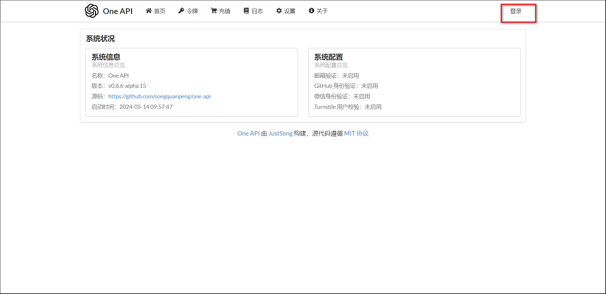
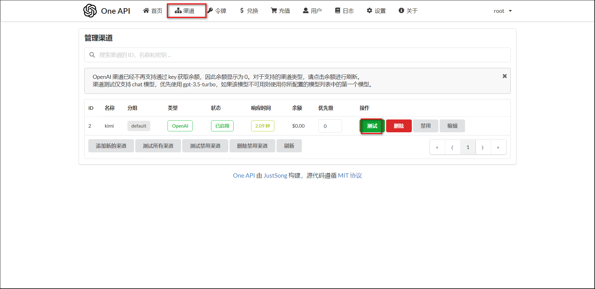

## 容器安装

```
services:
  one-api:
    image: justsong/one-api:latest
    container_name: one-api
    restart: always
    ports:
      - 3000:3000
    volumes:
      - ./data:/data
    environment:
      - TZ=Asia/Shanghai
    # - SQL_DSN=root:123456@tcp(localhost:3306)/oneapi  # 如果使用mysql数据库

```


## 配置 one-api

1、进入 oneapi 后台，点击登录， 默认账号 root 默认密码 123456



2、进去后会提示修改密码，建议修改


3、点击令牌-添加令牌


4、名称自定义，然后设置过期时间和限额，这里我选不过期和不限额。


5、设置好后，点击复制可以复制令牌


6、点击渠道-添加渠道


7、提交后可以看到添加的渠道，可以点击测试查看状态



8、画图的可以选讯飞、智谱、阿里，语音的话选海螺。

