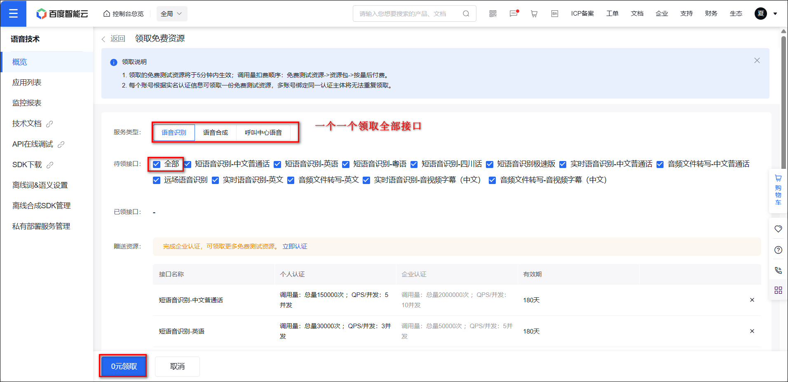

1、所有接口相关文档可以查看：`https://github.com/LLM-Red-Team`，可以点击查看相对应的接口，按需配置即可。


2、百度语音 识别和合成，按需

- 打开[百度智能云](https://console.bce.baidu.com/ai/#/ai/speech/overview/resource/getFree) 领取全部接口。
- 创建应用：https://console.bce.baidu.com/ai/#/ai/speech/app/list




## 2、接口容器部署

1、镜像列表
- 智谱清言 glm：vinlic/glm-free-api
  - 将智谱清言官方智能体API转换为OpenAI兼容协议的网关：zhipuai-agent-to-openai
- 阿里通义千问 qwen：vinlic/qwen-free-api
- kimi：vinlic/kimi-free-api
- 豆包 doubao：vinlic/doubao-free-api
- 深度求索 deepseek：vinlic/deepseek-free-api
- 即梦 jimeng：vinlic/jimeng-free-api
- MiniMax大模型海螺 hailuo：vinlic/minimax-free-api
- 跃问 step：vinlic/step-free-api
- 聆心智能 emohaa：vinlic/emohaa-free-api
- 讯飞星火 spark：vinlic/spark-free-api
- 秘塔 metaso：vinlic/metaso-free-api


2、分别部署所需的镜像，比如kimi，如果需要添加多个，可以复制这个compose，然后把kimi-free-api换成其他的镜像名称，并修改本地端口

```
services:
  kimi-free-api:
    container_name: kimi-free-api
    image: vinlic/kimi-free-api:latest
    restart: always
    ports:
      - 8000:8000
    environment:
      - TZ=Asia/Shanghai
```


## 渠道密钥获取

1、kimi

从 [kimi 官网](https://kimi.moonshot.cn/) 获取 refresh_token：进入 kimi 随便发起一个对话，然后 F12 打开开发者工具，从 Application > Local Storage 中找到 refresh_token 的值，这将作为 Authorization 的 Bearer Token 值

2、跃问 step-- 会掉，得手机验证码

从 [跃问 官网](https://yuewen.cn/) 获取 deviceId 和 Oasis-Token：

- 进入 StepChat 随便发起一个对话，然后 F12 打开开发者工具。
- 从 Application > LocalStorage 中找到 deviceId 的值（去除双引号），如：267bcc81a01c2032a11a3fc6ec3e372c380eb9d1
- 从 Application > Cookies 中找到 Oasis-Token 的值，如：eyJhbGciOiJIUzI1NiIsInR5cCI6IkpXVCJ9...
- 将 deviceId 的值 和 Oasis-Token 的值 使用 @ 拼接得到 Authorization 的 Bearer Token 值

3、阿里通义 qwen -- 会掉，得手机验证码

进入[通义千问 官网](https://tongyi.aliyun.com/)随便发起一个对话，然后 F12 打开开发者工具，从 Application > Cookies 中找到 tongyi_sso_ticket 的值，这将作为 Authorization 的 Bearer Token 值

4、智谱清言 glm

进入[智谱清言 官网](https://chatglm.cn/) 随便发起一个对话，然后 F12 打开开发者工具，从 Application > Cookies 中找到 chatglm_refresh_token 的值，这将作为 Authorization 的 Bearer Token 值

5、讯飞星火 spark

进入 [讯飞星火 官网](https://xinghuo.xfyun.cn/) 登录并发起一个对话，由于星火平台禁用 F12 开发者工具，请安装 Cookie-Editor 浏览器插件查看 ssoSessionId 值作为你的 Cookie。

6、秘塔 metaso -- 会掉，得手机验证码，可密码

从 从 [秘塔 官网](https://metaso.cn/) 获取 uid 和 sid 并使用-拼接：

进入秘塔 AI 搜索，登录账号（建议登录账号，否则可能遭遇奇怪的限制），然后 F12 打开开发者工具，从 Application > Cookies 中找到 uid 和 sid 的值。

将 uid 和 sid 拼接：uid-sid，如 65e91a6b2bac5b600dd8526a-5e7acc465b114236a8d9de26c9f41846 得到 Authorization 的 Bearer Token 值

7、海螺 hailuo

进入[海螺 官网](https://hailuoai.com/)随便发起一个对话，然后 F12 打开开发者工具，从 Application > LocalStorage 中找到 `_token` 的值，这将作为 Authorization 的 Bearer Token 值

模型选：gpt-4、whisper-1、tts-1-hd、abab6.5-chat、abab6.5s-chat

模型重定向填写：

```
{
  "whisper-1": "keli_hailuo"
}

```

8、深度求索 deepseek --会掉，密码

进入 [深度求索 官网]() 随便发起一个对话，然后 F12 打开开发者工具，从 Application > LocalStorage 中找到 userToken 中的 value 值，这将作为 Authorization 的 Bearer Token 值

9、聆心智能 emohaa--token 不易获取

从 [聆心智能 官网](https://echo.turing-world.com/)登录进入，由于 emohaa 禁用 F12 开发者工具，请先安装 Manage LocalStorage 插件（我在 edeg 没找到，所以没搞了），再从在当前页面中打开插件并点击 Export 按钮找到 Token 的值，这将作为 Authorization 的 Bearer Token 值