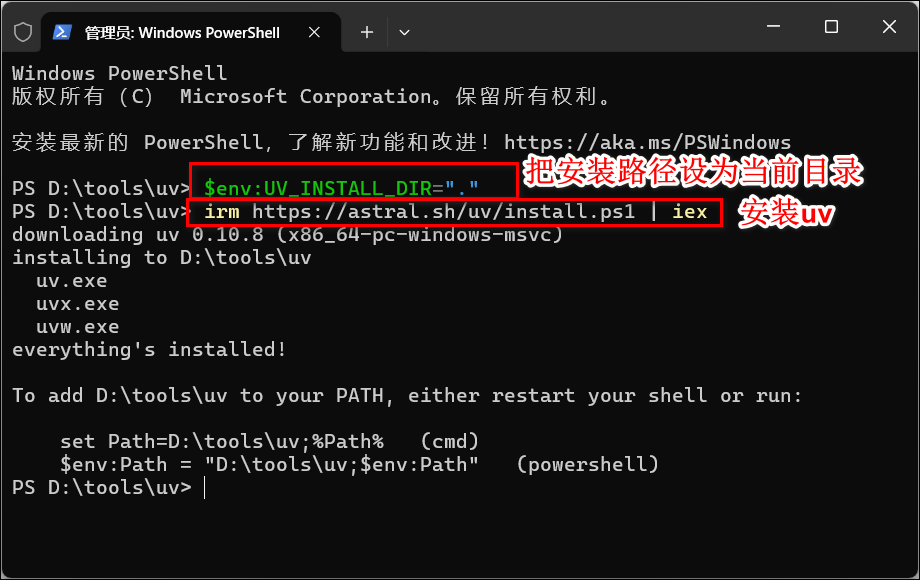
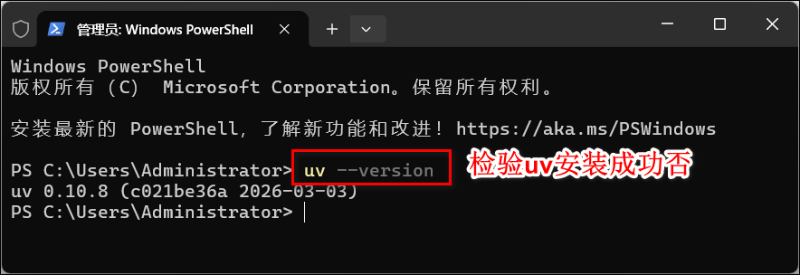
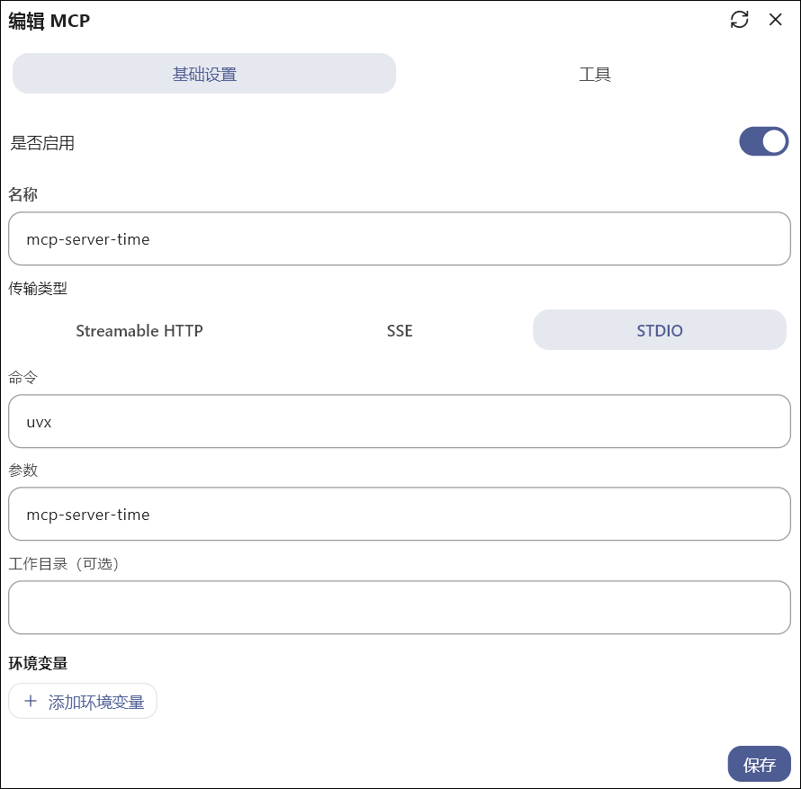
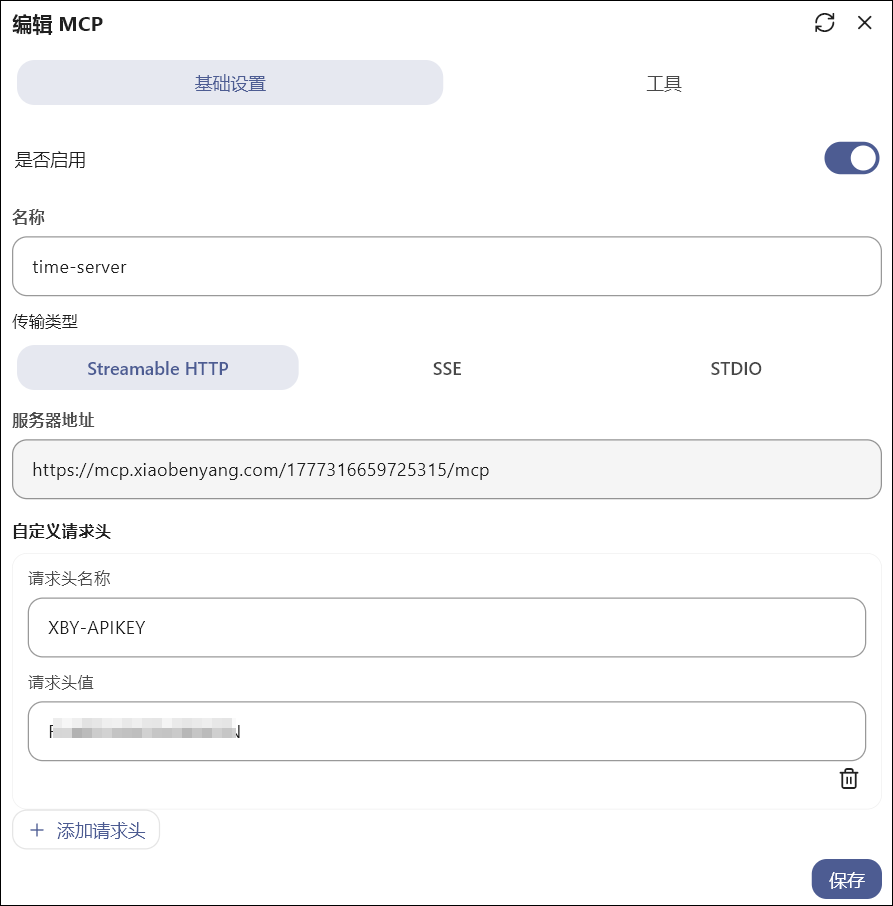
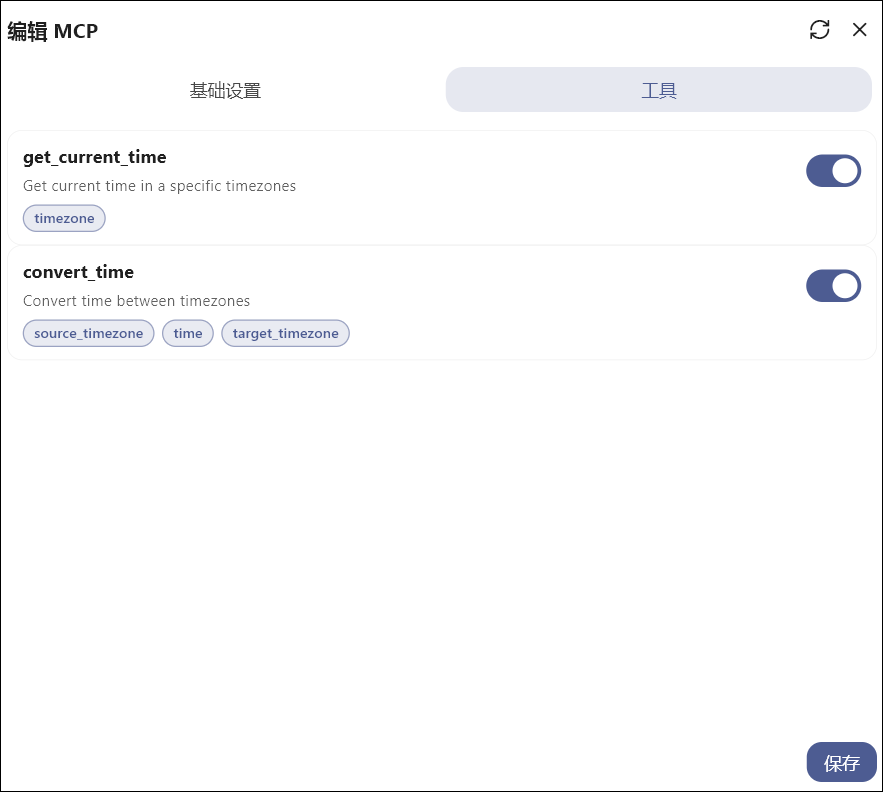

**MCP**
- 全称：Model Context Protocol（模型上下文协议）
- 一种让 AI 可以连接和调用外部工具、数据、服务的标准协议。


**uv**
- 一个 超快的 Python 包管理和环境管理工具，用来安装 Python 依赖、创建虚拟环境、管理 Python 版本等。

## 安装uv

1、打开powershell安装uv

```
# 设置安装目录如果不设置，默认安装在C:\Users\用户名\AppData\Local\bin
# 把安装路径设为当前目录
$env:UV_INSTALL_DIR="."
# 指定完整路径
$env:UV_INSTALL_DIR="D:\tools\uv"

# 安装uv
irm https://astral.sh/uv/install.ps1 | iex
```




2、验证uv是否安装成功：`uv --version`



>注意得把uv路径（比如我的 D:\tools\uv）加入PATH环境变量


## mcp传输方式

MCP 的通信方式（Transport）表示 AI 客户端和 MCP 服务之间如何进行通信，不同的传输方式适用于不同的运行场景，例如本地工具或远程服务。
- stdio
  - 通过 标准输入 / 标准输出 进行通信。
  - 一般用于本地运行的 MCP 服务。AI 客户端会启动一个本地进程，然后通过输入输出与该服务进行交互。
- streamableHttp
  - 通过 HTTP 流式连接（Streaming HTTP） 进行通信。
  - 一般用于 远程 MCP 服务。客户端通过 HTTP 连接到远程 MCP 服务，并持续接收返回的数据流。
- SSE（Server-Sent Events）
  - 一种 基于 HTTP 的实时推送机制。服务器可以持续向客户端推送事件数据，客户端无需频繁发起请求。
  - SSE 通常用于 实时数据推送或流式响应场景。

常见传输方式对比：
| 传输方式	| 	适用场景|	特点|
| :--- | :--- | :--- |
| stdio |	本地 MCP 服务 | 简单、稳定、低延迟 |
| streamableHttp | 远程 MCP 服务 | 支持流式 HTTP |
| SSE | 实时数据推送 | 服务器主动推送 |

## MCP服务配置

不同的传输方式需要配置不同的参数。

需要注意的是，不同的 MCP 客户端的配置格式可能略有不同，但核心参数基本一致，我以kelivo举例。

通用参数：
- name：服务名称
- type：传输方式
- isActive：是否启用
- description：服务描述


stdio传输参数：
- command：启动服务的命令
- args：命令参数
- env：环境变量（可选）
- cwd：工作目录（可选）


使用 stdio 方式启动一个 时区时间工具 MCP 服务：
```
{
    "name": "mcp-server-time",
    "description": "",
    "isActive": true,
    "type": "stdio",
    "command": "uvx",
    "args": [
    "mcp-server-time"
    ]
}
```


streamableHttp传输参数：
- baseUrl：远程 MCP 服务地址
- headers：请求头（通常用于 APIKey 认证）

同样效果的一个时间工具，但是使用 streamableHttp 方式连接远程服务：
```
{
    "name": "time-server",
    "type": "streamableHttp",
    "description": "",
    "isActive": true,
    "baseUrl": "https://mcp.xiaobenyang.com/1777316659725315/mcp",
    "headers": {
        "XBY-APIKEY": "" // 填写你的APIKEY
    }
}

```



当 MCP 服务配置完成并成功连接后，客户端会列出该服务提供的 Tools（工具）列表：


