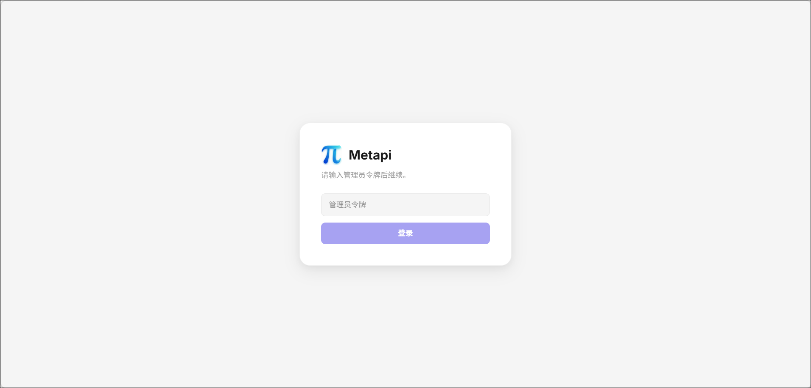
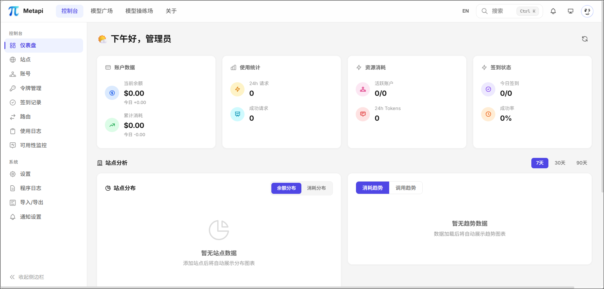
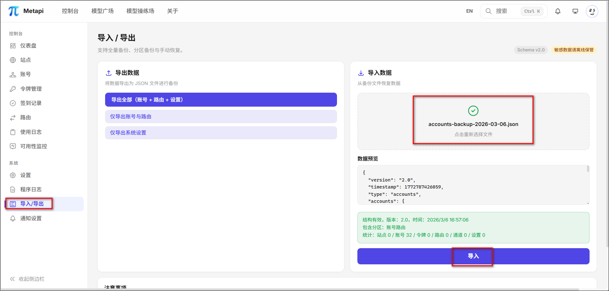

octopus是个为个人打造的 LLM API 聚合和负载平衡服务。

官方文档：https://github.com/bestruirui/octopus


## docker部署

**1、compose文件**
```
services:
  metapi:
    image: 1467078763/metapi:latest
    container_name: metapi
    restart: unless-stopped
    ports:
      - 4000:4000
    volumes:
      - ./data:/app/data
    environment:
      - AUTH_TOKEN=change-me-admin-token # 管理后台登录令牌
      - PROXY_TOKEN=change-me-proxy-sk-token # 代理接口 Bearer Token（下游客户端使用此值作为 API Key）
      - CHECKIN_CRON=0 8 * * * # 自动签到计划 (默认: 每天 8:00)
      - BALANCE_REFRESH_CRON=0 * * * *  # 余额刷新计划 (默认: 每小时整点)
      - PORT=4000   # 服务监听端口
      - DATA_DIR=/app/data  #数据目录（SQLite 数据库存储位置）
      - TZ=Asia/Shanghai    # 时区，默认Asia/Shanghai
```

2、部署完成后点击IP:4000访问，输入我们设的管理后台登录令牌



3、来到页面



4、点击导入导出菜单，可以导入外部应用比如All API Hub的数据




## 站点账号与令牌管理
