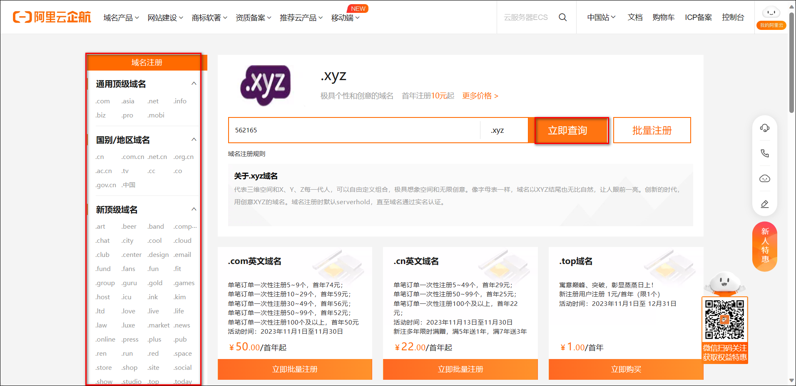
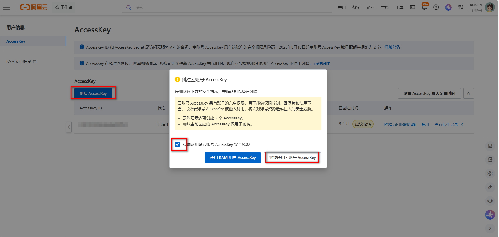
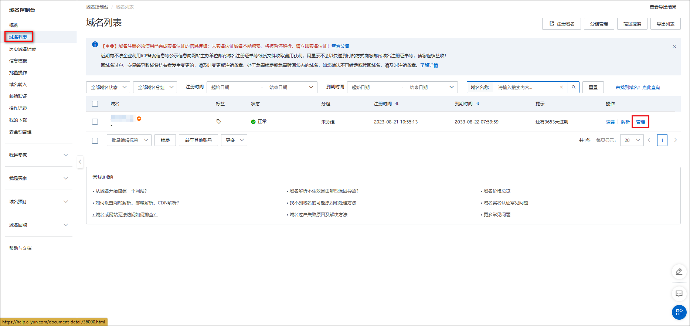
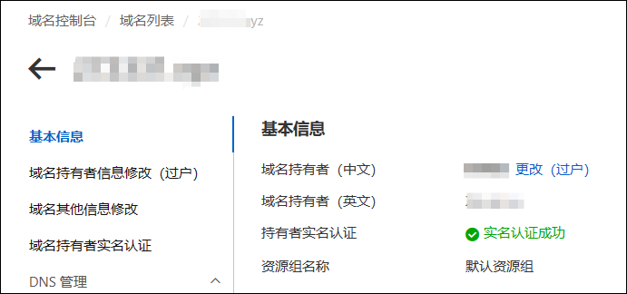
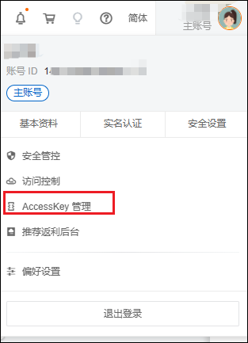
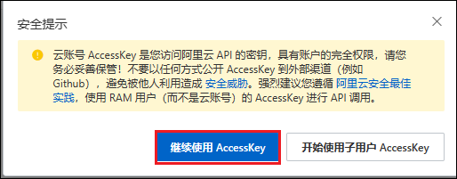
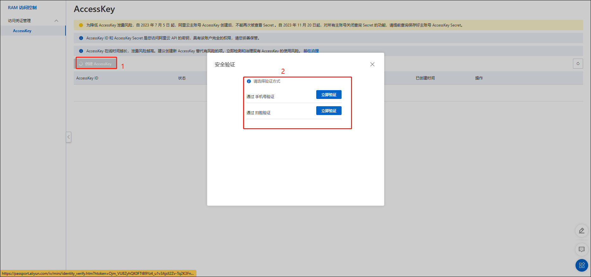
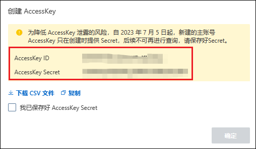

## 1、域名申请

首先我们确定阿里上我们已经上传了个人信息模板，并已经实名认证完成了。

1、打开[阿里 xyz 域名购买](https://wanwang.aliyun.com/domain/tld?spm=5176.17702883.J_1334179430.13.722d2f29cnWZto#.xyz)网站，输入你想购买的域名然后点击立即查询。旁边也可选择其它后缀，但是 6 位纯数字 XYZ 后缀的域名便宜，十年只需 68 块钱，具体的选择还是看你自己。

2、点击想购买域名后的加入清单，然后点击上面的域名清单。

3、点击立即购买。

4、输入想购买的年限，并选择信息模板，勾选同意协定，点击立即购买。

5、然后我们点击控制台，进入域名控制台下的域名列表，点击管理。

6、先在基本信息里看看自己的域名是否实名认证成功，因为没有认证成功是没办法进行域名解析的。这里我们是已认证的状态。

## 2、域名解析

1、点击进入域名解析。

2、点击添加记录（如果有新手指引可以先跳过），设置二级域名。

3、这里我们创建两个记录。

- 如果宽带 ip 是 ipv4，记录类型选择 A，宽带类型是 ipv6，记录类型选择 AAAA，这里大家根据自己的网络情况进行选择；主机记录选择@；记录值可以随便填一个进入比如 1.1.1.1（宽带是 V4 的），因为后面会实时更新；其他选项选择默认即可。
- 创建一个记录类型为 CHAME 的；主机记录选择\*；记录值填写我们申请的域名；其他选项选择默认即可。

## 3、AccessKey 创建

我们把鼠标放在阿里云头像位置，会自动弹出菜单，选择 AccessKey 管理。

这时会弹出窗口，我们点击继续使用。

进入 AccessKey 管理界面，点击创建 AccessKey，然后选择验证方式进行验证。

验证完后会自动生成一份 AccessKey 和 AccessKeySecret。这里注意要保存下来，否则后面没法再找回，只能重新创建。

