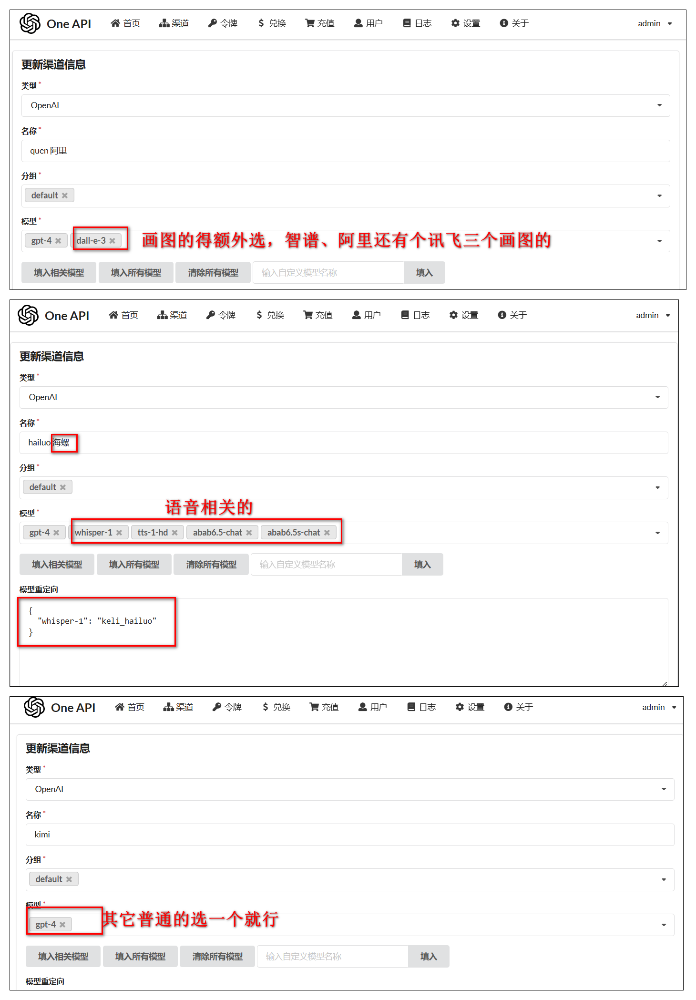
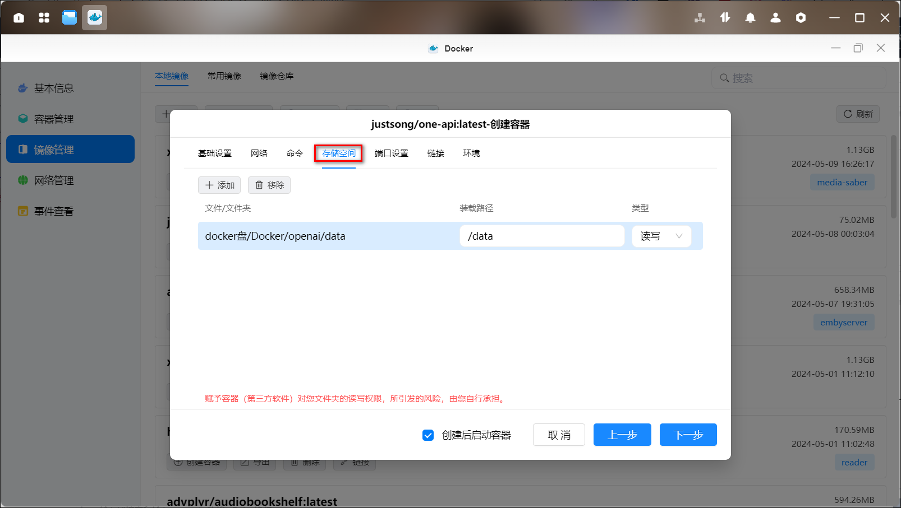
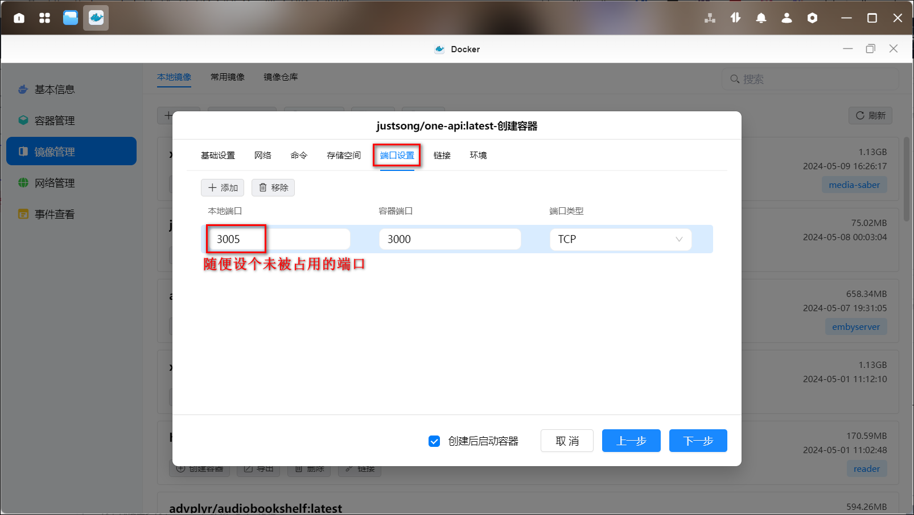
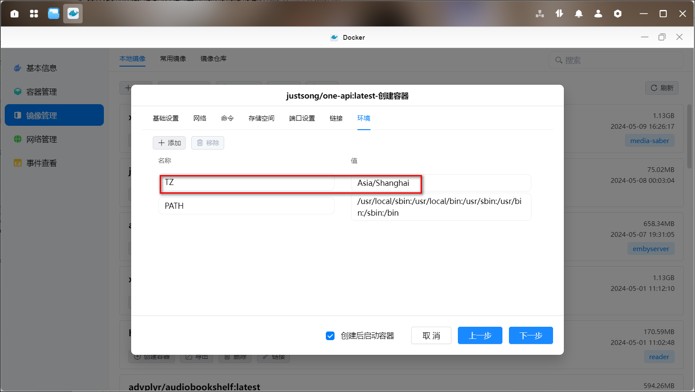
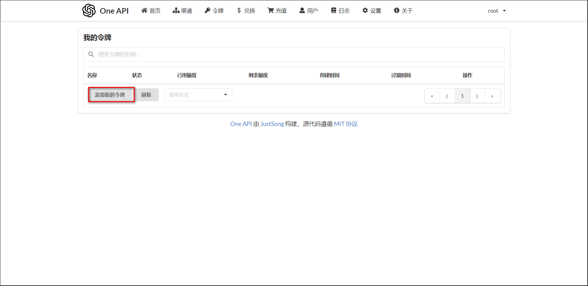
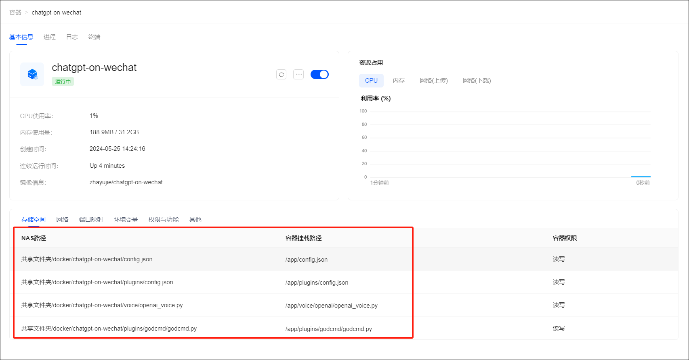
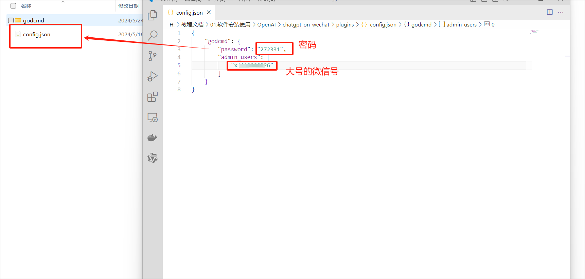

## 1、接口准备

### 1、接口说明

1、所有接口相关文档可以查看：`https://github.com/LLM-Red-Team`，可以点击查看相对应的接口，按需配置即可。画图的可以选讯飞、智谱、阿里，语音的话选海螺。



2、百度语音 识别和合成，按需，我没搞

- 打开[百度智能云](https://console.bce.baidu.com/ai/#/ai/speech/overview/resource/getFree) 领取全部接口。
- 创建应用：https://console.bce.baidu.com/ai/#/ai/speech/app/list

### 2、接口容器部署

1、拉取镜像

- kimi：vinlic/kimi-free-api
- 跃问 step：vinlic/step-free-api
- 阿里通义 qwen：vinlic/qwen-free-api
- 智谱清言 glm：vinlic/glm-free-api
- 秘塔 metaso：vinlic/metaso-free-api
- 讯飞星火 spark：vinlic/spark-free-api
- 海螺 hailuo：vinlic/hailuo-free-api
- 深度求索 deepseek：vinlic/deepseek-free-api
- 聆心智能 emohaa：vinlic/emohaa-free-api

2、分别部署容器

1）端口：本地端口改个未被占用的

2）环境添加一行： `TZ=Asia/Shanghai`

## 2、部署 one-api

### 容器安装

1、拉取 justsong/one-api 镜像


2、部署 one-api 容器

挂载目录：



端口设置：



环境配置：



### 配置 one-api

1、进入 oneapi 后台，点击登录， 默认账号 root 默认密码 123456


2、进去后会提示修改密码，建议修改


3、点击令牌-添加令牌



4、名称自定义，然后设置过期时间和限额，这里我选不过期和不限额。


5、设置好后，点击复制可以复制令牌


6、点击渠道-添加渠道


7、提交后可以看到添加的渠道，可以点击测试查看状态


### 渠道密钥获取

1、kimi

从 [kimi 官网](https://kimi.moonshot.cn/) 获取 refresh_token：进入 kimi 随便发起一个对话，然后 F12 打开开发者工具，从 Application > Local Storage 中找到 refresh_token 的值，这将作为 Authorization 的 Bearer Token 值

2、跃问 step-- 会掉，得手机验证码

从 [跃问 官网](https://yuewen.cn/) 获取 deviceId 和 Oasis-Token：

- 进入 StepChat 随便发起一个对话，然后 F12 打开开发者工具。
- 从 Application > LocalStorage 中找到 deviceId 的值（去除双引号），如：267bcc81a01c2032a11a3fc6ec3e372c380eb9d1
- 从 Application > Cookies 中找到 Oasis-Token 的值，如：eyJhbGciOiJIUzI1NiIsInR5cCI6IkpXVCJ9...
- 将 deviceId 的值 和 Oasis-Token 的值 使用 @ 拼接得到 Authorization 的 Bearer Token 值

3、阿里通义 qwen -- 会掉，得手机验证码

进入[通义千问 官网](https://tongyi.aliyun.com/)随便发起一个对话，然后 F12 打开开发者工具，从 Application > Cookies 中找到 tongyi_sso_ticket 的值，这将作为 Authorization 的 Bearer Token 值

4、智谱清言 glm

进入[智谱清言 官网](https://chatglm.cn/) 随便发起一个对话，然后 F12 打开开发者工具，从 Application > Cookies 中找到 chatglm_refresh_token 的值，这将作为 Authorization 的 Bearer Token 值

5、讯飞星火 spark

进入 [讯飞星火 官网](https://xinghuo.xfyun.cn/) 登录并发起一个对话，由于星火平台禁用 F12 开发者工具，请安装 Cookie-Editor 浏览器插件查看 ssoSessionId 值作为你的 Cookie。

6、秘塔 metaso -- 会掉，得手机验证码，可密码

从 从 [秘塔 官网](https://metaso.cn/) 获取 uid 和 sid 并使用-拼接：

进入秘塔 AI 搜索，登录账号（建议登录账号，否则可能遭遇奇怪的限制），然后 F12 打开开发者工具，从 Application > Cookies 中找到 uid 和 sid 的值。

将 uid 和 sid 拼接：uid-sid，如 65e91a6b2bac5b600dd8526a-5e7acc465b114236a8d9de26c9f41846 得到 Authorization 的 Bearer Token 值

7、海螺 hailuo

进入[海螺 官网](https://hailuoai.com/)随便发起一个对话，然后 F12 打开开发者工具，从 Application > LocalStorage 中找到 `_token` 的值，这将作为 Authorization 的 Bearer Token 值

模型选：gpt-4、whisper-1、tts-1-hd、abab6.5-chat、abab6.5s-chat

模型重定向填写：

```
{
  "whisper-1": "keli_hailuo"
}

```

8、深度求索 deepseek --会掉，密码

进入 [深度求索 官网]() 随便发起一个对话，然后 F12 打开开发者工具，从 Application > LocalStorage 中找到 userToken 中的 value 值，这将作为 Authorization 的 Bearer Token 值

9、聆心智能 emohaa--token 不易获取

从 [聆心智能 官网](https://echo.turing-world.com/)登录进入，由于 emohaa 禁用 F12 开发者工具，请先安装 Manage LocalStorage 插件（我在 edeg 没找到，所以没搞了），再从在当前页面中打开插件并点击 Export 按钮找到 Token 的值，这将作为 Authorization 的 Bearer Token 值

## 3、部署个人微信 chatgpt-on-wechat

1、拉取 zhayujie/chatgpt-on-wechat 镜像


2、部署 chatgpt-on-wechat 容器

文件挂载,文件可以去`https://github.com/syueya/COW`下载：



- `/app/config.json`（必需）：环境参数配置文件，你可以在环境中配置环境参数，推荐挂载，这样方便更改。

  

- `/app/plugins/config.json`（按需）: 密码随意设，微信号填你大号的微信号，而不是你扫码的

  

- `/app/voice/openai/openai_voice.py`（按需）:需要语音的话加
- `/app/plugins/godcmd/godcmd.py`（按需）:更丰富的 help 指令
- `/app/channel/chat_channel.py`（不建议）:每条文字都转换条语音

3、微信扫描登录，建议用小号

1）查看容器日志，找到类似于`https://api.pwmqr.com/qrcode/create/?url=https://login.weixin.qq.com...`这样的扫码链接地址

2）也可进入 ssh，输入以下命令获取二维码，然后微信扫描登录

`sudo docker logs -f chatgpt-on-wechat # 如果有root权限的话，可以去掉sudo，绿联是不需要sudo的`


4、无权限问题（一般不会遇到）

如果显示`[Errno 13]Permission denied:'./config.json'`，可以 ssh 里执行以下命令修改权限：

记得把路径换成自己的。

```
chmod a+rw /volume3/docker/chatgpt-on-wechat/plugins/config.json   ## 修改权限
ls -l /volume3/docker/chatgpt-on-wechat/plugins/config.json  ## 查看权限
```

## 4、企业微信

COW 环境参数需要填写以下内容，参考：https://docs.link-ai.tech/cow/multi-platform/wechat-com

```
"channel_type": "wechatcom_app",   # 渠道配置成企业微信
"wechatcom_corp_id": "",  # 企业微信公司的corpID
"wechatcomapp_token": "",  # 企业微信app的token
"wechatcomapp_port": 9898,  # 企业微信app的服务端口,需要端口转发
"wechatcomapp_secret": "",  # 企业微信app的secret
"wechatcomapp_agent_id": "",  # 企业微信app的agent_id
"wechatcomapp_aes_key": "",  # 企业微信app的aes_key
```

## 5、COW 环境参数说明

/app/config.json 文件：openai api key 和 OPEN_AI_API_BASE 修改成自己的，，群名那也改改，其他的自定义修改，也可以不用改

```
{
  # openai api配置
  "open_ai_api_key": "",     # 必填
  "open_ai_api_base": "http://192.168.31.31:3005/v1",    # 必填
  "proxy": "",  # openai使用的代理
  "model": "gpt-4", # chatgpt模型，支持 gpt-3.5-turbo, gpt-4, gpt-4-turbo, wenxin, xunfei, qwen
  "use_azure_chatgpt": false, # 是否使用azure的chatgpt
  "azure_deployment_id": "",  # azure 模型部署名称
  "azure_api_version": "",  # azure api版本

  # Bot触发配置
  "single_chat_prefix": [""], # 私聊时文本需要包含该前缀才能触发机器人回复
  "single_chat_reply_prefix": "", # 私聊时自动回复的前缀，用于区分真人
  "single_chat_reply_suffix": "", # 私聊时自动回复的后缀，\n 可以换行
  "group_chat_prefix": ["老大", "@老大"], # 群聊时包含该前缀则会触发机器人回复
  "group_chat_reply_prefix": "",  # 群聊时自动回复的前缀
  "group_chat_reply_suffix": "",  # 群聊时自动回复的后缀，\n 可以换行
  "group_chat_keyword": [], # 群聊时包含该关键词则会触发机器人回复
  "group_at_off": false,  # 是否关闭群聊时@bot 的触发
  "group_name_white_list": ["ALL_GROUP"], # 开启自动回复的群名称列表
  "group_name_keyword_white_list": [],  # 开启自动回复的群名称关键词列表
  "group_chat_in_one_session": ["nas吹水28群", "一个老大和两个小弟", "发财群"],   # 支持会话上下文共享的群名称
  "nick_name_black_list": [], # 用户昵称黑名单
  "group_welcome_msg": "",  # 配置新人进群固定欢迎语，不配置则使用随机风格欢迎
  "trigger_by_self": false, # 是否允许机器人触发
  "text_to_image": "dall-e-3",  # 图片生成模型，可选 dall-e-2, dall-e-3
  "image_proxy": true,  # 是否需要图片代理，国内访问 LinkAI 时需要
  "image_create_prefix": ["画"],  # 开启图片回复的前缀
  "concurrency_in_session": 1,  # 同一会话最多有多少条消息在处理中，大于 1 可能乱序
  "image_create_size": "256x256", # 图片大小,可选有 256x256, 512x512, 1024x1024 (dall-e-3 默认为 1024x1024)
  "group_chat_exit_group": false,

  # 无操作会话的过期时间
  "expires_in_seconds": 3600,

  # 人格描述
  "character_desc": "你将扮演一位有点摆烂的打工人形象，你富有同理心，有人问你问题你会耐心回复，但有时候对于一些太傻的问题你也很无语，会阴阳怪气的回复。",

  "conversation_max_tokens": 1000,  # 支持上下文记忆的最多字符数
  "rate_limit_chatgpt": 20, # chatgpt的调用频率限制
  "rate_limit_dalle": 50, # openai dalle的调用频率限制

  # chatgpt api参数 参考https://platform.openai.com/docs/api-reference/chat/create
  "temperature": 0.9,
  "top_p": 1,
  "frequency_penalty": 0,
  "presence_penalty": 0,
  "request_timeout": 180, # chatgpt请求超时时间，openai接口默认设置为600，对于难问题一般需要较长时间
  "timeout": 120, # chatgpt重试超时时间，在这个时间内，将会自动重试

  # Baidu 文心一言参数
  "baidu_wenxin_model": "eb-instant", # 默认使用ERNIE-Bot-turbo模型
  "baidu_wenxin_api_key": "", # Baidu api key
  "baidu_wenxin_secret_key": "",  # Baidu secret key

  # 讯飞星火API
  "xunfei_app_id": "",  # 讯飞应用ID
  "xunfei_api_key": "", # 讯飞 API key
  "xunfei_api_secret": "",  # 讯飞 API secret

  # claude 配置
  "claude_api_cookie": "",
  "claude_uuid": "",
  "claude_api_key": "",

  # 通义千问API
  "qwen_access_key_id": "",
  "qwen_access_key_secret": "",
  "qwen_agent_key": "",
  "qwen_app_id": "",
  "qwen_node_id": "", # 流程编排模型用到的id，如果没有用到qwen_node_id，请务必保持为空字符串

  # 阿里灵积模型api key
  "dashscope_api_key": "",
  "gemini_api_key": "",
  "wework_smart": true, # 配置wework是否使用已登录的企业微信，False为多开

  # 语音设置
  "speech_recognition": true, # 是否开启语音识别
  "group_speech_recognition": true, # 是否开启群组语音识别
  "voice_reply_voice": true,  # 是否使用语音回复语音，需要设置对应语音合成引擎的api key
  "always_reply_voice": false,  # 是否一直使用语音回复
  "voice_to_text": "openai",  # 语音识别引擎
  "text_to_voice": "openai",  # 语音合成引擎
  "text_to_voice_model": "tts-1-hd",  # tts使用的模型
  "tts_voice_id": "onyx", # 语音生成的音色

  # baidu 语音api配置， 使用百度语音识别和语音合成时需要
  "baidu_app_id": "",
  "baidu_api_key": "",
  "baidu_secret_key": "",
  "baidu_dev_pid": "1536",  # 1536普通话(支持简单的英文识别) 1737英语 1637粤语 1837四川话 1936普通话远场

  # azure 语音api配置， 使用azure语音识别和语音合成时需要
  "azure_voice_api_key": "",
  "azure_voice_region": "japaneast",

  # elevenlabs 语音api配置
  "xi_api_key": "",
  "xi_voice_id": "",  #ElevenLabs提供了9种英式、美式等英语发音id，分别是“Adam/Antoni/Arnold/Bella/Domi/Elli/Josh/Rachel/Sam


  # 服务时间限制，目前支持itchat
  "chat_time_module": false,  # 是否开启服务时间限制
  "chat_start_time": "00:00", # 服务开始时间
  "chat_stop_time": "24:00",  # 服务结束时间

  # 翻译api
  "translate": "baidu", # 翻译api，支持baidu
  "baidu_translate_app_id": "", # # 百度翻译api的秘钥
  "baidu_translate_app_key": "",  # 百度翻译api的秘钥

  "hot_reload": false,  # 是否开启热重载

  # wechaty的配置
  "wechaty_puppet_service_token": "", # wechaty的token

  # wechatmp的配置
  "wechatmp_token": "", # 微信公众平台的Token
  "wechatmp_port": 8080,  # 微信公众平台的端口,需要端口转发到80或443
  "wechatmp_app_id": "",  # 微信公众平台的appID
  "wechatmp_app_secret": "",  # 微信公众平台的appsecret
  "wechatmp_aes_key": "", # 微信公众平台的EncodingAESKey，加密模式需要

  # wechatcom的通用配置
  "wechatcom_corp_id": "",  # 企业微信公司的corpID
  "wechatcomapp_token": "", # 企业微信app的token
  "wechatcomapp_port": 9898,  # 企业微信app的服务端口不需要端口转发
  "wechatcomapp_secret": "",  # 企业微信app的secret
  "wechatcomapp_agent_id": "",  # 企业微信app的agent_id
  "wechatcomapp_aes_key": "", # 企业微信app的aes_key

  # 飞书配置
  "feishu_port": 80,  # 飞书bot监听端口
  "feishu_app_id": "",  # 飞书机器人应用APP Id
  "feishu_app_secret": "",  # 飞书机器人APP secret
  "feishu_token": "", # 飞书 verification token
  "feishu_bot_name": "",  # 飞书机器人的名字

  # 钉钉配置
  "dingtalk_client_id": "", # 钉钉机器人Client ID
  "dingtalk_client_secret": "", # 钉钉机器人Client Secret


  "clear_memory_commands": ["#清除记忆"], # 重置会话指令，必须以#开头
  "channel_type": "wx", # channel配置，通道类型，支持：{wx,wxy,terminal,wechatmp,wechatmp_service,wechatcom_app}
  "subscribe_msg": "",  # 订阅消息, 支持: wechatmp, wechatmp_service, wechatcom_app
  "debug": false, # 是否开启debug模式，开启后会打印更多日志
  "appdata_dir": "", # 数据目录

  # 插件配置
  PLUGIN_TRIGGER_PREFIX: '$'  # 规范插件提供聊天相关指令的前缀，建议不要和管理员指令前缀"#"冲突
  USE_GLOBAL_PLUGIN_CONFIG: 'True'    # 是否使用全局插件配置
  MAX_MEDIA_SEND_COUNT: 3 # 单次最大发送媒体资源的个数
  MEDIA_SEND_INTERVAL: 1  # 发送图片的事件间隔，单位秒

  # 智谱AI 平台配置
  ZHIPU_AI_API_KEY: ''
  ZHIPU_AI_API_BASE: https://open.bigmodel.cn/api/paas/v4
  MOONSHOT_API_KEY: ''
  MOONSHOT_BASE_URL: https://api.moonshot.cn/v1/chat/completions

  # LinkAI平台配置
  USE_LINKAI: 'False'
  LINKAI_API_KEY: ''
  LINKAI_APP_CODE: ''
  LINKAI_API_BASE: https://api.link-ai.tech   # linkAI服务地址
}

```
