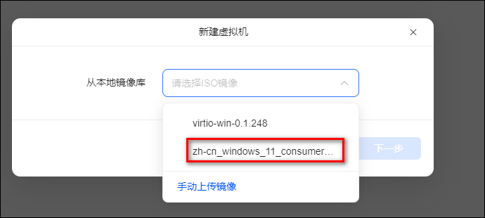
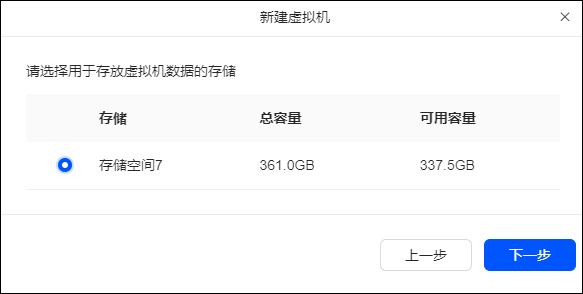
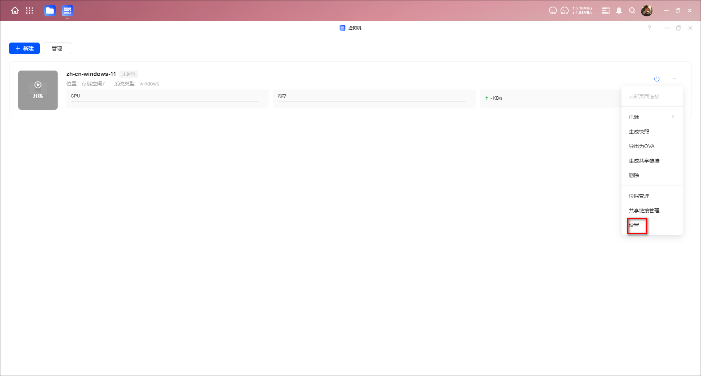
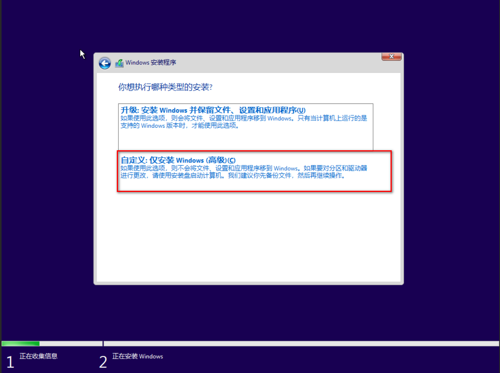

## 事先准备

安装 win11 和驱动镜像文件

- 镜像：`magnet:?xt=urn:btih:d478a1609f5c2d3fc9d03adc81398db2b3051c7f&dn=zh-cn_windows_11_consumer_editions_version_23h2_updated_may_2024_x64_dvd_3eaf6ec8.iso&xl=7099777024`

- 驱动：`https://fedorapeople.org/groups/virt/virtio-win/direct-downloads/archive-virtio/`

驱动选最后一个

下载 iso 文件

## 新建虚拟机

1、点开绿联的虚拟机，上传刚刚下载好的两个镜像文件。

2、重新点击新建虚拟机，选择下载的 win11 镜像。

3、选择虚拟机的存放位置

4、然后点击下一步完成名称、空间、网络这些基础设置，然后点击完成。

5、点击设置。

6、添加驱动的镜像文件，然后点击应用。

## 安装 win11

1、点击下一步

2、点击现在安装

3、点击没有产品密钥

4、选择专业版

5、出现没法运行 win11 的提示。

6、解决办法：Win11 怎么绕过 TMP 进行安装?

在出现没法运行 win11 的提示界面按 Shift+F10，打开命令行界面，输入 regedit 打开注册表，然后定位到：HKEY_LOCAL_MACHINE/SYSTEM/Setup，创建一个名为“LabConfig”的项，接着在“LabConfig”下创建两个 DWORD 值：

- 键为“BypassTPMCheck”，值为“00000001”
- 键为“BypassSecureBootCheck”，值为“00000001”

保存后退出。

7、点击上一步选择专业版后重新点击下一步，此时可以正常安装了，点击我接受

8、选择自定义安装

9、点击下一页

然后就是一些漫长的安装和设置界面，不作详述。

## 安装驱动

1、选择其他设备里打感叹号的两个 PCI 开头的驱动，右键选择更新驱动程序，然后选择浏览我的电脑查找驱动程序。

2、选择驱动镜像所在的 E 盘。

3、全部完成后，显示这两个。

!

4、然后将 驱动镜像对应的 Windows 版本文件夹下的“blnsvr.exe”拷贝到 C:\Windows\System32 目录下，

5、在搜索栏输入“cmd”鼠标右键以管理员身份运行“命令提示符”，输入“blnsvr -i”并回车。

6、现在 nas 里内存就是正常的已使用的内存了

## 激活

管理员运行 PowerShell，输入以下命令激活：`irm https://massgrave.dev/get | iex`

如果出现红色的错误，就多试几次。

直到出现这个页面，填入数字 1，永久激活。

激活成功，按随意键退出。

