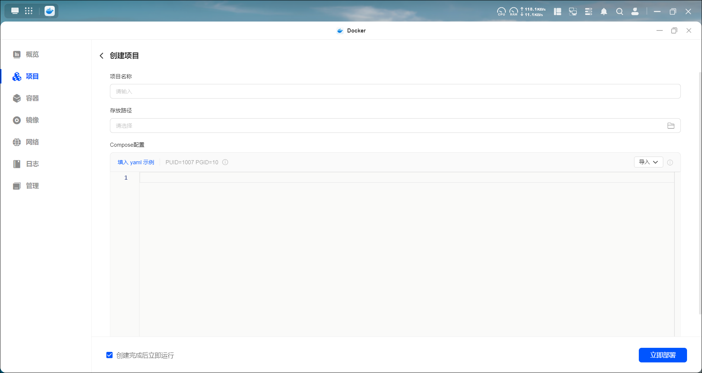

## 一、介绍

Compose 是用于定义和运行多容器 Docker 应用程序的工具。通过 Compose，您可以使用一个单独的 docker-compose.yml 模板文件来定义一组相关联的应用容器为一个项目。

当然，如果想使用compose的话，你得先进行安装compose，安装命令：
```
sudo curl -L "https://github.com/docker/compose/releases/latest/download/docker-compose-$(uname -s)-$(uname -m)" -o /usr/local/bin/docker-compose
```

记得赋予可执行权限：`sudo chmod +x /usr/local/bin/docker-compose`

安装完成后可以使用`docker compose version`测试是否已经安装成功。然后可以使用`docker compose --help`查看所有可用的 Docker Compose 命令。

>- 如果你安装的是Docker Compose V1版本，命令格式为 docker-compose（连字符形式），比如 `docker-compose --version`。
>- 如果安装的是 Docker Compose V2，命令格式为 docker compose（空格形式），比如 `docker compose version`。
>- 部分系统可能同时存在两个版本，此时需注意区分（通常新版优先级更高）。

当然对我们来说也不用关注这些，只需要在docker应用里创建项目编写compose模板文件即可。


## 二、compose 模板文件

Compose 模板文件是用于定义多容器应用配置的 YAML 文件，通过声明式语法描述服务、网络、数据卷等资源，实现一键部署。具体语法细节可参考官方文档：[compose-file](https://docs.docker.com/reference/compose-file/)。

### 顶级字段

模板文件的顶级字段用于全局配置应用资源，常用字段如下：
- 版本(version)：兼容场景需用。声明 Compose 语法版本（如 '3.8'），用于兼容不同版本的 Docker 引擎。注意：Docker Compose v2+ 已弱化该字段，不指定时默认使用最新语法，但旧版本仍需显式声明。
- 名称(name)：可选。指定项目名称（默认使用当前目录名），用于区分不同 Compose 项目（如网络、卷的命名会包含项目名）。
- 服务(services)：必选。定义所有服务（每个服务对应一个或多个容器），包含容器的镜像、端口、环境变量等配置。
- 网络(networks)：可选。定义自定义网络，用于服务间通信隔离或跨主机网络（默认会创建一个名为 [项目名]_default 的桥接网络）。
- 数据卷(volumes)：可选。定义命名卷，用于持久化数据
- 配置文件(configs)：可选。定义可共享的配置文件，供多个服务挂载使用（适合非敏感配置，如应用配置文件）。
- 敏感信息(secrets)：可选。定义敏感信息（如密码、证书），以安全方式挂载到服务中（避免明文暴露在配置或日志中）。

### 核心字段：services
services 是模板文件的核心，每个子项代表一个服务（可理解为 “容器模板”），包含容器的所有配置（如镜像、端口、依赖等）。

1、单服务
一个最简单的单服务配置：
```
services:
  web:  # 服务名称（自定义，用于标识服务）
    image: nginx:latest  # 容器使用的镜像
    ports:  # 端口映射（主机端口:容器端口）
      - "8080:80"  # 主机 8080 端口映射到容器 80 端口（Nginx 默认端口）
```

2、多服务
多服务配置通过在 services 下添加多个服务项实现，适合前后端、数据库等多组件架构：
```
services:
  web:
    image: nginx:latest
    ports:
      - "8080:80"

  db:
    image: postgres:13
    environment:
      POSTGRES_USER: example
      POSTGRES_DB: exampledb
```

### 编写模板文件

了解完模板文件的基础知识后，现在我们就来编写文件吧。这里以绿联为例：

1. 查看需要部署的容器官方文档或者网上搜索其compose教程，比如[qb容器](https://hub.docker.com/r/linuxserver/qbittorrent)的docker hub 页面上就有参考的compose代码：
  

2. 打开docker应用，点击左边菜单栏的项目菜单，并在页面点击创建按钮来到创建项目页面。
   - 填写项目名称：比如qb，部署完成后会在项目菜单下有一个名为qb的项目。
   - 设置路径：会在该路径下新建一个docker-compose.yaml文件，并且如果配置目录映射的主机路径时使用相对路径，也是基于该路径的。比如./downloads就是该路径下的downloads文件夹。
   - 把刚刚页面上的compose文件内容复制到compose配置区，如有需要则修改一些内容，一般主要修改主机端口、主机目录、一些环境变量。
   - 配置完成后点击立即部署即可。如果配置内容有问题，会在问题行下面打波浪线，并且下方会提示请解决配置错误，一般都是格式错误，比如缩进。
  

3. 部署完成后可以发现项目菜单下有个qb项目了，点击该项目进去可以查看项目下的容器与日志，也可以点击Compose配置修改配置。


### 优点
虽然我们也可以在容器菜单下点击创建按钮来部署容器，但是相对来说，我还是更喜欢通过compose来部署。
- compose文件易于保存和分享，对于新手来说，抄作业就容易多了。
- 对于多容器的项目来说，可以通过一个 YAML 文件定义所有服务的配置（镜像、端口、网络、依赖等），极大的简化了多容器管理。
- 各项配置一目了然，如果需要修改某项配置，也只需要修改下compsoe文件即可轻松解决。


## 三、常用services配置

服务字段也有很多配置，我们也不一一讲解，只讲解几个常用的属性，具体的可以看[服务属性](https://docs.docker.com/reference/compose-file/services/#attributes)。

### image

指定容器使用的镜像与版本，如果没有指定版本，一般默认是最新版本。比如：
```
image: linuxserver/qbittorrent:latest
image: linuxserver/qbittorrent:4.6.7
```

至于版本号，可以去docker hub官网查看对应的镜像的tags。


### container_name

指定通过compose文件部署后的容器名称，不指定则会默认生成一个名称，默认的名称格式为：项目名_服务名_序号
>注意：指定的容器名称必须是唯一的，如果尝试创建两个相同名称的容器，Docker 将会报错。

### restart

restart 定义了容器重启策略，一般不指定的话默认是no：
- no ：退出后不会重启容器。
- always ：无论容器以何种原因退出（包括正常退出、错误退出），Docker 都会自动重启容器。
- unless-stopped ：除非手动停止容器（docker stop），否则无论容器如何退出，都会自动重启。
- on-failure[:max-retries] ：仅当容器以非 0 状态码退出（即异常退出）时，才自动重启。
  - 可选参数 max-retries：限制最大重启次数（如 on-failure:3 表示最多重启 3 次，超过后停止尝试）。


### network_mode

network_mode 用于指定服务容器的网络模式，决定容器的网络栈如何与主机、其他容器关联：
- bridge: 默认的网络模式。
  - 未显式指定时，compose会为当前项目创建一个自定义桥接网络（默认名称为 [项目名]_default），所有服务自动加入，支持通过服务名通信，不同项目网络相互隔离（推荐）。
  - 显式指定了 network_mode: bridge，容器接入 Docker 原生 `docker0` 网络，仅支持 IP 通信（不推荐）。
  - 自定义桥接网络相比原生 docker0 的优势：支持容器间通过服务名（而非 IP）通信，且网络隔离性更好（不同项目的默认网络相互独立）。
- host ：容器与主机共享完整网络栈（IP、端口、接口等）。
  - 容器端口直接占用主机端口，无需配置 `ports`（配置会被忽略）。
  - 不支持跨平台（在 Windows/macOS 的 Docker Desktop 中，host 模式无法直接访问主机的 localhost，需通过特殊地址如 host.docker.internal 间接访问）。Linux 环境下可正常使用。
  - 端口冲突风险高，安全性较低（容器可直接访问主机网络资源）。
- none：禁用所有网络，容器无网络接口。
  - 仅适用于纯离线任务（如本地数据处理），无法与外部通信。
- service:{name}：当前容器与同一 Compose 项目中的 {name} 服务共享网络栈。
  - 共享 IP、端口，可通过 `localhost` 访问对方服务；需配合 `depends_on` 确保目标服务先启动。
- container:{name/id}：当前容器与指定外部容器（通过名称/ID）共享网络栈。
  - 依赖目标容器已存在，需手动管理其生命周期，适用于跨项目网络共享。


### ports

ports 用于定义主机和容器之间的端口映射，支持两种格式。

#### 短格式（常用）

用冒号分隔的字符串来设置主机 IP、主机端口和容器端口，完整格式完整：`[HOST:]CONTAINER[/PROTOCOL]`。
- HOST（可选）：表示主机端的绑定配置，格式为 [IP:](port | range)。
  - IP：主机的网络接口 IP（如 127.0.0.1 仅本地访问，192.168.1.10 绑定特定网卡），省略则默认绑定主机所有接口（0.0.0.0）。
  - port | range：主机上暴露的端口（单个端口或范围，如 8080 或 9000-9002），省略则由 Docker 自动分配随机空闲端口（通常在 32768-65535 范围内）。
- CONTAINER（必填），格式为port | range。
  - 容器内服务监听的端口（单个端口或范围，如 80 或 9000-9002）。
- PROTOCOL（可选）：指定传输协议，仅支持 tcp 或 udp，默认值为 tcp，需跟在 CONTAINER 后用 / 分隔（如 80/udp）。

示例：
```
ports:
  - "8080:80"               # 主机 8080 映射容器 80（tcp）
  - "127.0.0.1:8081:80"     # 仅本地 8081 映射容器 80
  - "8082:80/udp"           # 主机8082（udp）映射容器80（udp）
  - "8000-8002:9000-9002"   # HOST范围映射CONTAINER范围 → 8000→9000、8001→9001、8002→9002
  - "9000"                  # 省略HOST端口 → 主机随机端口映射容器9000
  - "[::1]:8083:80"         # IPv6地址（用方括号包裹）→ 仅IPv6本地回环通过8083访问容器80
```


注意：
- 所有映射需用引号包裹（如 "8080:80"），避免 YAML 将冒号解析为浮点数（如 8080:80 可能被误判为 8080.80）。IPv6 地址得用方括号括起来。
- 若服务配置 network_mode: host，ports 会被忽略（直接使用主机网络，无需映射）。
- 主机端口需未被占用，否则容器启动失败（报错 port is already allocated）。
- 一般容器端口不用变，只需要自定义前面的主机端口就行。访问是通过 `主机IP:主机端口` 访问的。


#### 长格式（更灵活）

支持指定协议、主机 IP 等细节，格式为字典：
- name ：端口名称，用于记录其在服务中的使用情况。
- target ：容器内端口。
- published ：主机暴露的端口。
- host_ip ：主机 IP 映射。如果未设置，则绑定到所有网络接口 ( 0.0.0.0 )。
- protocol ：传输层协议（如 tcp 或 udp），默认为 tcp 。
- app_protocol ：此端口所用的应用程序协议（如 HTTP、HTTPS、MySQL、Redis 等）。
- mode ：指定 Swarm 设置中端口的发布方式，默认为 ingress。如果设置为 host ，则会在 Swarm 中的每个节点上发布该端口。如果设置为 ingress ，则会允许 Swarm 中的节点之间进行负载均衡。

示例：
```
ports:
  - name: web
    target: 80
    host_ip: 127.0.0.1
    published: "8080"
    protocol: tcp
    app_protocol: http
    mode: host
```

### volumes
volumes 属性定义服务容器可访问的挂载主机路径或命名卷，支持多种挂载类型（volume、bind、tmpfs、npipe 等）。它可以实现数据持久化、主机与容器文件共享或多容器数据共享。

配置方式也分为短格式和长格式两种。

#### 短格式（常用）

通过冒号分隔的字符串配置， `VOLUME:CONTAINER_PATH:ACCESS_MODE` 。
- VOLUME ：挂载源（可选），支持两种类型
  - 主机路径：主机上的目录或文件路径，可以使用绝对路径或相对路径。相对路径如`./data`是基于 Compose 文件所在目录的
  - 命名卷：需在顶级 volumes 中声明的预定义卷（如 my_volume），由 Docker 统一管理存储位置。
- CONTAINER_PATH：容器路径（必填）
  - 容器内需要映射的目录或文件路径，必须是绝对路径
- ACCESS_MODE ：权限控制选项（可选）
  - rw ：读写模式（默认，容器可修改挂载内容）
  - ro ：只读模式（容器仅能读取，不可修改）。
  - z ：SELinux 共享标记（主机内容可被多个容器共享）。
  - Z ：SELinux 私有标记（主机内容仅当前容器可用）。

示例：
```
volumes:
  - ./code:/app/code  # 主机当前目录 code → 容器 /app/code（默认 rw）
  - mysql_data:/var/lib/mysql  # 命名卷 mysql_data → 容器数据目录（需顶级声明）
  - /etc/hosts:/etc/hosts:ro  # 主机 hosts 文件 → 容器 hosts（只读）
  - ./config:/app/config:z  # SELinux 共享模式，允许其他容器访问
```

#### 长格式（更灵活）

通过字典形式配置更多细节，常见属性：
- type（必填） ：挂载类型。支持 volume、bind、tmpfs、image、npipe、cluster
- source（必填） ：源路径。主机路径或命名卷（与 type 对应）
- target（必填） ：容器路径。
- read_only ：是否只读（可选，默认 false）。

以下为类型专属配置（按需添加）
- bind ：仅 type: bind 时生效：
  - propagation ：传播模式。如 rprivate、shared（控制挂载权限传播）
  - create_host_path ：主机路径不存在时是否自动创建。默认为 true 。
  - selinux ：SELinux 标记， z （共享）或 Z （私有）
- volume ：仅 type: volume 时生效
  - nocopy ：创建卷时是否跳过从容器复制数据（默认 false）
  - subpath ：挂载卷内的子目录（如卷 my_volume 的 /logs 子目录）
- tmpfs ：仅 type: tmpfs 时生效
  - size ：临时卷大小，如 100m、512k。
  - mode ：文件权限。以八进制数表示 Unix 权限位，如 0755。
- image ：仅 type: image 时生效（从其他镜像挂载数据）
  - subpath ：源镜像内的子路径
- consistency ：挂载的一致性要求。可用值因平台而异（如 macOS 的 delegated、cached）。

示例：
```
volumes:
  - type: bind
    source: ./data
    target: /app/data
    read_only: true
    bind:
      create_host_path: false  # 主机路径不存在时不自动创建（避免误创建）

- type: volume
  source: logs_volume
  target: /app/logs
  volume:
    subpath: app_logs  # 仅挂载 logs_volume 卷内的 app_logs 子目录

- type: tmpfs
  target: /app/cache
  tmpfs:
    size: 50m  # 限制临时卷大小为 50MB
    mode: 0777  # 允许所有用户读写
```
#### 注意事项

1. 路径格式：
  - 主机路径在 Windows 上需用反斜杠（C:\data:/app/data），Linux/macOS 用正斜杠（/data:/app/data）。
  - 容器路径必须是绝对路径（如 /app/data，不能是 app/data）。
2. 权限问题：绑定挂载时，主机文件/目录的权限直接影响容器访问，需提前用chmod 或 chown在主机设置目录权限。
3. 数据覆盖：挂载后，容器路径原有的文件/目录会被挂载源内容覆盖（卸载后恢复容器原内容）。
4. 顶级 volumes 关联：
  - 命名卷必须在顶级 volumes 中声明。
  - 绑定挂载（bind）、临时卷（tmpfs）无需在顶级声明


### environment
environment 属性定义了容器中设置的环境变量。支持两种配置格式：Array（数组）和Map（映射），可根据需求选择。

```
# Array（数组）格式
environment:
  - SHOW=true


# Map（映射）格式
environment:
  SHOW: "true"

```

注意事项：
1. 值的来源
- 显式定义：直接在environment里指定的变量值，优先级最高。
- 继承主机变量：容器会继承主机中同名环境变量的值（若主机未定义，则容器内该变量为空）
- 引用其他变量：容器内的环境变量可引用已定义的变量（如 PATH=$HOME/bin:$PATH），但需注意 Compose 不会解析变量，仅原样传递给容器，由容器内的 shell 解析。
- 优先级：environment 中显式定义的变量会覆盖 env_file 或 .env 文件中同名的变量（显式定义 > env_file > .env）。
2. 特殊字符处理
- 若值包含空格、引号、冒号等特殊字符，建议用Map（映射）格式并加引号（如 KEY: "Hello: World"），避免 YAML 解析错误。
- 单引号和双引号的区别：双引号内的特殊字符（如 $）会被容器内的 shell 解析，单引号则原样保留（如 KEY: '$(echo hello)' 会保留字符串 $(echo hello)，而 KEY: "$(echo hello)" 会被解析为 hello）。
3. 可在 Compose 文件所在目录创建 .env 文件存储环境变量，然后在 environment 中通过 ${变量名} 引用，实现配置与代码分离。

```
# .env 文件内容：
DB_PASSWORD=secret123
APP_ENV=production

# Compose 配置

services:
  app:
    environment:
      - DB_PASS=${DB_PASSWORD}  # 引用 .env 中的 DB_PASSWORD
      - ENV=${APP_ENV:-development}  # 若 APP_ENV 未定义，默认值为 development
```

4. 与 env_file 的区别
- environment 用于直接在 Compose 文件中定义环境变量，适合少量关键配置。
- env_file 属性用于指定一个或多个包含要传递给容器的环境变量的文件，适合大量配置：
  ```
  # 列表中的文件按从上到下的顺序处理
  env_file:
    - ./a.env
    - ./b.env
  ```

5. 敏感信息安全：environment 中的变量会明文显示在 docker compose config、docker inspect 等命令的输出中，不适合存储密码、密钥等敏感信息（建议使用 Docker Secrets 或外部密钥管理工具）。

6. 容器内可见性：环境变量仅在容器启动时注入，若容器内的应用程序需要动态刷新配置，需通过其他方式（如配置文件挂载）实现。


### depends_on

depends_on 属性用于定义服务之间的依赖关系，控制服务的启动、关闭顺序及依赖条件（如等待依赖服务就绪），确保服务按预期依赖关系运行。

#### 短语法
通过列表指定依赖的服务名称，仅控制启动和关闭的先后顺序，不包含额外条件。行为说明：
- 启动顺序：依赖的服务会先于当前服务创建（如 web 依赖 db 和 redis，则 db、redis 先启动，再启动 web）。
- 关闭顺序：当前服务会先于依赖的服务删除（如 web 先停止，再停止 db、redis）。
```
services:
  web:
    depends_on:
      - db    # web 依赖 db，db 先启动
      - redis # web 依赖 redis，redis 先启动
  db:
    image: mysql
  redis:
    image: redis
```

#### 长语法
通过字典形式配置依赖的详细条件，支持更精细的依赖控制，包含以下字段：
- condition（必填） ：设置依赖关系被视为满足的条件
  - service_started ：依赖服务启动即可（与短语法等效），不保证服务内部已就绪（如数据库启动但未完成初始化）
  - service_healthy ：依赖服务必须通过 healthcheck 检查（标记为 “健康”）
  - service_completed_successfully ：依赖服务必须成功运行并退出（如一次性任务）
- restart（可选） ：设为 true 时，若依赖服务更新（如重启、重建），当前服务会自动重启（仅针对 Compose 显式操作，不包括容器运行时的自动重启）
- required（可选） ：设为 false 时，若依赖服务未启动或不可用，Compose 仅警告不终止操作。默认 true，即依赖服务必须可用，否则当前服务启动失败


```
services:
  web:
    depends_on:
      db:
        condition: service_healthy  # 等待 db 健康检查通过才启动 web
        restart: true               # 若 db 重启，web 也自动重启
      redis:
        condition: service_started  # 仅需 redis 启动即可
        required: false             # 即使 redis 不可用，也仅警告不终止 web 启动
  db:
    image: mysql
    healthcheck:  # 定义健康检查（配合 service_healthy 使用）
      test: ["CMD", "mysqladmin", "ping", "-h", "localhost"]
      interval: 10s
      timeout: 5s
      retries: 5
  redis:
    image: redis
```


### command

command 覆盖容器镜像声明的默认命令，例如 Dockerfile 的 CMD。command 支持两种配置方式，根据命令的复杂度选择。

#### 字符串格式

直接以字符串形式指定命令，与在终端执行命令的格式一致：
```
command: python script.py  # 启动时执行 python script.py（覆盖镜像默认命令）
```
#### 列表格式

适合含空格或特殊字符的命令
```
command: ["python", "script.py", "--debug", "true"]  # 等效于 python script.py --debug true
```

#### 规则
1. 与镜像默认命令的关系
- 镜像的 Dockerfile 中通常会用 CMD 定义默认命令（如 CMD ["nginx", "-g", "daemon off;"]）。
- command 会完全覆盖 CMD 的值，但不会覆盖 ENTRYPOINT（若镜像定义了 ENTRYPOINT，command 的值会作为参数传递给 ENTRYPOINT）。
- command 的优先级高于镜像的 CMD，但低于 entrypoint。
2. 命令执行环境
- 命令在容器的默认工作目录（由镜像 WORKDIR 定义）中执行，若需指定其他目录，可在命令中包含路径（如 cd /app && python script.py）。
- 命令可引用容器内的环境变量（如 command: echo "DB_HOST is $DB_HOST"，需确保变量已通过 environment 定义）。
3. 特殊场景处理
- 若命令包含管道（|）、重定向（>）等 shell 特性，需显式通过 shell 执行，否则可能失效：
  ```
  # 正确：通过 /bin/sh 执行带管道的命令
  command: /bin/sh -c "ls /app | grep .py"

  # 错误：直接使用管道，可能无法解析
  command: ls /app | grep .py
  ```
- 多行命令可通过列表或 shell 分号拼接：`command: /bin/sh -c "python setup.py; python run.py"`

### privileged

默认情况下，容器受 Linux 命名空间隔离，权限受限；开启特权模式后，容器可突破隔离，授予容器几乎与主机相同的权限（如访问所有设备、修改内核参数等）。
```
privileged: true  # 开启特权模式（默认 false）
```
>注意：特权模式会显著降低容器安全性，仅在必要场景（如需要直接访问主机硬件、修改内核配置）使用，生产环境需谨慎。


### resources
resources 用于配置容器的资源约束（CPU、内存等），控制容器对主机物理资源的使用，避免单个容器过度占用资源。

deploy.resources 主要用于 Swarm 集群，单机模式下部分配置（如 cpus、memory）可直接生效，但推荐统一用 deploy 字段保持兼容性。其中develop 是开发环境专属配置，用于实现代码自动同步、服务热更新，减少手动重启 / 重建操作，提升开发效率。
  
核心配置项：
- limits ：容器可使用的最大资源（平台强制限制，超出会被节流或终止）。
- reservations ：容器需保证分配的最小资源（平台优先满足，未达此值可能启动失败）。

常用资源类型：
- cpus: CPU 核心数限制 / 预留（如 '1' 表示 1 核，'0.5' 表示半核）。
- memory：内存限制 / 预留（支持单位 M/G，如 2G、1024M）。
- pids：容器内允许的最大进程数（整数，如 100 限制最多 100 个进程）。
- devices：硬件设备预留（如 GPU、TPU），需配合以下子字段：
  - capabilities（必填）：设备功能列表（如 [gpu] 表示需要 GPU）。
  - driver（可选）：设备驱动程序（如 nvidia 针对 NVIDIA GPU）。
  - count（可选）：预留设备数量（all 表示所有符合条件的设备，整数表示至少 N 个）。
  - device_ids（可选）：指定设备 ID 列表（与 count 互斥）。


示例：
```
services:
  app:
    image: myapp
    deploy:  # Swarm 模式下用 deploy.resources
      resources:
        limits:
          cpus: '2'        # 最多使用 2 核 CPU
          memory: 4G       # 最多使用 4GB 内存
          pids: 500        # 最多 500 个进程
        reservations:
          cpus: '1'        # 至少保证 1 核 CPU
          memory: 2G       # 至少保证 2GB 内存
          devices:
            - capabilities: [gpu]  # 预留 GPU 设备
              driver: nvidia       # 使用 NVIDIA 驱动
              count: 1             # 至少 1 个 GPU

  # 单机模式（非 Swarm）可直接在服务下配置 resources（部分版本支持）
  worker:
    image: worker
    resources:
      limits:
        cpus: '0.5'
        memory: 1G

```