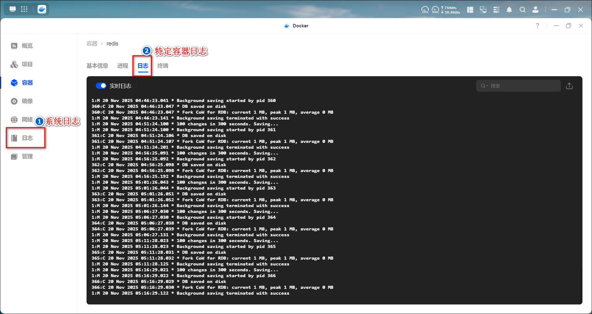
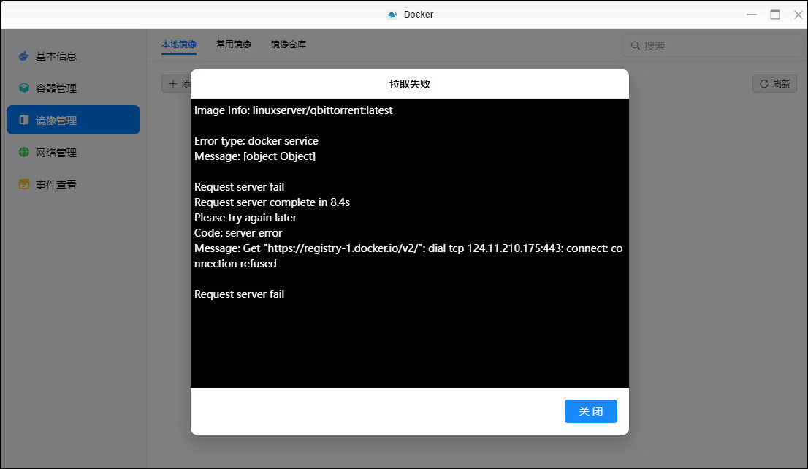
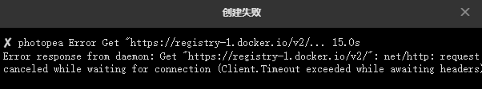
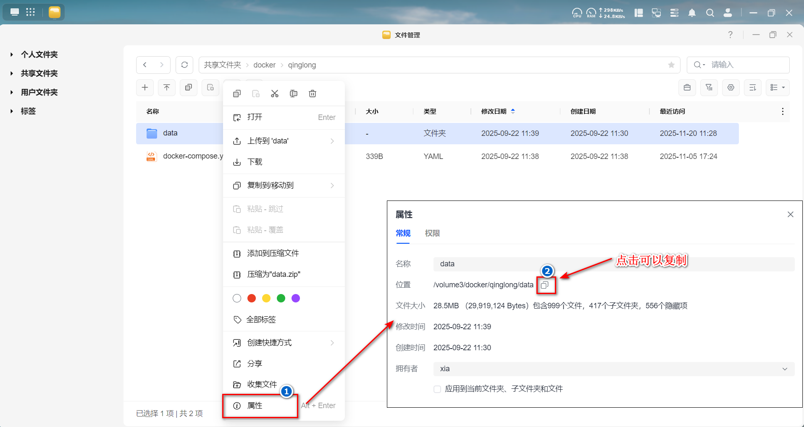

docker部署过程中经常会遇到这样那样的错误，遇到错误不要怕，首先去查看日志找到报错原因。

日志一般有两个地方：主菜单下的系统日志和容器下的日志。



我们查看过程中可以关注下error，warnning这些词汇，如果看了后也不知道怎么解决，再带上日志去寻求帮助，不要笼统的来一句部署失败了怎么办。


## 端口相关

如果我们在部署容器的时候，查看日志后发现如下提示：`Bind for 0.0.0.0:9091 failed: port is already allocated`错误，他的意思是9091端口已经被占用了。


端口设置一般是`[nas本地端口]:[docker容器端口]`。

其中冒号前面的nas端口可以自定义，只要未被占用就可以，占用了就会报上面的错；冒号后的docker端口是容器定义的，不用动。

因此解决这个报错就是把冒号前面的9091换成其他未被占用的端口，比如19091即可。


## 网络相关

### 镜像下载失败

错误：
如果在拉取镜像或者compose创建容器的时候，出现如下错误：`Get "https://registry-1.dockerio/v2/":...`。






原因：网络问题连接不上docker仓库。


解决方法：配置加速器或者配置代理，加速器配置方法如下
- 在Docker应用中点击【镜像】，点击【设置】按钮。
- 在镜像仓库中，选择需要加速的镜像源，点击“加速器配置”。
- 在【源加速器URL】输入框里点击一下，会有个推荐的镜像地址，点击添加按钮即可填充推荐的地址。然后点击“确定”。
  


> 加速器可以多配置几个，可以访问[境内 Docker 镜像状态监控](https://status.anye.xyz/)选择几个免费的在线的镜像加速源地址。


### 创建自定义网络失败


说明：
- 若在 Compose 项目中显式设置`network_mode: bridge`，容器会接入 Docker 内置默认 bridge 网络（名称固定为`bridge`，一般默认子网 172.17.0.0/16）；
- 若未显式设置network_mode，Compose 会自动创建名为`项目名_default`的自定义 bridge 网络，其子网从 Docker 默认地址池自动分配：
- 优先池：172.17.0.0/16 ~ 172.31.0.0/16，共 15 个 / 16 网段，按顺序分配；
- 备用池：192.168.0.0/20 ~ 192.168.240.0/20，共 16 个 / 20 网段，仅优先池耗尽后启用。


错误：
```
✘ Network simplemindmap_default  Error                                    0.0s
failed to create network simplemindmap_default: Error response from daemon: could not find an available, non-overlapping IPv4 address pool among the defaults to assign to the network
```

错误原因：
Docker 遍历默认 IPv4 地址池时，无法找到可用、不重叠的子网来创建名为「simplemindmap_default」的自定义 bridge 网络。其核心原因就是默认地址池被已创建的自定义网络耗尽。

解决方法：
1、接入默认 bridge 网络：即显式设置`network_mode: bridge`

- 优点：复用 Docker 默认 bridge 网络，无需创建新自定义网络，避开地址池耗尽问题；
- 缺点：默认 bridge 网络不支持容器名解析，容器间通信需用 IP，且所有容器共享一个网络，隔离性差；

2、删除长期未使用的自定义网络，释放已占用的网段
- 在docker-【网络】里删除不使用的网络
- 使用命令：`docker network prune -f`

3、手动指定自定义网段或者调整 Docker 默认地址池。


## 路径相关

绿联获取文件夹路径方法：
- 右键目标文件夹，选择【属性】选项。
- 在打开的属性窗口中，位置后面的就是文件夹的真实路径，可以点击复制按钮复制此路径。
  


如果我们在创建compose文件的时候提示：`volumes 参数配置错误: 不存在的 NAS 路径 (第 13 行)`。


这个就是说我们挂载的这个NAS路径不存在，可以按照刚刚获取文件夹路径的方法复制好路径，然后把冒号前面的nas路径修改为刚刚获取到的路径。

如果我们在部署容器的过程中遇到：`no such file or directory`类似的找不到文件或者文件夹错误，第一也是要去查看挂载的目录是否正确。


## 权限相关

如果我们在部署的过程遇到：`permission denied`错误，一般是说用户权限不够。

我们可以先看看设置的PGID和PUID是否拥有正确的权限。如果还不行的话可以ssh进去用chmod命令进行赋权操作。


ssh查看PGID和PUID方法:
- 显示当前用户ID：`id`
- 显示指定用户的ID：`id xia`
   