说明：

- 本教程不包会，不包熟，不保入门，不保鲜
​
- 拆机需谨慎，刷机有风险！！！拆机刷机出现问题，概不负责
​
## 前期准备

### 工具准备

1、拆机工具：螺丝刀，镊子，清灰刷子等

2、引导盘 16g以上，可以多备两个，坏了直接换

3、不想盲刷的还需准备显示器、键鼠、以及专用hdmi数据线一根，hdmi数据线如下

  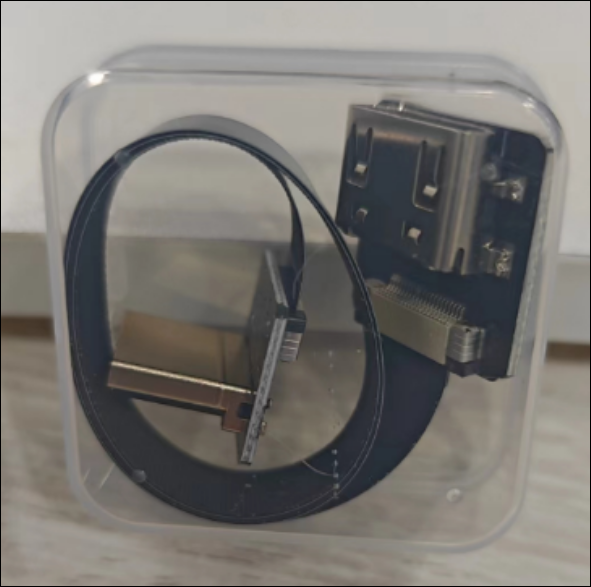
​
### 数据准备

​1、提前拷贝出绿联里的数据，对于docker来说，可以直接备份整个docker文件夹，然后打开dockercopilot新建个备份，并备份这个备份的json文件。

2、下载黑裙引导程序：<https://github.com/RROrg/rr/releases>，然后解压会得到一个img文件

3、下载镜像写入程序：<https://etcher.balena.io/#download-etcher>

4、下载黑裙系统（SA6400的DSM7.2.1）：<https://www.synology.cn/zh-cn/support/download/SA6400?version=7.2#system>

## u盘写入镜像
​
1、电脑插入空U盘，然后打开balenaEtcher烧录引导文件

2、点击从文件烧录，选择刚刚解压的img黑裙引导程序

​3、选择U盘作为目标磁盘

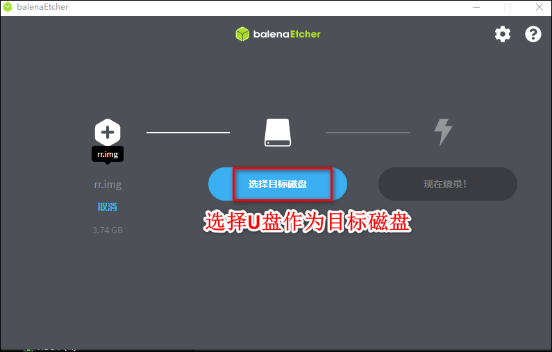

​4、点击烧录

5、烧录完成

6、​烧录完成会弹出是否将其格式化，点击取消即可。然后可以弹出U盘了。 ​

注意：如果烧录失败也没关系，重新刷就行了。

## 拆机引出hdmi线

1、用镊子或者小一字螺丝刀，插进橡皮塞边缘，撬出橡皮塞。

2、拆卸面板，可以用绳子(硬的好穿)穿过网格，拉出后盖板。

​

3、拆卸风扇螺丝和网面固定螺丝，风扇的电源线不用拔下来，记录风扇的正反面样子。

​

​

4、拆卸底面内存外盖，左边是前面，右边是有风扇的尾部（即标签贴的一头），然后从右往左推出主板，里面有滑槽，可以连风扇一起慢慢推出。推出主板的时候注意弹簧的位置，可以手动摁下去

​

​​

5、找到hdmi位置

​​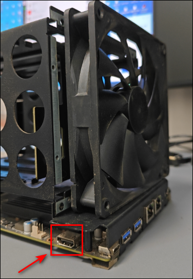

6、插上hdmi线，注意不要插的太深，免得在后面组装的时候卡住。也最好往外拉一点不要碰到主板散热片，防止散热片温度高烫坏hdmi线。

​​​

7、按照拆机反方向往里推，开始装机

​​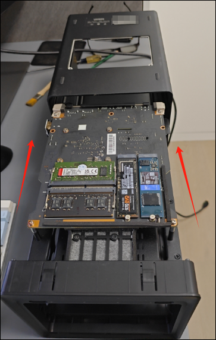

8、推的时候，注意hdmi插口位置，小心和外壳的卡槽卡住

​​​

9、箭头指的地方是hdmi线的板子和外壳圆柱导轨，这也是为什么hdmi不要插的太紧，不然会碰到卡住

​​​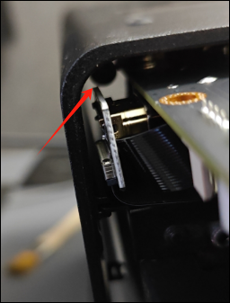

10、往里塞到一半，注意的弹簧，用手按下去，再往里推

​​​​

11、测试hdmi线是否安装正常：插上电脑的hdmi线，连接电源，开机，听到滴的声音，查看显示屏，显示UGREEN，就代表成功啦！！！

​​​​

12、再把剩下的东西怎么拆的怎么装回去，最后左下角的螺丝可以拧松一点。

​​​

13、机器全部装完后，插上至少一块机械硬盘，插上前面烧录好数据的u盘，插上键盘，hdmi线连接好显示器，插上网线。

## 刷机

1、启动电源，开机的时候一直按DEL键，直到听到'滴'的蜂鸣声，此时你已经进入了BIOS页面

​​​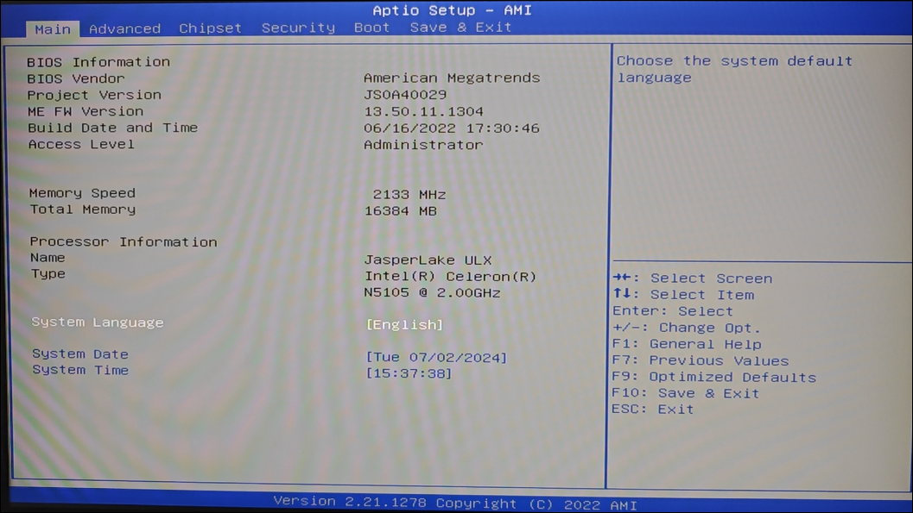

2、关闭看门狗

- 按1下键盘右箭头→进入advanced，按3下下箭头↓到watchDog Settings然后回车
​​  ​

- 进入看门狗设置项，把参数修改为disabled，如果默认是disabled则不更改，按esc退回主页面。
​​  ​
​
​3、设置U盘为第一启动项

- 按4下右箭头→，切到boot界面
​​  ​

- 按3下下箭头↓，回车，切到引导设置项，再按5下下箭头↓回车，设置第一个引导为 USB Key（U盘启动），然后把原本的第一项 Hard DiSK:UEFI OS(EHMC BITD4R) 挪到第2项。
​​  ​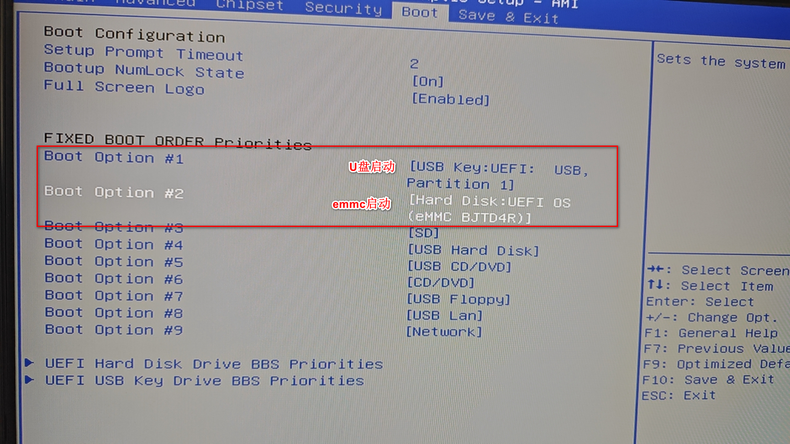   

- 按F10保存设置。这时系统会重启（仔细听系统重启的声音），此时显示屏会黑屏，狂刷代码，忽略。可以拔掉hdmi线了
​​​  ​ 

4、成功的话，等一分钟，打开路由器，可以寻找到设备名为SA6400的IP，如果之前固定了IP，那就试试固定的那个IP

## 设置引导

1、在 浏览器上 输入 http://IP:7681   (IP即是刚刚找到的路由器里的IP)到引导界面。

​ 

2、用方向键选择choose a model，回车, 下箭头选择SA6400，回车

​ 

3、选择choose a version 回车

​ 

4、选择7.2，回车

​ 

5、跳出这个画面，一直按回车键，不用动别的。等跳出菜单

​ 

6、跳出菜单画面，选择addons menu，回车。这一步的目的是加入核显驱动

​ 

7、选择add an addon 回车，然后一直按回车，直到选完所有的addon，回车

​​ 

​ 

​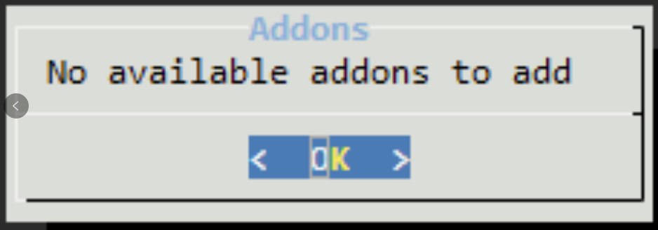 

​8、跳回菜单，选择build the loader 然后回车，等待。

​ 

​​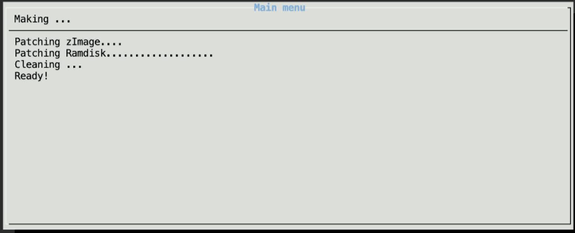 

9、自动跳回菜单，选择boot the loader，回车

​ 

10、引导程序已完成，可以使用他提供的地址（http://192.168.5.167:5000） 登录

​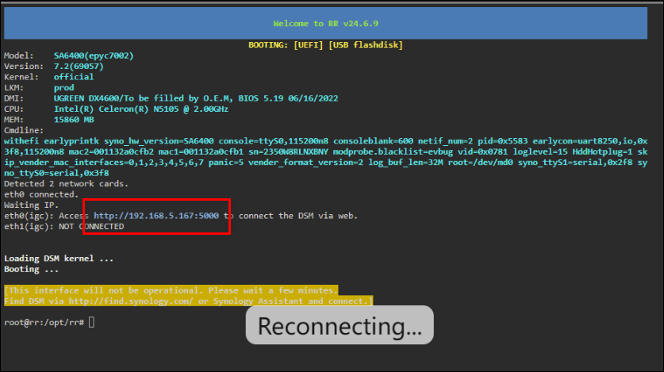 

## 安装系统

1、等待一会，浏览器输入上面提供的地址 http://192.168.5.167:5000 登录

​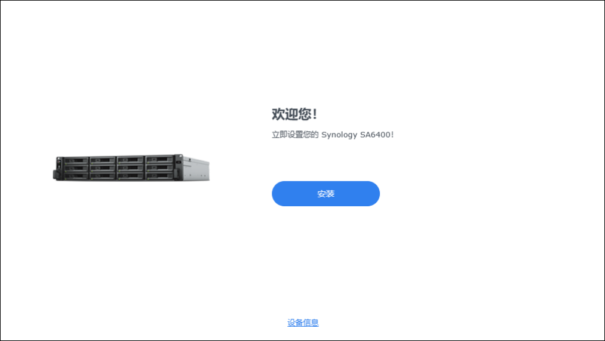 

2、手动指定文件

​ 

3、这会删除数据，没问题就打勾继续

​ 

​4、输入型号：SA6400

​ 

​5、安装中

​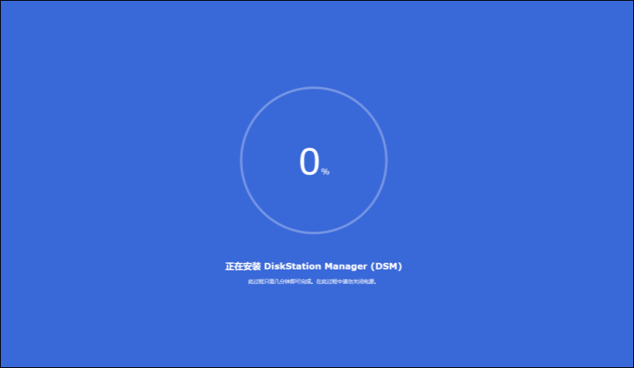 

​6、重新启动

​ 

7、等个几分钟后安装内置的套件，如果很久没变化可以尝试刷新网页或者重新登录网址

​ 

​8、安装完成，点击开始

​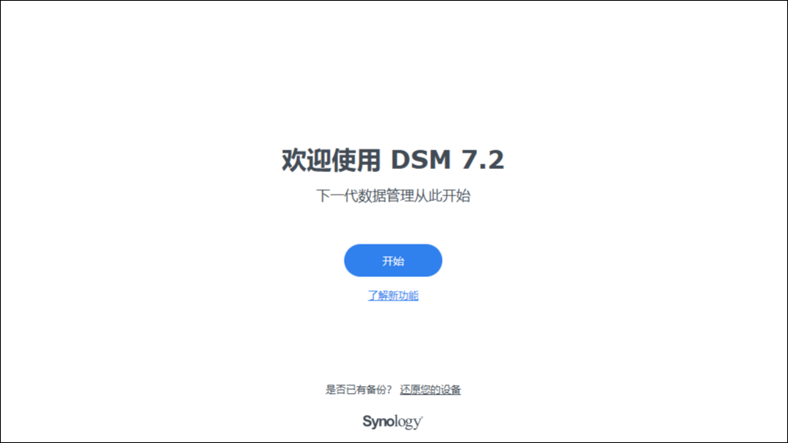 

9、设置绿群机器名，管理员账号密码，选项不打勾

​ 

​10、设置更新选项为手动安装

​ 

11、跳过创建账号

​ 

12、不共享数据，点击提交

​ 

​13、两个套件可以以后再安装

​

​14、放弃保护账号

​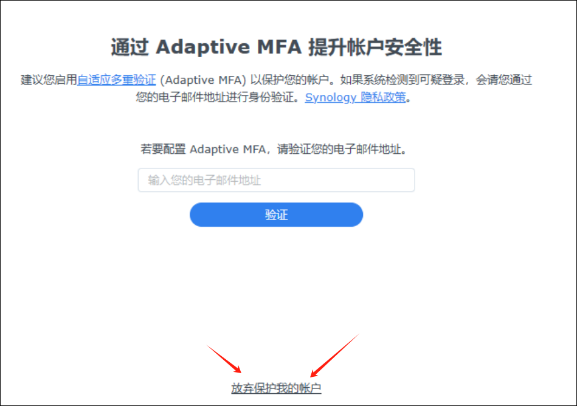 

15、跳过硬盘检查

​ 

16、文件系统选建议的Btrfs格式

​ 

​17、不配置加密

​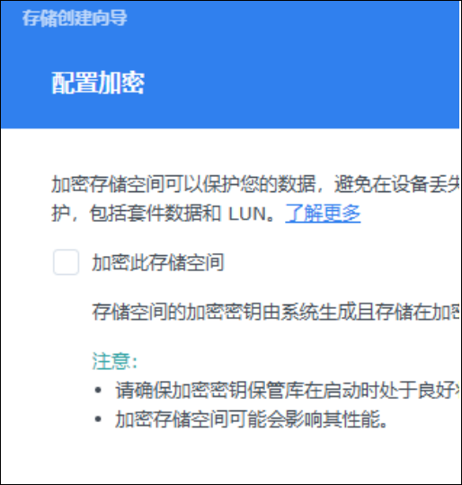 

18、再次检查

​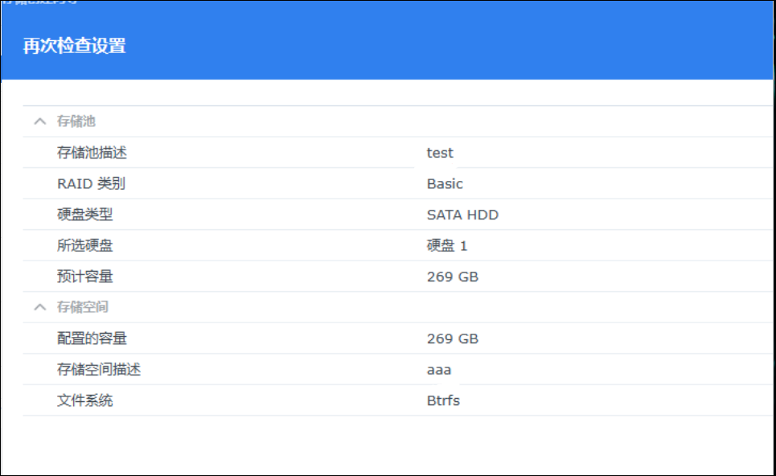 

19、进入系统，你看到的就是界面啦！！！

​ 