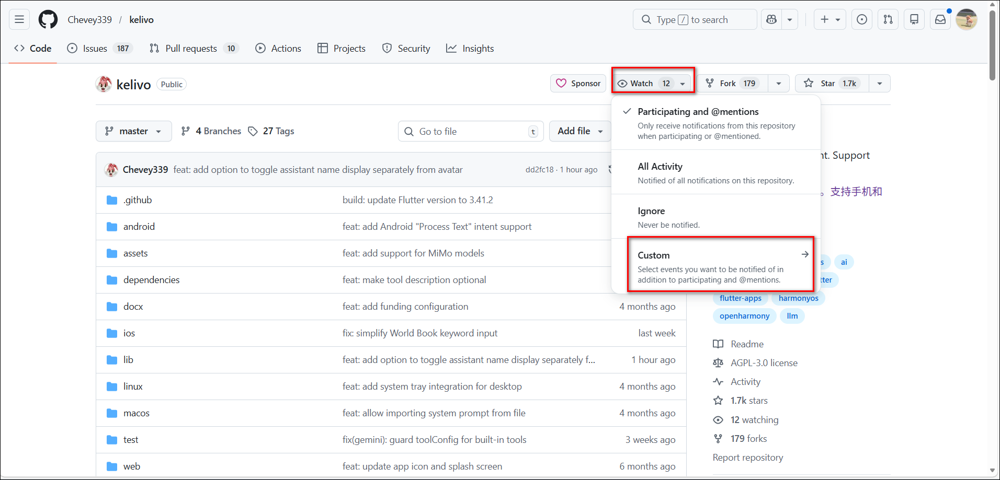
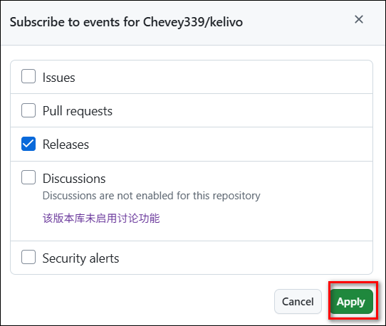
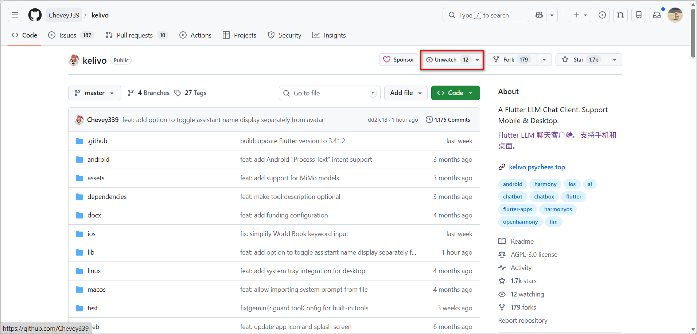
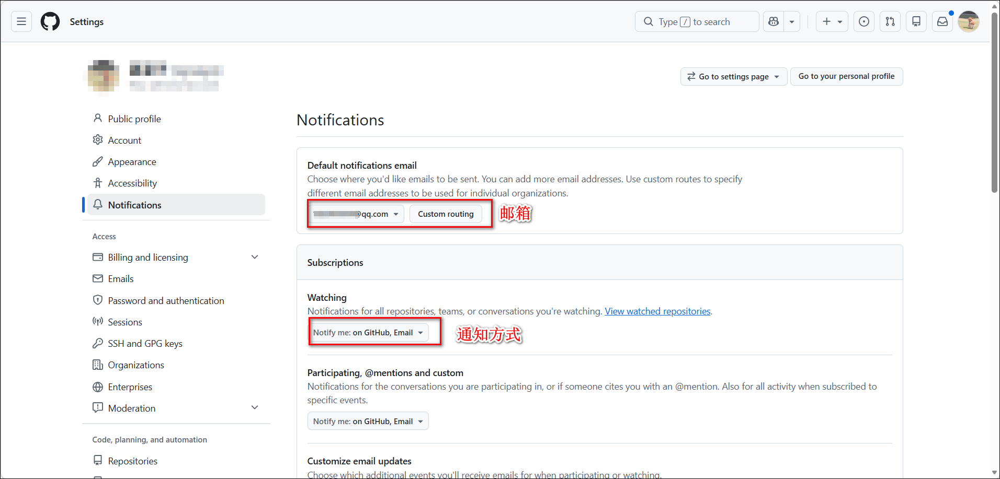

有时候我们会安装一些 GitHub 上的开源应用。如果应用内部没有内置更新提醒功能，就可能不知道项目什么时候发布了新版本。

其实可以通过 GitHub 的 Watch 功能来订阅项目更新，从而及时获取新版本发布通知。

## 方法一：用 GitHub Watch

**操作步骤如下**：

1、打开项目并选择 Watch 订阅方式

打开对应的 GitHub 项目页面，点击右上角的 Watch 按钮，会出现四个选项，我们选择 Custom：
- Participating and @mentions：只在你参与讨论（例如评论、被 @ 提及）时接收通知。
- All Activity：订阅该仓库的所有活动通知，包括 Issues、Pull Requests、Commit、Release 等所有更新。
- Ignore：不接收任何通知。
- Custom：自定义订阅内容，可以只勾选自己关心的通知类型。

2、自定义订阅内容

因为我们只想知道是否发布了新版本，所以只勾选 Releases，然后点击 Apply 按钮提交。
- Issues：创建 Issue。
- Pull Requests：创建 Pull Request。
- Releases：发布新版本。
- Discussions：新的讨论。
- Security alerts：安全漏洞提醒。

3、确认订阅成功

提交完成后，原本的 Watch 按钮会变成 Unwatch，表示已经成功订阅该仓库的更新通知。

这样，当项目发布新的 Release 时，GitHub 就会向你发送通知，从而及时了解软件是否有新版本发布。

4、通知选项
打开 GitHub 设置：https://github.com/settings/notifications。在这里可以自定义邮箱地址和通知接收方式（站内通知/邮件提醒）。
- Default notification email：设置接收通知邮件的邮箱地址。

## 方法二：用 RSS

GitHub 每个仓库都提供 Release 的 Atom 订阅源：`https://github.com/<owner>/<repo>/releases.atom`
- owner：用户名
- repo：仓库名

然后我们可以使用工具（Follow、FreshRSS、RSSHub、Telegram RSS Bot）来订阅该源，或者使用脚本去轮询。