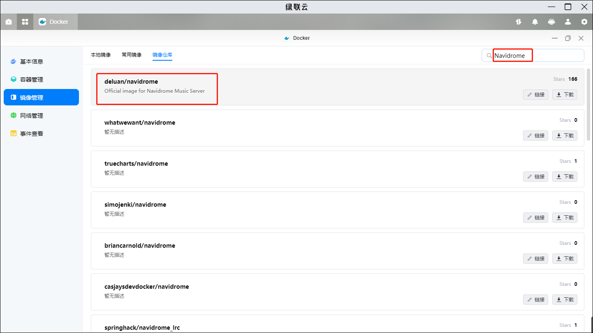
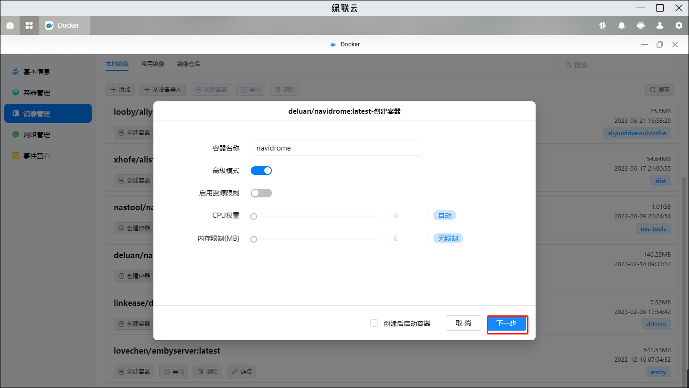
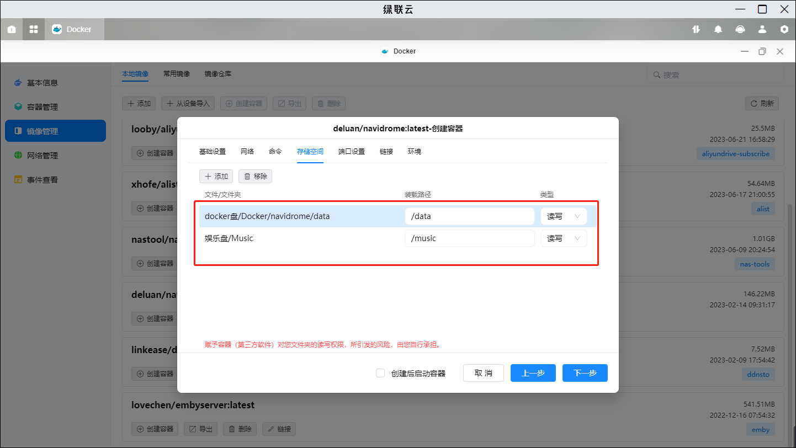
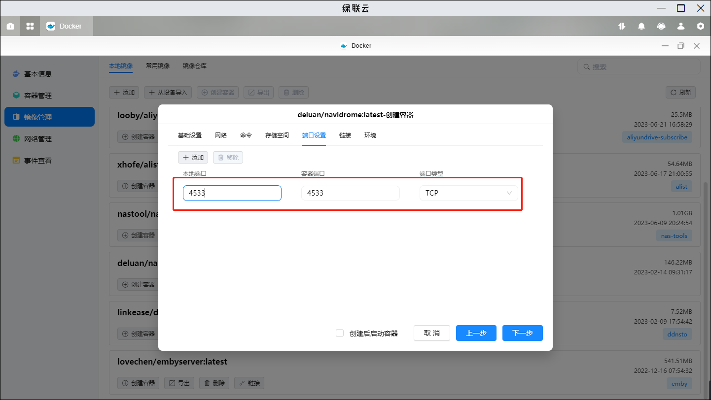
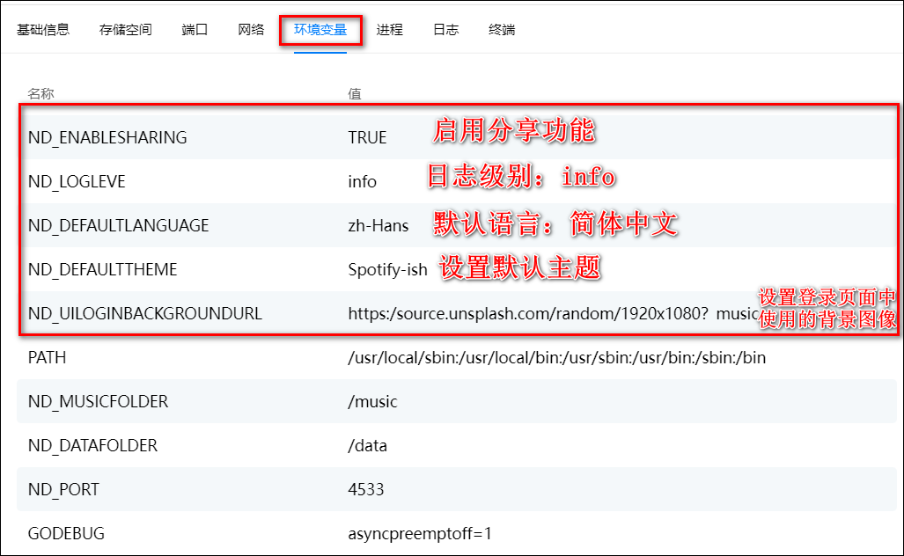
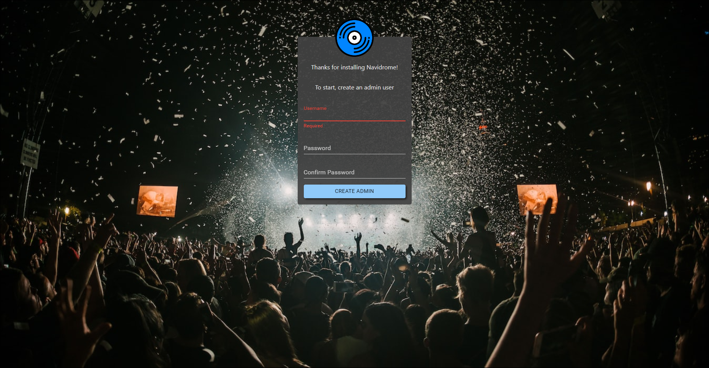
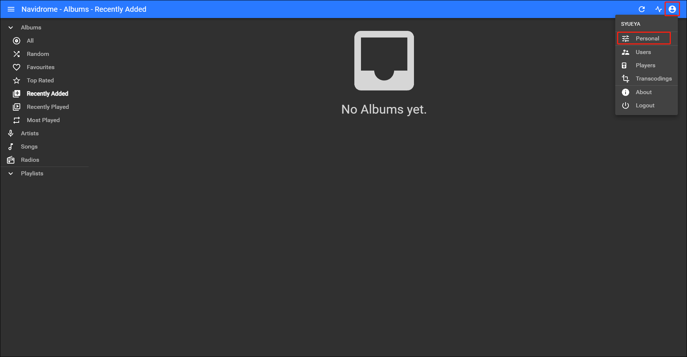
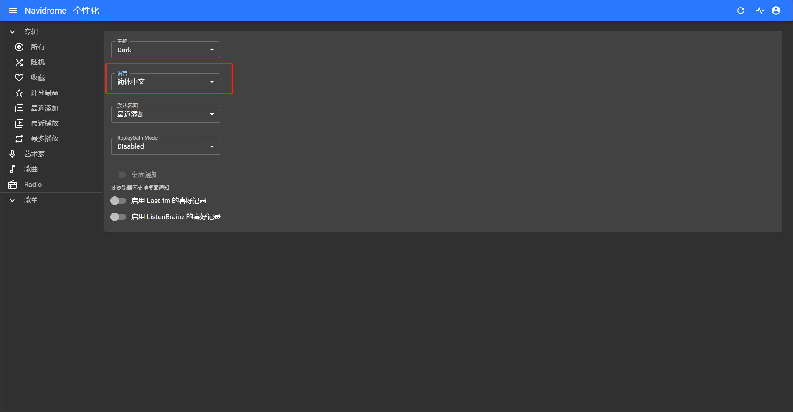
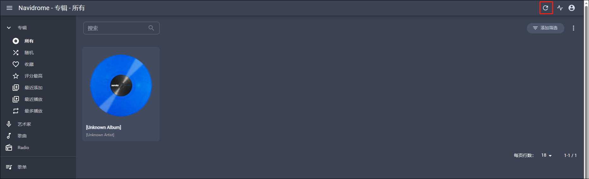

## 一、 容器部署

1、打开 Docker,在镜像仓库搜索 navidrome，下载“deluan/navidrome”最新版本镜像。

2、点击创建容器，容器名称可以默认也可以自定义，点击下一步

3、设置存储空间设置：在 docker 文件夹下新建一个“navidrome”文件夹，然后新建了一个子文件夹“data” 用来存储其数据库和缓存，并把它挂载为“/data”；然后选择你的音乐文件夹挂载为“/music”

4、端口设置：默认 4533，本地端口不冲突即可

5、环境设置

环境变量可以按自己要求来增加，比如我增加了红框中的几项：

更多的配置可以点击下方的[环境配置](/fun/navidrome/#三、环境配置)进行查看。

6、全部填写完成后可以点击下一步，然后点击完成并启动容器，至此容器部署完成。

## 二、使用

### 基础使用

1）本地浏览器访问 ip:4533 会自动跳转到账号注册页面，填入管理员用户名与密码。

2）语言设置

如果环境中没有另外设置默认语言的话，默认的为英文。

此时我们可以点击右上角小人头像-personal，然后在第二个框选择语言。

在这里可以设置语言为简体中文。

3）如果对音乐文件进行增加和删除操作，可以点击一下刷新按钮刷新音乐库。

### 2、第三方客户端

Navidrome 除了 WEB 网页界面，还支持各种第三方客户端。

- [音流](https://aqzscn.cn/archives/stream-music-versions)

## 三、环境配置

官方地址：<https://www.navidrome.org/docs/usage/configuration-options/>

### 基本配置

| 配置文件夹  |    环境变量    |                                            描述                                             |          默认值          |
| :---------: | :------------: | :-----------------------------------------------------------------------------------------: | :----------------------: |
|             | ND_CONFIGFILE  |                                  从外部配置文件中加载配置                                   |    "./navidrome.toml"    |
| MusicFolder | ND_MUSICFOLDER |                              存储音乐库的文件夹。可以是只读的                               |        "./music"         |
| DataFolder  | ND_DATAFOLDER  |                            用于存储应用程序数据 （DB） 的文件夹                             |         "./data"         |
| CacheFolder | ND_CACHEFOLDER |                          用于存储缓存数据（转码、图像等）的文件夹                           |   "<DataFolder>/cache"   |
|  LogLevel   |  ND_LOGLEVEL   |             日志级别。用于故障排除。可选的值：: error, warn, info, debug, trace             |          "info"          |
|   Address   |   ND_ADDRESS   |     服务器地址，可以是 IPv4 或 IPv6。 还支持 Unix 套接字文件的路径 `unix:/path/to/file`     | 0.0.0.0 and :: (all IPs) |
|   BaseUrl   |   ND_BASEURL   | 用于在代理后面配置 Navidrome 的基本 URL (例如：examples: /music, https://music.example.com) |          Empty           |
|    Port     |  ND_PORT HTTP  |                                Navidrome 将使用的 HTTP 端口                                 |           4533           |

### 高级配置

|          配置文件夹          |            环境变量             |                                                                                       描述                                                                                        |                     默认值                      |
| :--------------------------: | :-----------------------------: | :-------------------------------------------------------------------------------------------------------------------------------------------------------------------------------: | :---------------------------------------------: |
|      AuthRequestLimit\*      |       ND_AUTHREQUESTLIMIT       |                                                 在 AuthWindowLength 期间，单个 IP 可以处理多少个登录请求。设为 0 以禁用限制速率。                                                 |                        5                        |
|      AuthWindowLength\*      |       ND_AUTHWINDOWLENGTH       |                                                                        用于身份验证速率限制的时间窗口长度                                                                         |                      "20s"                      |
|     AutoImportPlaylists      |     ND_AUTOIMPORTPLAYLISTS      |                                                                          启用/禁用 .m3u 播放列表自动导入                                                                          |                      true                       |
|       CoverArtPriority       |       ND_COVERARTPRIORITY       |                                                     配置查找封面艺术图片的顺序，使用特殊`embedded`值从音频文件中获取嵌入图片                                                      | cover._, folder._, front.\*, embedded, external |
|      ArtistArtPriority       |      ND_ARTISTARTPRIORITY       |                                                                             配置查找艺术家图片的顺序                                                                              |       artist._, album/artist._, external        |
|       CoverJpegQuality       |       ND_COVERJPEGQUALITY       |                                                            通过设置 JPEG 质量百分比指定压缩后的封面艺术图片的质量级别                                                             |                       75                        |
|  DefaultDownsamplingFormat   |  ND_DEFAULTDOWNSAMPLINGFORMAT   |                                                               客户要求进行降采样时转码的格式（无格式时比特率最大）                                                                |                      opus                       |
|       DefaultLanguage        |       ND_DEFAULTLANGUAGE        |                设置在使用新浏览器登录时界面的默认语言。这个值必须与 resources/i18n 文件夹中文件名之一相匹配。例如，对于简体中文，它必须是 zh-Hans（区分大小写）。                 |                      "en"                       |
|         DefaultTheme         |         ND_DEFAULTTHEME         |                                                    设置在使用新浏览器登录时 UI 使用的默认主题。此值必须与 UI 中的某个选项匹配                                                     |                      Dark                       |
|    EnableArtworkPrecache     |    ND_ENABLEARTWORKPRECACHE     |                                                                         启用对新添加的音乐进行图像预缓存                                                                          |                      true                       |
|     EnableCoverAnimation     |     ND_ENABLECOVERANIMATION     |                                                               控制 UI 中的播放器是否对专辑封面进行动画效果（旋转）                                                                |                      true                       |
|       EnableDownloads        |       ND_ENABLEDOWNLOADS        |                                                             在 UI 中启用从服务器下载音乐/专辑/艺术家/播放列表的选项。                                                             |                      true                       |
|    EnableExternalServices    |    ND_ENABLEEXTERNALSERVICES    |                                                                      将其设置为 false 以完全禁用所有外部集成                                                                      |                      true                       |
|       EnableFavourites       |       ND_ENABLEFAVOURITES       |                                    在用户界面中启用对歌曲/专辑/艺术家进行‘喜爱’/'收藏'的切换功能（在 Subsonic 客户端中被映射为‘星星’/'标记'）                                     |                      true                       |
|        EnableGravatar        |        ND_ENABLEGRAVATAR        |                                            使用[Gravatar](https://gravatar.com/)图像作为用户个人资料图片。需要填写用户的电子邮件地址。                                            |                      false                      |
|      EnableLogRedacting      |      ND_ENABLELOGREDACTING      |                                                                  是否应该在日志中隐藏敏感信息（例如令牌和密码）                                                                   |                      true                       |
|   EnableMediaFileCoverArt    |   ND_ENABLEMEDIAFILECOVERART    |                                                                如果设置为 false，当请求歌曲封面时，将返回专辑封面                                                                 |                      true                       |
|       EnableReplayGain       |       ND_ENABLEREPLAYGAIN       |                                                                           在 UI 中启用 ReplayGain 选项                                                                            |                      true                       |
|        EnableSharing         |        ND_ENABLESHARING         |                                                                                   启用分享功能                                                                                    |                      false                      |
|       EnableStarRating       |       ND_ENABLESTARRATING       |                                                                               在 UI 中启用 5 星评级                                                                               |                      true                       |
|   EnableTranscodingConfig    |   ND_ENABLETRANSCODINGCONFIG    |                                                                               在 UI 中启用转码配置                                                                                |                      false                      |
|      EnableUserEditing       |      ND_ENABLEUSEREDITING       |                                                                     使普通用户能够编辑其详细信息并更改其密码                                                                      |                      true                       |
|          FFmpegPath          |          ND_FFMPEGPATH          | ffmpeg 可执行文件的路径。如果 Navidrome 无法找到 ffmpeg 可执行文件，或者您想使用特定版本时，可以通过设置这个路径来使 Navidrome 将使用这个路径下的 ffmpeg 版本进行音频处理和解码。 |             Empty (在 PATH 中搜索)              |
|         GATrackingID         |         ND_GATRACKINGID         |                                                     将基本信息发送到您自己的 Google Analytics 账户。必须符合格式 UA-XXXXXXXX                                                      |                  Empty (禁用)                   |
|       IgnoredArticles        |       ND_IGNOREDARTICLES        |                                                                     在对艺术家进行排序/索引时被忽略的冠词列表                                                                     |      "The El La Los Las Le Les Os As O A"       |
|        ImageCacheSize        |        ND_IMAGECACHESIZE        |                                                                图像（艺术作品）缓存的大小，将其设置为'0'以禁用缓存                                                                |                     "100MB"                     |
|       Jukebox.Enabled        |       ND_JUKEBOX_ENABLED        |                                                                     启用点唱机模式（在服务器硬件上播放音频）                                                                      |                      false                      |
|       Jukebox.Devices        |       ND_JUKEBOX_DEVICES        |                                                                              点唱机可使用的设备列表                                                                               |                Empty (自动检测)                 |
|       Jukebox.Default        |       ND_JUKEBOX_DEFAULT        |                                                              如果有多个 Jukebox.Devices 条目，则用于点唱机模式的设备                                                              |                Empty (自动检测)                 |
|        LastFM.ApiKey         |        ND_LASTFM_APIKEY         |                                                                                  Last.fm ApiKey                                                                                   |           Navidrome 项目的共享 ApiKey           |
|        LastFM.Enabled        |        ND_LASTFM_ENABLED        |                                                                      将此设置为 false 完全禁用 Last.fm 集成                                                                       |                      true                       |
|       LastFM.Language        |       ND_LASTFM_LANGUAGE        |                                                                   用于从 Last.fm 获取传记信息的语言的两个字母码                                                                   |                      "en"                       |
|        LastFM.Secret         |        ND_LASTFM_SECRET         |                                                                               Last.fm Shared Secret                                                                               |            Navidrome 项目的共享密钥             |
|     ListenBrainz.BaseURL     |     ND_LISTENBRAINZ_BASEURL     |                                             将此设置为覆盖默认的 ListenBrainz 基本 URL（在像 Maloja 这样的自托管解决方案中非常有用）                                              |         https://api.listenbrainz.org/1/         |
|     ListenBrainz.Enabled     |     ND_LISTENBRAINZ_ENABLED     |                                                                    将此设置为 false 完全禁用 ListenBrainz 集成                                                                    |                      true                       |
|     MaxSidebarPlaylists      |     ND_MAXSIDEBARPLAYLISTS      |                                                设置 UI 侧边栏显示的播放列表的最大数量。请注意，非常大的数量可能会导致 UI 性能问题                                                 |                       100                       |
|           MPVPath            |           ND_MPVPATH            |                                                                       mpv 可执行文件的路径，用于点唱机模式                                                                        |             Empty (在 PATH 中搜索)              |
|    PasswordEncryptionKey     |    ND_PASSWORDENCRYPTIONKEY     |                                                                         用于在数据库中加密密码的密码短语                                                                          |                        -                        |
|        PlaylistsPath         |        ND_PLAYLISTSPATH         |                  在哪里搜索并导入播放列表。可以是文件夹/通配符（用冒号“：”分隔，Windows 上用分号“;”分隔）。路径必须相对于“MusicFolder”（存放你音乐文件的根目录）                  |   ".:**/**" ("MusicFolder"目录及其所有子目录)   |
|      Prometheus.Enabled      |      ND_PROMETHEUS_ENABLED      |                                                                        使用 Prometheus 指标启用额外的端点                                                                         |                      false                      |
|    Prometheus.MetricsPath    |    ND_PROMETHEUS_METRICSPATH    |                                                             自定义的 Prometheus 指标路径，用于阻止未经授权的指标请求                                                              |                   "/metrics"                    |
|    RecentlyAddedByModTime    |    ND_RECENTLYADDEDBYMODTIME    |                                                            按“最近添加”排序时使用音乐文件的修改时间，否则使用导入时间                                                             |                      false                      |
|    ReverseProxyUserHeader    |    ND_REVERSEPROXYUSERHEADER    |                                                                    来自经过身份验证的代理的 HTTP 头包含用户名                                                                     |                  "Remote-User"                  |
|    ReverseProxyWhitelist     |    ND_REVERSEPROXYWHITELIST     |                       当使用反向代理认证时，可以配置一个逗号分隔的 IP CIDR 列表，用于指定允许使用该认证机制的客户端 IP 地址范围, 如果为空则表示拒绝所有请求                       |                      Empty                      |
|      Scanner.Extractor       |      ND_SCANNER_EXTRACTOR       |                                                                     元数据提取器的实现方式: taglib or ffmpeg                                                                      |                    "taglib"                     |
|   Scanner.GenreSeparators    |   ND_SCANNER_GENRESEPARATORS    |                                                                           用于拆分流派标签的分隔符列表                                                                            |                      ";/,"                      |
|  Scanner.GroupAlbumReleases  |  ND_SCANNER_GROUPALBUMRELEASES  | 当设置为"true"时，会将具有相同艺术家（Artist）和专辑标题（Album Title）的音频文件分组为同一张专辑; 当设置为"false"时，会将重新发行（具有不同的发行日期）的音频文件视为独立的专辑  |                      false                      |
|         ScanSchedule         |         ND_SCANSCHEDULE         |                                                                    使用“cron”语法配置定期扫描,设置为"0"禁用它                                                                     |                   "@every 1m"                   |
|       SearchFullString       |       ND_SEARCHFULLSTRING       |                                 匹配查询字符串在可搜索字段中的任意位置，而不仅限于单词边界。 适用于单词之间没有使用空格分隔的语言，例如中文或日语                                 |                      false                      |
|        SessionTimeout        |        ND_SESSIONTIMEOUT        |                                                                             Web UI 的空闲会话超时时间                                                                             |                      "24h"                      |
|          Spotify.ID          |          ND_SPOTIFY_ID          |                                                               如果需要获取艺术家图片的话必须提供 Spotify 客户端 ID                                                                |                      Empty                      |
|        Spotify.Secret        |        ND_SPOTIFY_SECRET        |                                                               如果需要获取艺术家图片的话必须提供 Spotify 客户端密钥                                                               |                      Empty                      |
| SubsonicArtistParticipations | ND_SUBSONICARTISTPARTICIPATIONS |                                                 当请求艺术家的专辑时，可以选择包含艺术家参与的专辑，例如 Various Artists 合集专辑                                                 |                      false                      |
|           TLSCert            |           ND_TLSCERT            |                                                                                TLS 证书文件的路径                                                                                 |               Empty (disable TLS)               |
|            TLSKey            |            ND_TLSKEY            |                                                                                TLS 密钥文件的路径                                                                                 |               Empty (disable TLS)               |
|     TranscodingCacheSize     |     ND_TRANSCODINGCACHESIZE     |                                                                        转码缓存的大小，设置为"0"将禁用缓存                                                                        |                     "100MB"                     |
|     UILoginBackgroundUrl     |     ND_UILOGINBACKGROUNDURL     |                                                                           更改登录页面中使用的背景图像                                                                            |           Unsplash.com 的随机音乐图像           |
|       UIWelcomeMessage       |       ND_UIWELCOMEMESSAGE       |                                                                              在登录屏幕添加欢迎消息                                                                               |                      Empty                      |

> **注意**
>
> - 对于时间持续长度，可以使用数字和一个单位后缀来指定，例如“24h”, “30s” 或 “1h10m”。有效时间单位为“s”、“m”、“h”。
> - 对于大小，可以使用数字和可选的单位后缀来指定，例如“1GB”或“150 MiB”。默认单位为字节。注意： “1KB” == “1000”， “1KiB” == “1024”。
