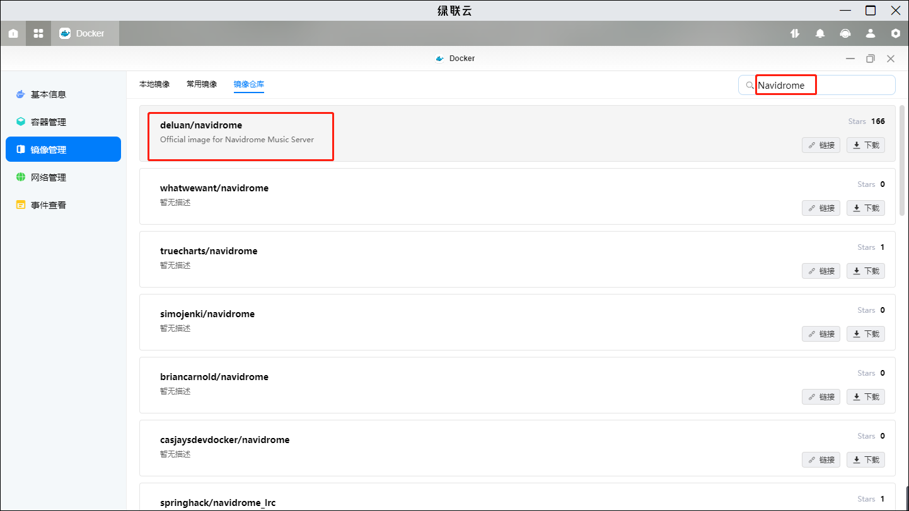
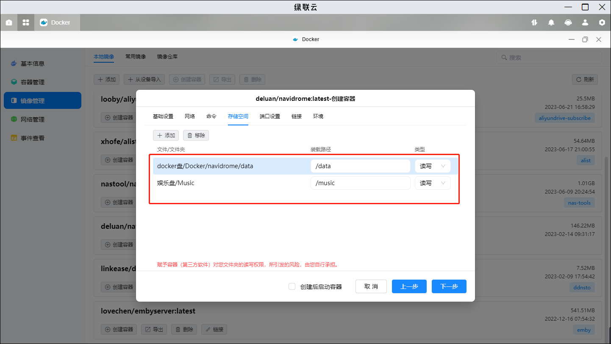
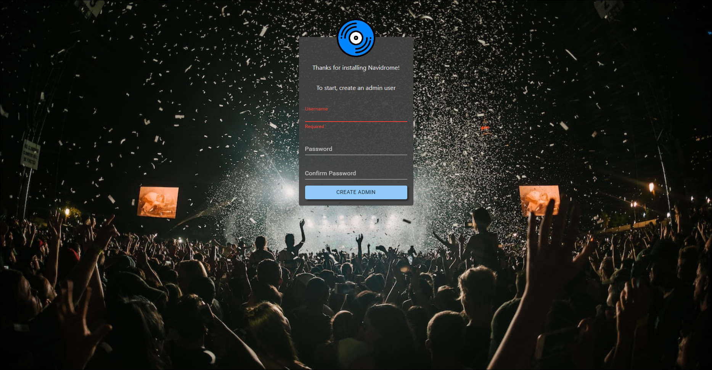
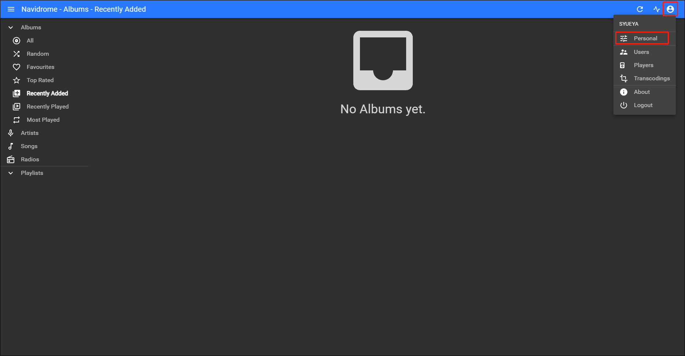
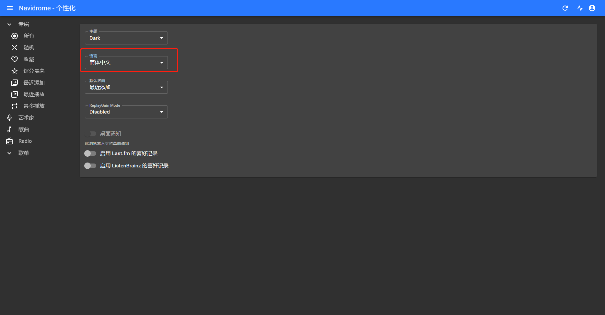

## 一、 容器部署

1、打开Docker,在镜像仓库搜索navidrome，下载“deluan/navidrome”最新版本镜像。

2、点击创建容器，容器名称可以默认也可以自定义，点击下一步

3、设置存储空间设置：在docker文件夹下新建一个“navidrome”文件夹，然后新建了一个子文件夹“data” 用来存储其数据库和缓存，并把它挂载为“/data”；然后选择你的音乐文件夹挂载为“/music”

4、端口设置：默认4533，本地端口不冲突即可

5、环境设置

环境变量可以按自己要求来增加，比如我增加了红框中的几项：

更多的配置可以点击下方的[环境配置](/fun/navidrome/#三、环境配置)进行查看。

6、全部填写完成后可以点击下一步，然后点击完成并启动容器，至此容器部署完成。

## 二、使用

### 基础使用

1）本地浏览器访问ip:4533会自动跳转到账号注册页面，填入管理员用户名与密码。

2）语言设置

如果环境中没有另外设置默认语言的话，默认的为英文。

此时我们可以点击右上角小人头像-personal，然后在第二个框选择语言。

在这里可以设置语言为简体中文。

3）如果对音乐文件进行增加和删除操作，可以点击一下刷新按钮刷新音乐库。

### 2、第三方客户端

Navidrome 除了WEB网页界面，还支持各种第三方客户端。

- [音流](https://aqzscn.cn/archives/stream-music-versions)

## 三、环境配置

官方地址：<https://www.navidrome.org/docs/usage/configuration-options/>

### 基本配置

|    配置文件夹     | 	环境变量  |     	描述	        | 默认值 | 
|:------------:|:---------------:|:------------:|:--------------:|
|              |ND_CONFIGFILE|     从外部配置文件中加载配置	|"./navidrome.toml"|
| MusicFolder	 |ND_MUSICFOLDER|  存储音乐库的文件夹。可以是只读的    |"./music"|
| DataFolder	  |ND_DATAFOLDER	|   用于存储应用程序数据 （DB） 的文件夹  |	"./data"|
| CacheFolder	 |ND_CACHEFOLDER|   用于存储缓存数据（转码、图像等）的文件夹 |"<DataFolder>/cache"|
|  LogLevel	   |ND_LOGLEVEL	|  日志级别。用于故障排除。可选的值：: error, warn, info, debug, trace |"info"|
|   Address	   |ND_ADDRESS	|  服务器地址，可以是 IPv4 或 IPv6。 还支持Unix套接字文件的路径 `unix:/path/to/file`  |0.0.0.0 and :: (all IPs)|
|   BaseUrl	   |ND_BASEURL	| 用于在代理后面配置 Navidrome 的基本 URL (例如：examples: /music, https://music.example.com)	 |Empty|
|     Port     |	ND_PORT	HTTP|  Navidrome 将使用的 HTTP 端口    |	4533|

### 高级配置 

|    配置文件夹     | 	环境变量  |     	描述	        | 默认值 | 
|:------------:|:---------------:|:------------:|:--------------:|
|AuthRequestLimit*	|ND_AUTHREQUESTLIMIT|在AuthWindowLength期间，单个IP可以处理多少个登录请求。设为0以禁用限制速率。|5|
|AuthWindowLength*	|ND_AUTHWINDOWLENGTH|用于身份验证速率限制的时间窗口长度|"20s"|
|AutoImportPlaylists	|ND_AUTOIMPORTPLAYLISTS|启用/禁用 .m3u 播放列表自动导入|	true|
|CoverArtPriority	|ND_COVERARTPRIORITY|	配置查找封面艺术图片的顺序，使用特殊`embedded`值从音频文件中获取嵌入图片|	cover.*, folder.*, front.*, embedded, external|
|ArtistArtPriority	|ND_ARTISTARTPRIORITY	|配置查找艺术家图片的顺序|	artist.*, album/artist.*, external|
|CoverJpegQuality|ND_COVERJPEGQUALITY|通过设置JPEG质量百分比指定压缩后的封面艺术图片的质量级别|75|
|DefaultDownsamplingFormat|ND_DEFAULTDOWNSAMPLINGFORMAT|客户要求进行降采样时转码的格式（无格式时比特率最大）	|opus|
|DefaultLanguage|ND_DEFAULTLANGUAGE|设置在使用新浏览器登录时界面的默认语言。这个值必须与 resources/i18n 文件夹中文件名之一相匹配。例如，对于简体中文，它必须是 zh-Hans（区分大小写）。|"en"|
|DefaultTheme|ND_DEFAULTTHEME|设置在使用新浏览器登录时UI使用的默认主题。此值必须与UI中的某个选项匹配|Dark|
|EnableArtworkPrecache	|ND_ENABLEARTWORKPRECACHE|启用对新添加的音乐进行图像预缓存|	true|
|EnableCoverAnimation|	ND_ENABLECOVERANIMATION|控制 UI 中的播放器是否对专辑封面进行动画效果（旋转）|true|
|EnableDownloads|ND_ENABLEDOWNLOADS|在 UI 中启用从服务器下载音乐/专辑/艺术家/播放列表的选项。|true|
|EnableExternalServices|ND_ENABLEEXTERNALSERVICES|将其设置为 false 以完全禁用所有外部集成|true|
|EnableFavourites|ND_ENABLEFAVOURITES|在用户界面中启用对歌曲/专辑/艺术家进行‘喜爱’/'收藏'的切换功能（在Subsonic客户端中被映射为‘星星’/'标记'）|true|
|EnableGravatar|ND_ENABLEGRAVATAR|使用[Gravatar](https://gravatar.com/)图像作为用户个人资料图片。需要填写用户的电子邮件地址。|false|
|EnableLogRedacting|ND_ENABLELOGREDACTING|是否应该在日志中隐藏敏感信息（例如令牌和密码）|true|
|EnableMediaFileCoverArt|ND_ENABLEMEDIAFILECOVERART|如果设置为false，当请求歌曲封面时，将返回专辑封面|true|
|EnableReplayGain	|ND_ENABLEREPLAYGAIN|在UI中启用ReplayGain选项|true|
|EnableSharing	|ND_ENABLESHARING|	启用分享功能	|false|
|EnableStarRating	|ND_ENABLESTARRATING|在 UI 中启用 5 星评级|	true|
|EnableTranscodingConfig|ND_ENABLETRANSCODINGCONFIG|在 UI 中启用转码配置|false|
|EnableUserEditing	|ND_ENABLEUSEREDITING|使普通用户能够编辑其详细信息并更改其密码|true|
|FFmpegPath|ND_FFMPEGPATH|ffmpeg可执行文件的路径。如果Navidrome无法找到ffmpeg可执行文件，或者您想使用特定版本时，可以通过设置这个路径来使Navidrome将使用这个路径下的ffmpeg版本进行音频处理和解码。|Empty (在PATH中搜索)|
|GATrackingID	|ND_GATRACKINGID|将基本信息发送到您自己的Google Analytics账户。必须符合格式UA-XXXXXXXX|	Empty (禁用)|
|IgnoredArticles	|ND_IGNOREDARTICLES	|在对艺术家进行排序/索引时被忽略的冠词列表|"The El La Los Las Le Les Os As O A"|
|ImageCacheSize	|ND_IMAGECACHESIZE|图像（艺术作品）缓存的大小，将其设置为'0'以禁用缓存|"100MB"|
|Jukebox.Enabled|ND_JUKEBOX_ENABLED|启用点唱机模式（在服务器硬件上播放音频）|	false|
|Jukebox.Devices	|ND_JUKEBOX_DEVICES|点唱机可使用的设备列表|Empty (自动检测)|
|Jukebox.Default	|ND_JUKEBOX_DEFAULT	|如果有多个Jukebox.Devices条目，则用于点唱机模式的设备|Empty (自动检测)|
|LastFM.ApiKey	|ND_LASTFM_APIKEY|	Last.fm ApiKey|	Navidrome 项目的共享 ApiKey|
|LastFM.Enabled|ND_LASTFM_ENABLED	|将此设置为 false 完全禁用 Last.fm 集成|true|
|LastFM.Language|	ND_LASTFM_LANGUAGE|	用于从Last.fm获取传记信息的语言的两个字母码|"en"|
|LastFM.Secret	|ND_LASTFM_SECRET|	Last.fm Shared Secret	|Navidrome 项目的共享密钥|
|ListenBrainz.BaseURL|	ND_LISTENBRAINZ_BASEURL|将此设置为覆盖默认的ListenBrainz基本URL（在像Maloja这样的自托管解决方案中非常有用）|https://api.listenbrainz.org/1/|
|ListenBrainz.Enabled|ND_LISTENBRAINZ_ENABLED|将此设置为false完全禁用ListenBrainz集成|true|
|MaxSidebarPlaylists|	ND_MAXSIDEBARPLAYLISTS	|设置UI侧边栏显示的播放列表的最大数量。请注意，非常大的数量可能会导致UI性能问题|100|
|MPVPath	|ND_MPVPATH	|mpv可执行文件的路径，用于点唱机模式|Empty (在 PATH 中搜索)|
|PasswordEncryptionKey|ND_PASSWORDENCRYPTIONKEY|用于在数据库中加密密码的密码短语|	-|
|PlaylistsPath|	ND_PLAYLISTSPATH	|在哪里搜索并导入播放列表。可以是文件夹/通配符（用冒号“：”分隔，Windows上用分号“;”分隔）。路径必须相对于“MusicFolder”（存放你音乐文件的根目录）|".:**/**" ("MusicFolder"目录及其所有子目录)|
|Prometheus.Enabled	|ND_PROMETHEUS_ENABLED	|使用Prometheus指标启用额外的端点|false|
|Prometheus.MetricsPath|	ND_PROMETHEUS_METRICSPATH|自定义的Prometheus指标路径，用于阻止未经授权的指标请求|	"/metrics"|
|RecentlyAddedByModTime|ND_RECENTLYADDEDBYMODTIME|按“最近添加”排序时使用音乐文件的修改时间，否则使用导入时间|false|
|ReverseProxyUserHeader|ND_REVERSEPROXYUSERHEADER|来自经过身份验证的代理的HTTP头包含用户名|"Remote-User"|
|ReverseProxyWhitelist|ND_REVERSEPROXYWHITELIST|当使用反向代理认证时，可以配置一个逗号分隔的IP CIDR列表，用于指定允许使用该认证机制的客户端IP地址范围, 如果为空则表示拒绝所有请求|Empty|
|Scanner.Extractor|ND_SCANNER_EXTRACTOR|元数据提取器的实现方式: taglib or ffmpeg|"taglib"|
|Scanner.GenreSeparators|ND_SCANNER_GENRESEPARATORS|用于拆分流派标签的分隔符列表|	";/,"|
|Scanner.GroupAlbumReleases	|ND_SCANNER_GROUPALBUMRELEASES	|当设置为"true"时，会将具有相同艺术家（Artist）和专辑标题（Album Title）的音频文件分组为同一张专辑; 当设置为"false"时，会将重新发行（具有不同的发行日期）的音频文件视为独立的专辑	|false|
|ScanSchedule|ND_SCANSCHEDULE|使用“cron”语法配置定期扫描,设置为"0"禁用它 |"@every 1m"|
|SearchFullString	|ND_SEARCHFULLSTRING	|匹配查询字符串在可搜索字段中的任意位置，而不仅限于单词边界。 适用于单词之间没有使用空格分隔的语言，例如中文或日语|false|
|SessionTimeout	|ND_SESSIONTIMEOUT|	Web UI的空闲会话超时时间|	"24h"|
|Spotify.ID|ND_SPOTIFY_ID|如果需要获取艺术家图片的话必须提供Spotify客户端ID|Empty|
|Spotify.Secret|ND_SPOTIFY_SECRET|如果需要获取艺术家图片的话必须提供Spotify客户端密钥|Empty|
|SubsonicArtistParticipations	|ND_SUBSONICARTISTPARTICIPATIONS|当请求艺术家的专辑时，可以选择包含艺术家参与的专辑，例如Various Artists合集专辑|false|
|TLSCert	|ND_TLSCERT	|TLS 证书文件的路径	|Empty (disable TLS)|
|TLSKey	|ND_TLSKEY	|TLS 密钥文件的路径	|Empty (disable TLS)|
|TranscodingCacheSize	|ND_TRANSCODINGCACHESIZE|转码缓存的大小，设置为"0"将禁用缓存|"100MB"|
|UILoginBackgroundUrl	|ND_UILOGINBACKGROUNDURL|更改登录页面中使用的背景图像|Unsplash.com 的随机音乐图像|
|UIWelcomeMessage|	ND_UIWELCOMEMESSAGE|在登录屏幕添加欢迎消息 |Empty|

> **注意**
>- 对于时间持续长度，可以使用数字和一个单位后缀来指定，例如“24h”, “30s” 或 “1h10m”。有效时间单位为“s”、“m”、“h”。
>- 对于大小，可以使用数字和可选的单位后缀来指定，例如“1GB”或“150 MiB”。默认单位为字节。注意： “1KB” == “1000”， “1KiB” == “1024”。

