github 官网：<https://github.com/xhongc/music-tag-web>

## 一、 安装

打开 Docker,在镜像仓库搜索 music_tag_web，下载“xhongc/music_tag_web”最新版本镜像。

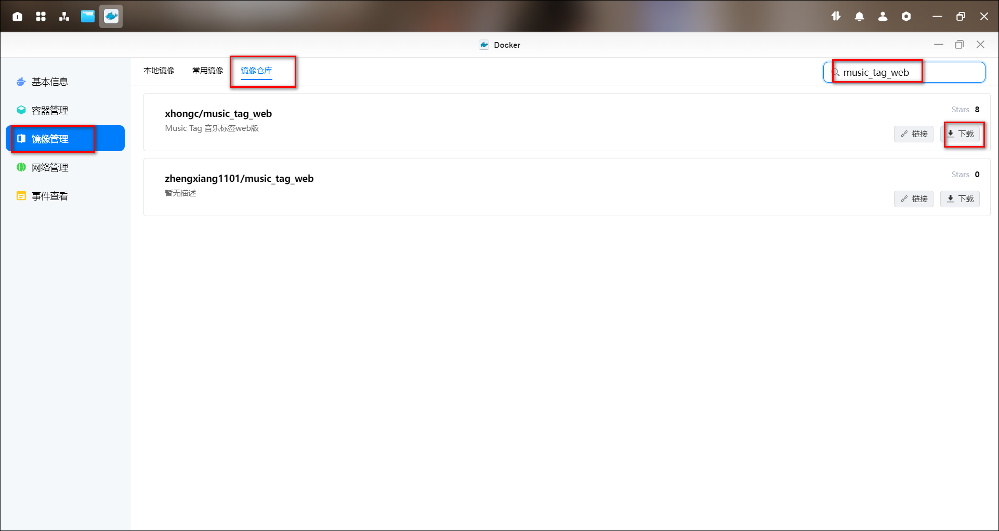

2、点击创建容器，容器名称可以默认也可以自定义，勾选创建后启动容器，点击下一步

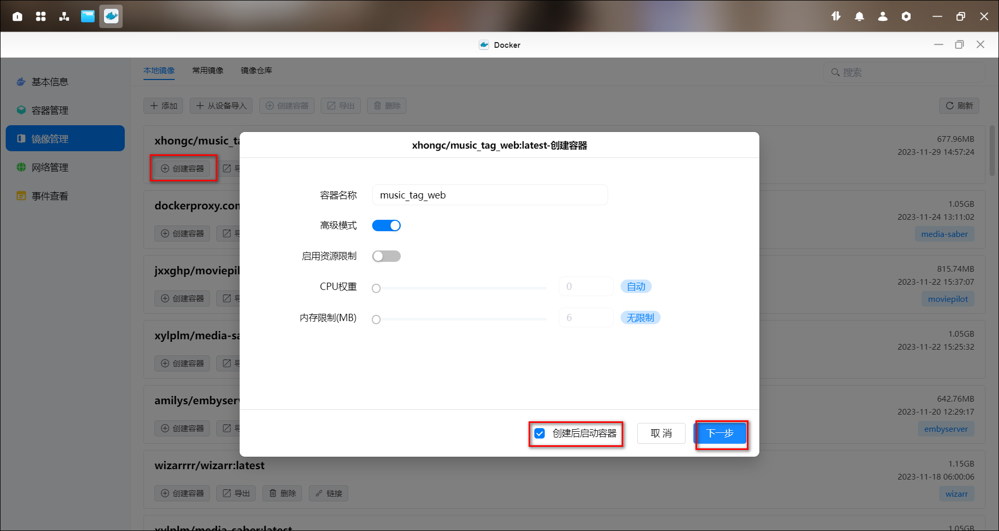

3、基础设置设置重启策略

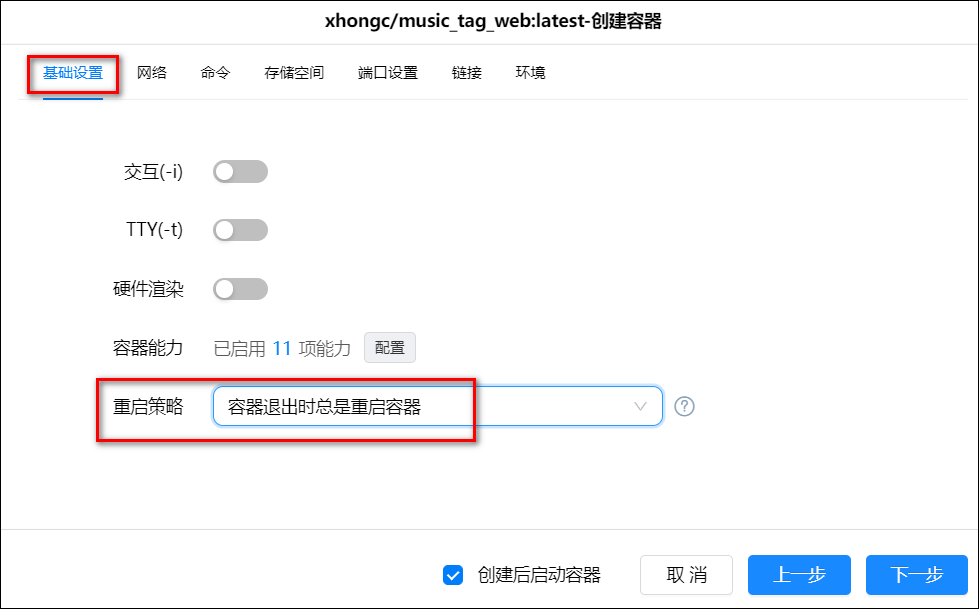

4、设置存储空间设置：在 docker 文件夹下新建一个“music_tag_web”文件夹，然后新建了一个子文件夹“config” 用来存储其数据库和缓存，并把它挂载为“/app/data”；然后选择你的音乐文件夹挂载为“/app/media”

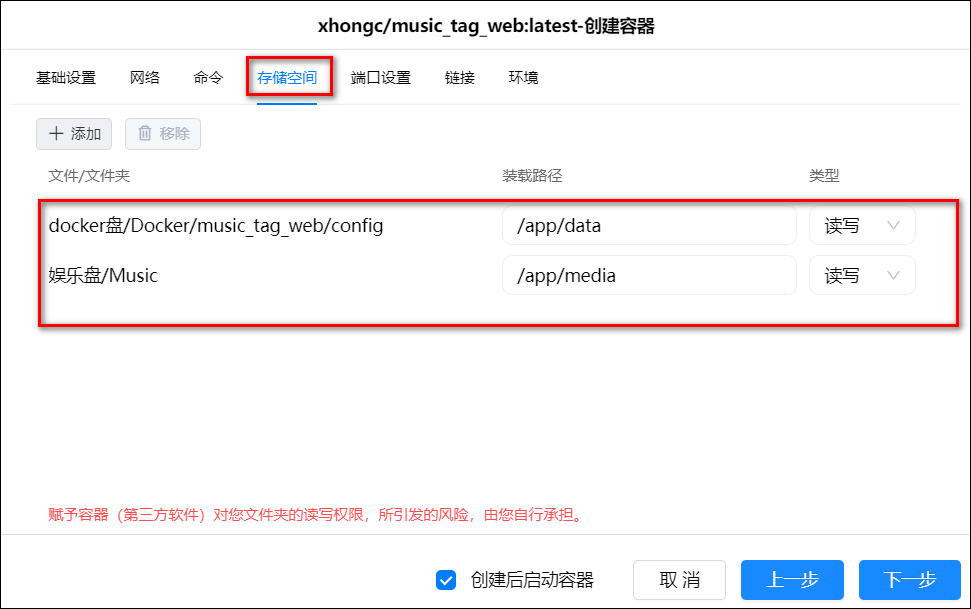

5、端口设置：默认 8001，本地端口不冲突即可

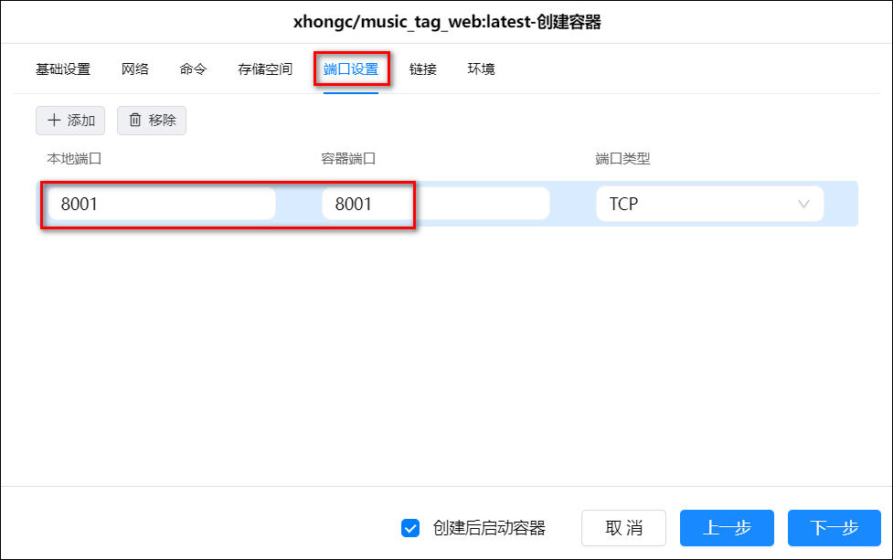

6、全部填写完成后可以点击下一步，然后点击完成并启动容器，至此容器部署完成。

## 初始化

1、浏览器输入 IP:端口/admin（端口号后加/admin）进入登录页，默认的账号和密码都是 admin。

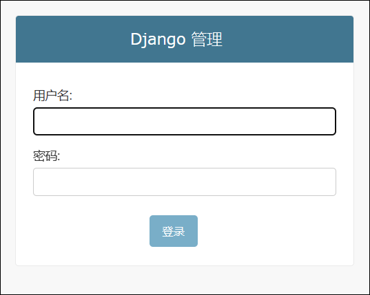

2、进入页面，点击用户

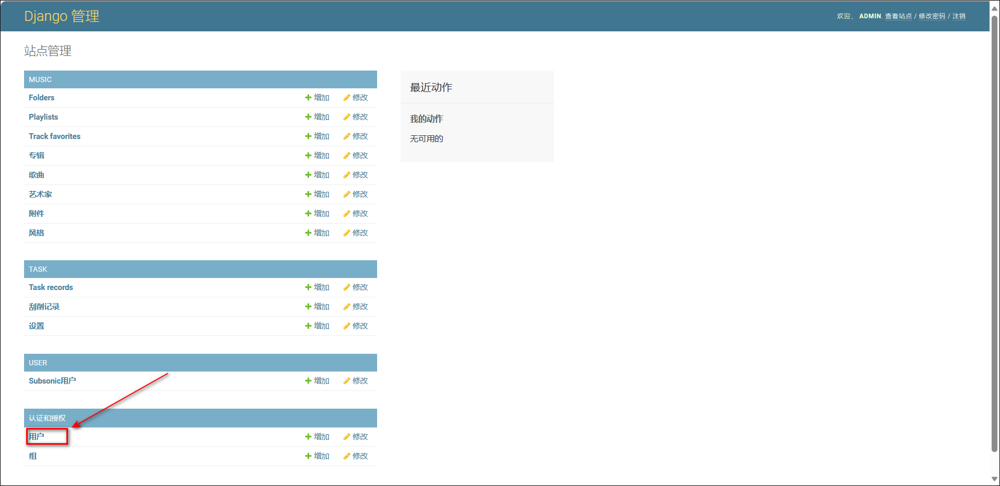

3、点击用户名称 admin

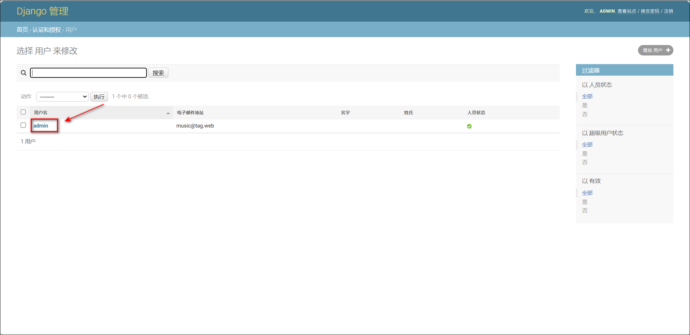

4、在这里可以修改用户名（自动生效）和一些个人信息，修改完个人信息后记得点下面的保存按钮。还可以点击表单进入修改密码。

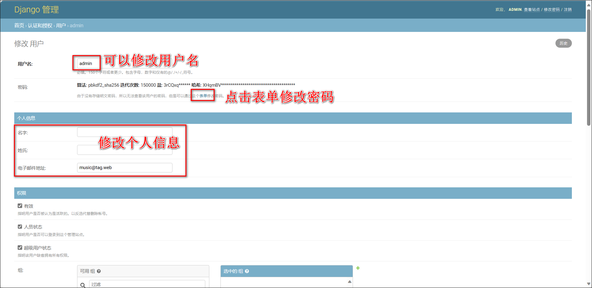

5、修改密码。

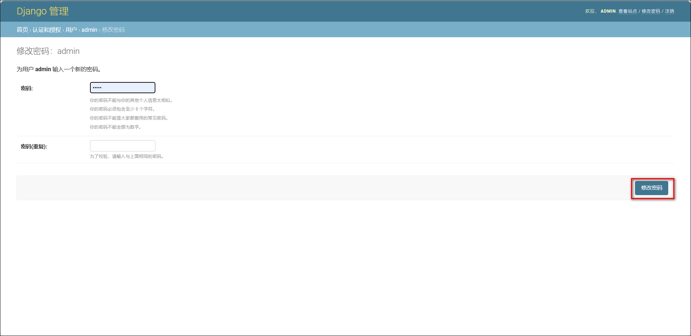

## 使用

1、浏览器输入 IP:端口，进入登录页，输入刚刚修改好的账号密码登录。

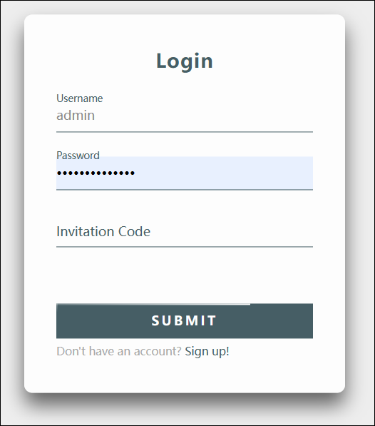

2、右边的 media 下是我们之前挂载的音乐文件夹里的内容。

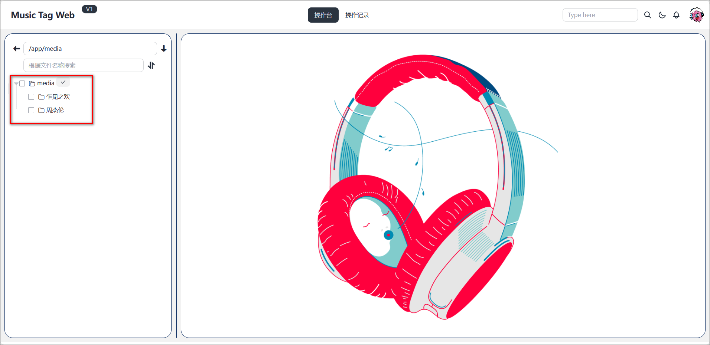

3、可以对音乐文件的标签单独/批量修改。

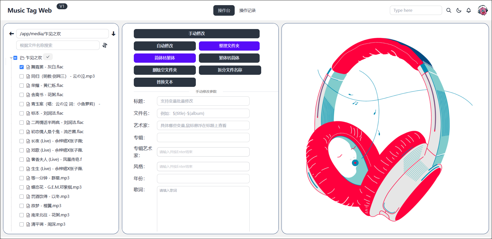

4、点击音乐名称可以看到该音乐文件的一些标签内容。

