## 安装

### 1、下载镜像

在绿联云镜像仓库里搜索 audiobookshelf，下载最新版本。

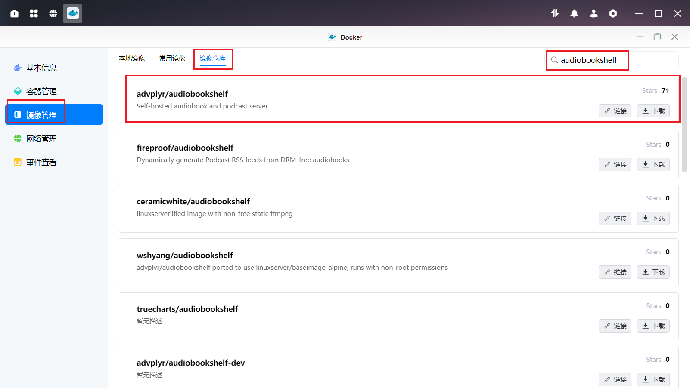

### 2、创建容器

1、点击创建容器，名称可自定义，资源限制也可自定义设置，勾选创建后启动容器。

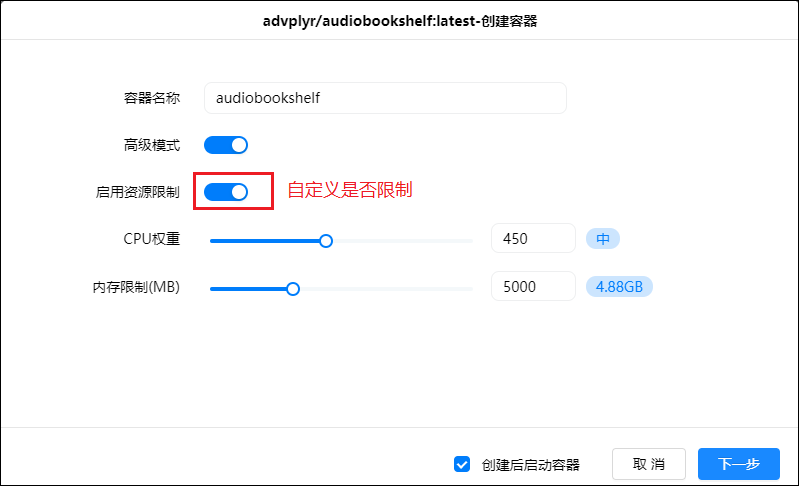

2、基础设置选择倒数第二项。

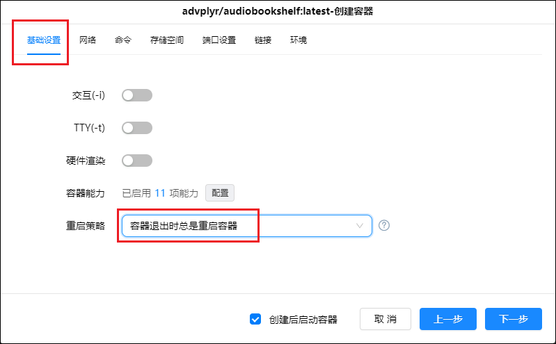

3、存储空间如下配置

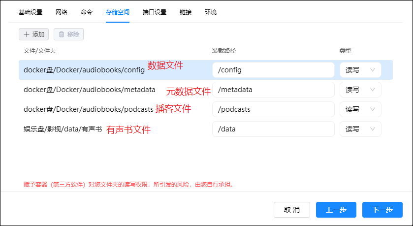

4、本地端口随意，只要不冲突即可。

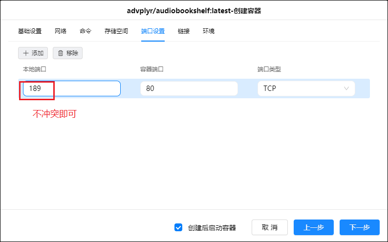

## 使用

1、浏览器输入 IP:189 即可进入注册界面，创建账号密码点击 submit。

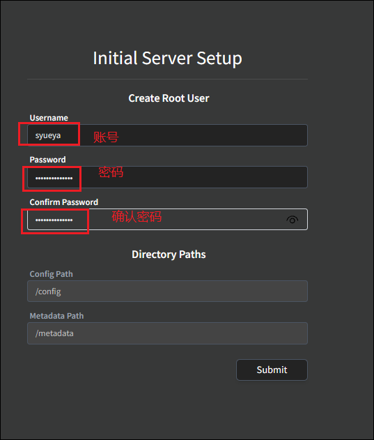

2、输入账号密码进行登录。

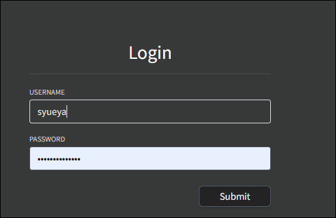

3、点击右上角的设置，选择简体中文

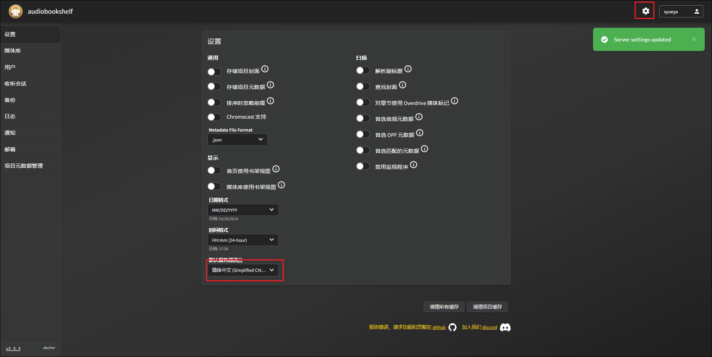

4、新建媒体库

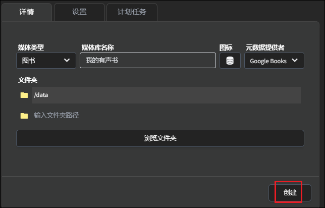

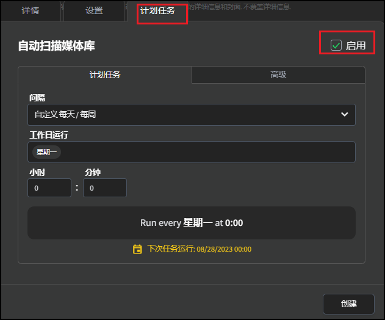

5、扫描媒体库

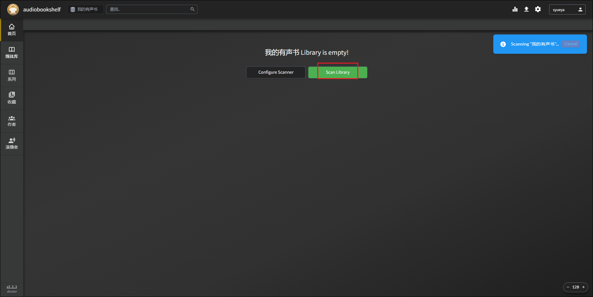

6、完成扫描

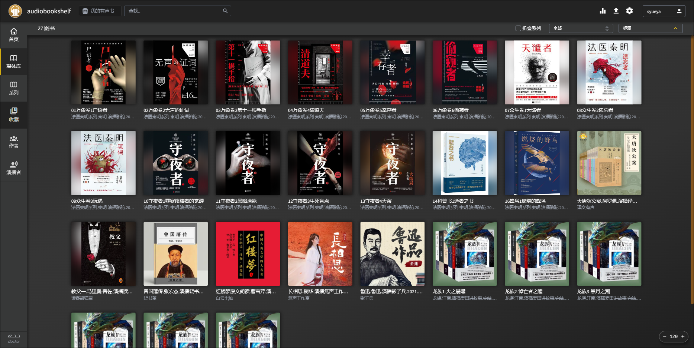
