TaleBook 是基于 Calibre Web 二次开发的开源书库工具。

## 一、容器部署

首先我们先在 Docker 管理器中打开镜像管理，在镜像仓库中搜索 talebook/talebook，选择 latest 版本下载。

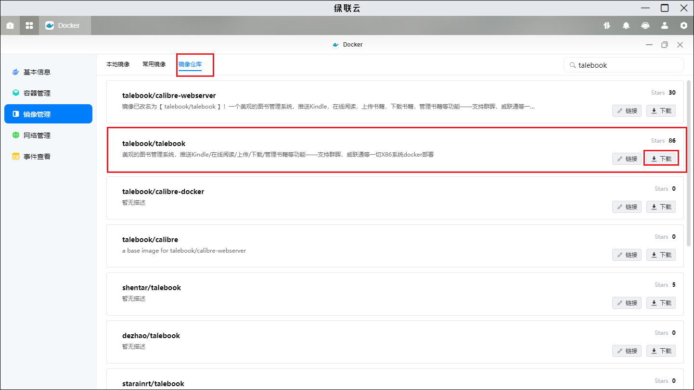

然后我们在本地镜像中找到刚刚下载的镜像，点击创建容器。

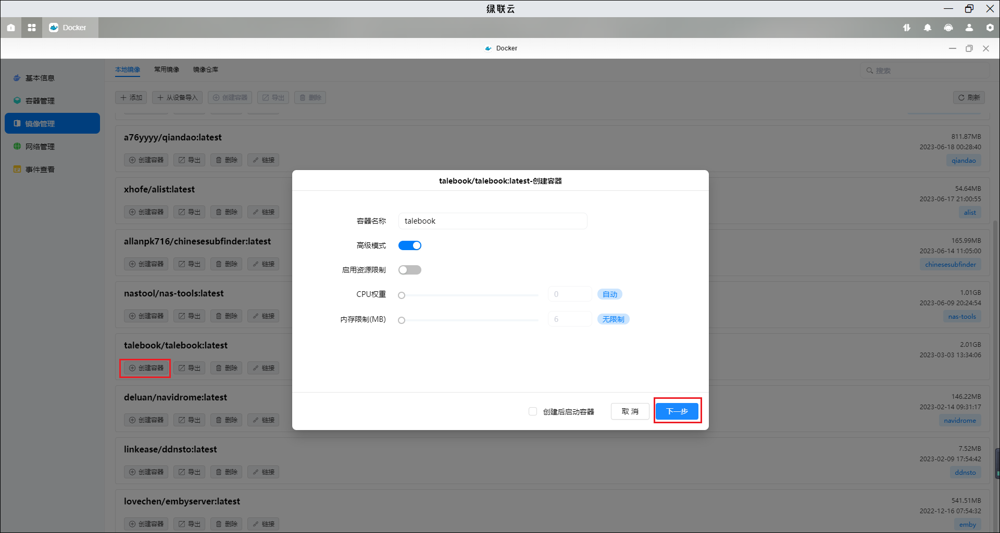

在基础设置中，将重启策略设置为容器退出时总是重启容器。

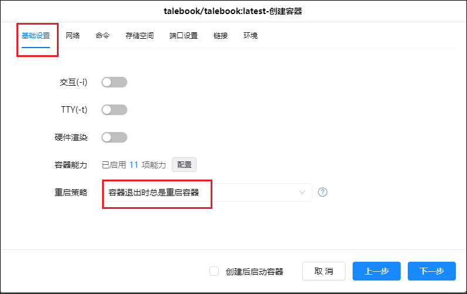

在存储空间设置中，我们为容器的挂载目录/data 在 docker 盘新建一个目录 Talebook，并配置类型为读写。

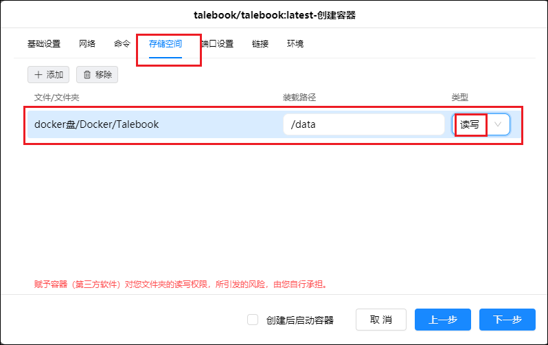

然后在端口设置中，我们设置一个好记的端口，后续访问的时候会用到。

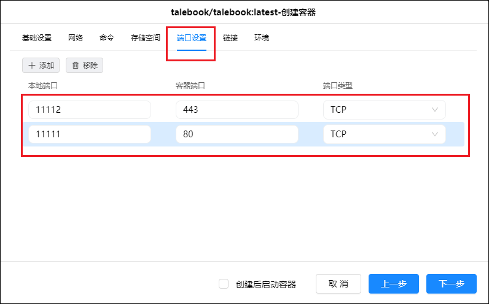

点下一步，再点完成，容器就创建好了。

## 二、配置

1、我们可以通过`IP:端口`或者`域名:端口`来访问我们刚搭好的容器进入注册页面。

- 如果我们不希望其他人能随便访问的话，那么我们最好开启私人图书馆模式。
- 网站标题、用户名、密码、邮箱、访问码等，都按自己的喜好填好即可。
- 完成填写后，点击完成设置。

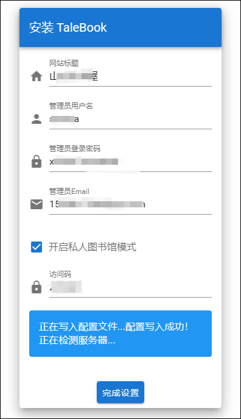

2、这里输入刚刚设置的访问码。

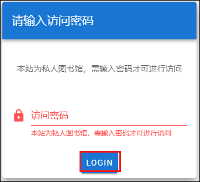

3、下面就会进入到首页。 然后我们在右上角点击“请登录”按钮，并通过刚才配置的账号密码登陆。

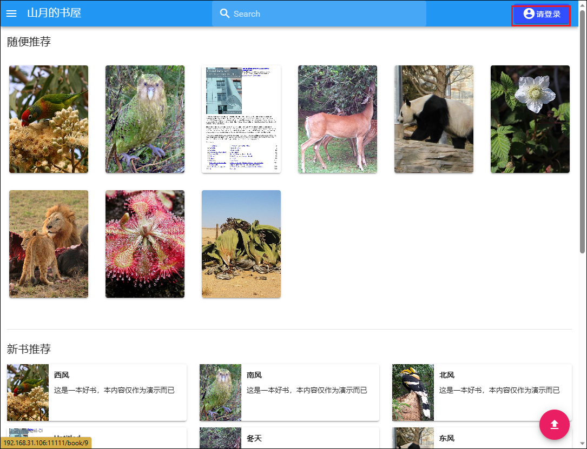

4、然后我们在刚刚新建的 Talebook 目录下找到 books/imports 目录，并将我们的书籍上传到此目录。 上传成功后，在网页左上角找到管理，并进入导入图书页面，点击扫描书籍。

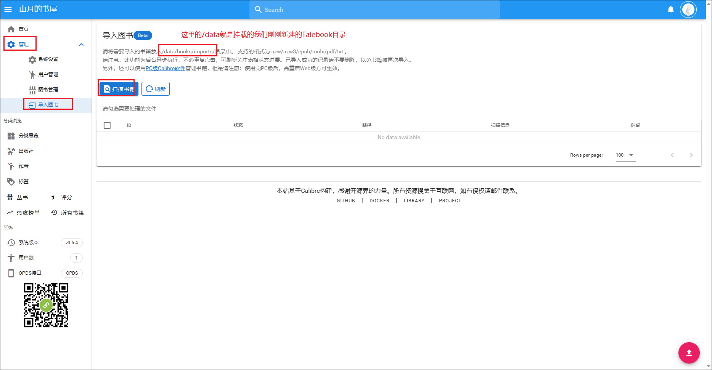

5、在扫描出来的书籍列表中，勾选我们想要导入的书籍，并点击“导入书籍”按钮。

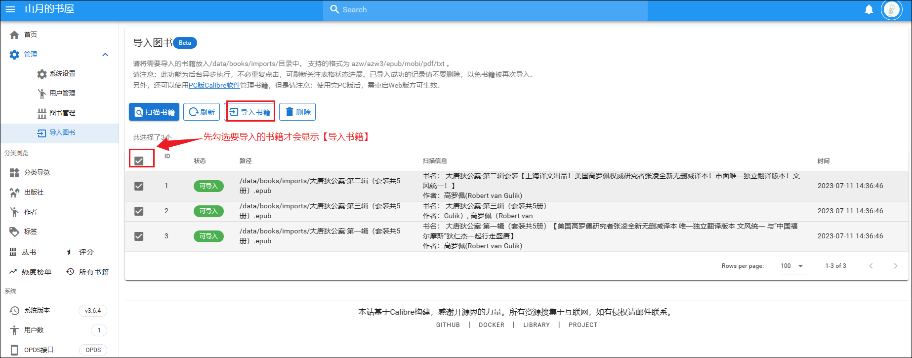

6、等待一段时间后，我们就可以看到我们选择的书籍被成功导入了。

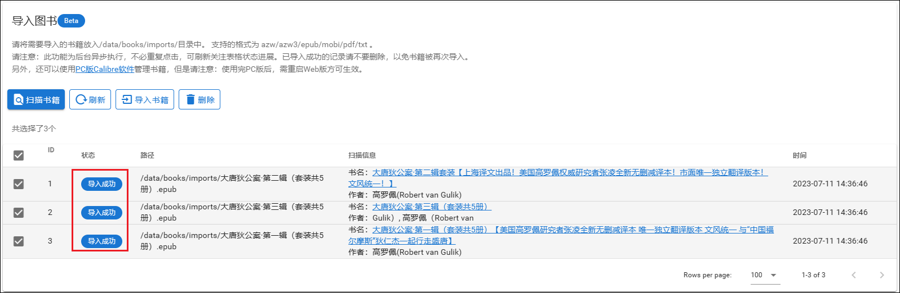

7、回到首页，随便点击一本书进来，我们可以直接在线阅读，或者将它推送到邮箱、Kindle。如果书籍信息有错误的话，我们还可以手动更新书籍相关信息，并从互联网更新书籍信息。

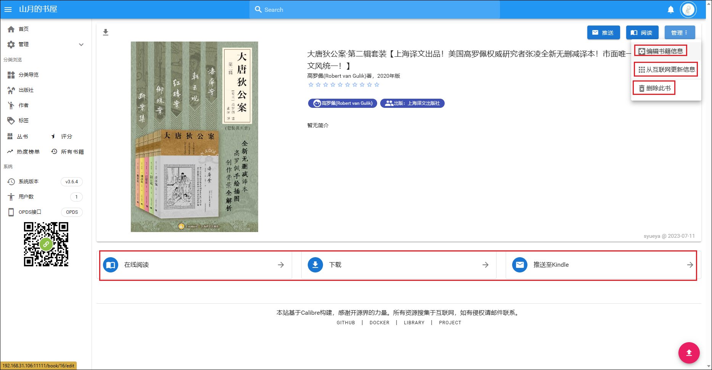
