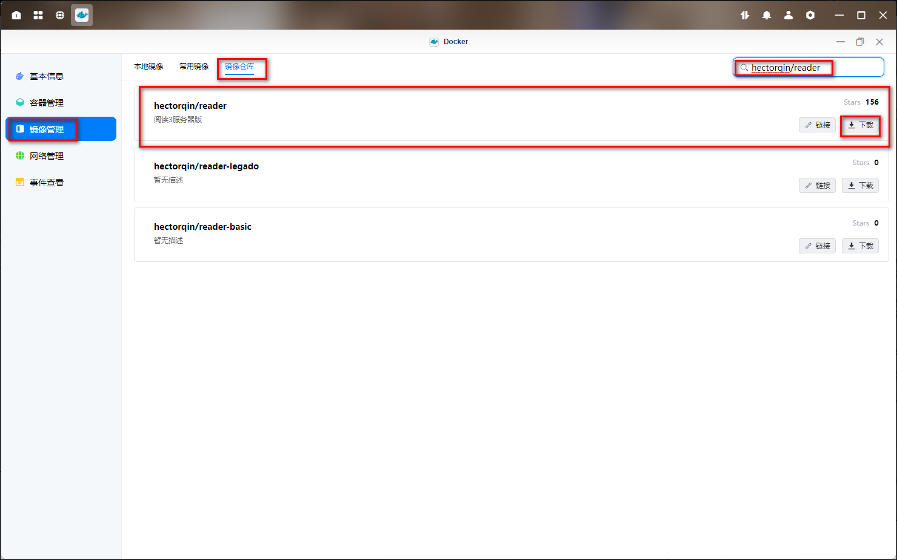
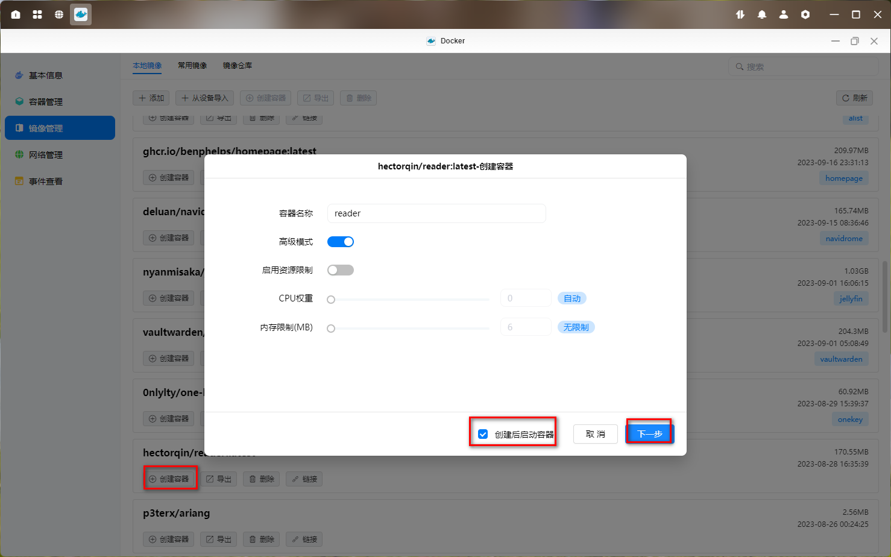
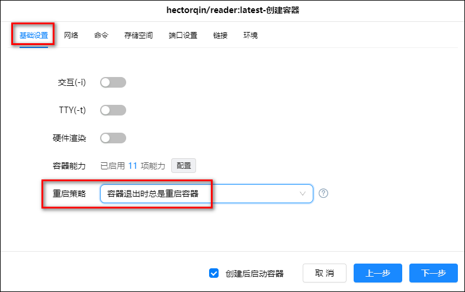
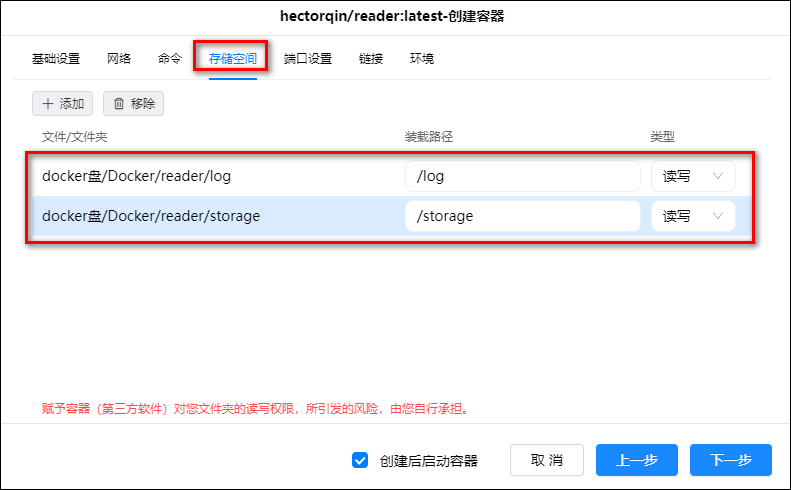
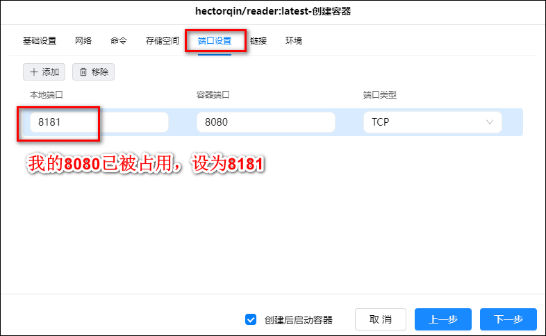
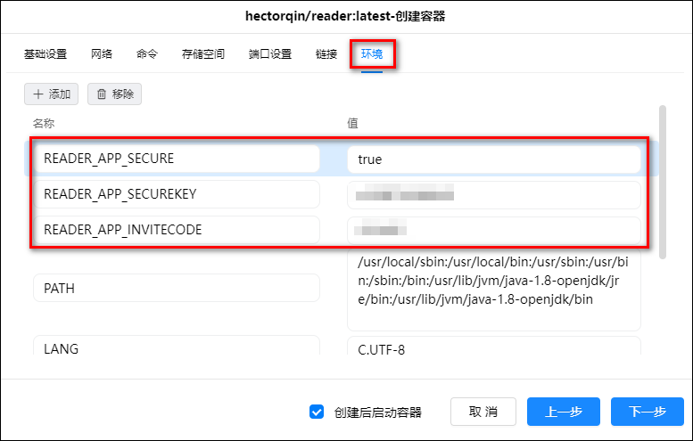
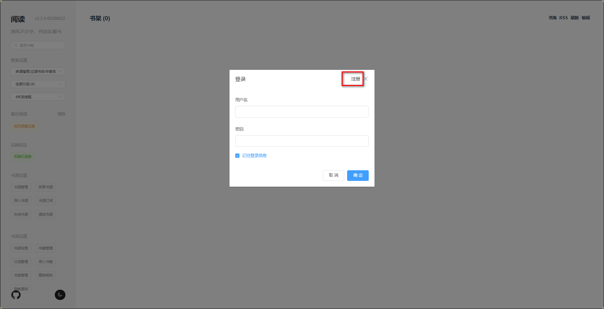
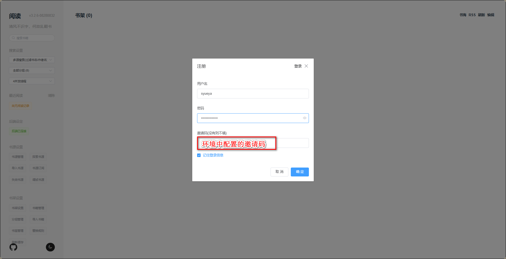
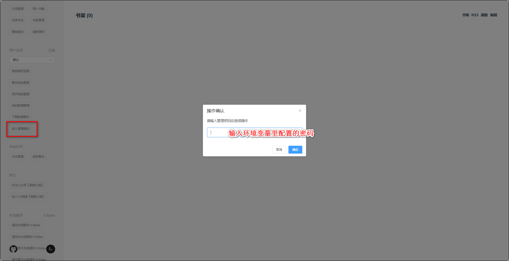
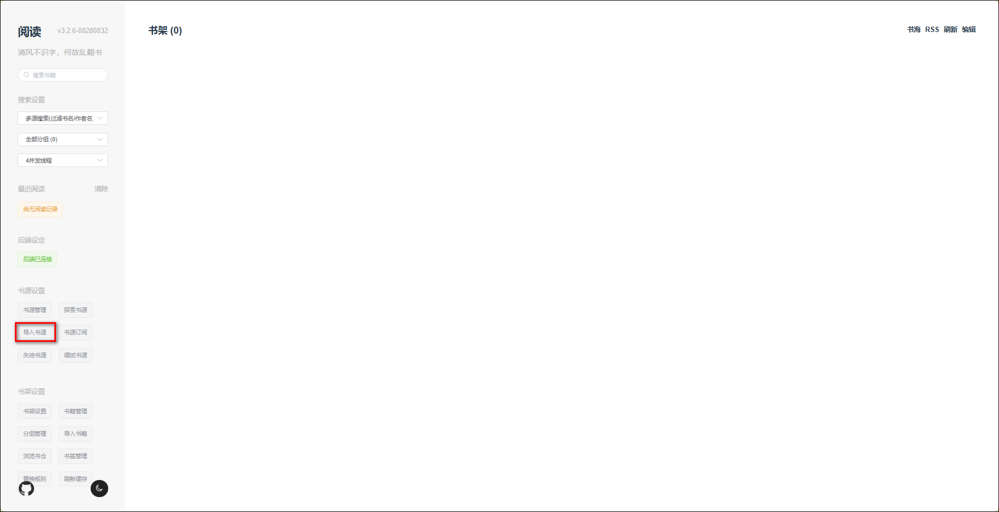

github 官网：<https://github.com/hectorqin/reader>

## 容器部署

1、在 Docker 管理器中打开镜像管理，在镜像仓库中搜索 hectorqin/reader，选择 latest 版本下载。

2、点击本地镜像，找到刚才下载的镜像，并点击创建容器。在配置窗口容器名称可以自定义，勾选创建后启动容器，并点击下一步。

3、在基础设置中，勾选重启策略为“容器退出时总是重启容器”。

4、网络中保持默认为“bridge”，命令保持默认为 java -jar /app/bin/reader.jar。

5、存储空间设置：在 docekr 文件夹下新建一个文件夹 reader，然后在这个文件夹下再创建两个子文件夹，分别叫 log 和 storage。

- 选择 log 目录，然后配置装载路径为/log，类型为读写。
- 选择 storage 目录，然后配置装载路径为/storage，类型为读写。

6、在端口设置中，如果本地端口未被占用的话默认即可，要不设置一个未被占用的其他端口即可。

7、在环境设置中，我们添加三个环境变量。

- 配置邀请码：READER_APP_INVITECODE:your_invite_code
- 配置访问密码：READER_APP_SECUREKEY:your_password
- 开启安全访问：READER_APP_SECURE:true

## 初始化

1、在浏览器输入 IP:端口来访问网站，点击注册

2、设置账号密码，邀请码为我们刚才在环境变量里配置的邀请码。

3、自动登陆后点击左下角用户空间处的“进入管理模式”。输入我们在环境变量里配置的密码，点击确定。

4、点击导入书源并选择书源配置文件，配置文件为 json 格式。

