## 1、emby环境搭建

1、首先进入绿联docker镜像管理，在本地镜像下点击添加官方库，镜像名称为：amilys/embyserver:beta，来下载beta版本的amilys/embyserver镜像。

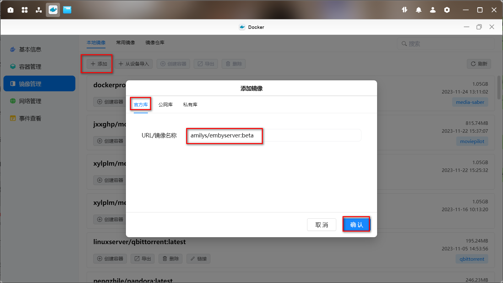

2、下载完成后在本地镜像界面创建该镜像。

1）名称自定义，勾选创建后启动容器。

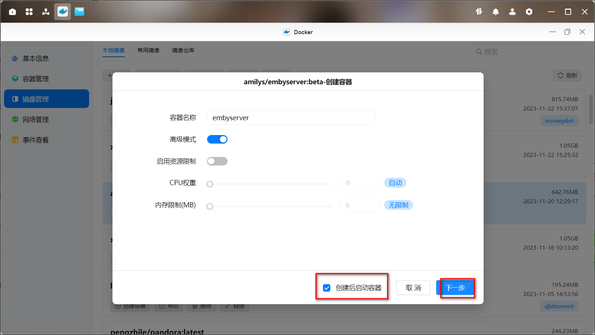

2）在基础设置中打开硬件渲染（顾名思义是为视频硬解，如果不打开在emby会没有硬解选项）。重启策略设置为【容器退出时总是重启容器】(这样在设备重启或者开机下会自动打开emby)。

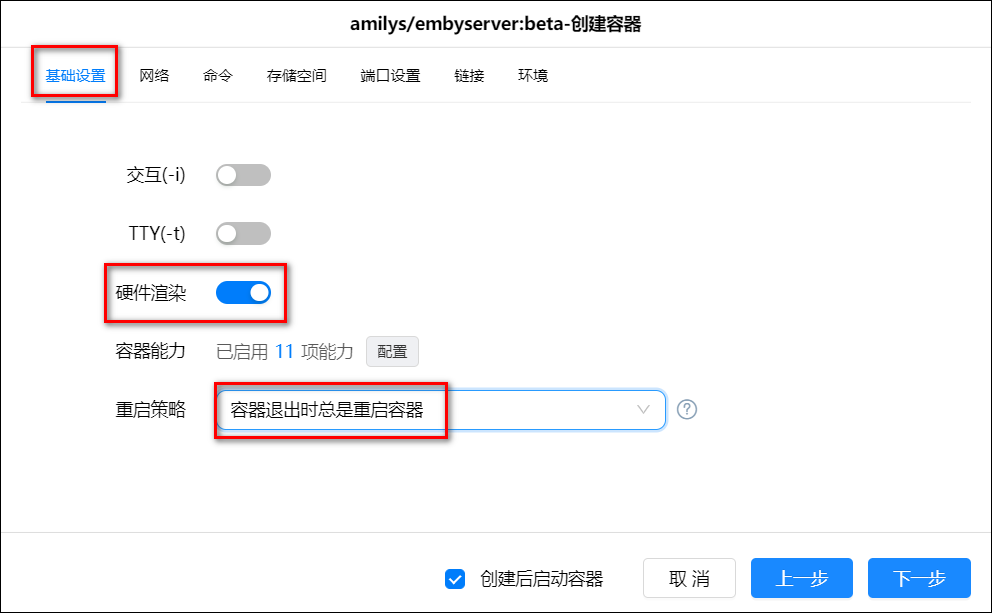

3）在网络中选择HOST（因为会影响到后续的视频刮削）。

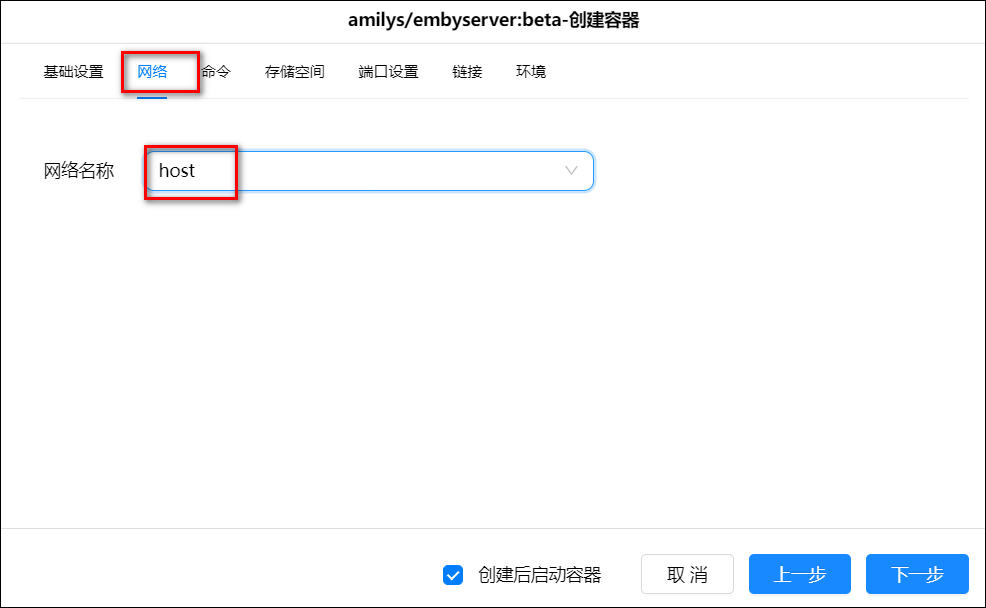

4）跳过命令到存储空间，这里填写要注意了，不能乱填不然会影响读取。

先在Docker文件夹下创建一个amilys-emby文件夹，再在此文件夹下创建一个config子文件夹，然后根据图内显示，选择这个文件夹，装载路径默认为/config ，类型改为读写。

下面是你放影视资源的位置，装载路径就是 /hdd1 （你自身几个硬盘放了影视资料就加几个以此类推 /hdd2 /hdd3）。

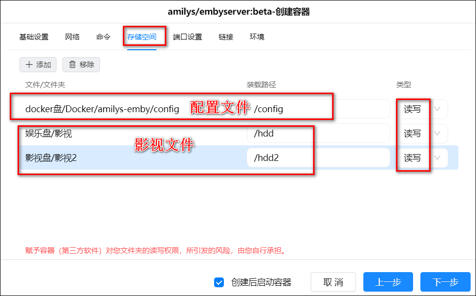

5)接下来我们来到端口设置里面，因为我们前面写的是HOST，所以这个的本地端口是无法修改的，按默认的即可。

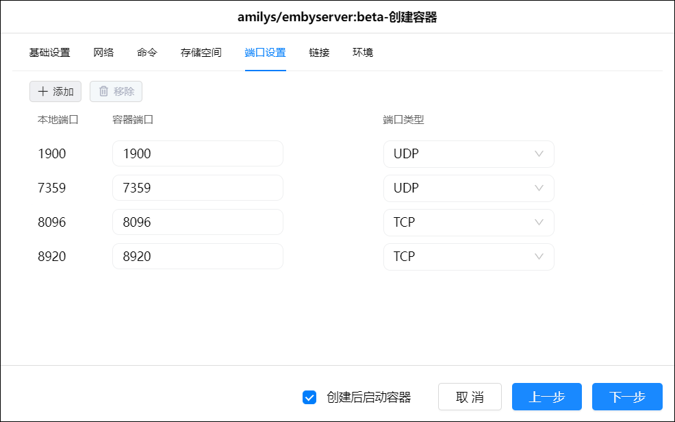

6）这里我们跳过链接来到环境一栏，添加 TZ="Asia/Shanghai"（这个是时区）。

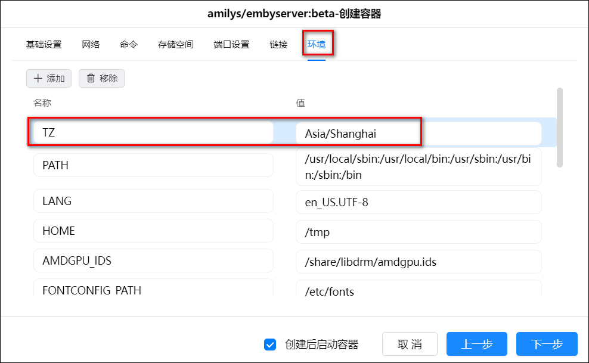

7)点击下一步，然后点完成，可以勾选上【创建后重启容器】。

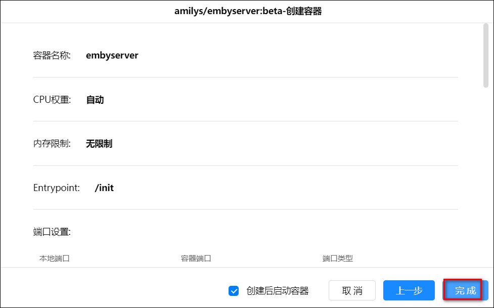

这样一个Emby就搭建完成了。

## 2、emby初始化

通过Emby前期搭建、Emby参数配置，Emby的部署工作已经完成了，接下来是初始化，里面涉及到大量的个性化设置，请大家按照自己需求修改即可，如果不明白什么意思那么就和我选择同样的即可。

1、打开浏览器，地址栏中输入绿联IP:8096,下拉列表选择中文，然后点击next。

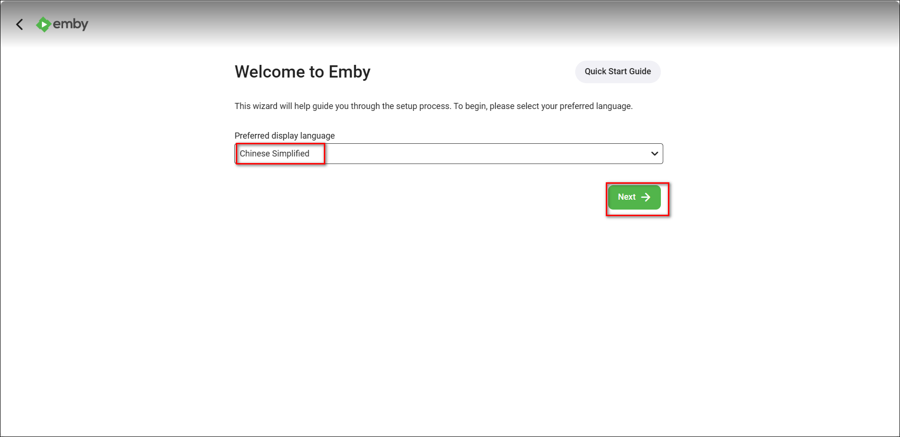

2、配置用户名和密码，点击下一步。

>在这个页面点击一下刷新才可使之前的设置生效，变为中文，我懒得刷新了。

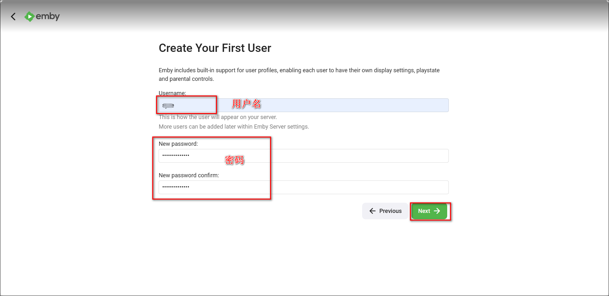

3、设置媒体库这里因为设置选项过多，我们稍后配置，点击下一个。

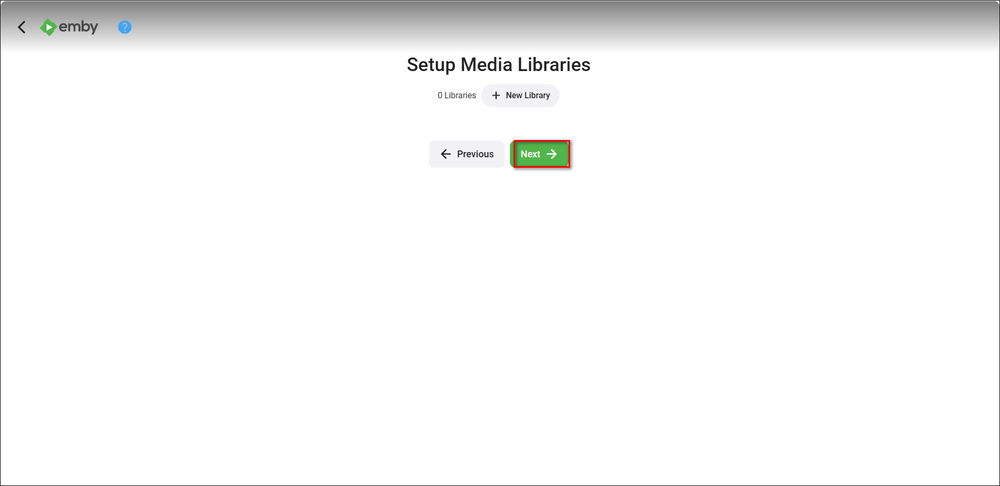

4、首选元数据语言和国家按照自己需求选择，这里我选择简体中文和中国。

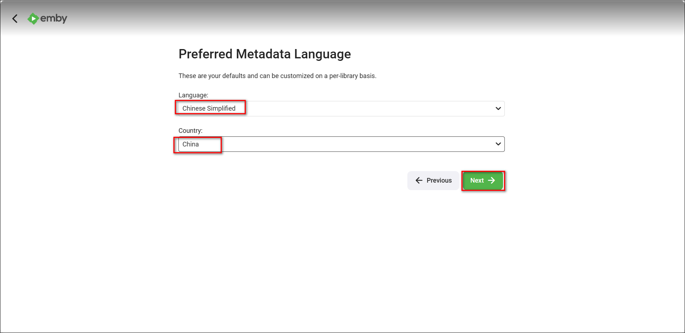

5、配置远程访问这里是否勾选无影响直接选择下一个。

6、接受emby条款，然后继续点击下一个。

7、初始化步骤结束点击完成。

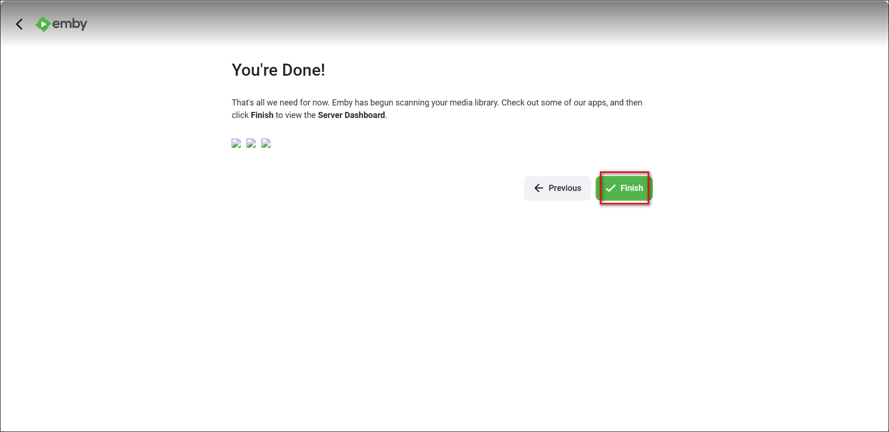

8、点击手动登录并输入刚刚设置的账号密码来登录刚刚创建的账户。

9、进入了首页

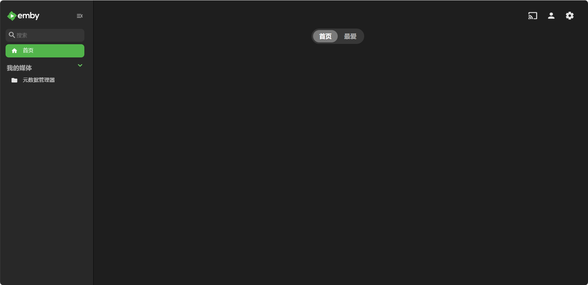

## 3、Emby设置

登录emby,点击右上角的小齿轮图标进入emby设置页面。

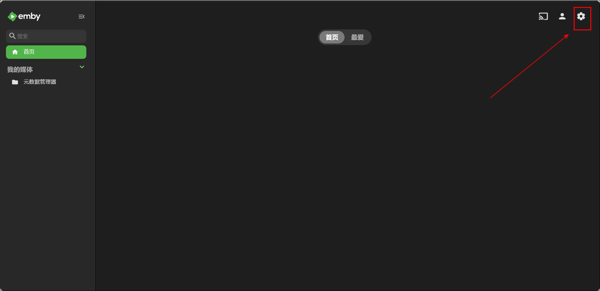

### 1、转码

点击转码，在启动硬件加速中选择高级，将下列的解码器全部选择QuickSnyc，关闭所有的VAAPI，然后记得翻到下面点击保存。

### 2、添加媒体库

关于媒体库的添加这里我主要演示一下电影的添加，关于剧集之类的因为命名比较影响信息的搜刮效果。
此步骤设置为bt和个人资源的信息搜刮，正在做种的资源不要按照这种方式配置容易影响做种。

1、点击媒体库，点击新增媒体库

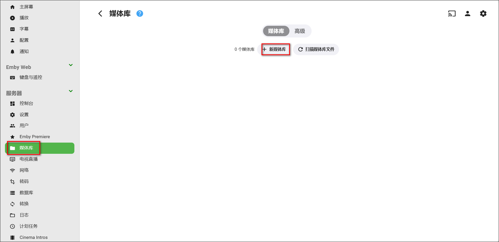

2、这里因为我都是通过其它工具刮好的媒体，所以一些emby刮削的选项没有设置了，填写完点击确定。

首次添加需要时间才能刮削完毕，请耐心等待。

### 4、插件

2、添加字幕插件

字幕插件：https://github.com/91270/MeiamSubtitles。
插件路径：

首次安装可能里面没有路径请刷新一下就会出现，把下载的插件丢进去即可。
3、搜刮失败解决办法
大部分搜刮失败都是因为网络无法访问下面几个域名，可以使用ping工具查看能否ping通，如图我的网络无法ping通，然后我在路由器中做了下面的映射，意思就是寻找一个能本地能访问的ip，然后将域名和ip绑定。（百度搜索ping工具）

	http://api.themoviedb.org
	http://api.thetvdb.com
	http://image.themoviedb.org
	http://www.themoviedb.org

依次使用ping工具ping上面几个域名，寻找一个时间最短的ip，然后将此ip和域名在路由器中进行绑定，部分路由器中设置方式不同，请自行百度。

下图为爱快路由器中设置方法

4、第三方插件安装
1、将下载好的后缀为dll的插件放到文件夹/docker/emby/plugins中即可，然后重启emby服务器。

2、登录emby 在插件选项中配置插件即可。

因为无法附上相关插件信息，请自行百度搜索即可（关键字 emby 插件、字幕等）
5、emby客户端
emby支持全平台客户端，可以在官网（https://emby.media/download.html）直接下载，这里推荐emby的windows客户端（下载桌面版本界面非常友好使用流畅）

## 5、命名规范

### 1)电影的命名

标准命名规范：**影片名.年份.分辨率.视频编码.音频编码**

例：
- 变形金刚3.2011.1080p.AVC.TrueHD7.1.mkv
- Transformers Dark Of The Moon.2011.1080p.AVC.TrueHD7.1.mkv
- 变形金刚3.Transformers Dark Of The Moon.2011.1080p.AVC.TrueHD7.1.mkv

但其实不需要那么多后缀，中文名.年份，就够了（那么多后缀你看着烦不烦，要是有的你多的东西命名又不规范还会影响你海报识别，真心没必要），例如：【变形金刚3.2011】

要是系列电影有小标题的，中文名中间是用冒号分开，例如【007：八爪女.1983】

真想要保留分辨率，视频编码，音频编码，中间也是用英文状态的【.】 隔开，例如【007：八爪女.1983.Blu-Ray.1080P】

### 2)电视剧的命名

标准命名规范：**影片名.季+剧集.年份.分辨率.视频编码.音频编码**

例：

- 萨布丽娜的惊心冒险.S01E01.2018.1080p.x264.DD5.1.mp4
- Chilling Adventures of Sabrina.S01E01.2018.1080p.x264.DD5.1.mp4
- 萨布丽娜的惊心冒险.Chilling.Adventures.of.Sabrina.S01E01.2018.1080p.x264.DD5.1.mp4

其实就 剧名+数字季别.季别（这个可有可无，因为前面有了，但是你有这个会兼容其他的软件海报墙）+集数.年份，这里画重点，数字季别很重要，例如：【心理罪2.S02E01.2016】，有人直接是【心理罪.2016.S02E01】是没用的，会归类到心理罪第一季里面，所以，中文名后面的紧接着的数字季别很重要。

要是有的剧，每一集有小标题的话，用括号括在里面，目的是为了防止造成海报识别干扰，而不是要利用小标题，例如：【 超智能足球2.S02E02（奥尼外传 不敌.心魔）】

### 3）动漫剧的命名

不管动漫是否只有一季，一定要创建一个“Season 1”的文件夹，不然刮削的时候不能搜到每一集的介绍。

比如我们动漫一人之下目前是有5季：

需要设置5个 Season X 文件夹，正常来说里面视频命名带有1.2.3.4.5.顺序就可以，但是为了精准识别我们可以改成：

S01E01就是第一季的第一集，S对应季E对应集，第二季就是S02。

特别篇是建一个文件夹（Season 0，Season 00，Specials），存放这些特别篇。下面是一个命名结构：
剧场版的命名：【原动漫名+剧场版：小标题】，例如：【名侦探柯南剧场版：唐红的恋歌】；【死神剧场版：无人的回忆】

4）批量改名的软件
