## 1、容器安装

1、在绿联云 APP 里打开 docker，在镜像管理-镜像仓库中搜索 transmission 并点击下载，版本选择最新版本即可（latest）。

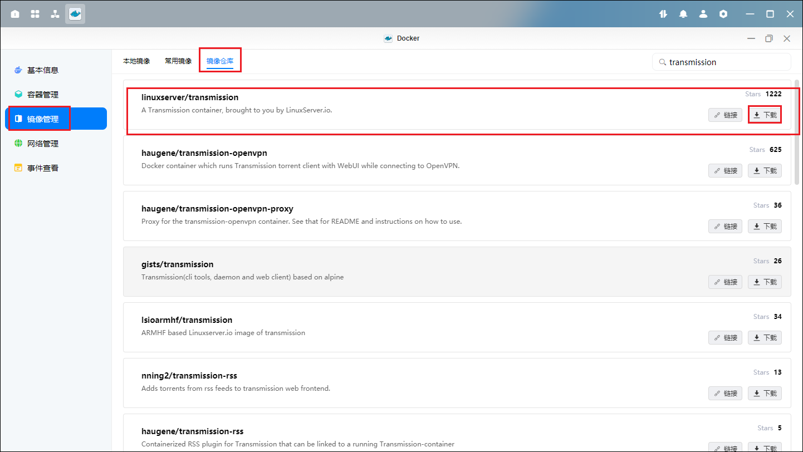

2、下载好后在本地镜像中找到已经下载好的镜像，点击创建容器。容器名称可以自定义，资源限制也可自定义，勾选创建后启动容器，然后点击下一步。

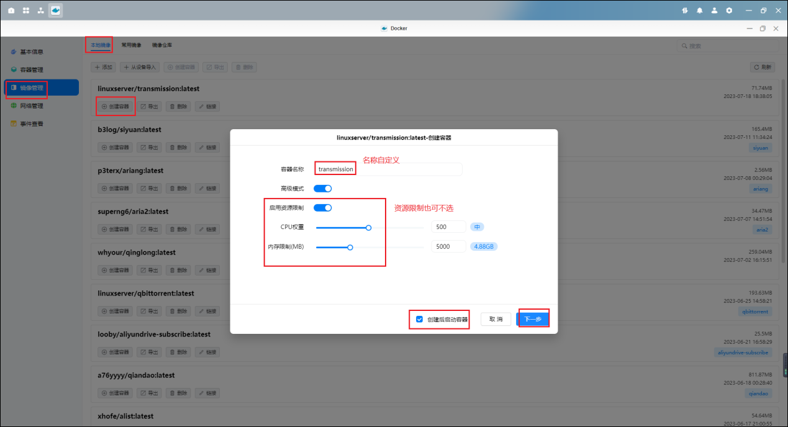

3、基础设置中重启策略选择最后一个【容器退出时重启】，网络和命令保持默认即可。

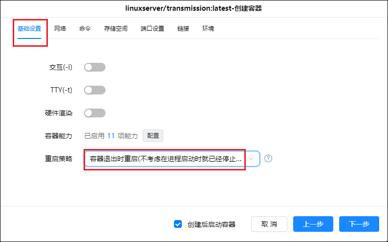

4、存储空间中，按以下来配置，注意类型是读写。

| 文件/文件夹                           | 装载路径 | 说明                    |
| :------------------------------------ | -------: | ----------------------- |
| /docker 盘/Docker/transmission/config |  /config | transmission 配置文件夹 |
| /娱乐盘/影视                          |     /hdd | 影视文件夹，可自定义    |

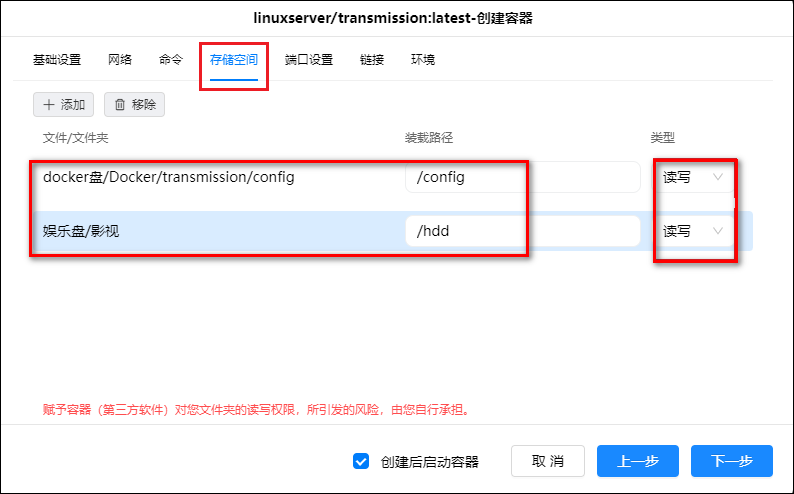

5、端口设置中本地端口和容器端口保持一样就行。

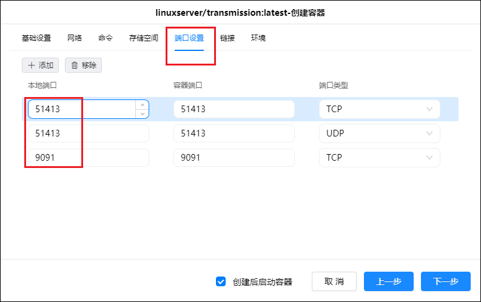

6、环境中添加如下名称和值，然后点击下一步。

| 环境名称              |        环境值 | 说明                                                                                                                                            |
| :-------------------- | ------------: | ----------------------------------------------------------------------------------------------------------------------------------------------- |
| TZ                    | Asia/Shanghai | 时区                                                                                                                                            |
| PUID                  |             0 | 容器内进程的用户 ID，默认 0                                                                                                                     |
| PGID                  |             0 | 容器内进程所属的用户组 ID，默认 0                                                                                                               |
| USER                  |        \*\*\* | web 登陆用户名，可自定义                                                                                                                        |
| PASS                  |        \*\*\* | web 登陆密码，可自定义                                                                                                                          |
| TRANSMISSION_WEB_HOME |   /config/web | 下载[皮肤压缩包文件](https://github.com/transmission-web-control/transmission-web-control/releases/)，将解压后的 web 文件夹放至/config 文件夹里 |
| RPCPORT               |          9091 | web 访问端口号，可自定义，默认为 9091                                                                                                           |

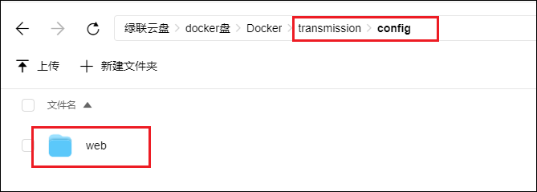

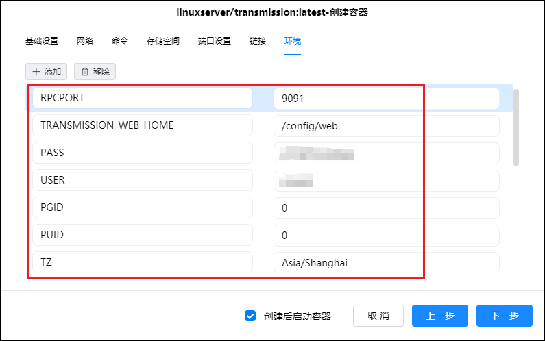

7、再次检查配置选项是否正确，没有问题后点击完成。

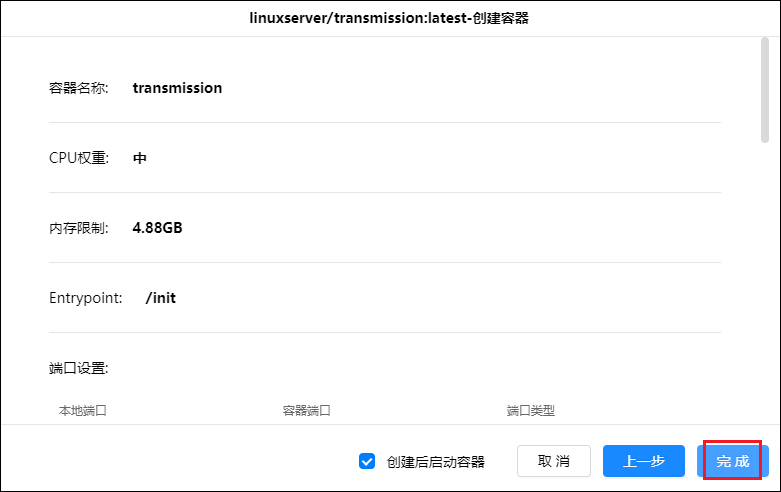

8、容器类表中可以看到 Transmission 已经正常运行。

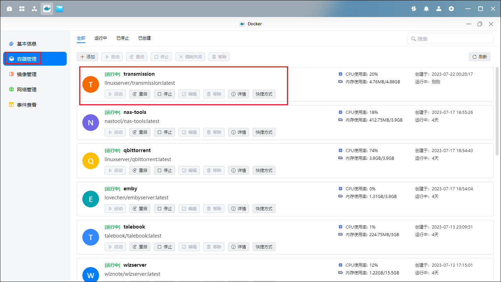

## 2、初始化

1、打开浏览器，在地址栏输入绿联 IP:9091,输入初始的用户名和密码登录。

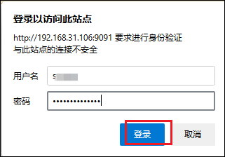

登陆后界面

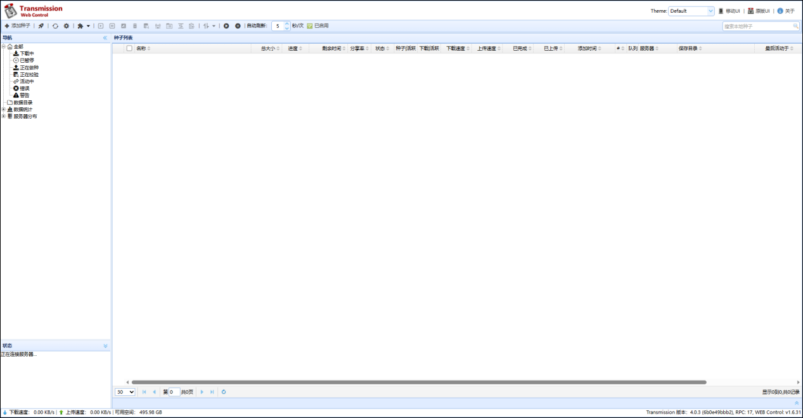
