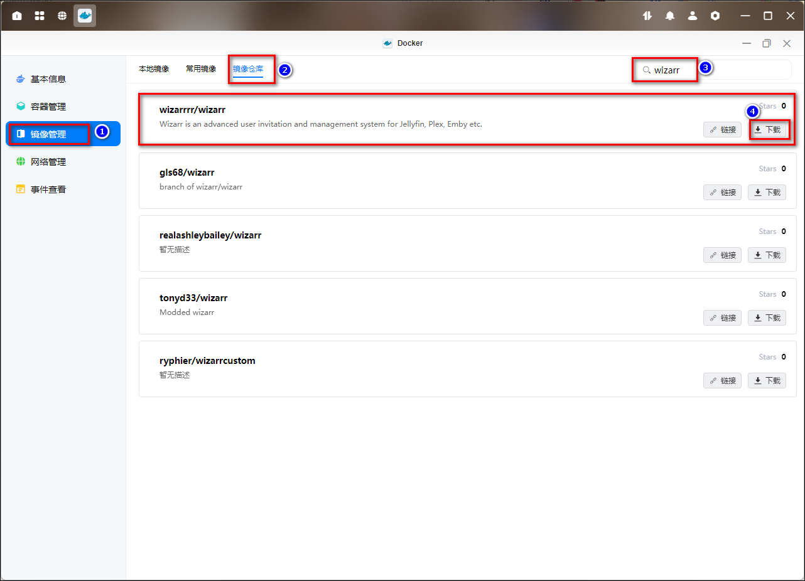
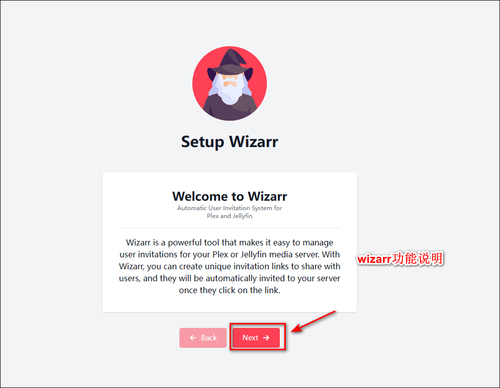
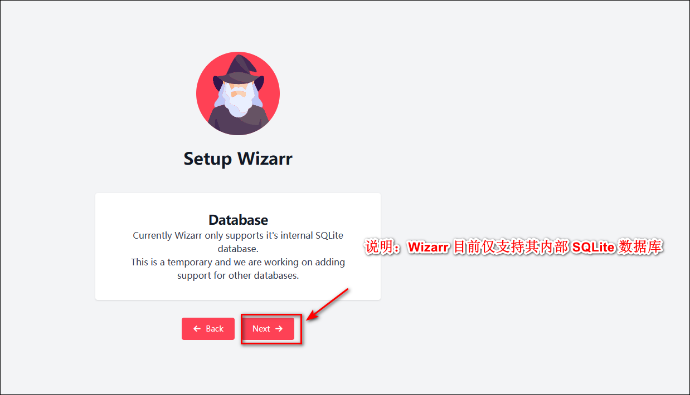
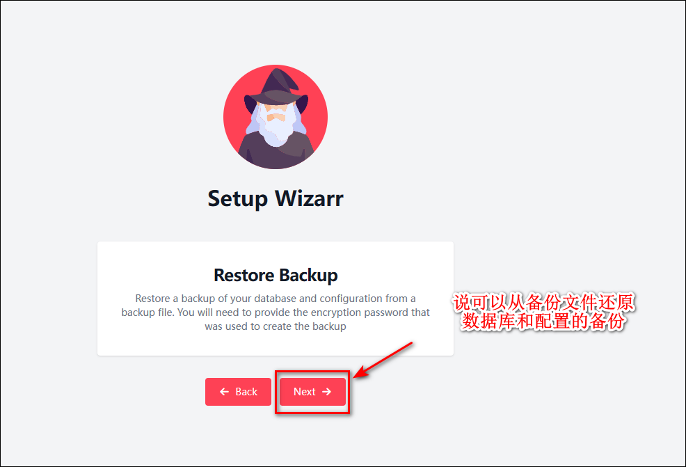
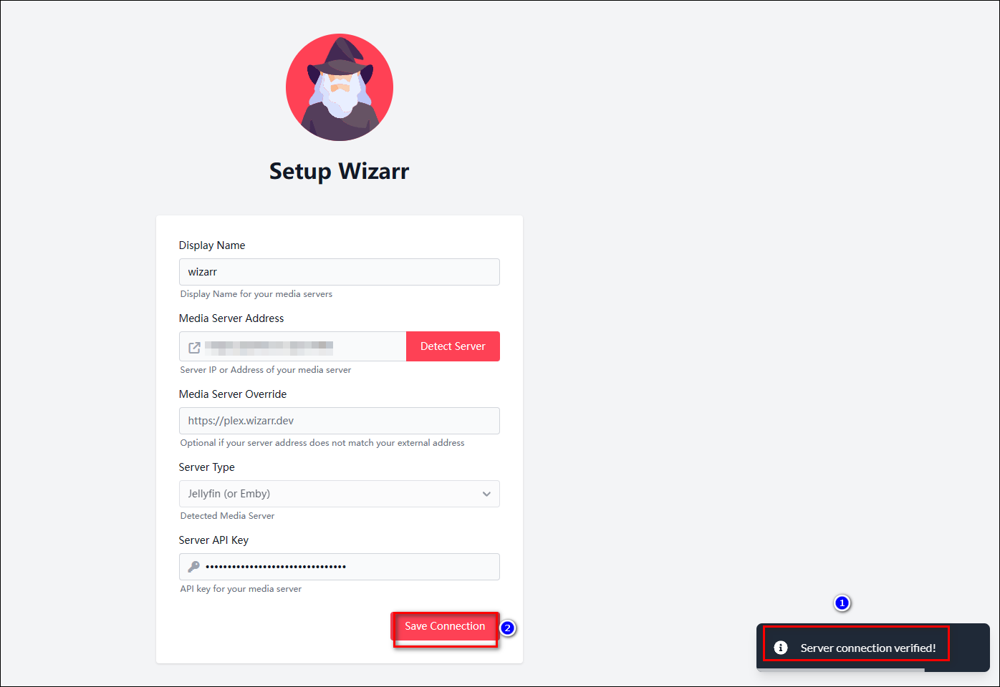
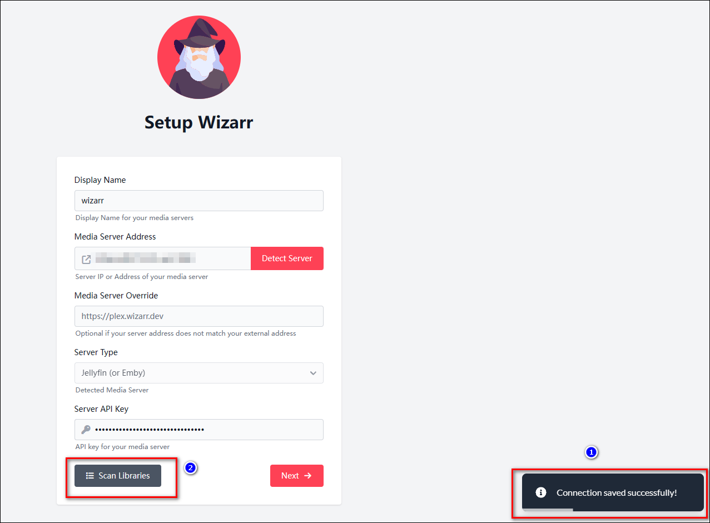
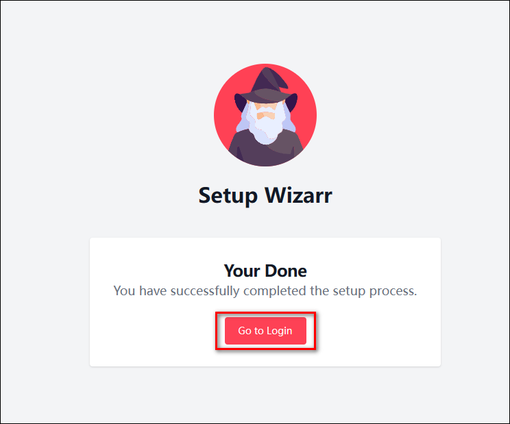
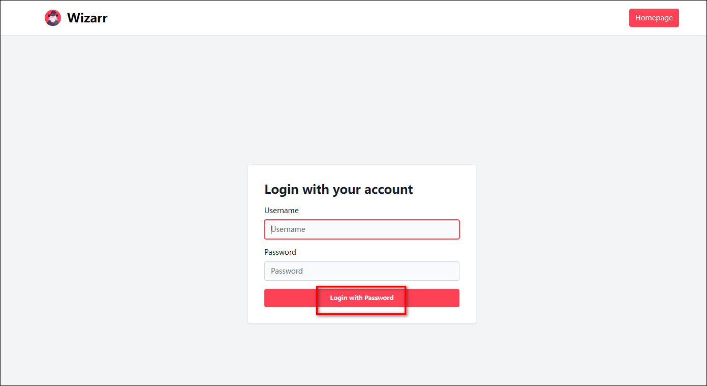
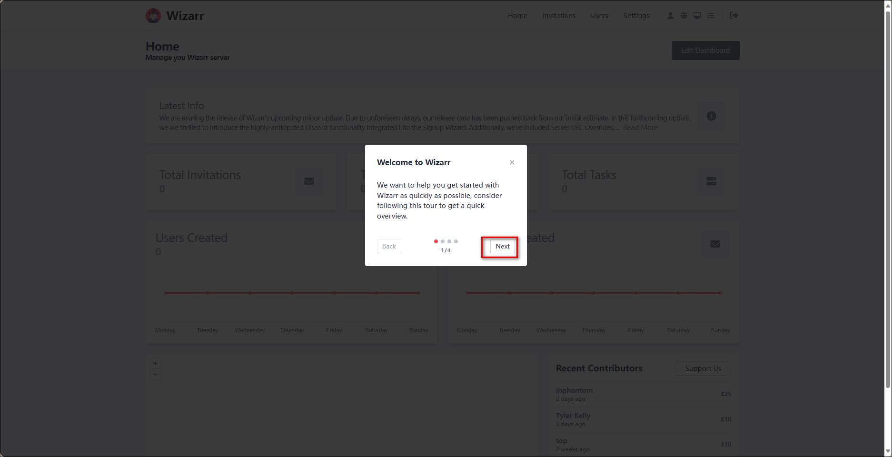
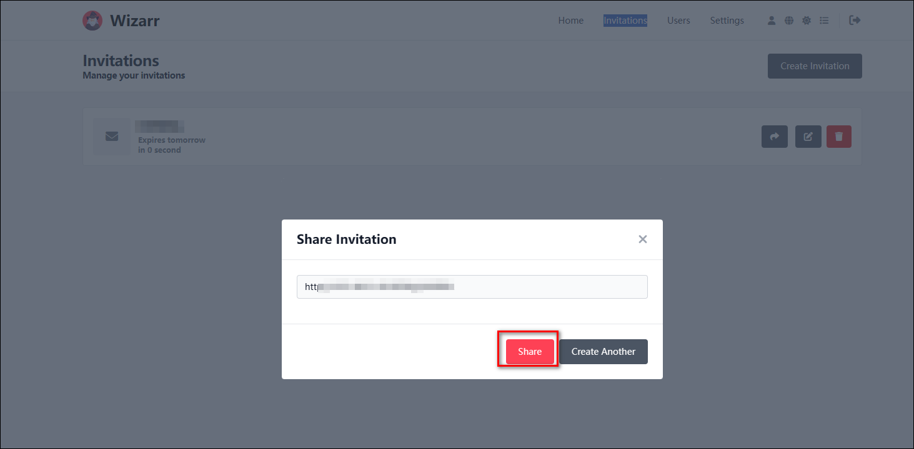

可以为Jellyfin创建用户邀请，github地址：<https://github.com/wizarrrr/wizarr>。

## 容器部署

1、在绿联云APP里打开docker，在镜像管理-镜像仓库中搜索wizarr，选择第一个并点击下载，版本选择最新版本即可。

2、在本地仓库里找到刚刚下载好的镜像，点击创建容器。容器名称可以自定义，勾选创建后启动容器，然后点击下一步。

3、基础设置这里设置下重启策略。此时先不要点下一步。

4、存储空间设置：在docker文件夹下新建一个文件夹wizarr，并建一个子文件夹database，把它挂载为/data/database，类型设置读写。

5、端口设置：本地端口如果5690没有被占用的话，默认5690即可。端口设置完可以点下一步了。

6、点击完成。

## 初始化

在浏览器中打开ip:5690，进入Wizarr设置界面。

1、功能说明提示，点击next

2、说明目前 Wizarr 仅支持其内部 SQLite 数据库，点击next

3、说明从备份文件还原数据库和配置的备份，点击next

4、输入管理员账号的用户名、密码、邮箱，输入完之后点击Create Account。

5、配置媒体服务器信息

- Display Name自定义即可
- 在Media Server Address中填入你的Jellyfin/Emby/Plex的地址，然后点击旁边的Detect Server，没问题的话右下角会自动识别出媒体服务器的类型，比如我这里是jf。
- 在媒体库中（我这里是jf）中创建一个API Key，粘贴在Server API Key下。
- 点击Verify Connection

6、点完Verify Connection后右下角会跳出个成功的提示，此时页面也已更改，我们继续点击Save Connection

7、点完Save Connection后右下角会跳出个成功的提示，此时页面也已更改，我们点击Scan Libraies

8、点完Scan Libraies后，会扫描出你的媒体服务器所有的媒体库，选择你后续想用来分享的媒体库，建议全部都选上，选完后点击Select Libraies

9、点完Select Libraies后右下角会跳出个成功的提示，此时页面也已更改，最后继续点击Next。

10、现在设置都完成了，点Go to Login去登录

11、输入用户名和密码，点击 Login with Password 登录

12、进入界面会有功能说明教程，一直点击next查看就行

13、点完后成功地初始化完成了

## 使用

### 邀请

点击Invitations - Create Invitations，选择有效期（有一天、一月、一年、永久、自定义日期等选项）后点击Create Invitations。

会跳出个分享的链接，点击share分享给别人即可。

