## 介绍
是一个Emby/Jellyfin/Plex 媒体中文自动同步工具。
- 中文标题
- 媒体概述
- 中文人名(Plex暂时不支持)
- 中文扮演(Plex暂时不支持)
- 剧集概述评分图片同步
- 剧集组自定义同步
- 媒体搜刮检查是否正确(配合NasTools)

Dockerhub地址: <https://hub.docker.com/r/ddsderek/mediaservertools>

Github地址: <https://github.com/sleikang/MediaServerTools>


## 容器部署

1、在绿联云APP里打开docker，在镜像管理-镜像仓库中搜索mediaservertools，选择第一个ddsderek/mediaservertools镜像，并点击下载最新版本。


2、官方docker-compose安装命令

```
version: '3.3'
services:
    MediaServerTools:
        container_name: MediaServerTools
        volumes:
            - './config:/config'
        environment:
            - TZ=Asia/Shanghai
            - PUID=1000  # 可以改成0
            - PGID=1000   # 可以改成0
            - UMASK=022
            - MediaServerTools_AUTO_UPDATE=true # 自动更新，建议关掉
            - MediaServerTools_CN_UPDATE=true # 使用国内源更新
        network_mode: host
        logging:
          driver: json-file
          options:
            max-size: 5m
        image: 'ddsderek/mediaservertools:latest'

```

2、在本地仓库里找到刚刚下载好的镜像，点击创建容器。容器名称可以自定义，勾选创建后启动容器，然后点击下一步。

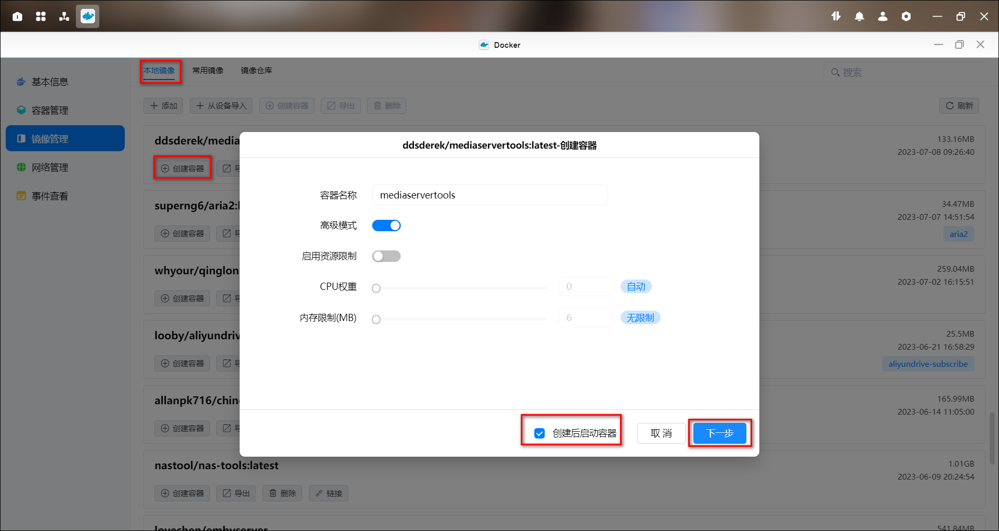

3、基础设置这里设置下重启策略。此时先不要点下一步。


4、网络：设置为host模式。


5、存储空间设置：在docker文件夹下新建一个文件夹MediaServerTools，并建一个子文件夹config，把它挂载为/config，类型设置读写。

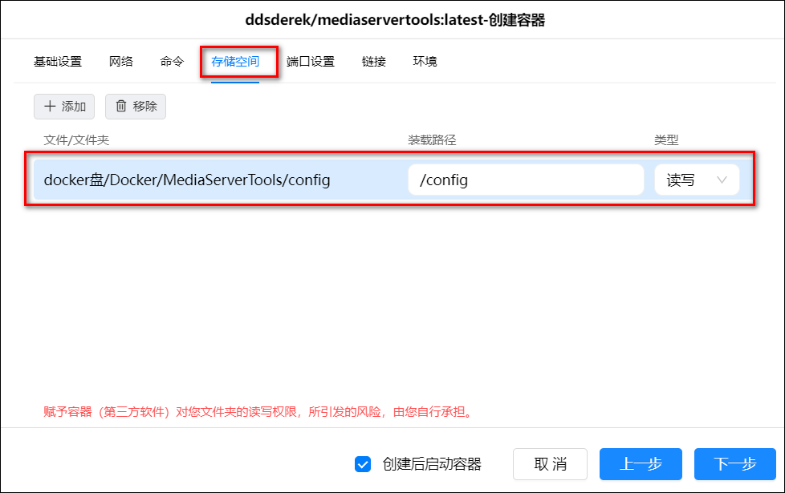

6、环境这里可以把PUID、PGID都由默认的1000改成0，把自动更新MediaServerTools_AUTO_UPDATE由默认的true改成false。

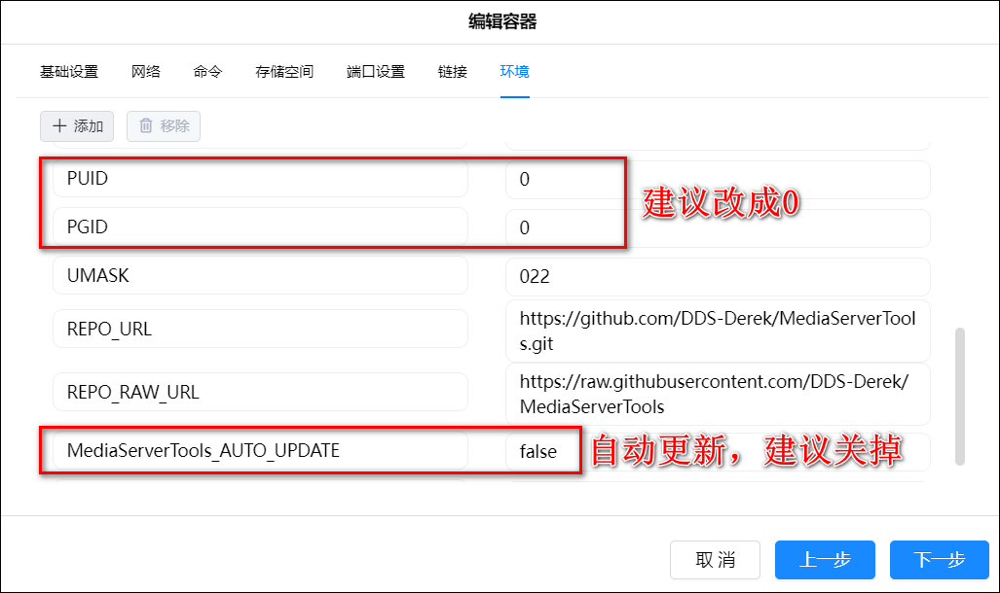

需要加代理的话（建议增加代理环境），环境可以另外加三行：
```
NO_PROXY=172.17.0.1,127.0.0.1,localhost ##保持默认
ALL_PROXY=http://192.168.31.2:7890 ## 更换为自己的http代理
HTTP_PROXY=http://10.0.0.4:10081 ##更换为自己的http代理
```
7、点击下一步，然后点击完成，完成容器部署。

## 初始化

1、打开刚刚新建的MediaServerTools-config文件夹，找到config.yaml文件。下载到本地。

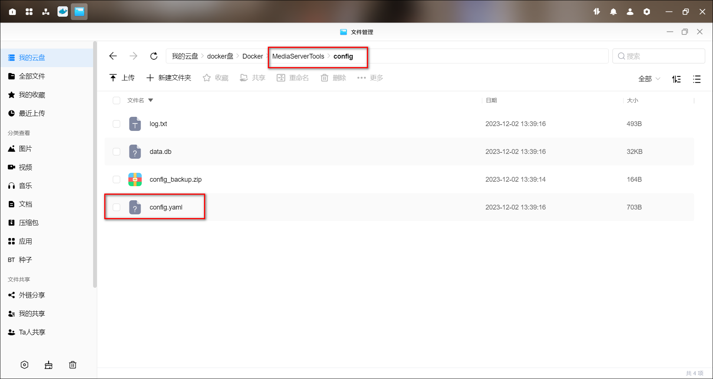

2、打开文档，初始样子是这样。

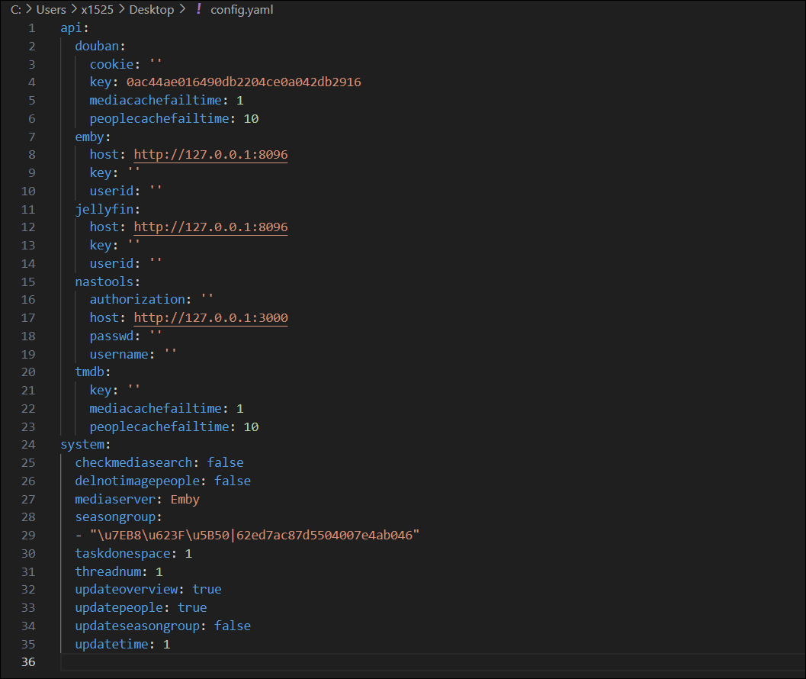

3、我们需要填写或修改些内容。

**1）emby和jf**

- host：jf/emby的内网访问地址及端口，后面不要带/
- key：jf/emby的api key，点击jf/emby控制台-API密钥，点击新建API密钥，名称可以填MediaServerTools，得到key值。
  - emby：
      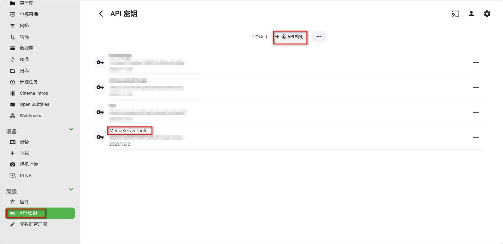
    
  - jf：
      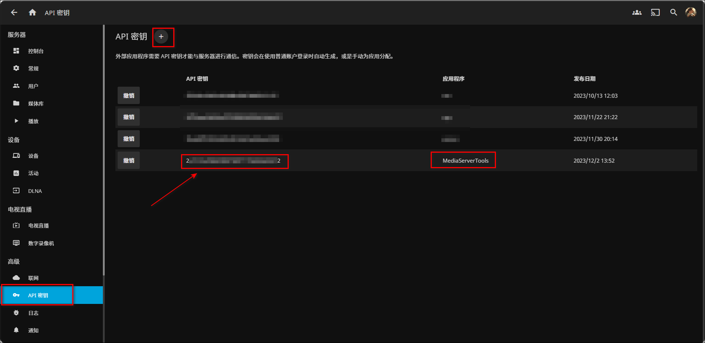
- userid：jf/emby的管理员ID，点击jf/emby控制台-用户，找到当前管理员账户点进去浏览器地址显示的userid=后面的内容就是我们需要的userid值。
  - emby的userid获取：
      
  - jf的userid获取：
      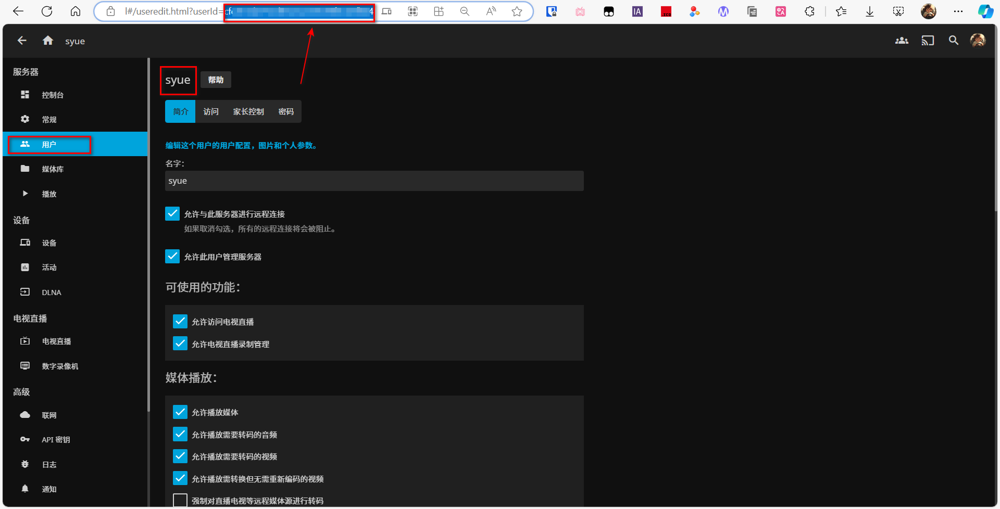

**2）nastools**
- authorization: ''  # nastools基础设置-安全-API密钥
- host:   # nastools内网地址地址及端口，后面不要带/
- passwd: ''  # nastools密码
- username: ''  # nastools用户名

**3）douban**
- cookie: ''  # 豆瓣PC端个人页cookie
  - cookie获取：
  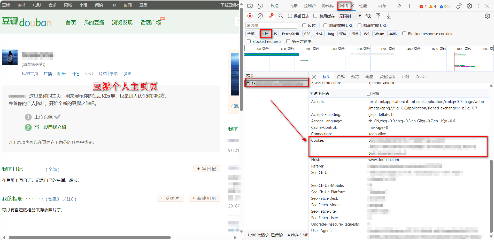
- key: 0ac44ae016490db2204ce0a042db2916  # 豆瓣API KEY，默认这个就可
- mediacachefailtime: 1  # 媒体数据缓存失效时间，单位：天
- peoplecachefailtime: 10 # 人物数据缓存失效时间，单位：天

**3）tmdb**
- key:''   # TMDB的API KEY，未申请的话点击查看[申请TMDB的Api](/other/tmdb_api/)
- mediacachefailtime: 1  # 媒体数据缓存失效时间，单位：天
- peoplecachefailtime: 10 # 人物数据缓存失效时间，单位：天

**4）system**
```
mediaserver: Jellyfin # 使用的媒体服务器，可选 Emby Jellyfin
checkmediasearch: true # 检查媒体搜刮是否正确,不正确自动更新,需要配合NasTools使用
delnotimagepeople: true # 是否删除没有头像的演员
taskdonespace: 20 # 任务完成等待时间，单位：秒。豆瓣API有请求频率限制，建议时间可以设置长一点
threadnum: 8  # 线程数量，豆瓣API有请求频率限制，建议线程数量不要过多
updateoverview: true # 是否更新简介，建议打开
updatepeople: true # 是否刷新人名，建议打开，这样可以把演员英文名字换成中文
updatetime: 24 # 每次刷新全部媒体间隔时间，单位：小时

updateseasongroup: false # 是否更新剧集组

#剧集组配置, 在启用更新剧集组后有效，不用的话保持默认即可
seasongroup:
- "\u7EB8\u623F\u5B50|62ed7ac87d5504007e4ab046" # 内容："EMBY媒体名称|TMDB episode_group剧集组ID" ，比如："纸房子|5eb730dfca7ec6001f7beb51"
```

4、把docker盘中的MediaServerTools-config文件夹里的原config.yaml删除，并把修改好的config.yaml文件上传进去。

5、点击重启，然后点击详情


6、点击日志，查看运行情况

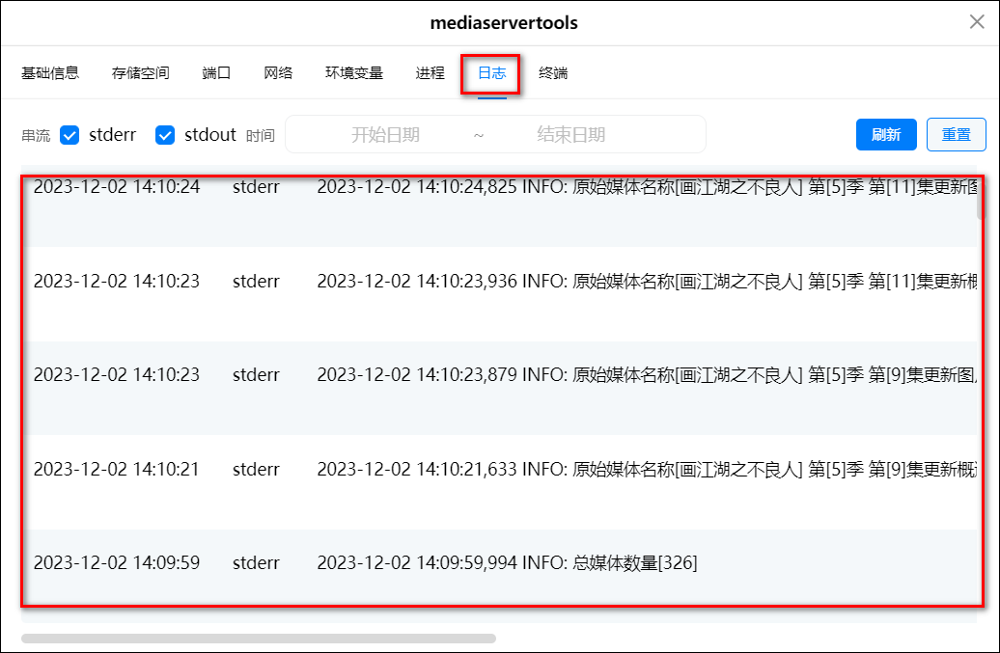

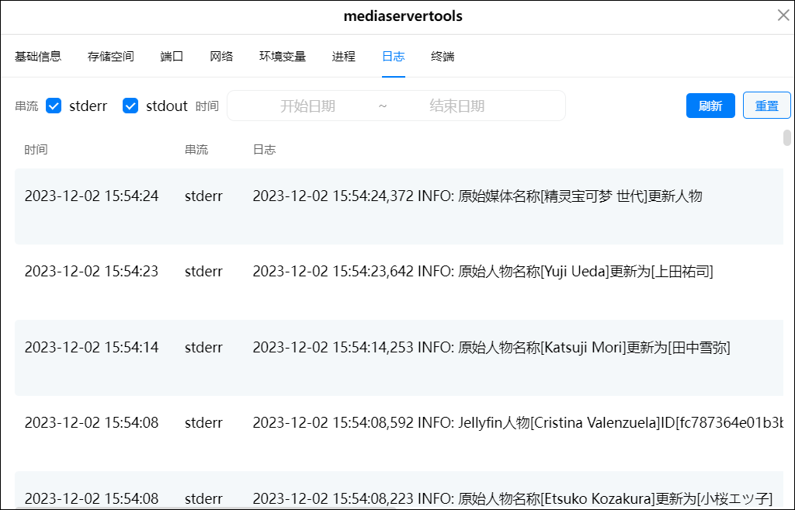


