## 1、容器部署

1、在绿联Docker 界面进入镜像管理-镜像仓库，搜索框内搜索“xhofe”，回车，选中第一个“xhofe/alist”下载最新版本。

2、在本地镜像找到刚刚下载的镜像文件，点击创建容器

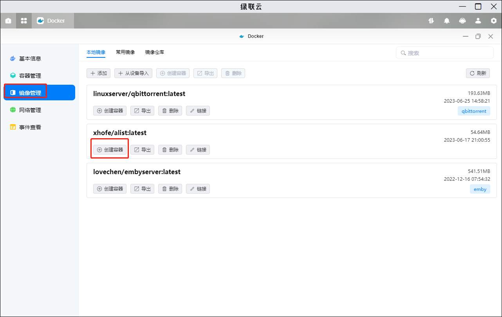

3、改下容器名称（方便你自己后期管理和辨识），打开“高级模式”，点“下一步”。

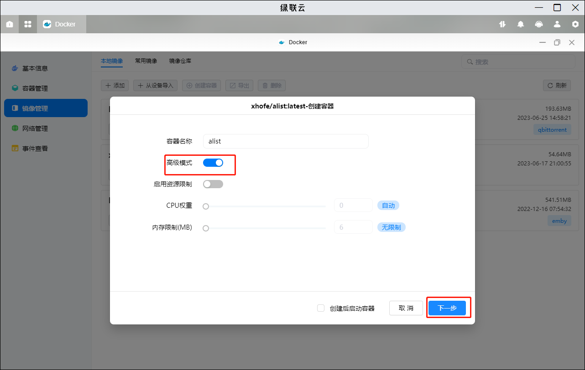

4、由于 alist 成功后会挂载上很多网盘，这里重启策略建议选择“容器退出时总是重启容器” 。

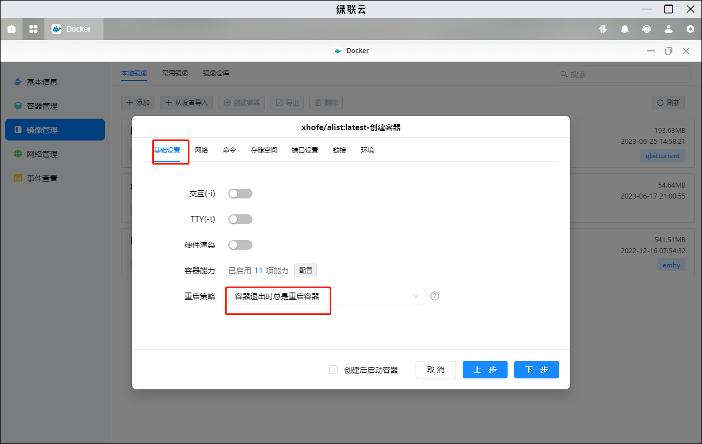

5、点存储空间，在docker目录下新建一个alist文件夹，再建一个data子文件夹用来存放配置文件，再点击添加挂载一个下载目录，类型都为读写。

6、点上方端口设置，把本地端口填写“5244”

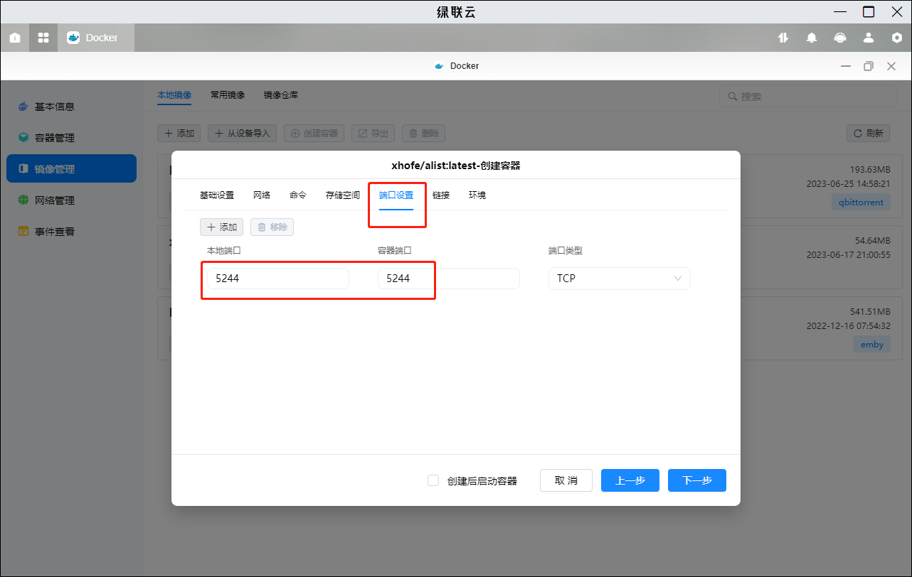

7、填写完后点击下一步。检查完后点击完成。

8、点左边“容器管理”，找到你刚才创建的“alist”容器，点对应下面的“启动” 

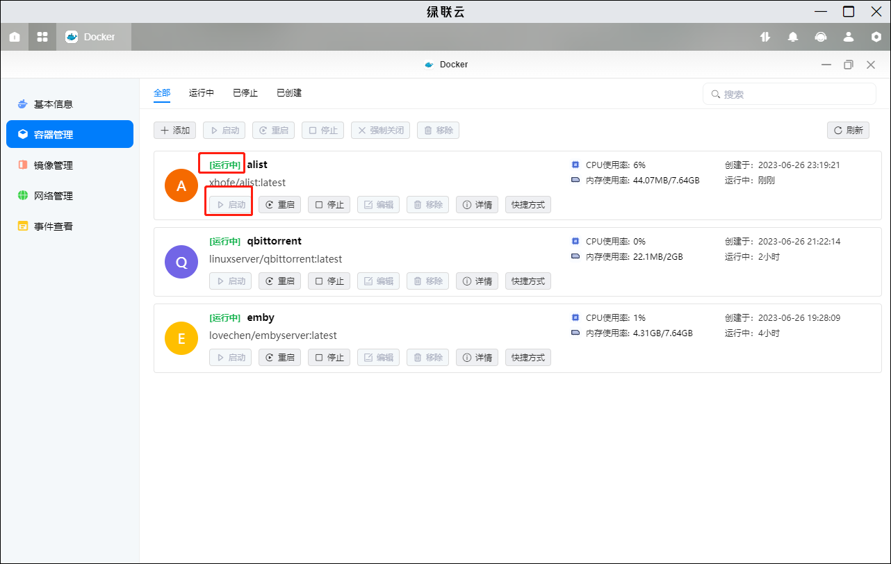

## 2、使用

### 说明

1、在容器管理里点alist容器的“详情”，再在详情界面上方点“日志”，然后在日志里找到密码。

2、在浏览器输入 nas 的 ip:5244进入 alist页面。登录的默认用户名是“admin”；密码为刚刚找到的密码。

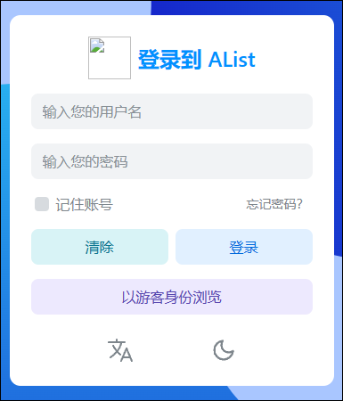

3、登陆完点后击管理进入管理界面。

4、点击个人资料可以修改密码。

5、点击存储-添加可以挂载云盘。

6、点击文档可以进入说明页面。

7、在说明页面可以把文字改成简体中文，然后在左方选择添加存储，可以看到挂载不同网盘的说明文档。

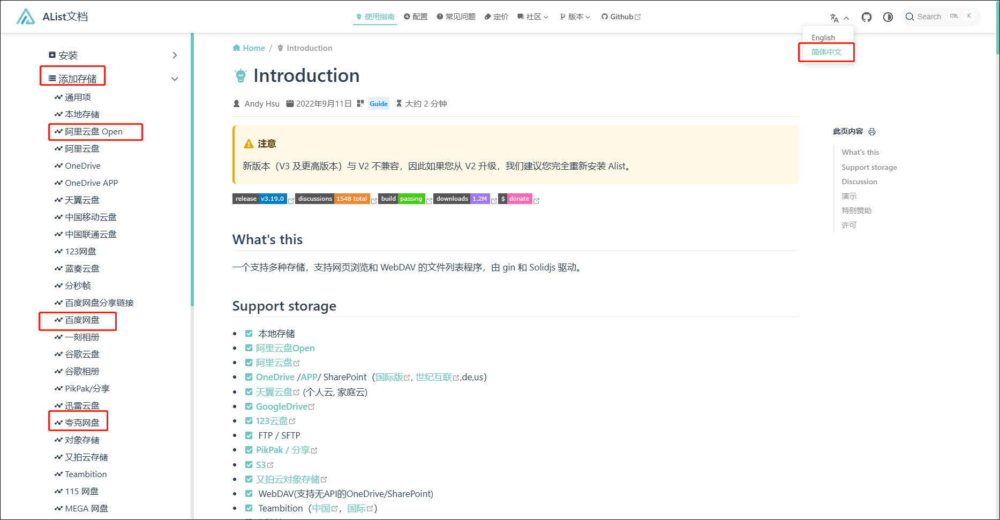

### 挂载绿联

填写以下内容：

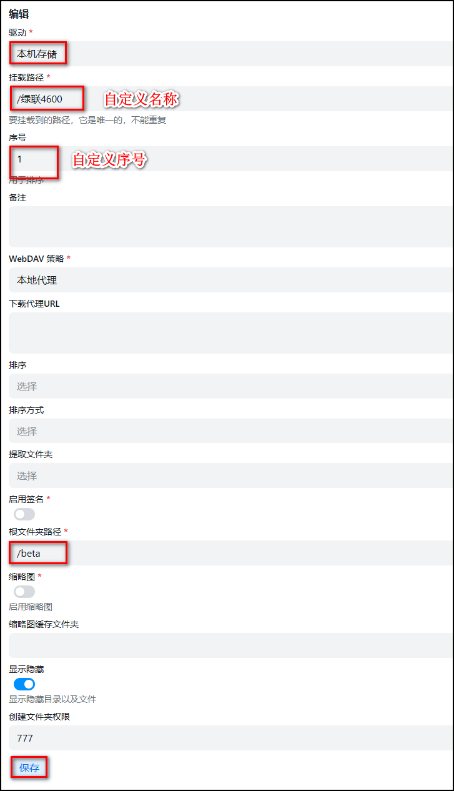

挂载成功：

### 挂载百度网盘

在文档里点击刷新令牌，获取密钥等内容。

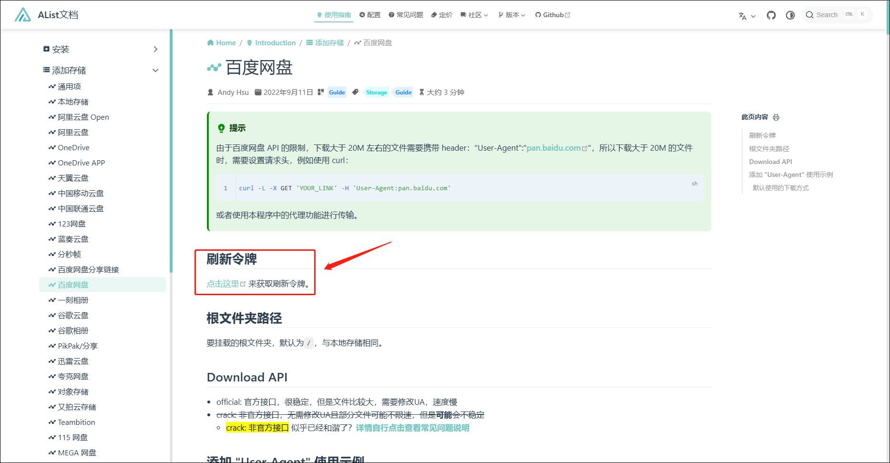

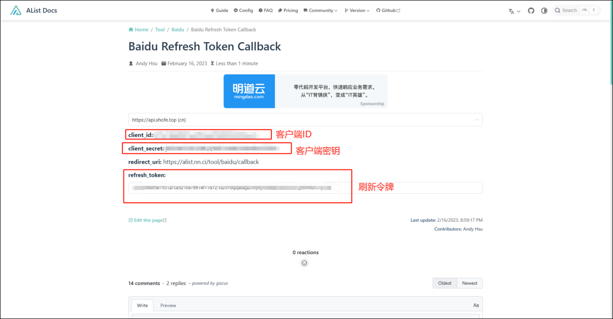

填写内容：

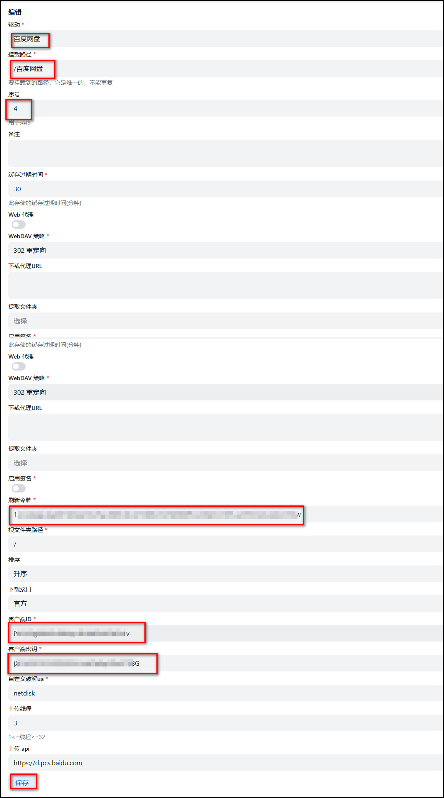

### 挂载阿里云盘

在文档里点击[刷新令牌的链接](https://alist.nn.ci/tool/aliyundrive/request)，获取二维码。

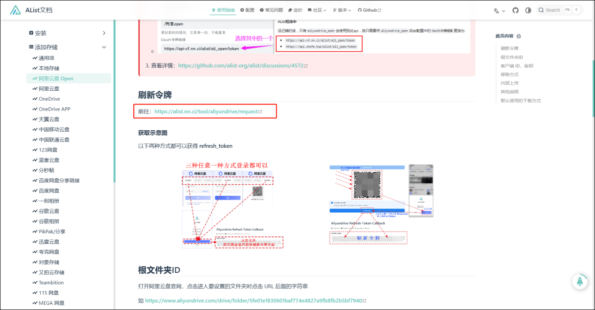

扫码登录获取令牌。

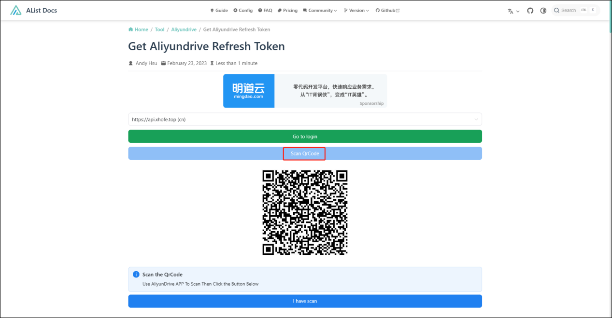

填写以下内容：

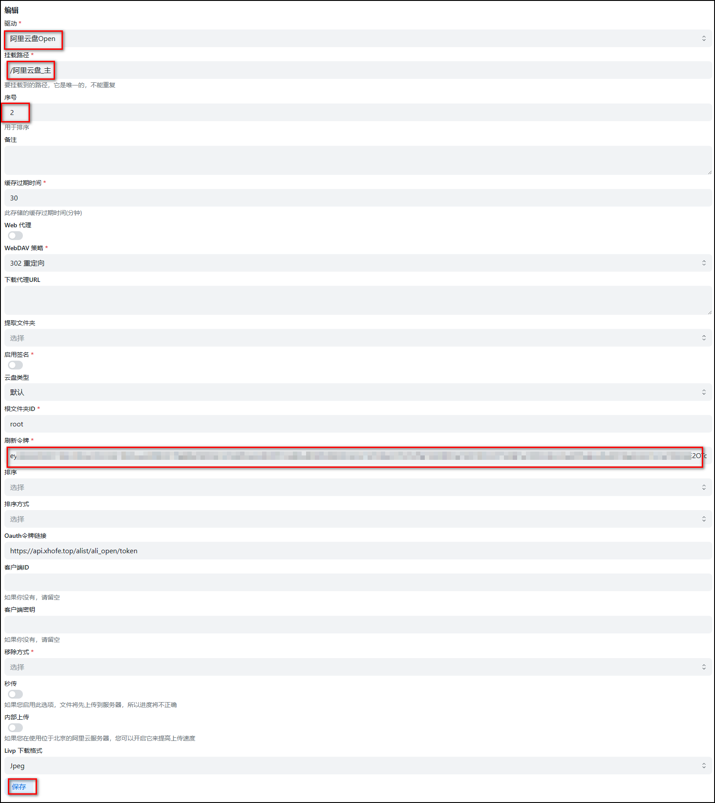

### 挂载夸克网盘

从请求中获取 Cookie 和根文件夹 ID的方法：按F12打开“调试”，选中“网络”，找到一个以“sort”开头的文件即可找到。

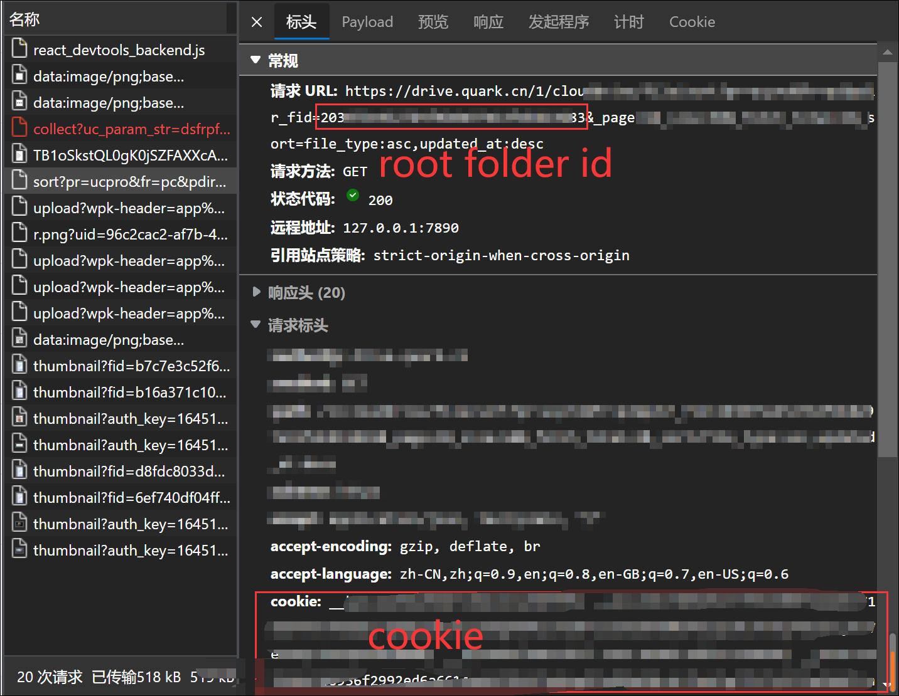

填写以下内容：

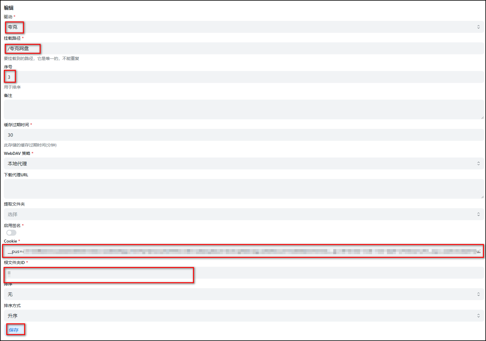

### 挂载阿里云盘分享链接

1、首先我们找到我们想要接入的阿里云分享链接，举个例子，比如这个链接：<https://www.aliyundrive.com/s/gQZfdoexuBs>。我们所需的是gQZfdoexuBs这串代码。

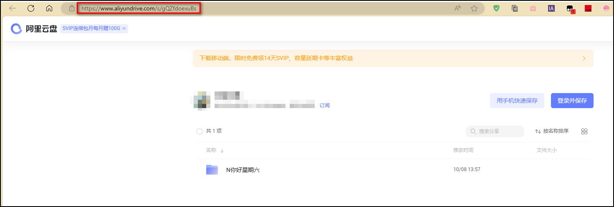

2、在alist管理界面，点击存储-添加。

3、填写以下内容，然后点击添加：
- 驱动选择阿里云盘分享；
- 挂载路径填写/自己自己喜欢的路径，比如这里我填/N1-Hi6；
- 序号因为这里是我的第1个分享驱动盘，这里我填1；
- 刷新令牌填写阿里云盘的短Token；
  - 打开链接：<https://alist.nn.ci/zh/guide/drivers/aliyundrive.html>，点击获取Token。

    

  - 用手机上的阿里云盘App扫描生成的二维码，扫描完以后点击上方的“使用阿里云盘APP扫描然后点击”这个按钮，随后二维码下方会生成一串Token。

    
- 分享ID填写我们刚刚复制的那串ID（举例的是gQZfdoexuBs）

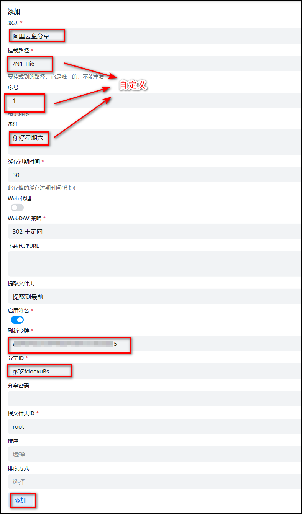

4、添加完成后我们就能看到我们挂载的阿里云盘分享链接已经出现了，状态显示work。

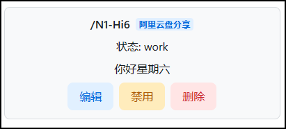

5、在主页也能看到链接的分享内容了。

