## 1.Aira2 容器部署

1、在镜像仓库查找并下载 superng6/aria2 最新版镜像。

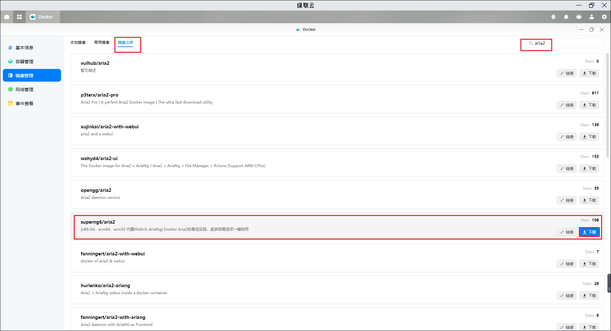

2、点击创建容器

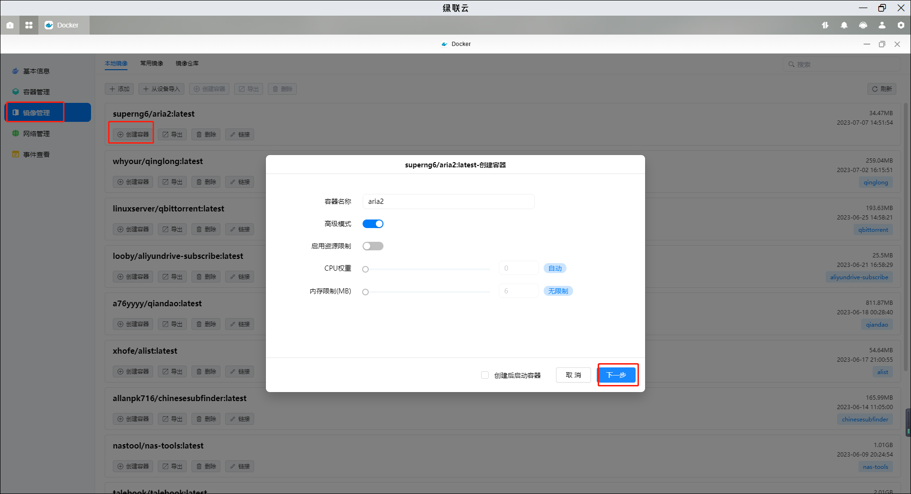

3、基础设置里重启策略设置为容器退出时总是重启容器(这样在设备重启或者开机下会自动打开 Aira2)

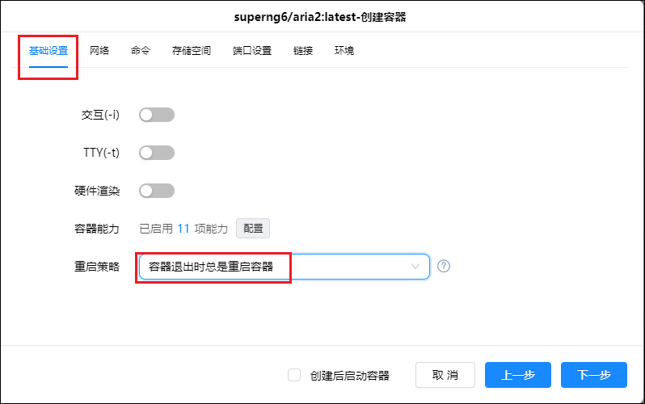

4、存储空间设置，需要在你存放 Docker 的硬盘中创建一个 Aria2 文件，并创建两个子文件夹分别为 www 和 config，在你的下载盘中设置一个 download/aria2 文件夹。装在路径默认，类型全部读写。

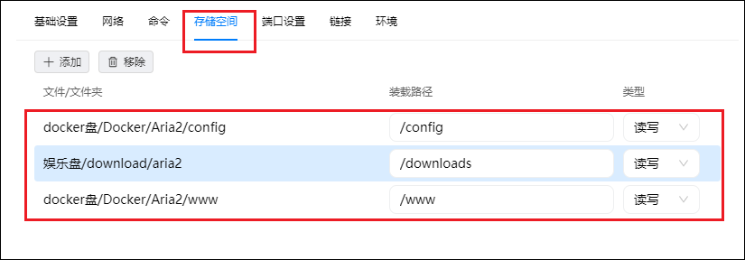

5、端口设置，因为绿联内置离线下载使用了 6800 端口，需要把本地端口修改 6800 以外的未被占用的端口如我这里设置的 16800。这个 16800 端口需记住，是我们的 Aira2 的链接端口，后续图形化面板和 Alist 都用的到。

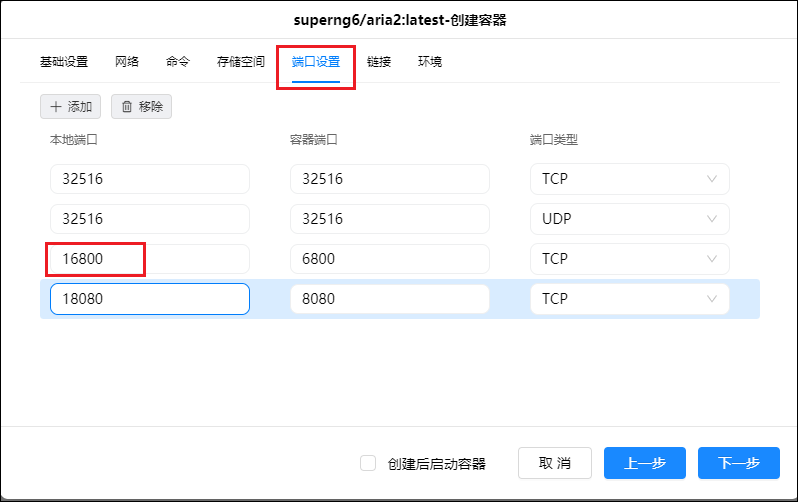

6、到达环境往下翻可以看到一个 SECRET 这里是你的密钥设置你可以设置成自己记得住的密钥，后续要用。

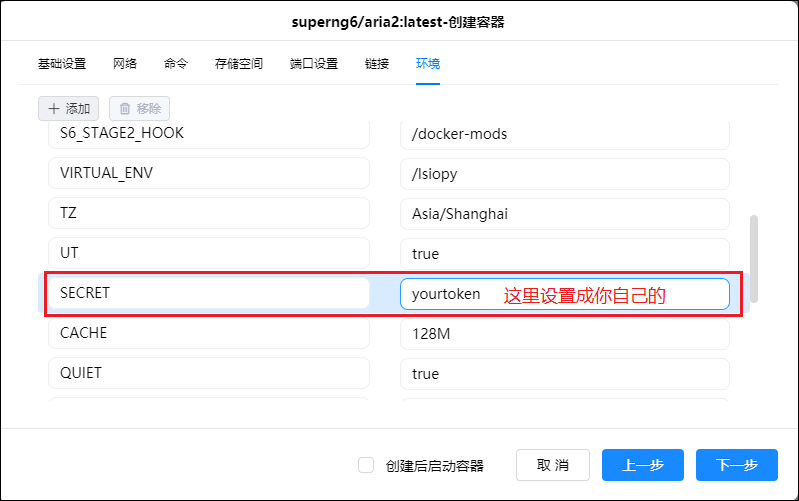

7、然后我们点击下一步，再点击完成 aria2 容器部署。

## 2.ariang 容器部署

1、在镜像仓库界面查找并下载 p3terx/ariang 最新版镜像

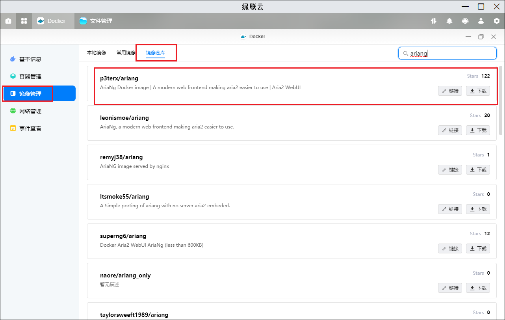

2、点击创建容器

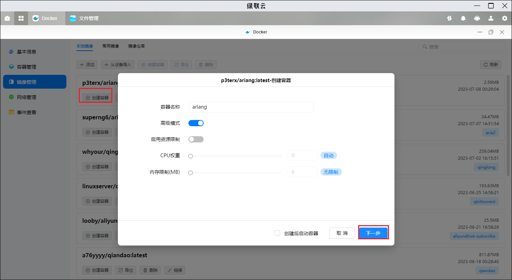

3、基础设置里重启策略设置为容器退出时总是重启容器(这样在设备重启或者开机下会自动打开 ariang)

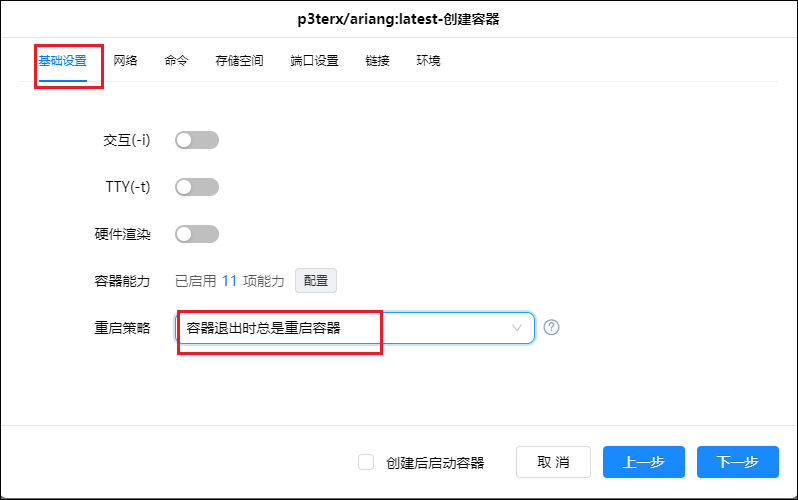

4、跳过命令和存储空间，把端口设置为 6880。

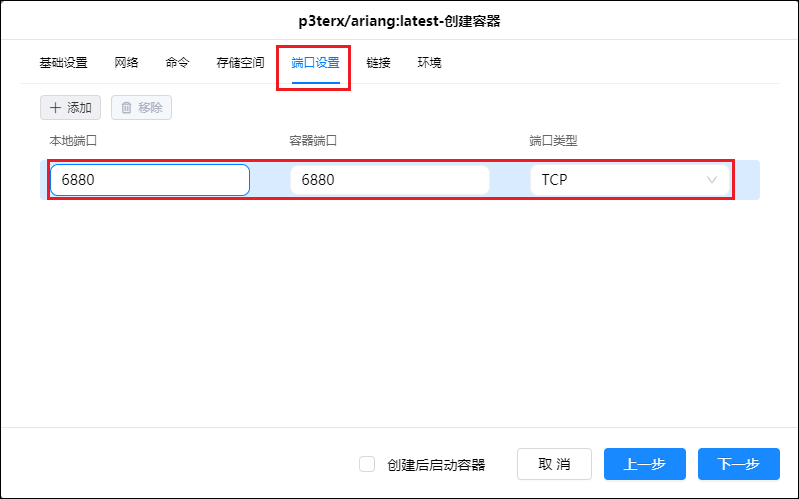

点击下一步然后点击完成，至此 ariang 容器部署完成。

## 3.ariang 连接 Aira2

1、打开浏览器输入你的绿联云 IP+ariang 端口进入 ariang，这个时候出现个认证失败不要管。 在左侧设置栏进入 AriaNG 设置，输入你的 Aira2 的端口号 16800 以及密钥。然后点击重新加载 AiraNG

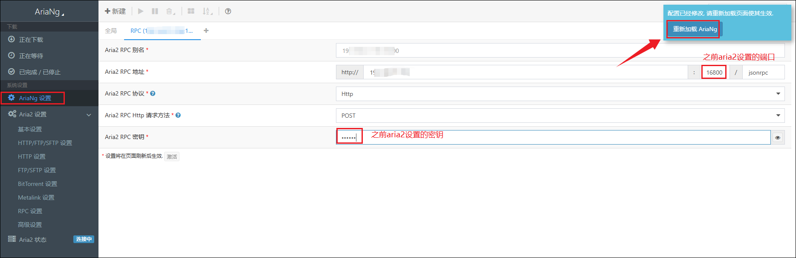

2、这样我们就可以看到我们的状态就是已经连接的状态了

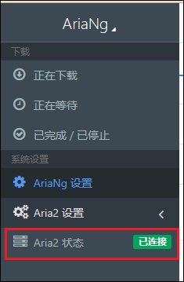

## 4.Ailst 连接 Aira2

1、登录 Alist 界面点击本地设置

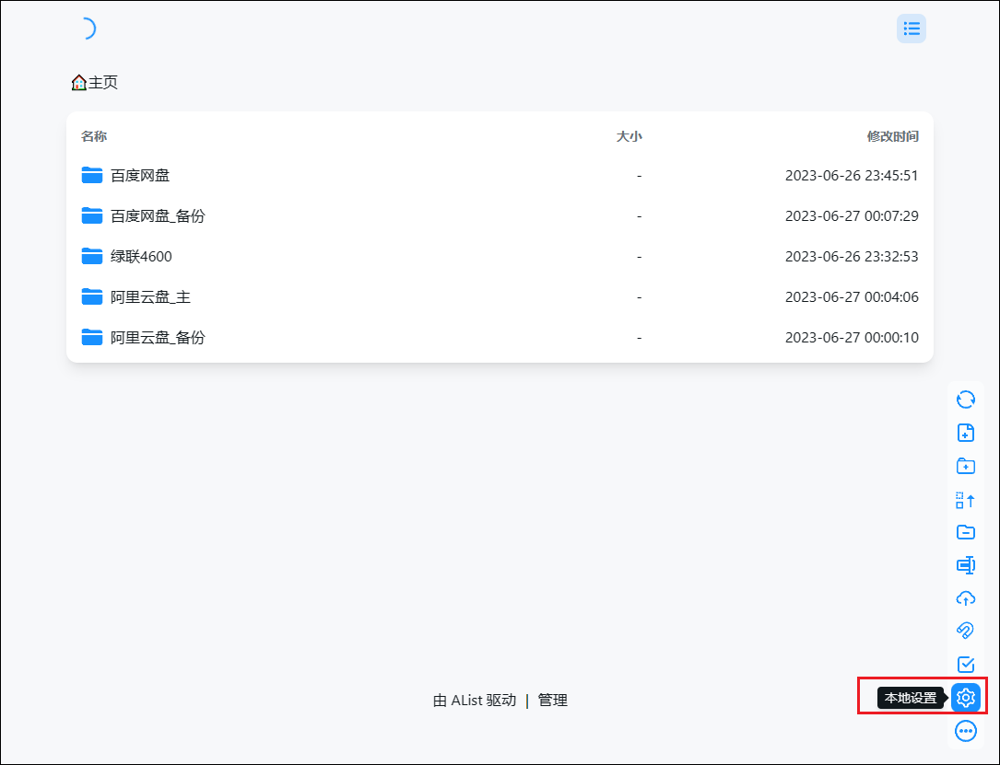

2、填写你设置的 Aira2 的 ip 和端口以及密钥

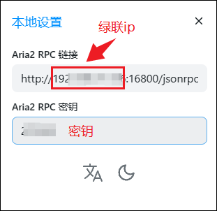

3、然后打开复选框

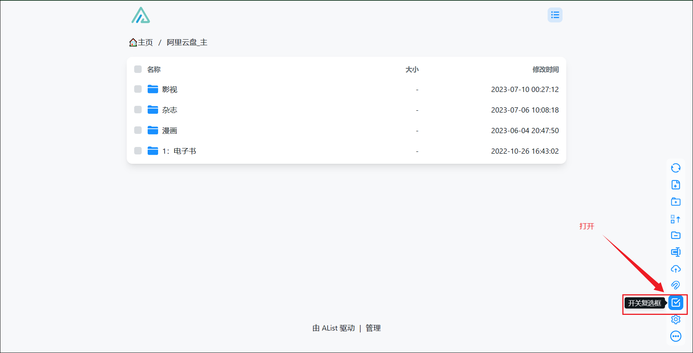

4、然后就可以选中我们需要的文件，点击下方下载图标，有一个发送到 Aira2，点击发送。

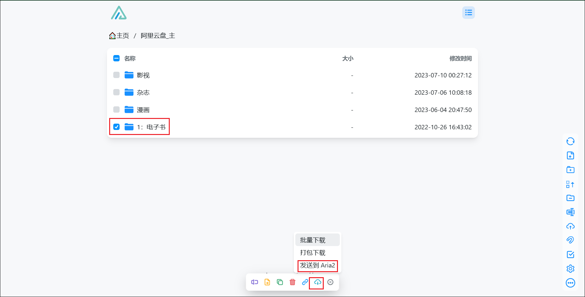

5、右上角会弹出弹窗已经成功发送到 aria2。

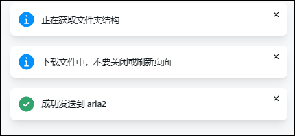

6、我们回到 AiraNG 界面可以看到下载进度。

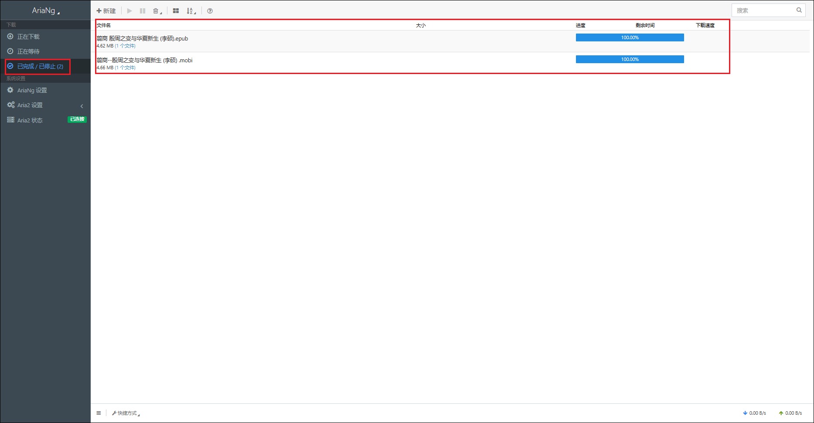

7、在我们上面 Aria2 存储空间配置的下载文件夹中可以看到我们下载成功的文件。

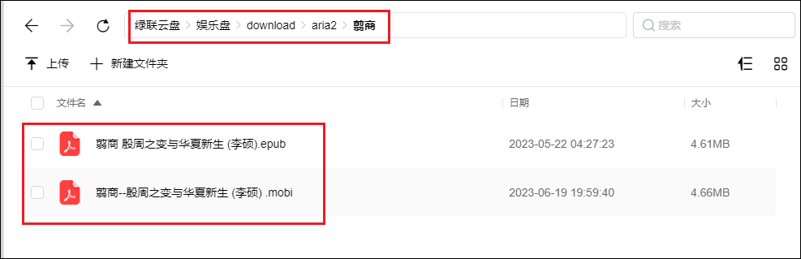
