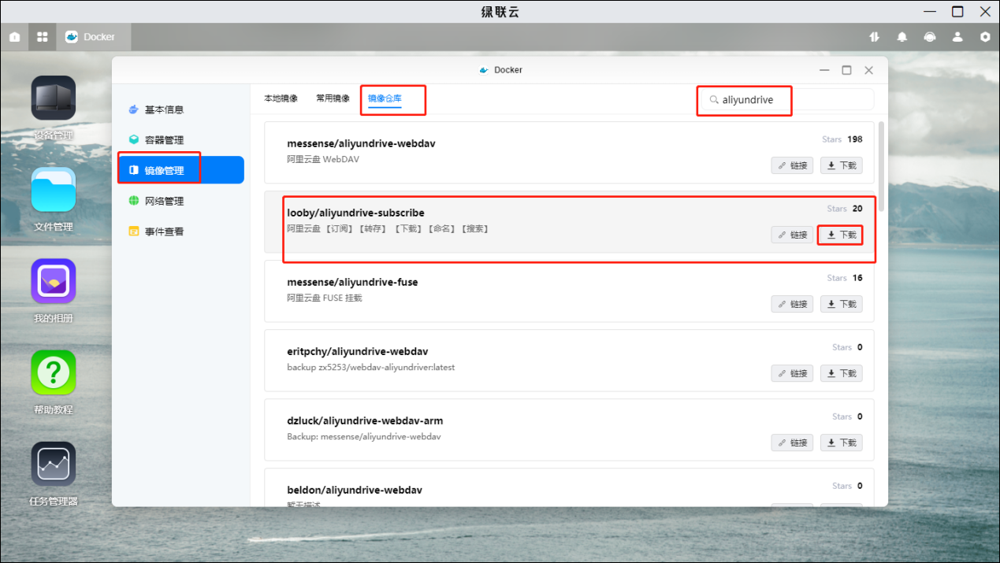
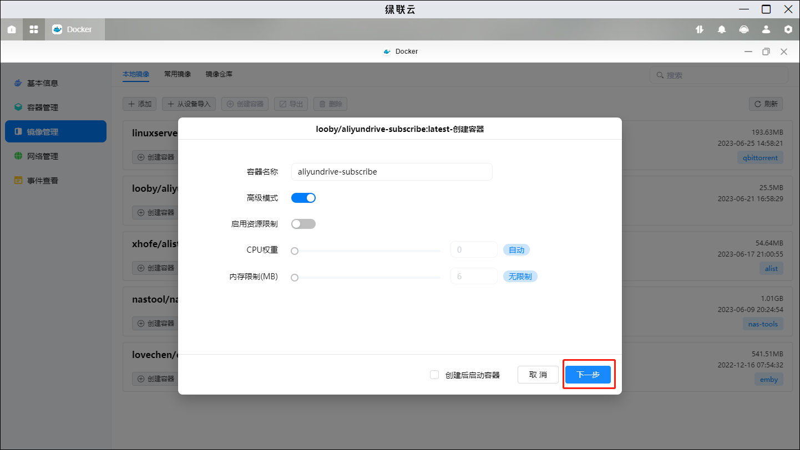
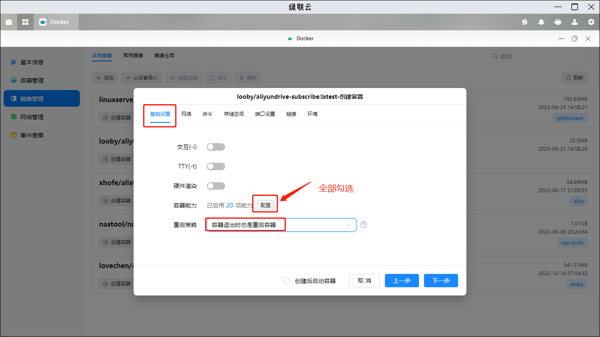
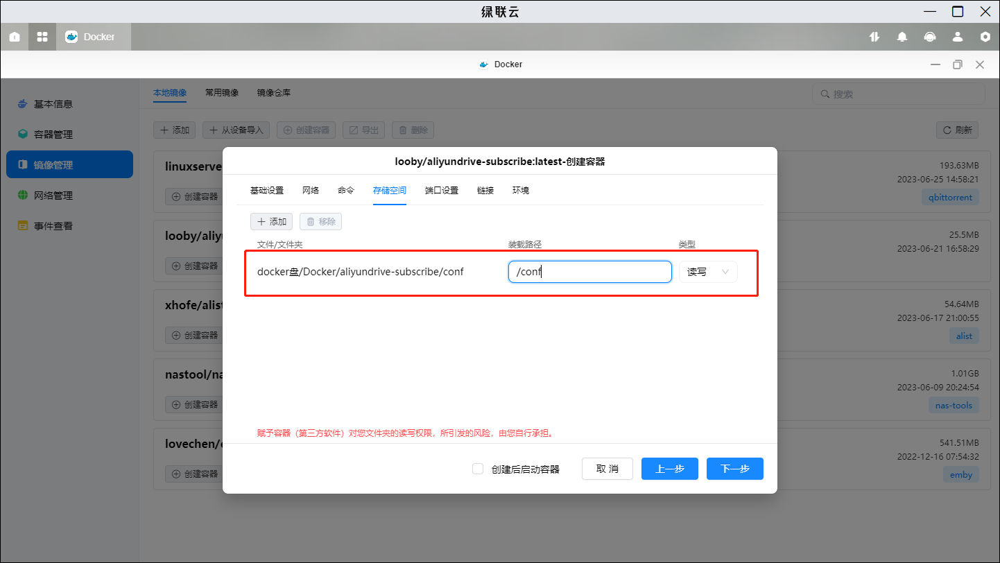
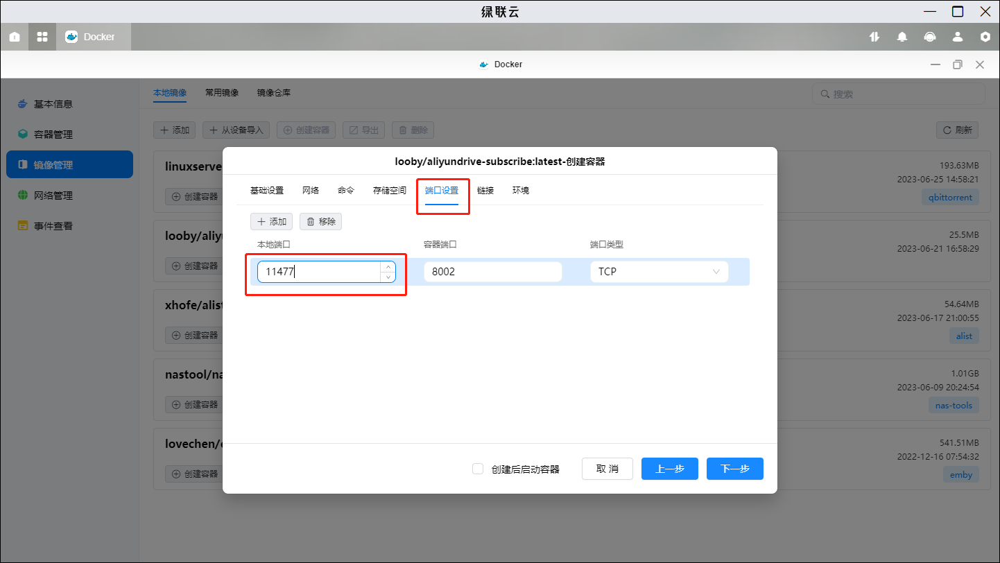
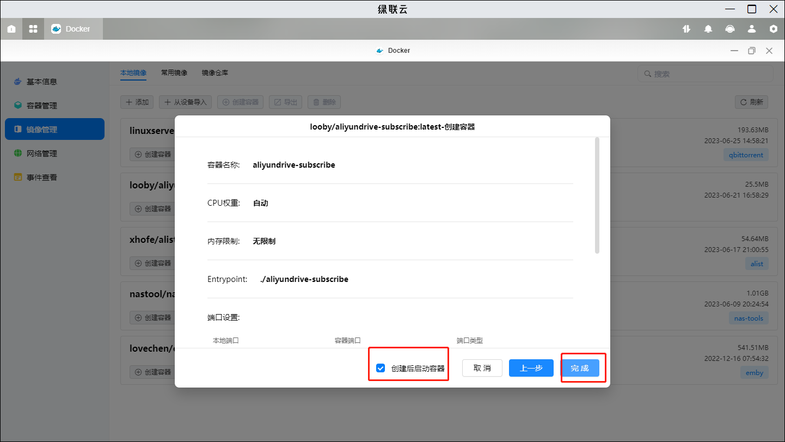
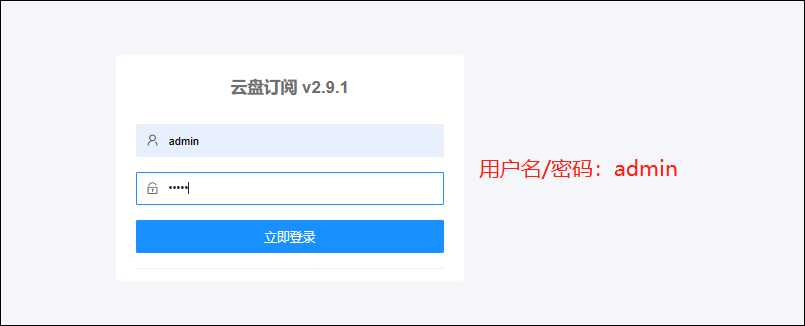
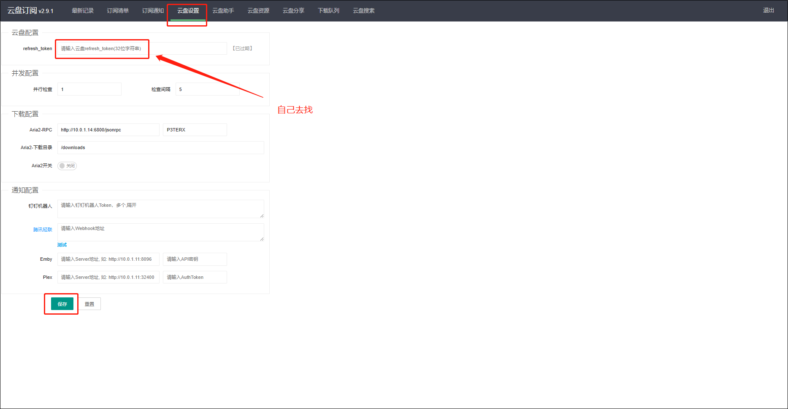

## 容器部署

1、在绿联 docker-镜像管理-镜像仓库中输入 aliyundrive，选择第二个镜像下载。

2、在本地仓库中找到刚刚下载好的镜像，点击创建容器，点击下一步。

3、在基础设置里把容器能力全部勾选，重启策略选择容器退出时总是重启容器。

4、在 docker 盘里新建个文件夹 aliyundrive-subscribe，并把子文件夹 conf 挂载为/conf.

5、端口设置这里本地端口设置个没有被占用的即可。然后点击下一步。

6、勾选创建后启动容器，点击完成。

## 使用

1、在浏览器输入绿联 IP:本地端口，进入登录界面，初始用户名和密码都是 admin。

2、点击云盘设置，输入阿里云的 refresh_token.

