官方在线文档：<https://www.notion.so/xiaoya-docker-69404af849504fa5bcf9f2dd5ecaa75f#444f2033d834427b80114fc0d774d53c>

## 准备工作

1、在本地新建三个 txt 文件夹，内容如下：

1）token

- 文件名称：mytoken.txt
- 用途：用来加载阿里分享，和自动签到
- 格式：75fee1ca79514e60aa6d46c8370b9afd
- 备注：32 位长度，阿里云更新，网页版的 refresh_token 已经失效不可以再用。
  - 安卓手机最新获取的 refresh_token 的方法如下：
    - 1、在手机安装好“阿里云盘 APP”，并正常登录一次；
    - 2、在手机安装“ES 文件浏览器”，浏览本地内部存储，进入“Android/data/com.alicloud.databox/files/logs/trace/”，会看到随机生成的文件夹日志，进入，找最新的文件，下载到电脑上，记事本打开搜索 refreshToken；
  - iPhone 手机获取方法：不清楚
  - 没有选择的话用 https://aliyuntoken.vercel.app/

2）open token

- 文件名称：myopentoken.txt
- 获取方式：<https://alist.nn.ci/zh/guide/drivers/aliyundrive_open.html>
- 用途：用来加载自己的阿里云盘（open 接口）
- 格式：eyJ0eXAiOixxxxxLCJhbGciOiJSUzI1NiJ9.eyJzd999999wNzBkOWRiNWQ5YmQ0YT........
- 备注：很长一串，280 位，获取方式：<https://alist.nn.ci/zh/guide/drivers/aliyundrive_open.html>，如果已经部署 alist 并挂载好阿里的话，还有个简单的办法，直接从 alist 里面复制。

3）转存目录的 folder id

- 文件名称：temp_transfer_folder_id.txt
- 用途：你的阿里⽹盘的转存目录的 folder id
- 格式：640xxxxxxxxxxxxxxxxxxxca8a
- 备注：先转存这个<https://www.aliyundrive.com/s/rP9gP3h9asE>到自己网盘（选择资源库），然后浏览器打开转存后的目录，此时的浏览器 url：<https://www.aliyundrive.com/drive/file/resource/640xxxxxxxxxxxxxxxxxxxca8a> ，最后这一串 640 开头的就是。记得这个目录不要删，里面的内容可以定期删除。

2、在绿联的 docker 文件夹下新建一个 xiaoya 文件夹，并把这三个 txt 文件上传进去。

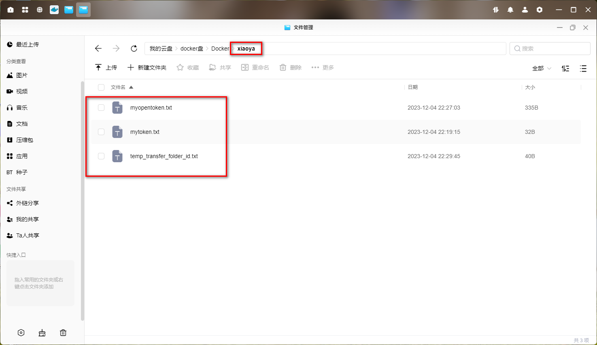

3、额外的文档，更多可参考官方文档

1）强制登陆

说明： 设置强制登入和自定义密码，把密码保存到 /etc/xiaoya/guestpass.txt （不过不要设置稀奇古怪的符号，例如；&#“~@（）\*$ 之类的）。如果你的 xiaoya 放在公网，为了防止别人蹭网，可以设置强制登入，新增 /etc/xiaoya/guestlogin.txt 这个文件，重启即可，文件有没有内容无所谓，如果取消强制登入就删除这个文件。强制登入的账号为 dav，密码使用/etc/xiaoya/guestpass.txt 里设置的，同时 webdav 连接使用 dav 这个用户，上述 2 个功能设置好后需要重启 docker 才会生效。

- 文件：guestpass.txt
  - 用途：自己修改 guest 账号的密码
  - 备注：如果开启了强制登入则 登入账号 dav 也使用此密码
- 文件：guestlogin.txt
  - 用途：通过此文件的存在与否来决定是否开启强制登入
  - 格式：空白文件，不需要强制登入功能则删除此文件

2）代理

文件：proxy.txt
用途：使用代理，http，https，socks5 协议
格式：http://xxxxx:7890 或 socks5://xxxxx:7891 （最后不要加 /)

## 容器部署

1、在绿联 docker-镜像管理-本地镜像中点击添加，选择官方库，输入 xiaoyaliu/alist:hostmode，下载 hostmode 版本镜像。

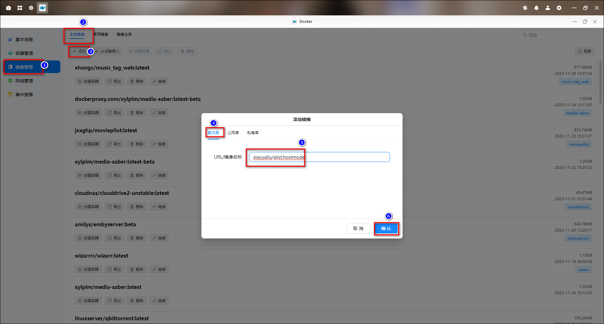

2、点击创建容器，容器名称默认是 alist2，这里改一下。勾选创建后启动容器，点击下一步。

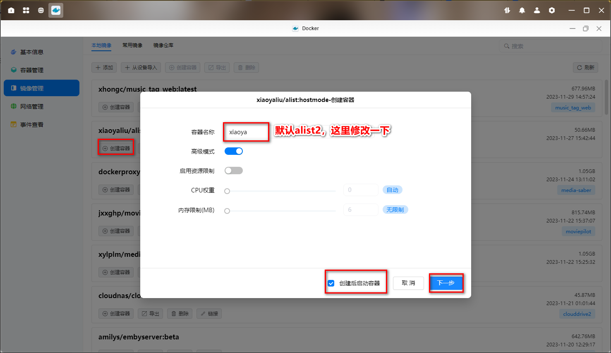

3、基础设置选择重启策略

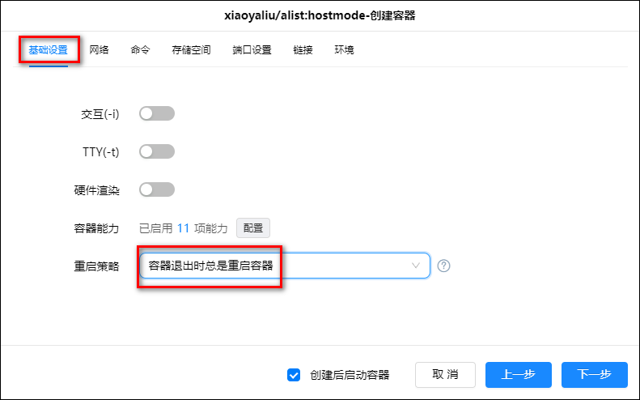

4、网络选择 host

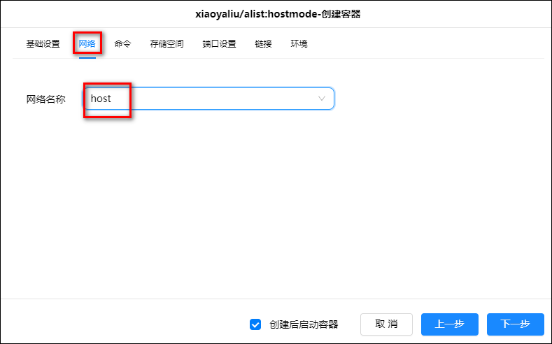

5、存储空间把之前添加的 xiaoya 文件夹挂载为/data，类型选写读写。

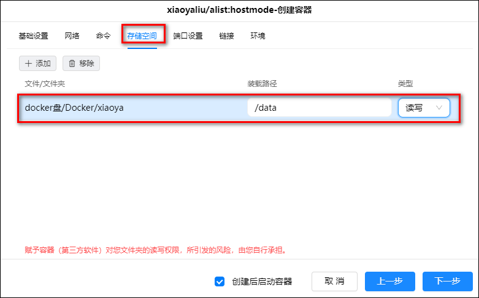

6、等待一会，等加载完毕，可以在日志里查看进度。如果日志里出现`failed to refresh token: Too Many Requests`这个错误，则继续等一会。

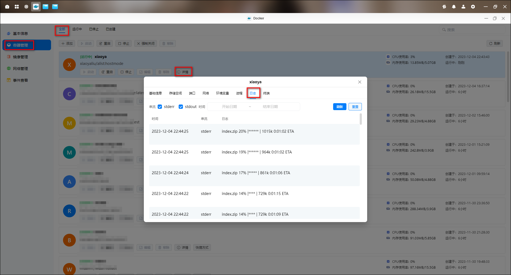

7、在浏览器输入 IP:6789 进入界面。

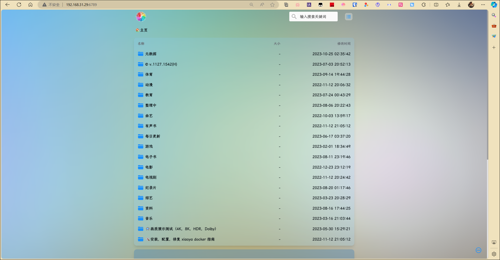

如果布置了 guestpass.txt 文件的话，需要输入账户密码才可以进入。

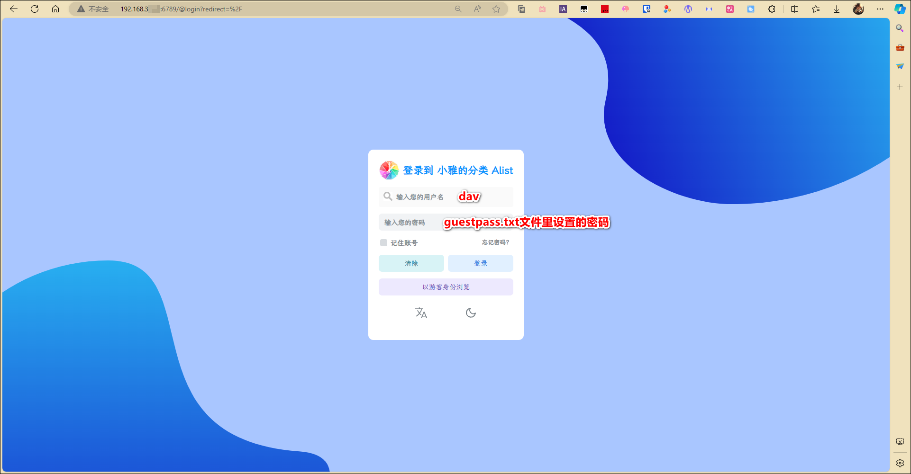

## clouddrive2 挂载

1、点击添加网盘，选择 webdav，服务器输入 http://ip:6789/dav，用户名是 dav，密码就是 guestpass.txt 设置的密码。[clouddrive2 部署方法点这里](/tool/clouddrive2/)。

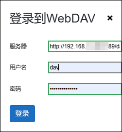

2、在左边点击挂载小雅 alist 的 webdav，然后点击电脑样式的挂载到本地按钮添加挂载点，挂载点选择我们创建的 cloudshare 目录，然后点击挂载。

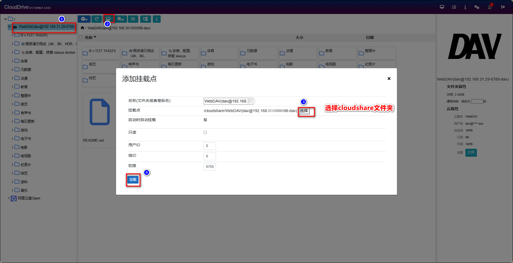

3、现在我们本地 docker 目录中的 cloudshare 文件夹已经有了我们小雅的资源了。

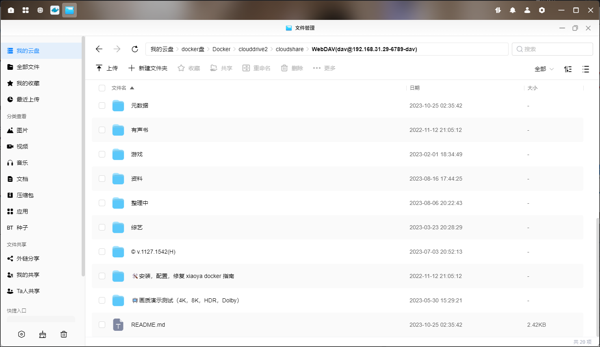

## 使用 EMBY 展示小雅的内容

官方文档：<https://xiaoyaliu.notion.site/d353c9ceb15444d7b8e21ce6097ed739?v=145044ac8252470a9feef094ff1db520>
