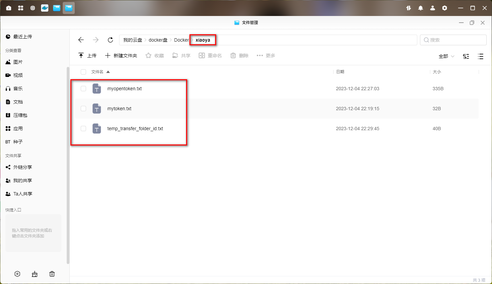
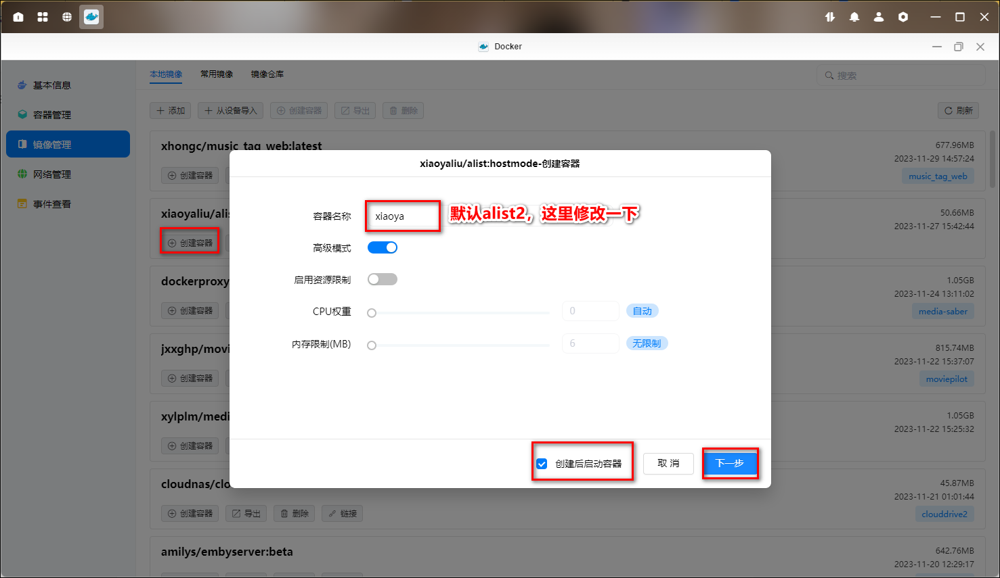
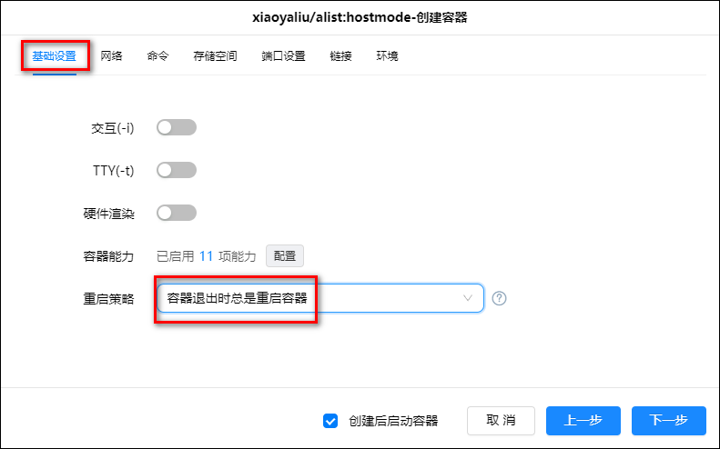
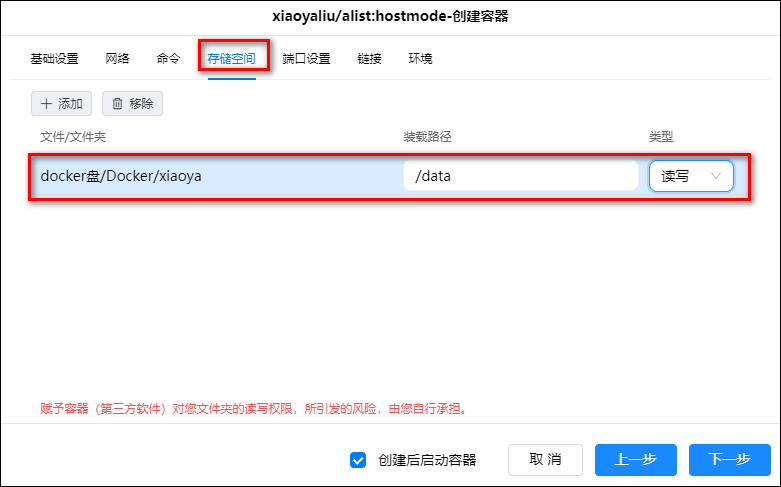
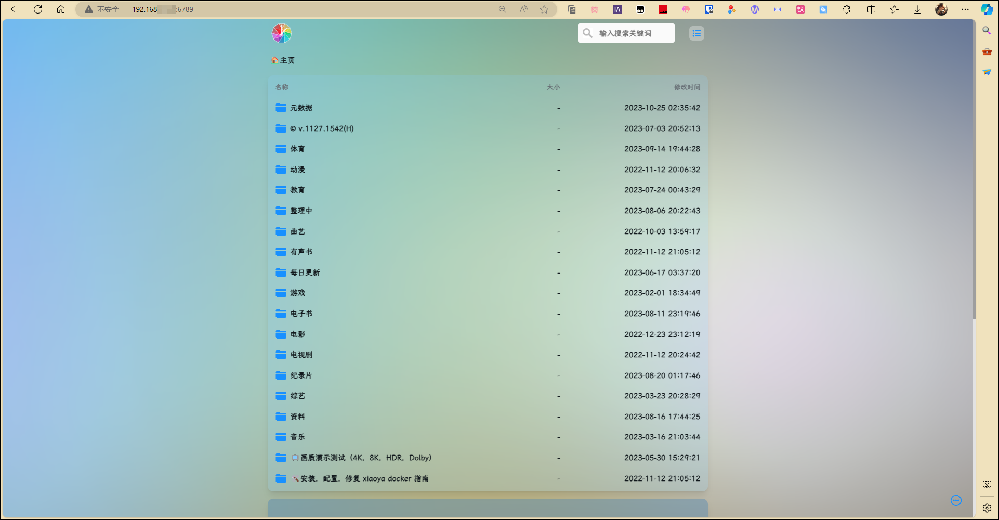
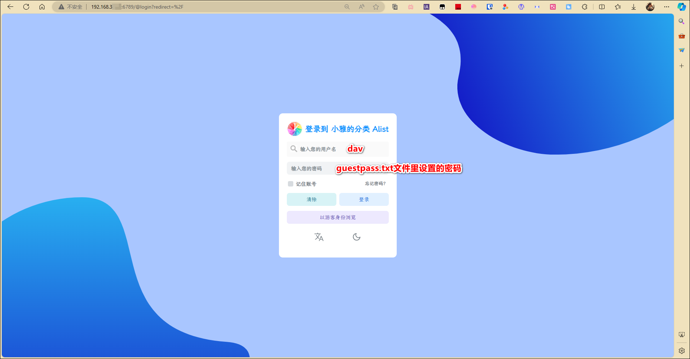
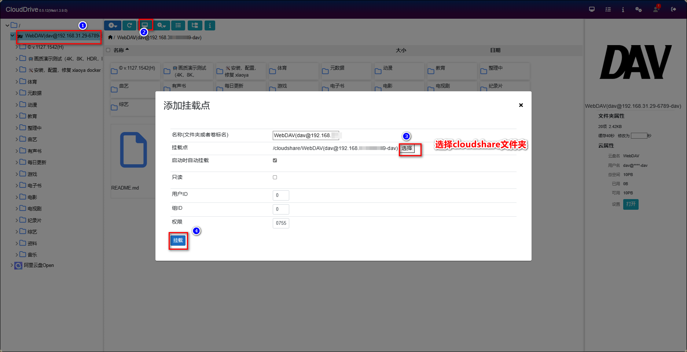
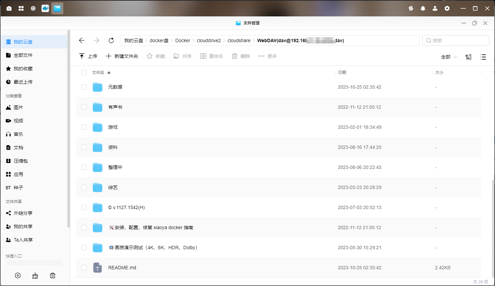

官方在线文档：<https://www.notion.so/xiaoya-docker-69404af849504fa5bcf9f2dd5ecaa75f#444f2033d834427b80114fc0d774d53c>

## 准备工作

1、在本地新建三个txt文件夹，内容如下：

1）token
- 文件名称：mytoken.txt
- 用途：用来加载阿里分享，和自动签到
- 格式：75fee1ca79514e60aa6d46c8370b9afd
- 备注：32位长度，阿里云更新，网页版的refresh_token已经失效不可以再用。
  - 安卓手机最新获取的refresh_token的方法如下：
    - 1、在手机安装好“阿里云盘APP”，并正常登录一次；
    - 2、在手机安装“ES文件浏览器”，浏览本地内部存储，进入“Android/data/com.alicloud.databox/files/logs/trace/”，会看到随机生成的文件夹日志，进入，找最新的文件，下载到电脑上，记事本打开搜索refreshToken；
  - iPhone手机获取方法：不清楚
  - 没有选择的话用 https://aliyuntoken.vercel.app/

2）open token
- 文件名称：myopentoken.txt
- 获取方式：<https://alist.nn.ci/zh/guide/drivers/aliyundrive_open.html>
- 用途：用来加载自己的阿里云盘（open接口）
- 格式：eyJ0eXAiOixxxxxLCJhbGciOiJSUzI1NiJ9.eyJzd999999wNzBkOWRiNWQ5YmQ0YT........
- 备注：很长一串，280位，获取方式：<https://alist.nn.ci/zh/guide/drivers/aliyundrive_open.html>，如果已经部署alist并挂载好阿里的话，还有个简单的办法，直接从alist里面复制。

3）转存目录的folder id
- 文件名称：temp_transfer_folder_id.txt
- 用途：你的阿里⽹盘的转存目录的folder id
- 格式：640xxxxxxxxxxxxxxxxxxxca8a
- 备注：先转存这个<https://www.aliyundrive.com/s/rP9gP3h9asE>到自己网盘（选择资源库），然后浏览器打开转存后的目录，此时的浏览器url：<https://www.aliyundrive.com/drive/file/resource/640xxxxxxxxxxxxxxxxxxxca8a> ，最后这一串640开头的就是。记得这个目录不要删，里面的内容可以定期删除。 

2、在绿联的docker文件夹下新建一个xiaoya文件夹，并把这三个txt文件上传进去。

3、额外的文档，更多可参考官方文档

1）强制登陆

说明： 设置强制登入和自定义密码，把密码保存到 /etc/xiaoya/guestpass.txt （不过不要设置稀奇古怪的符号，例如；&#“~@（）*$ 之类的）。如果你的xiaoya放在公网，为了防止别人蹭网，可以设置强制登入，新增 /etc/xiaoya/guestlogin.txt 这个文件，重启即可，文件有没有内容无所谓，如果取消强制登入就删除这个文件。强制登入的账号为 dav，密码使用/etc/xiaoya/guestpass.txt 里设置的，同时webdav连接使用 dav 这个用户，上述2个功能设置好后需要重启docker才会生效。

- 文件：guestpass.txt
  - 用途：自己修改 guest 账号的密码
  - 备注：如果开启了强制登入则 登入账号 dav 也使用此密码
- 文件：guestlogin.txt
  - 用途：通过此文件的存在与否来决定是否开启强制登入
  - 格式：空白文件，不需要强制登入功能则删除此文件

2）代理

文件：proxy.txt
用途：使用代理，http，https，socks5 协议
格式：http://xxxxx:7890 或 socks5://xxxxx:7891 （最后不要加 /)

## 容器部署

1、在绿联docker-镜像管理-本地镜像中点击添加，选择官方库，输入xiaoyaliu/alist:hostmode，下载hostmode版本镜像。

2、点击创建容器，容器名称默认是alist2，这里改一下。勾选创建后启动容器，点击下一步。

3、基础设置选择重启策略

4、网络选择host

5、存储空间把之前添加的xiaoya文件夹挂载为/data，类型选写读写。

6、等待一会，等加载完毕，可以在日志里查看进度。如果日志里出现`failed to refresh token: Too Many Requests`这个错误，则继续等一会。

7、在浏览器输入IP:6789进入界面。

如果布置了guestpass.txt文件的话，需要输入账户密码才可以进入。

## clouddrive2挂载

1、点击添加网盘，选择webdav，服务器输入http://ip:6789/dav，用户名是dav，密码就是guestpass.txt设置的密码。[clouddrive2部署方法点这里](/tool/clouddrive2/)。

2、在左边点击挂载小雅alist的webdav，然后点击电脑样式的挂载到本地按钮添加挂载点，挂载点选择我们创建的cloudshare目录，然后点击挂载。

3、现在我们本地docker目录中的cloudshare文件夹已经有了我们小雅的资源了。

## 使用EMBY展示小雅的内容

官方文档：<https://xiaoyaliu.notion.site/d353c9ceb15444d7b8e21ce6097ed739?v=145044ac8252470a9feef094ff1db520>

