## 1、容器创建

1、下载最新版本镜像。

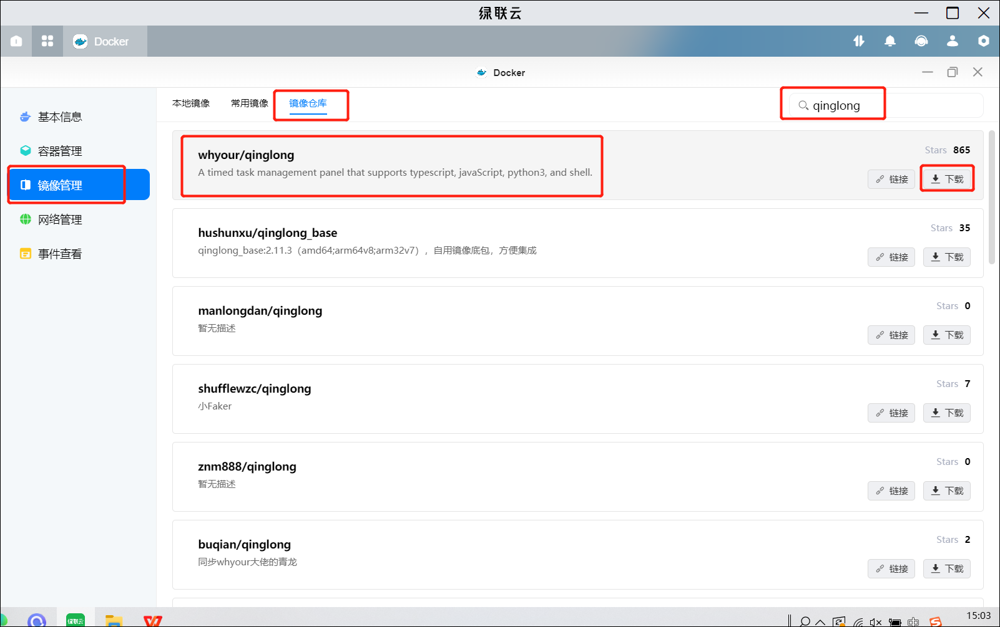

2、点击创建容器，名称自定义，点击下一步。

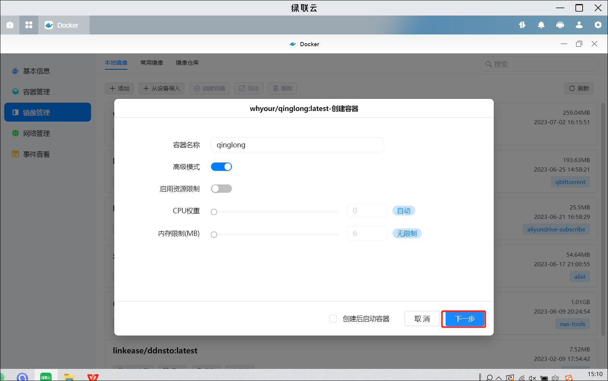

3、配置存储空间

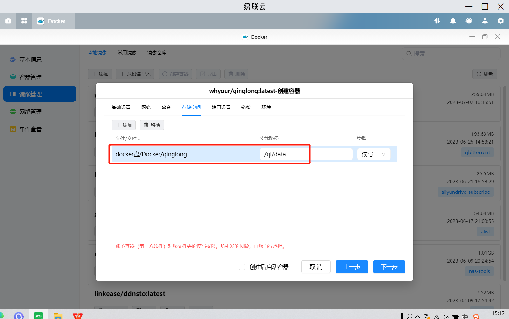

4、配置端口


## 2、初始化

1、在本地浏览器输入 ip:端口进行访问，点击开始安装

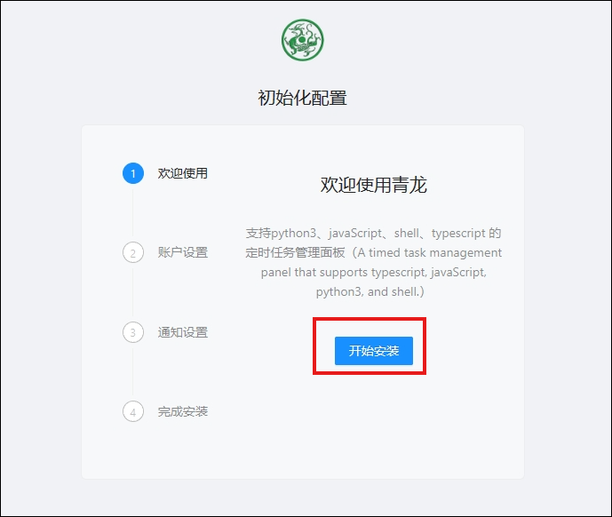

2、设置完管理员账号密码后可以点击提交

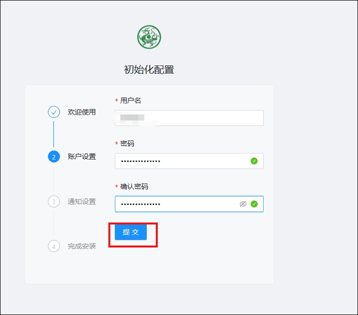

3、通知设置可以先跳过

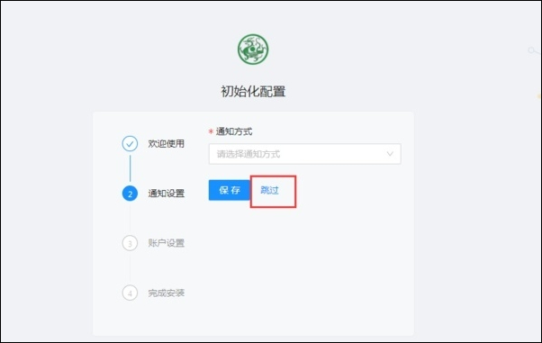

可以后面在系统里设置

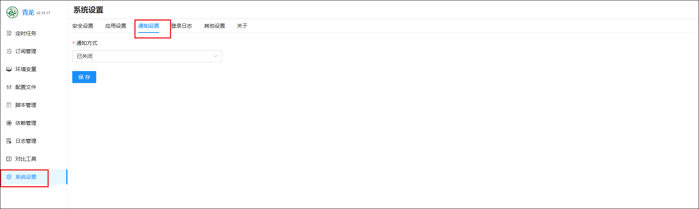

4、点击去登录

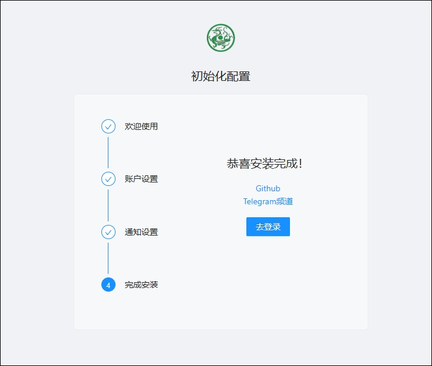

5、输入账户密码点击登录

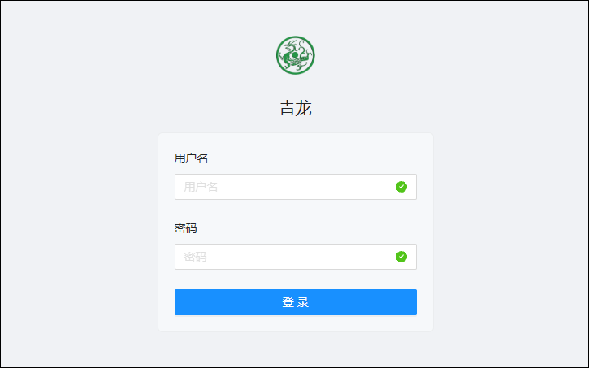

6、登录成功界面

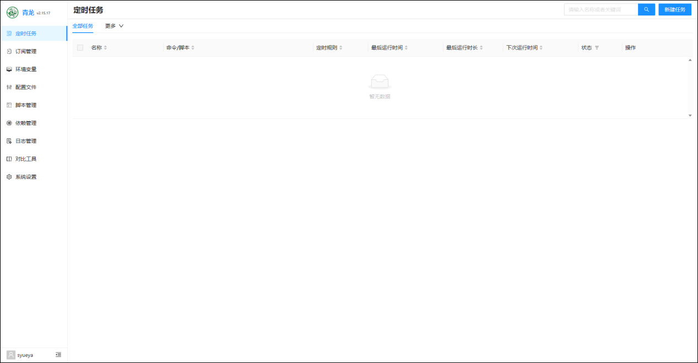

## 3、阿里云签到

1、获取 token

通过[alist 获取阿里云盘的 token](https://alist.nn.ci/zh/guide/drivers/aliyundrive.html)

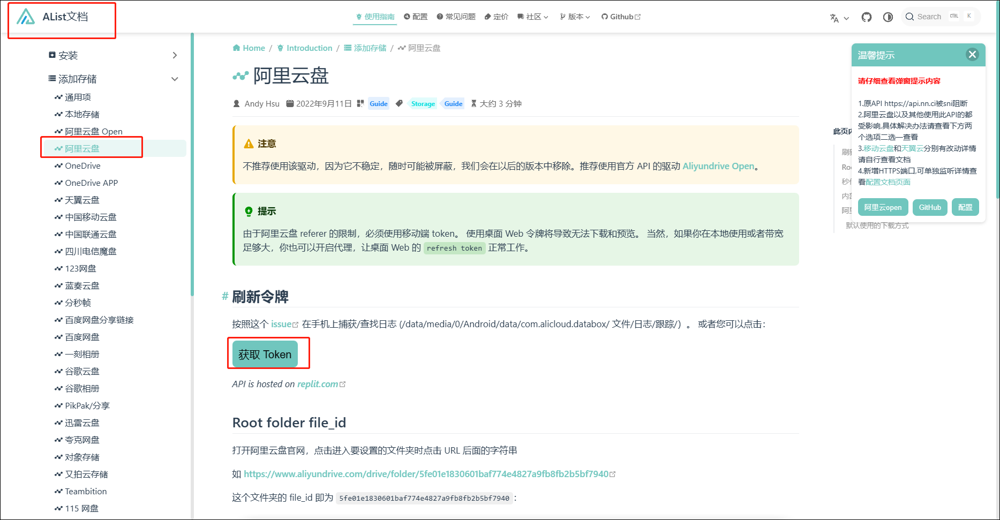

2、新建环境变量

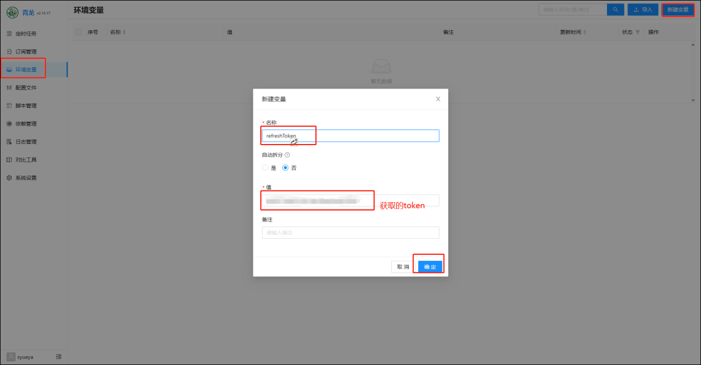

3、新建依赖

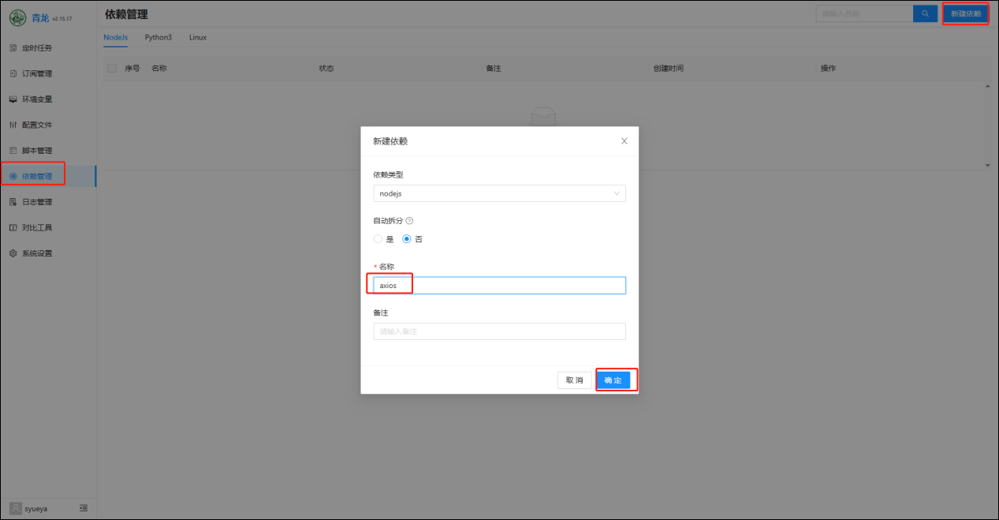

4、新建任务

定时签到程序脚本：

- 国内建议用此脚本：
  ```
  ql repo https://gitee.com/joechen1024/aliyundriveDailyCheck.git "autoSignin" "" "qlApi"
  ```
- 国外原版拉取脚本：
  `    - ql repo https://github.com/mrabit/aliyundriveDailyCheck.git "autoSignin" "" "qlApi"
    - ql repo https://gh-proxy.com/https://github.com/mrabit/aliyundriveDailyCheck.git "autoSignin" "" "qlApi"
   `
  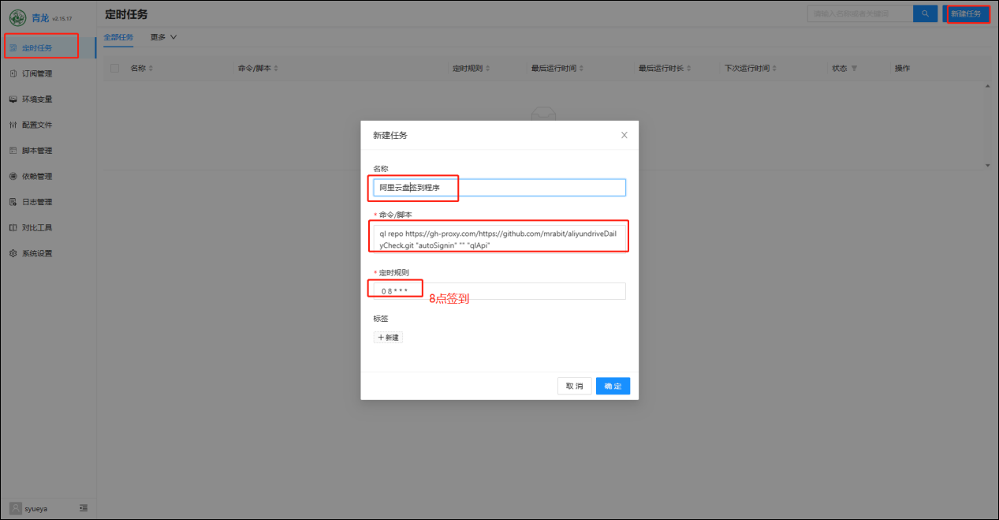

点击运行一次，运行完成后刷新网页

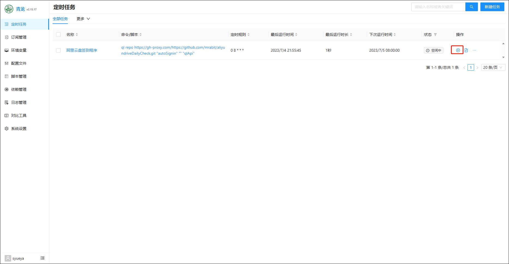

如果多出一条定时任务则表示成功。

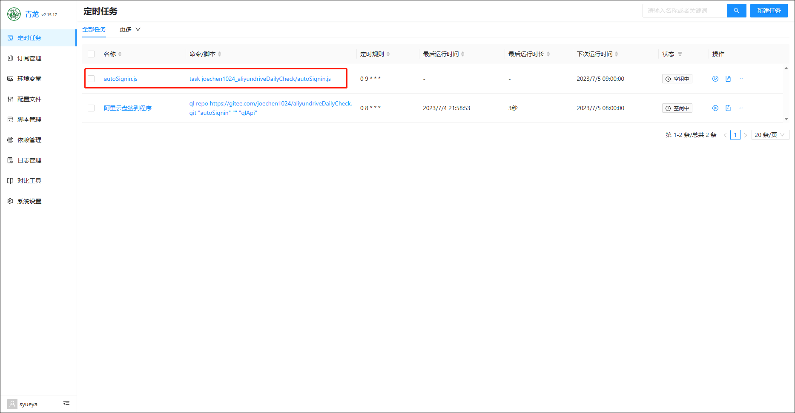

再手动运行一次。

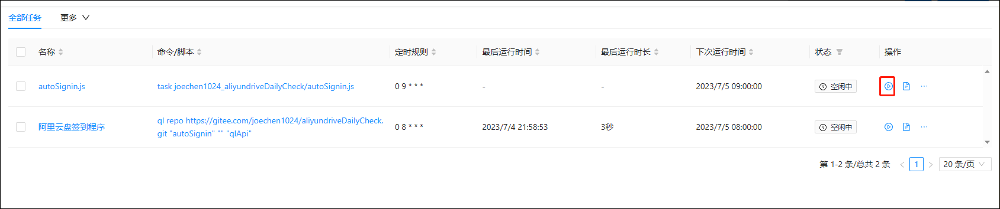

然后查看日志是否正常，如果成功就可以不用管了。

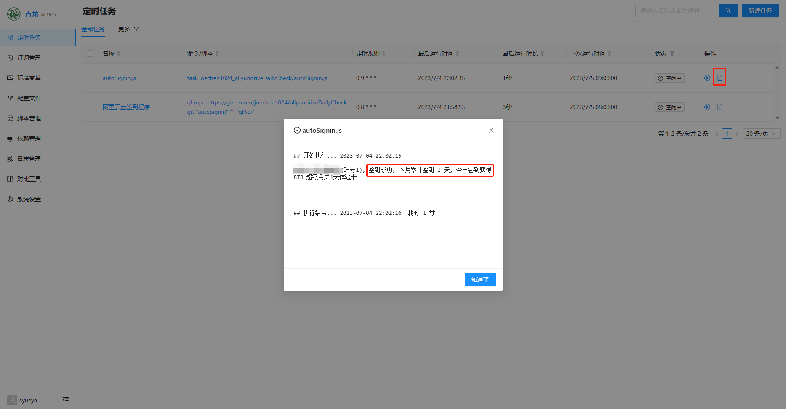

5、如果有两个账号就多新建一个环境变量就行

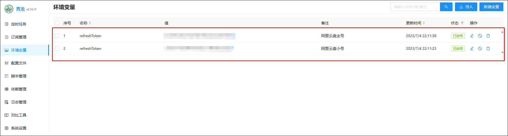

6、消息通知

- 可以在设置里填好通知方式对应的信息。

  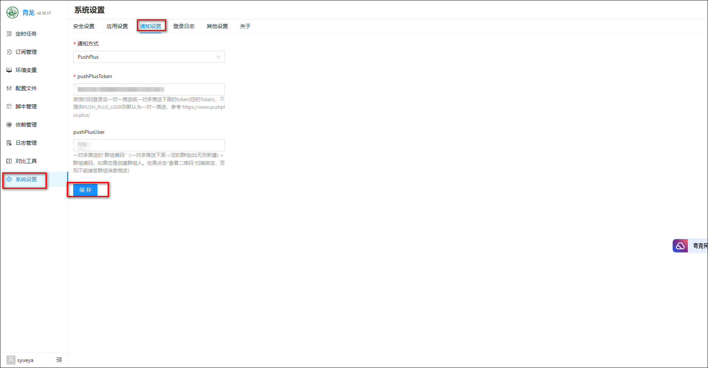

- 也可在配置文件里输入对应的通知方法的信息。

  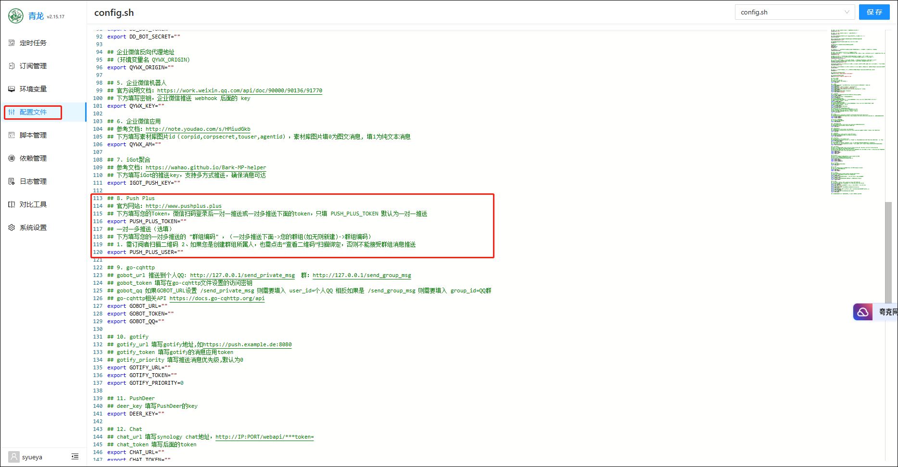
