github 链接：<https://github.com/linuxserver/docker-heimdall>

## 1、容器部署

1、进入绿联 Docker 镜像仓库，搜索 heimdall，选择第一个镜像 linuxserver/heimdall 点击下载拉取镜像，安装版本默认选择 latest。

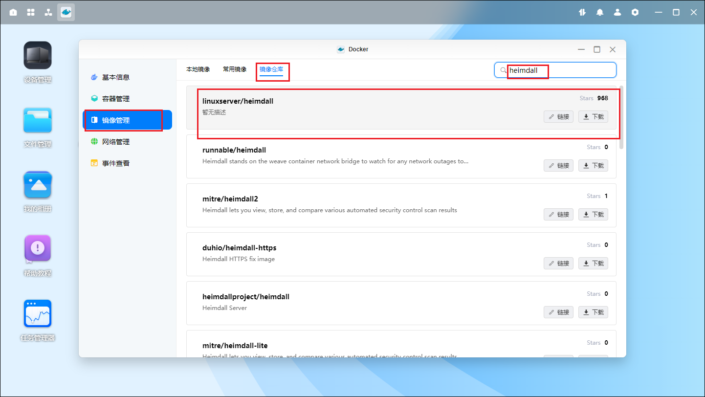

2、下载完成后，在镜像管理中找到刚刚下载的 linuxserver/heimdall 镜像，点击创建容器；名称可以默认也可以自定义，点击下一步

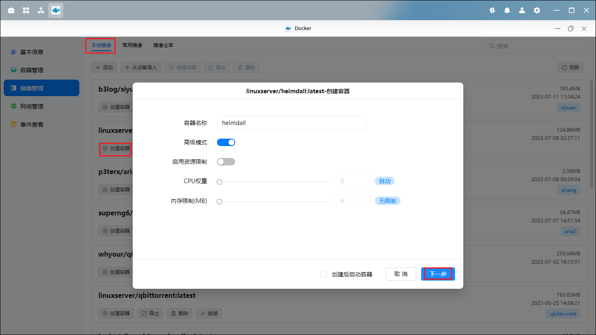

3、在【基础设置】中，重启策略选择容器退出时重启

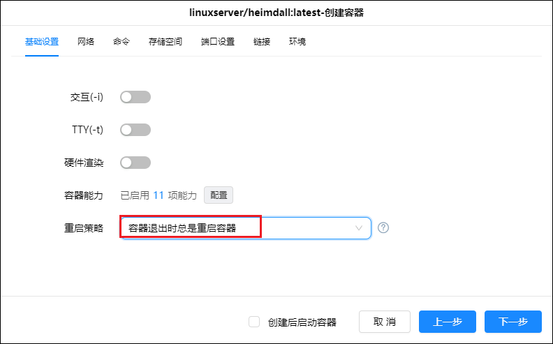

4、【网络】保持默认，即 bridge 模式

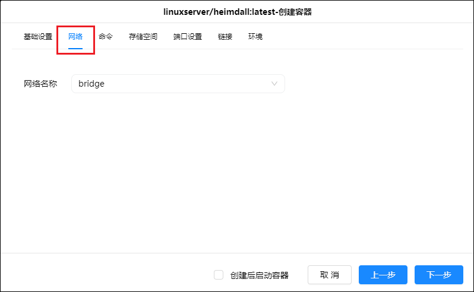

5、【存储空间】选择放置 Docker 的硬盘，新建文件夹，文件夹路径：
docker 盘/Docker/heimdall/config，装载路径默认填“/config”，注意类型选择读写。

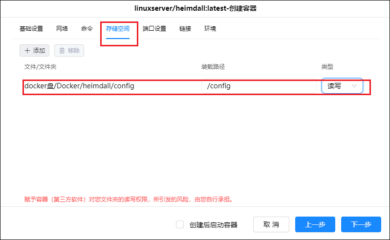

6、【端口设置】这里，容器端口 80 对应 http 的端口，443 对应 https 的端口，为了避免端口冲突，本地端口需要改成其他未被占用的端口，且建议改成比较容易记的端口。

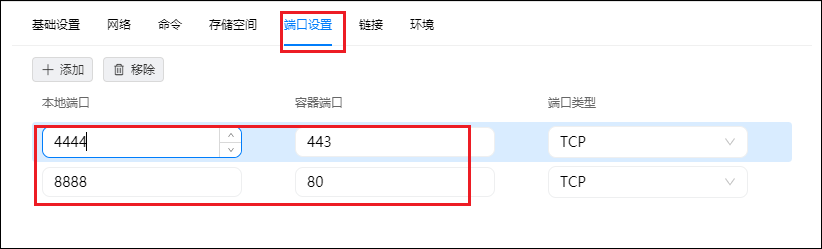

7、【环境】这里添加两条参数：PUID = 1000 PGID =1000。最后点击下一步，就完成了容器的安装配置。

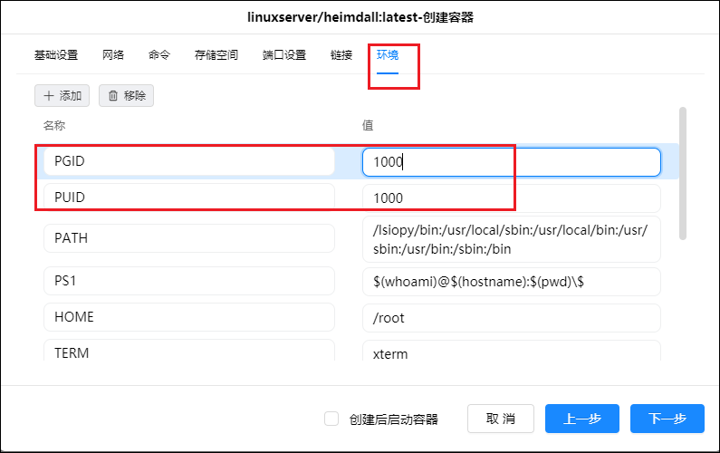

## 2、heimdall 主页配置

完成 deimdall 容器安装后，在浏览器输入 ip:端口号，进入 deimdall 主页。

deimdall 默认为英文界面，但最新版本已支持中文。首先我们先点击右侧最下面的图标进入【设置】界面。

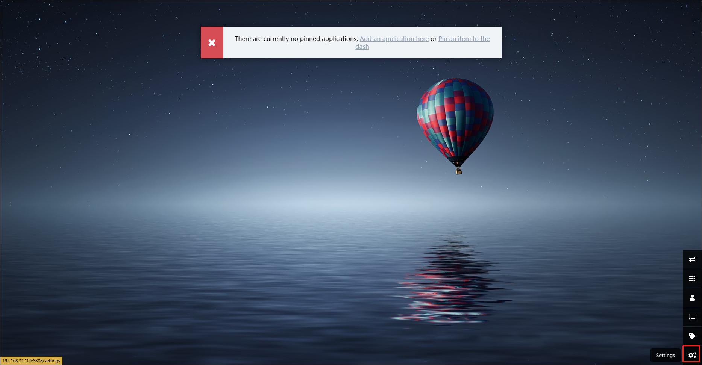

在 Language 中选择 Zh（chinese），点击保存即设置为中文界面。

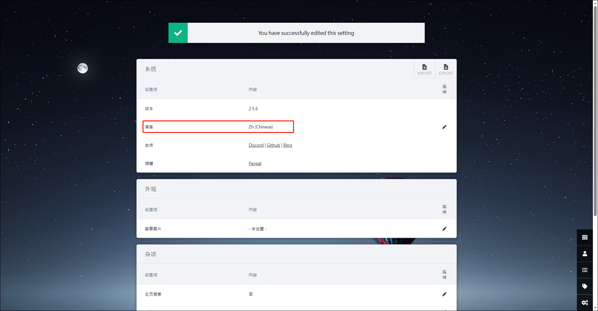

接着回到首页，点击右侧【用户】菜单。

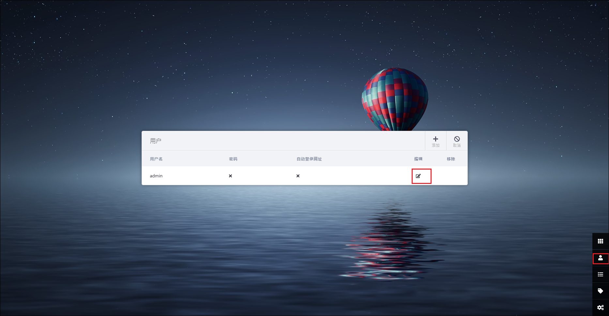

设置账号密码邮箱，同时勾选允许公开访问，点击保存。

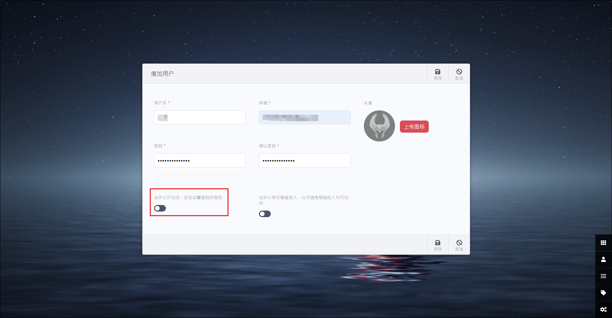

点击【应用列表】菜单，然后在界面点击【添加】即可添加相关页面的快捷链接了。

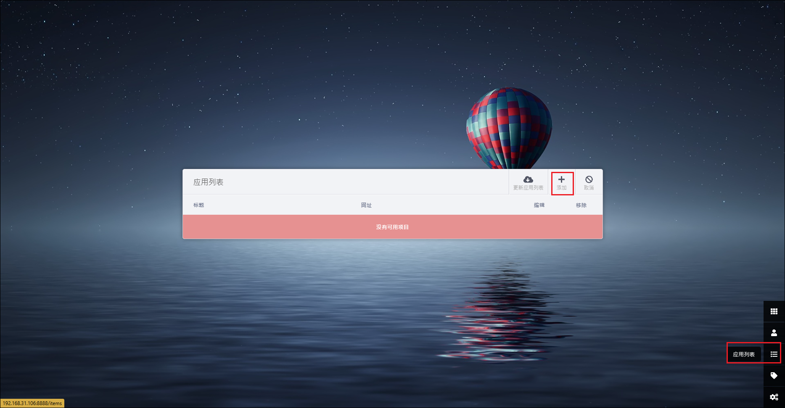

deimdall 自带了一些网站的默认设置、LOGO 等可供选择，也可根据自己喜好进行自定义。网址可以输入相关应用的域名:端口号。（如只需内网访问则输入 IP：端口号）。除了 NAS 内部的应用，还可以添加如百度、淘宝、京东等等外部网站，根据需求定制个人导航，同时可以进行标签的归类。

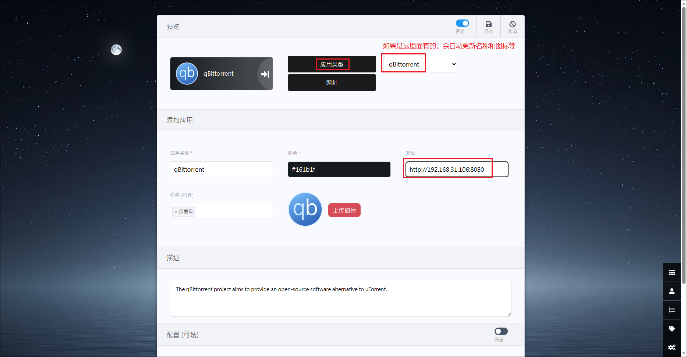
