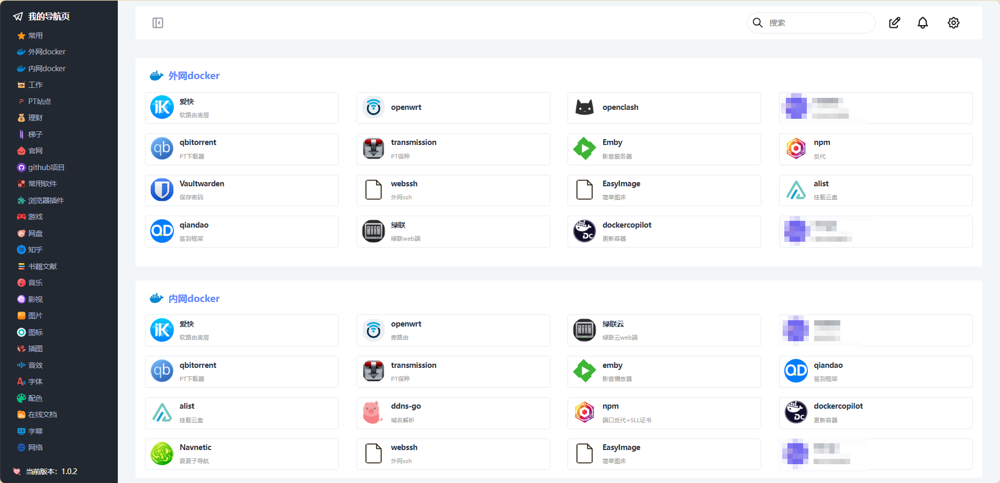
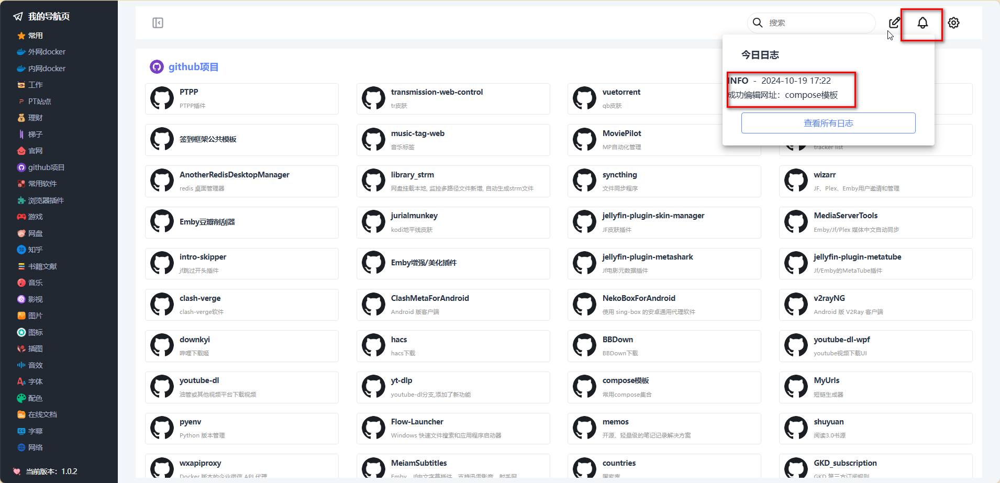
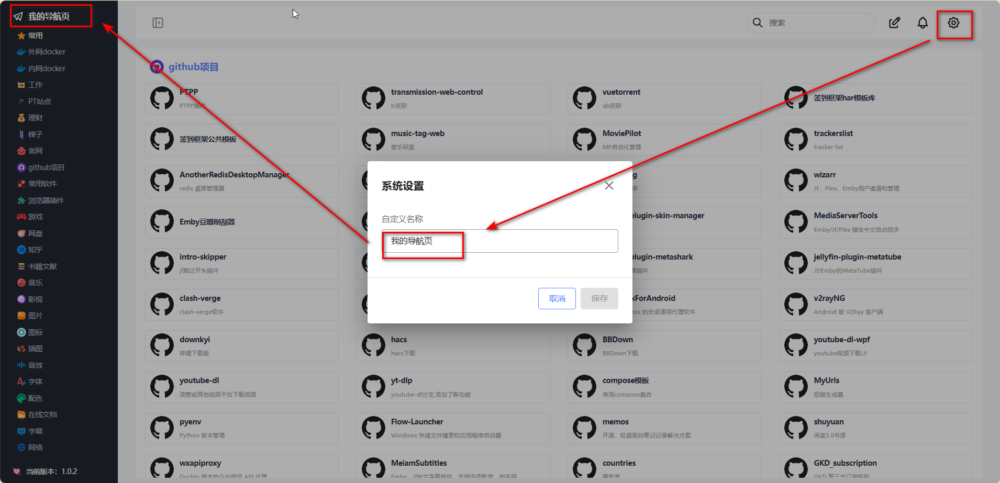

## compose 文件

```
services:
  navnetic:
    image: "syueya/navnetic:latest" 
    container_name: navnetic
    restart: always
    ports:
      - '8880:8888'         # 前面的8880是nas的端口，可以随便取个未被占用的端口
    volumes:
      - "/volume3/docker/navnetic/config:/app/config"  # 配置文件目录
      - "/volume3/docker/navnetic/data:/app/data" # 数据文件目录
      - "/volume3/docker/navnetic/svgs:/app/static/svgs" # 分类图标存放路径
      - "/volume3/docker/navnetic/logos:/app/static/logos"   # 网址图标存放路径
    environment:
      - PORT=8888
      - PUID=1007
      - PGID=10
```

## 挂载说明

挂载目录:
- config目录: 用来存放配置文件
- data目录: 用来存放数据，可以对里面的data.json文件进行编辑，添加、删除、修改分类和网址信息。
- svgs目录: 用来存放分类的svg图标，里面是svg格式的图片。比如有一个分类【常用】，它的category_icon名称是【star】，则把【start.svg】放入svgs目录下。
- logos目录: 用来存放网址logo，里面是png格式的图片。比如分类【常用】下网址【夏夏子blog】的icon名称是【myblog】，则在logos目录下新建个【star】文件夹，然后把【myblog.png】放入。

## 使用

1、打开浏览器，输入nas的ip和端口，端口就是上面配置的nas端口。

2、进入页面后可以看到主页面



3、点击右上角的编辑按钮可以进入显示增删改的按钮，也可以导入收藏夹文件。


4、点击日志按钮可以查看操作日志



5、点击设置按钮可以设置自定义名称

