## 容器部署

1、打开 Docker 管理器，进入镜像管理。然后在镜像仓库中搜索 b3log/siyuan，选择 latest 版本并下载。

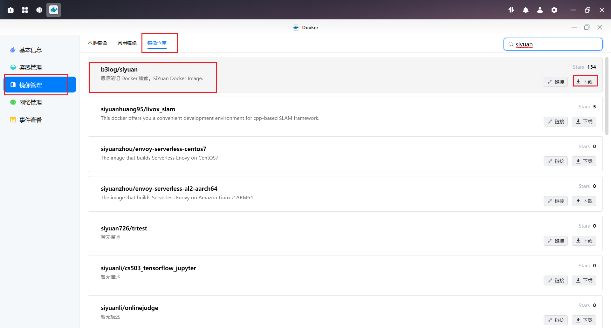

2、下载完成后，我们在本地镜像中找到刚刚下载的镜像，点击创建容器。名称可以自定义，点击下一步。

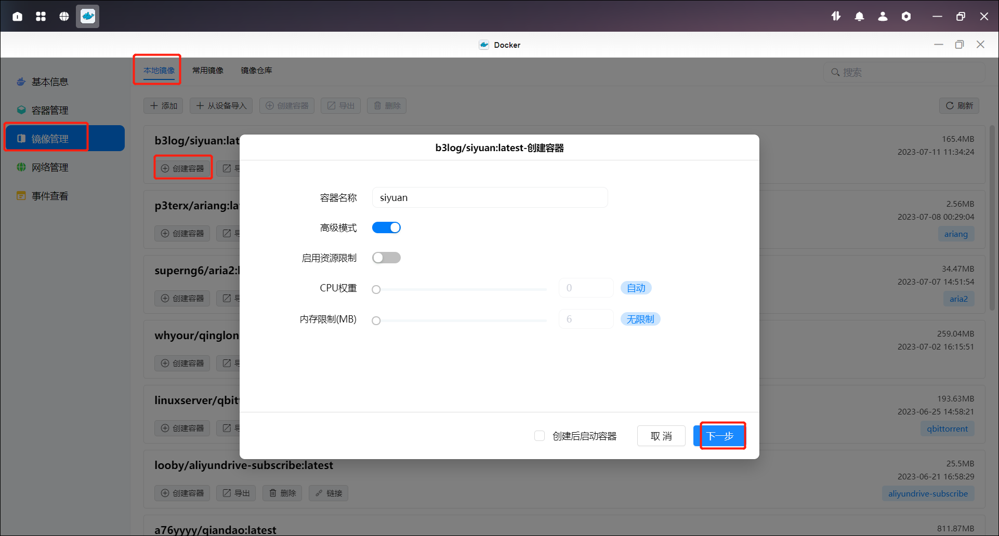

3、在基础设置中，重启策略选择“容器退出时总是重启容器”。

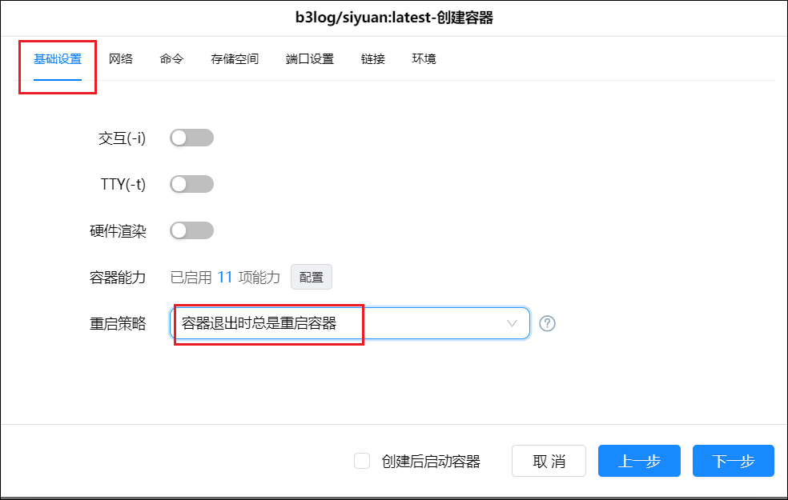

4、在命令中，输入--workspace=/siyuan/workspace。

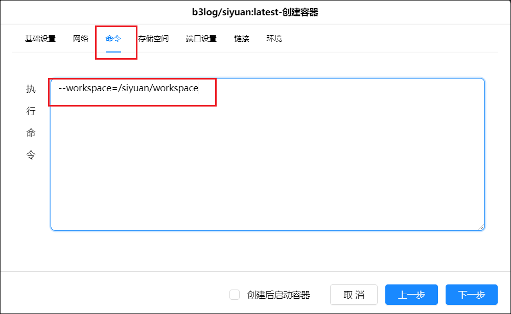

5、在存储空间中，我们先在 docker 盘中创建一个属于思源笔记的专属文件夹 siyuan，并在该文件夹中创建一个子文件夹 workspace，并将其与容器中的/siyuan/workspace 目录绑定，类型设置为读写。

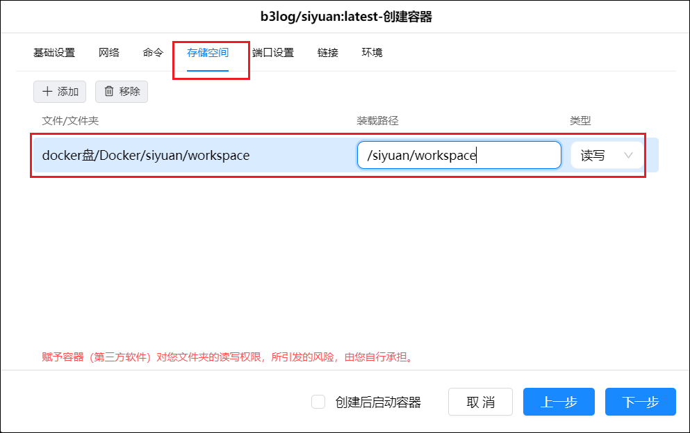

6、设置一个喜欢的本地端口号。

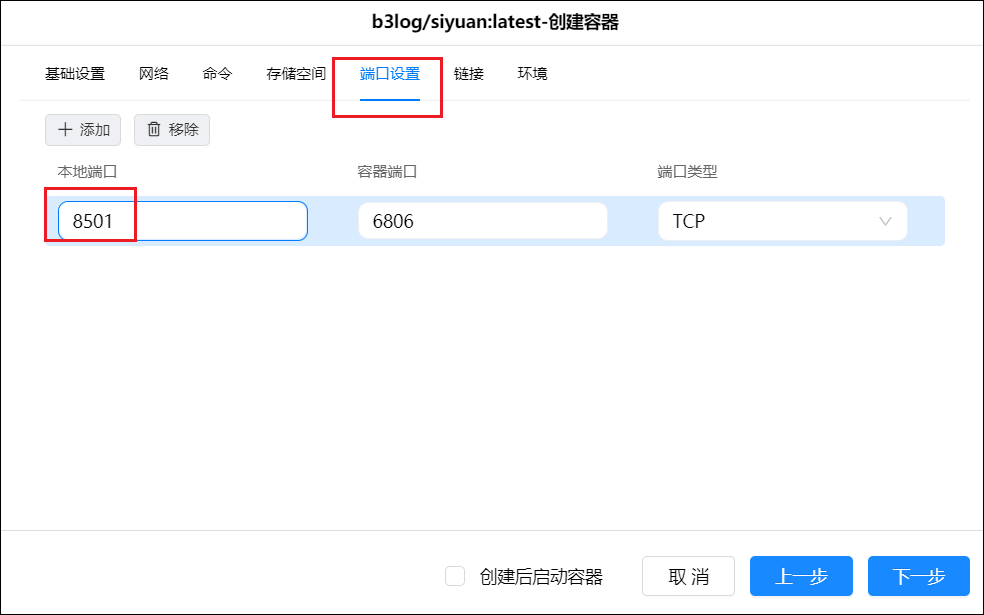

容器配置完成，点击下一步然后点击完成。

## 使用

启动容器，然后输入 IP:端口访问思源笔记。

1、进入设置

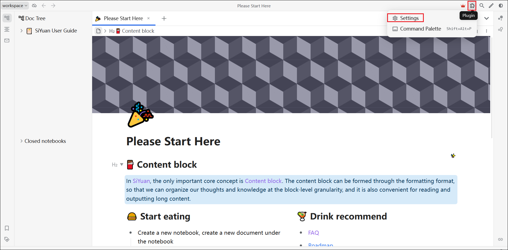

2、在 Appearance 中找到 Language，改为简体中文。

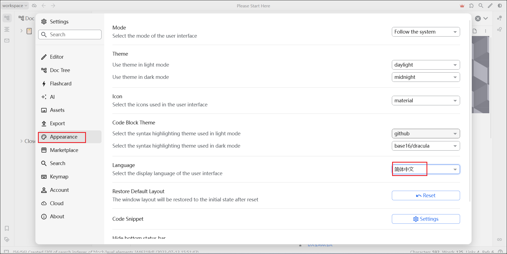

3、点击关于，点击通过密码生成秘钥。该密码要记牢，后续跨设备同步需要使用。该密码用于加密解密，如果秘钥忘记了，你的笔记就废了。

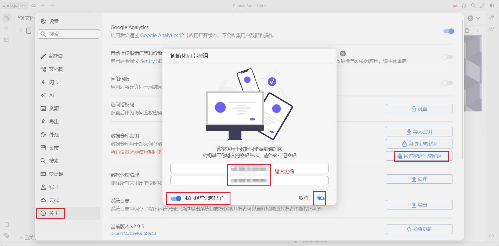

4、设置访问授权码，这里强烈建议设置，不然其他人通过你的网址也可以访问你的笔记。

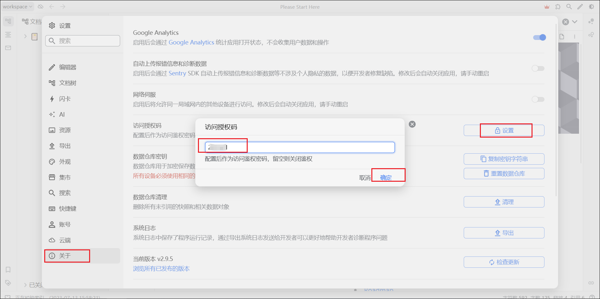

5、点击云端

- 如果想要使用官方的云同步，可以购买会员。但绿联支持 WebDav，所以我们这里也可以选择 WebDav。
- Endpoint 处填写我们 WebDav 要使用的根目录链接，然后 Username 和 Password 处分别填写我们的账号密码。
- 勾选“启用云端同步”和“同步冲突时生成冲突文档”。
- 在 WebDav 目录中，我们提前创建好一个目录名称比如思源笔记，那么在云端同步目录里我们就可以选择它来作为未来同步专用的文件夹。如果没有的话，软件会默认创建一个 main 文件夹来作为同步文件夹。

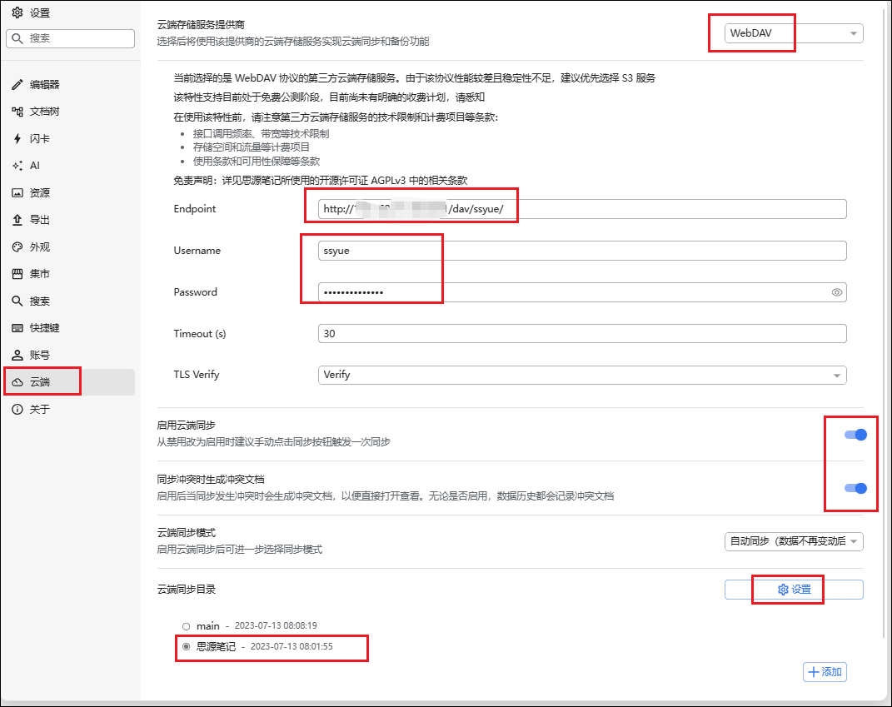
