## 容器部署

1、打开 docker 模块，在镜像仓库里搜索并下载 wiznote/wizserver 镜像。

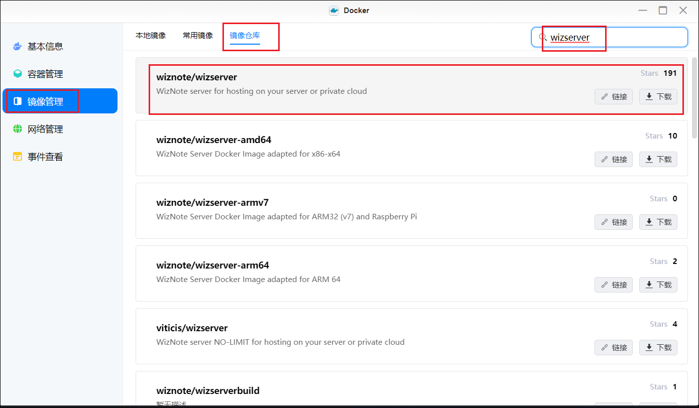

2、下载完成后，在本地镜像找到刚刚下载好的镜像，点击创建容器。可以把下方的创建后启动容器这里打钩，这样配置完基础参数后就可以自动运行。然后点击下一步进入下图页面。

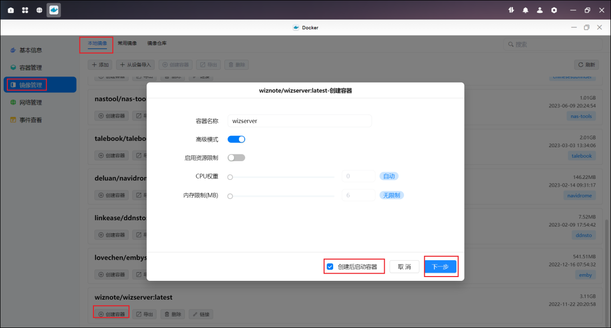

3、基础设置这里建议重启策略选择“容器退出时总是重启容器”，这样在我们重启设备或遇到其他故障时，docker 模块一旦重启，会自动恢复启动我们的为知笔记服务。

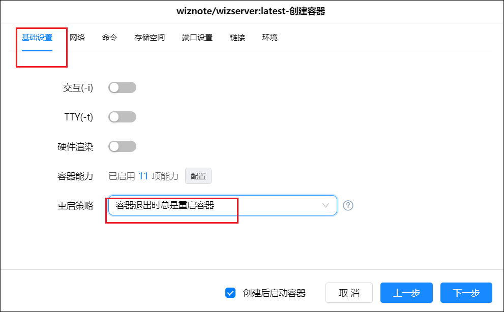

4、存储空间模块，左侧的文件夹目录选择你自己 nas 里的路径即可，装载路径必须是“/wiz/storage”，类型必须选择读写。

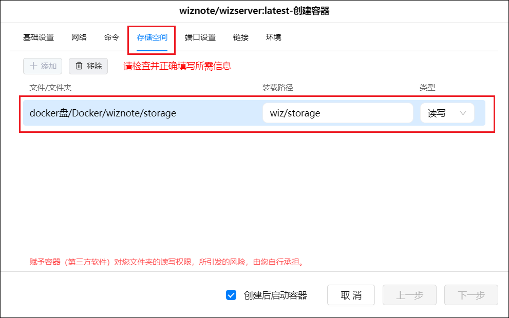

5、端口号设置，一个是 tcp 的 80 端口，一个是 udp 的 9269 端口，实际正常我们会用到这个 80 端口，在本地端口中我们可以选手动选择一个没有被占用过的端口，总之这里只要满足端口没被占用，且避开 80/443 等会被屏蔽的端口即可

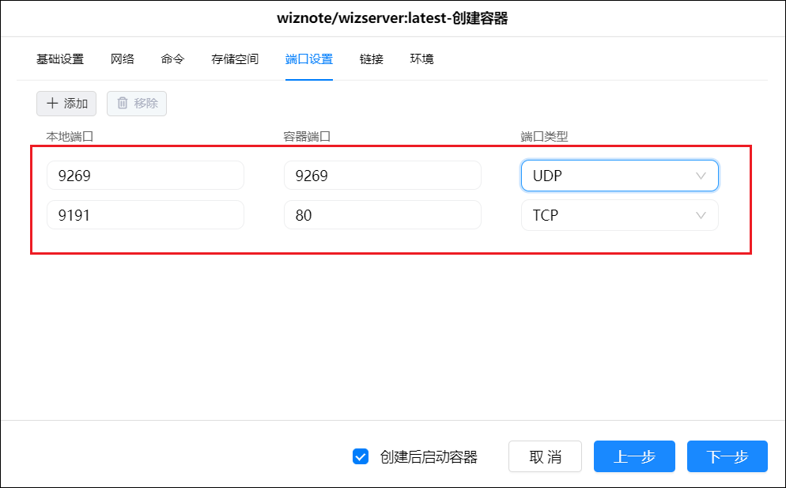

6、环境变量这里加上一行，左边的名称写入“SEARCH”，右边的值内写入“true”，这一行的命令意思是添加搜索功能。

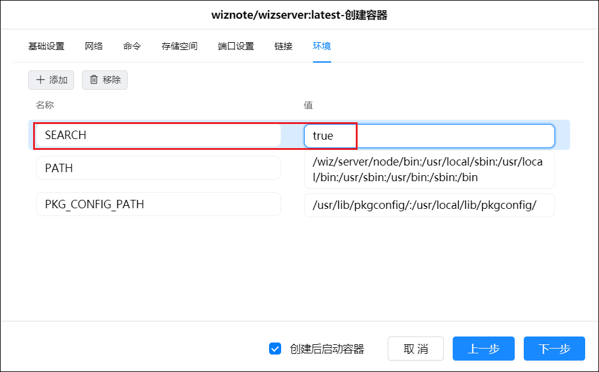

## 初始化

1、完成容器参数配置后即可启动 docker，对应的链接就是我们 nas 的 ip 加上上方参数中的 80 对应的端口，比如我的 nas 地址是 192.168.3.107，参数配置的本地 80 端口对应的是 9191。那么我的为知笔记内网地址就是：192.168.3.107:9191。

Ps：第一次配置启动会需要非常长的时间，大概几分钟，因为需要自动生成数据库等相关模块。 如果我们等不及，打开了链接，看到如下界面，不用着急，说明仍在启动中，还需要耐心等待一会。

2、直到我们刷新看到以下界面，我们的为知笔记终于安装完成。使用默认【管理员账号：admin@wiz.cn】和【密码：123456】登录

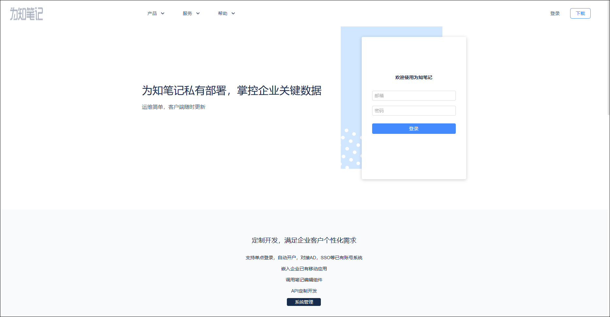

3、登录进页面后可以点击头像，选择账户设置修改管理员密码。

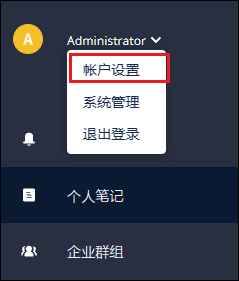

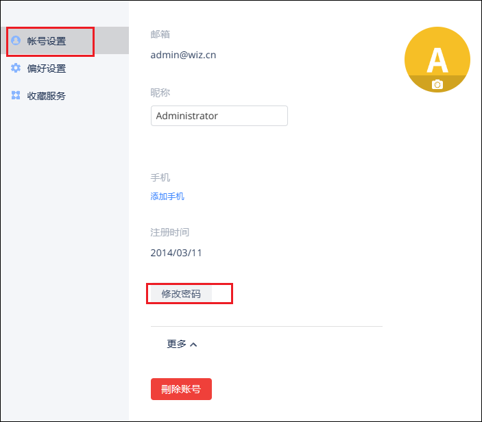

> 免费版本可以注册 5 个用户（不包含管理员账号）

## 其他客户端

1、我们搭建的 docker 是一个服务端，我们还需要客户端（[官网下载](https://www.wiz.cn/zh-cn/wiznew.html)）去配合，为知笔记支持的客户端如图。

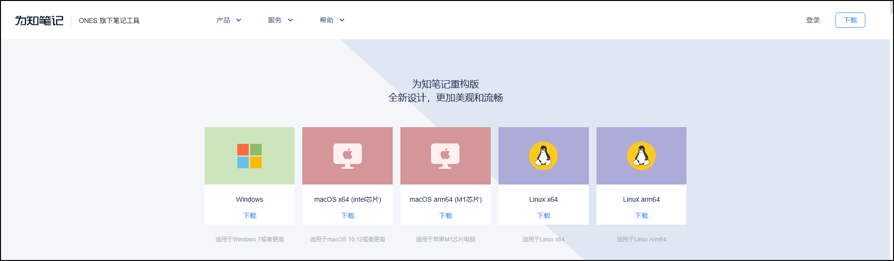

2、我们以 window 客户端为例，安装后打开界面如下图所示，我们可以点击右上角我标记的那个图标切换到私有服务界面

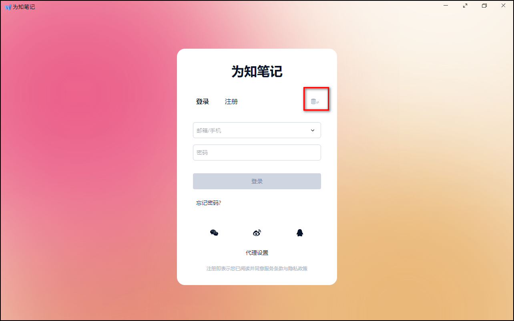

3、前两行就输入我们的账户名和密码，最后一行就需要输入我们的为知笔记的地址。然后就可以登陆成功，其他客户端同理。

> 建议 docker 服务端搭好以后，尽量都用专用的客户端，不要使用网页版，网页版功能非常简陋，编辑功能非常少，模板功能都找不到。
